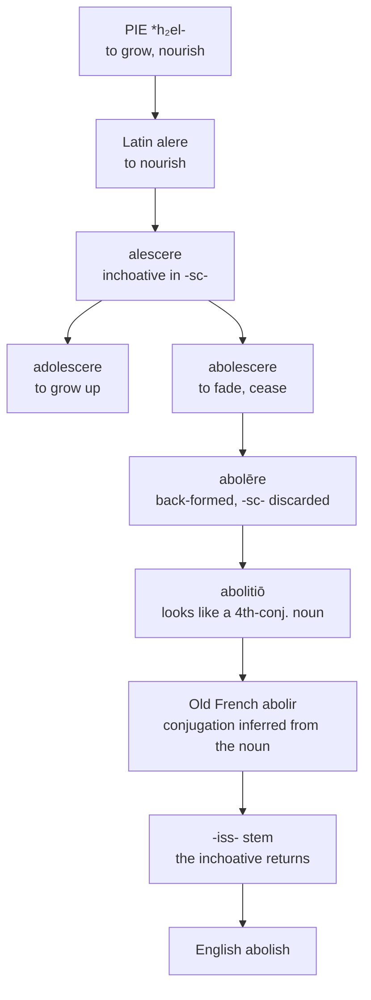

# *Abolēre*: ending, in the suffix of beginning

A study of a verb coined to be the opposite of growing up, stripped of its inchoative suffix in Latin, refitted into the wrong conjugation by its own noun, and handed back that same suffix by French.

---

## 1. The root

Proto-Indo-European **\*h₂el-** "to grow, nourish" gives Latin *alere* "to feed, nourish, bring up," and from it *alimentum*, *alumnus* "fosterling," *almus* "nurturing," and *altus*, literally "grown tall." The same root supplies Gothic *alan* "to grow up," Old Norse *ala* "to nourish," and — through Proto-Germanic \**althaz* — English *old*.

Latin formed the inchoative of *alere* with the suffix *-scere*, the formative that marks a process beginning or coming on. This yields *alescere* "to be nourished, to start growing," and with the prefix *ad-*, *adolescere* "to grow up, come to maturity, ripen." Its present participle *adolescens* gives English *adolescent*, and its past participle *adultus* gives *adult*.

---

## 2. The antonym, and the loss of its suffix

Against *adolescere* Latin set *abolescere*, "to decay gradually, vanish, cease" — *ab-* "away from" replacing *ad-* "toward," so that the two verbs describe growth approaching and growth departing.

From *abolescere* the language then back-formed a transitive verb, *abolēre*: not "to fade away" but "to make fade away." The classical glosses preserve the sense exactly — *destroy, efface, annihilate, cause to die out, retard the growth of*. To abolish a thing is to withdraw its nourishment.

The important formal point is that the back-formation **discarded the *-sc-***. *Abolēre* is a second-conjugation verb with no inchoative marker, precisely because the marker had to go for the verb to become causative and transitive. The suffix that made *adolescere* a process was incompatible with a verb denoting an act performed on something else.

---

## 3. The noun that rebuilt the verb

*Abolēre* formed its verbal noun on the supine stem: *abolitiō, -ōnis*. In Roman law this was a technical term, denoting the annulment of a criminal charge — *abolitio publica* by decree, *abolitio privata* by the accuser's withdrawal.

And here the family goes wrong in a way that determines everything after it. The shape *-itiō* is characteristic of fourth-conjugation verbs: *pūnīre* gives *pūnītiō*, *fīnīre* gives *fīnītiō*, *audīre* gives *audītiō*. Readers of Latin who met *abolitiō* naturally inferred a verb \**abolīre* behind it — a verb that had never existed.

Old French duly built *abolir* rather than \**aboler*. The noun reshaped its own parent, and every Romance reflex inherits the mistake. A second-conjugation verb was reclassified as a fourth-conjugation one on the evidence of a noun that was never fourth-conjugation to begin with.

---

## 4. The suffix returns

The reclassification had a consequence that nobody intended.

French verbs of the second group take an extended stem in *-iss-* through much of the paradigm — *nous finissons*, *ils punissent*, *en périssant*. That infix is the direct continuation of the Latin inchoative *-scere*: the same suffix that made *alescere* out of *alere*, and *adolescere* out of *alescere*.

So the verb that Latin had back-formed expressly to shed its *-sc-* received it back, because the conjugation it was wrongly assigned to was the one that carried it.

English then compounded the return. The *-ish* of *abolish* is not a native suffix but the French *-iss-* stem borrowed whole, the same borrowing that produced *finish*, *punish*, *banish*, *cherish*, *nourish*, *perish*, *establish*, and *diminish*. English *abolish* therefore contains, in its final syllable, the inchoative marker of *adolescere* — carried into a word whose entire purpose is to denote cessation.

*Nourish* and *abolish* end in the same suffix and begin from the same root. One feeds and the other starves, and the two share both their ancestor and their ending.

---

## 5. The comparative set

| | Infinitive | 1 sg | 3 sg | 1 pl |
|---|---|---|---|---|
| **Latin** | *abolēre* | *aboleō* | *abolet* | *abolēmus* |
| **French** | *abolir* | *j'abolis* | *elle abolit* | *nous abolissons* |
| **Spanish** | *abolir* | *yo abolo* | *ella abole* | *nosotros abolimos* |
| **Portuguese** | *abolir* | *eu abulo* | *ela abole* | *nós abolimos* |
| **English** | *to abolish* | *I abolish* | *she abolishes* | *we abolish* |
| **Inglisce** | *to abolișe* | *I abolișe* | *sie abolișes* | *uie abolișe* |

| | The noun | The adjective |
|---|---|---|
| **Latin** | *abolitiō* | — |
| **French** | *l'abolition* | *abolissable* |
| **Spanish** | *la abolición* | *abolido* (participle) |
| **Portuguese** | *a abolição* | *anulável* (from *anular*) |
| **English** | *the abolishment*, *the abolition* | *abolishable* |
| **Inglisce** | *þi abolișement*, *þi abolicion* | *abolișable* |

English and French build a deverbal adjective on the *-iss-* stem. Spanish has none on this root and presses the past participle *abolido* into service; Portuguese abandons the stem altogether for *anulável*, formed on *anular*.

---

## 6. The English doublet

English holds two nouns where the other languages hold one.

*Abolition* is the learned form, taken directly from Latin *abolitiōnem* by way of French. *Abolishment* is the vernacular form, built on the naturalised English verb with the suffix *-ment*. Both are attested from the sixteenth century.

They have not fared equally. *Abolition* became the term of art — it is the word of *abolitionism*, of the abolition of slavery and of the slave trade, and it carries the whole political vocabulary of the eighteenth and nineteenth centuries. *Abolishment* survives but has been pushed to the margins, generally felt as the clumsier of the two.

The pairing is characteristic of English. The learned noun is closer to Latin and further from the English verb; the vernacular noun is transparently derived from the verb but has no standing. A speaker who knows *abolish* cannot predict *abolition*, and a speaker who knows *abolition* cannot predict *abolish*, because the two sit on opposite sides of the *-iss-* borrowing.

---

## 7. The Inglisce forms

`Abolișe` writes /ʃ/ with a marked `s` rather than the digraph `sh`, and the silent `-e` marks the verb. The paradigm is otherwise English: invariant except for the third singular `-s`, giving `sie abolișes` against `I abolișe` and `uie abolișe`.

`Abolicion` spells the suffix `-cion` rather than `-tion`. It aligns the word with Spanish *abolición* and Portuguese *abolição*.

Inglisce **keeps both nouns**. `Abolișement` and `abolicion` preserve a doublet that the other languages in the set do not have and that English itself has allowed to fall out of balance. Since the two are formed on different principles — one on the naturalised verb, one on the Latin noun — retaining both preserves the record of how the word entered the language twice.

`Abolișable` is formed on the verb, and so follows English and French in building the adjective on the *-iss-* stem rather than following Spanish and Portuguese, which cannot.
