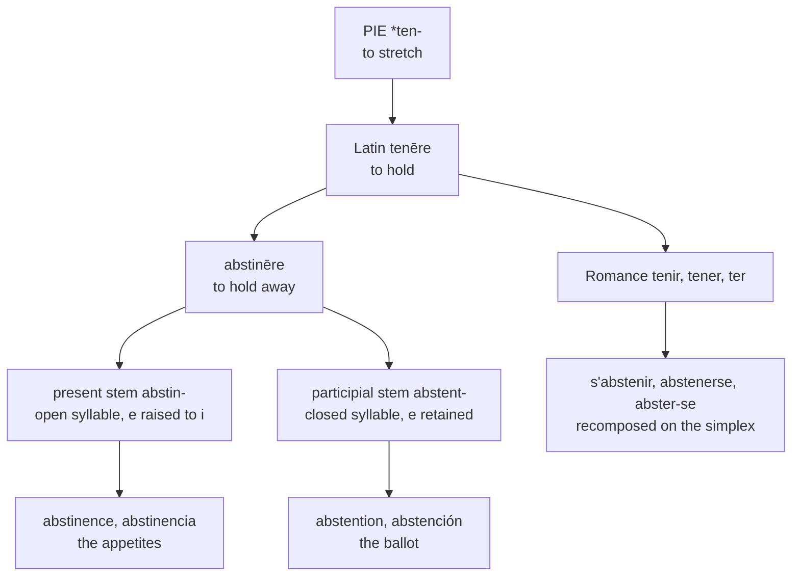

# *Abstinēre*: the vowel that divided a meaning

A study of a Latin verb with two stems, one carrying *i* and the other *e*, and of how every language in the set recruited that accident to separate two kinds of refusal.

---

## 1. The root

Latin *tenēre* "to hold, occupy, possess" descends from Proto-Indo-European **\*ten-** "to stretch." The root is among the most productive in the language: it yields *tenāx*, *tenor*, *tenēns* (whence *tenant*), *tenēre* itself, and — through *tendere*, its nasal-infixed relative — *tendency*, *extend*, *intend*, and *portend*.

To *tenēre* Latin prefixed *abs-*, the variant of *ab-* "away from" used before *c-* and *t-*. The compound *abstinēre* therefore means, with complete transparency, "to hold away."

---

## 2. Two stems

Latin compounds regularly weaken the vowel of a simplex verb when it falls into an unstressed medial syllable, and the weakening takes two different forms according to what follows.

In an open syllable the vowel raises to *i*: *teneō* gives *abstineō*, and likewise *contineō*, *retineō*, *obtineō*, *pertineō*, *sustineō*. In a syllable closed before a consonant cluster it lowers to *e* instead: *tentum* gives *abstentum*, exactly as *factum* gives *confectum* and *captum* gives *acceptum*.

One verb therefore carried two stems from the outset:

| Stem | Latin forms | Sense |
|---|---|---|
| *abstin-* | *abstineō*, *abstinēns*, *abstinentia* | present system |
| *abstent-* | *abstentum*, *abstentiō* | participial system |

Nothing distinguished them in meaning. *Abstinentia* was the moral term — self-restraint, temperance, and specifically the integrity of a magistrate who does not take bribes — while *abstentiō* denoted a withholding of any kind. They were near-synonyms formed on the two halves of a single paradigm.

---

## 3. The verb recomposed

The Romance verb is not an inherited descendant of *abstinēre*. It was rebuilt on the living simplex.

Latin *tenēre* survives everywhere as a common verb — French *tenir*, Spanish *tener*, Portuguese *ter*, Italian *tenere*, Catalan *tenir* — and the prefixed form was reformed to match it, conjugation and all. French *abstenir* was borrowed from Latin with its inflection adapted to *tenir*, taking that verb's stressed stem *abstien-* against its unstressed *absten-*. The *i* of the Latin present system was undone in the process.

Portuguese settles the matter beyond argument. The Portuguese reflex is *abster*, not \**abstener*, because Portuguese *tenēre* lost its intervocalic *n* on the way to *ter*. A form that carries a sound change specific to the Portuguese simplex cannot have descended independently from *abstinēre*; it can only have been assembled from *ter*.

So the verb across the whole set shows *e* — and shows it for a reason that has nothing to do with the *e* of *abstentum*.

---

## 4. The seam becomes a meaning

The two Latin stems were interchangeable. Every modern language in the set has made them mean different things, and all of them have made them mean the same different things.

The *-entia* nouns, built on the present stem, denote refraining from an appetite: food, drink, sex. The *-tiō* nouns, built on the participial stem, denote refraining from a vote. *Abstinence* is what one practises in Lent; *abstention* is what one records in a division. French *abstinence* and *abstention*, Spanish *abstinencia* and *abstención*, Portuguese *abstinência* and *abstenção*, Italian *astinenza* and *astensione*, Catalan *abstinència* and *abstenció* all divide along the same line.

<cite index="67-1">The electoral sense is datable: English *abstain* acquires "refrain from voting" in 1796.</cite> The division is thus a modern one, imposed on a morphological distinction that had been lying idle since Latin — a redundancy that a set of unrelated speech communities independently found a use for.

---

## 5. The comparative set

| | Verb | Adjective | *-entia* noun | *-tiō* noun |
|---|---|---|---|---|
| **Latin** | *abstinēre* | *abstinēns* | *abstinentia* | *abstentiō* |
| **French** | *s'abstenir* | *abstinent* | *l'abstinence* | *l'abstention* |
| **Spanish** | *abstenerse* | *abstinente* | *la abstinencia* | *la abstención* |
| **Portuguese** | *abster-se* | *abstinente* | *a abstinência* | *a abstenção* |
| **Italian** | *astenersi* | *astinente* | *l'astinenza* | *l'astensione* |
| **Catalan** | *abstenir-se* | *abstinent* | *l'abstinència* | *l'abstenció* |
| **English** | *to abstain* | *abstinent* | *abstinence* | *abstention* |
| **Inglisce** | *to absteine* | *àbstinent* | *þi àbstinence* | *þi abstencion* |

Read down the columns rather than across the rows. The two middle columns carry *i* in every language; the outer two carry *e* in every language. The seam runs through the whole table in the same place, though the *e* of the first column and the *e* of the last arrived by entirely different routes — one from a Romance recomposition on the simplex, the other from the Latin participial stem.

Two further observations. Italian alone drops the *b* of the prefix throughout, by the regular simplification of *abs-* to *as-* seen also in *astratto* and *assoluto*. And every Romance language in the set makes the verb reflexive — *s'abstenir*, *abstenerse*, *abster-se*, *astenersi*, *abstenir-se* — while English and Inglisce do not. Latin used *abstinēre* both transitively and with *sē*; Romance generalised the reflexive and English discarded it.

---

## 6. What English hides

English received the verb from Anglo-French *absteign-*, the stressed stem, which is why the vowel of *abstain* is a diphthong where the Romance infinitives have a plain *e*. The same borrowing produced *contain*, *detain*, *entertain*, *maintain*, *obtain*, *pertain*, *retain*, and *sustain*: an entire class of English verbs in *-tain*, each of them the tonic stem of a French verb in *-tenir*.

That family behaves consistently. *Retain* pairs with *retention*, *detain* with *detention*, *contain* with *continence* and *content*. In every case the English verb shows the French stressed vowel and the English noun shows a Latin stem, and no rule connects them that a speaker could state.

The stress is where English is least helpful. The four forms are:

| | Pronunciation | Stress |
|---|---|---|
| *abstain* | /əbˈsteɪn/ | second syllable |
| *abstinent* | /ˈæbstɪnənt/ | first syllable |
| *abstinence* | /ˈæbstɪnəns/ | first syllable |
| *abstention* | /əbˈstɛnʃən/ | second syllable |

The accent moves twice within a four-word family, and the prefix changes quality with it: /əb/ when unstressed, /æb/ when stressed. English writes `ab` for both and marks nothing.

---

## 7. The Inglisce forms

`Absteine` keeps the stem vowel that English threw away. Latin has *abstinēre* and every Romance verb in the set has `e` — *s'abstenir*, *abstenerse*, *abster-se*, *astenersi*, *abstenir-se*. English alone writes `a`, having taken the Anglo-French stressed stem and spelled its diphthong with the digraph `ai`. Inglisce writes `ei`, so the `e` survives the diphthong and the word stays visibly the same word as its cognates. The silent `-e` marks the verb.

The choice governs a whole class, since English makes `-tain` out of `-ten-` throughout. Against French *contenir*, *détenir*, *maintenir*, *obtenir*, *retenir*, and *soutenir*, and Spanish *contener*, *detener*, *mantener*, *obtener*, *retener*, and *sostener*, English writes *contain*, *detain*, *maintain*, *obtain*, *retain*, and *sustain*. The `ai` severs every one of them from its cognate at a glance; `ei` severs none, and `conteine`, `mainteine`, and `susteine` follow from the same rule that gives `absteine`.

That the spelling is also attested is a convenience rather than the argument. Middle English wrote *absteine* beside *abstene* and *absteynen*, and *conteine*, *mainteine*, and *susteine* were current well into the early modern period. The `a` of the received forms is the later intruder.

The grave accent does the work English leaves undone. `Àbstinent` and `àbstinence` carry it because the stress falls on the first syllable; `absteine` and `abstencion` go unmarked because theirs falls on the second. A reader can therefore take the vowel quality of the prefix off the page — `à` is /æ/ and unmarked `a` is /ə/ — where English requires the word to be known in advance.

`Abstencion` writes the participial stem with `e` and the suffix as `-cion`, aligning it with Spanish *abstención* and Catalan *abstenció*. Set against `àbstinence`, the pair displays the Latin stem alternation directly: `i` for the present system, `e` for the participial, and the meanings divided along the same line the vowels are.

The verb is not reflexive, following English against the whole of Romance.
