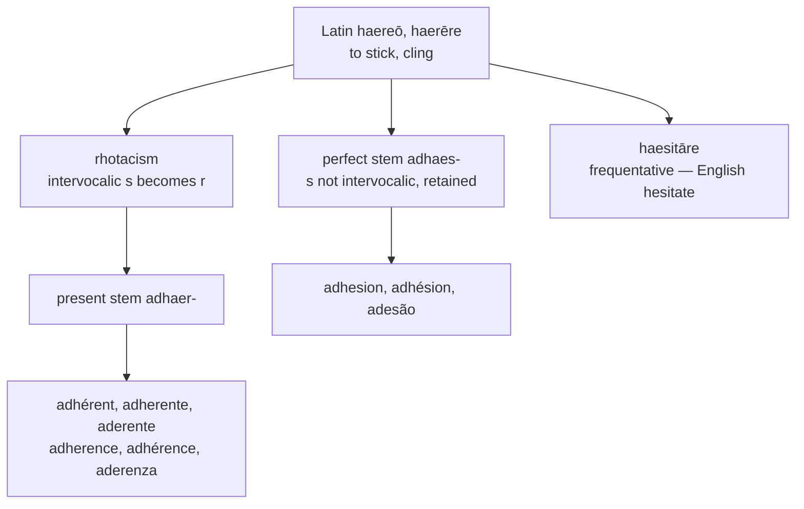

# *Adhaerēre*: sticking, and getting stuck

A study of a Latin verb whose two stems differ by a consonant, and of an English spelling convention that writes /ɪə/ with the letter `e` and offers no warning that it has done so.

---

## 1. The root

Latin *haereō, haerēre, haesī, haesum* means "to stick, cling, be fixed, be held fast." The alternation between the *r* of the present and the *s* of the perfect is not irregularity but **rhotacism**: an intervocalic *s* regularly became *r* in Latin at some point before the classical period, so that the original consonant survives only where it was not intervocalic. The present *haerēre* stands for an earlier \**haisēre*; the perfect *haesī* and supine *haesum* never had a vowel following the *s* and so kept it.

The same alternation shows in *flōs* : *flōris*, *honōs* : *honōris*, and *quaerō* : *quaesītum*. It is one of the reliable seams in the language, and it produces doublets in English wherever both stems were borrowed.

The root has one further descendant worth naming. *Haesitāre*, the frequentative of *haerēre*, means "to keep sticking" — and gives English *hesitate*. To hesitate is to get stuck, repeatedly.

---

## 2. The two stems

Prefixed with *ad-*, the verb yields:

| Stem | Latin forms | English |
|---|---|---|
| *adhaer-* | *adhaereō*, *adhaerēns*, *adhaerentia* | *adhere*, *adherent*, *adherence* |
| *adhaes-* | *adhaesum*, *adhaesiō* | *adhesion*, *adhesive* |

English took both, and then divided them. *Adherence* became the figurative term — adherence to a rule, a doctrine, a regimen — while *adhesion* stayed physical, the province of glue and of surgical scarring. A speaker uses one for principles and the other for surfaces.

The division is not universal. French assigns the physical sense to *adhérence*, which is what a tyre has on wet tarmac, and the abstract sense to *adhésion*, which is what one gives to a party or a treaty. The two languages have made the same two words carry opposite loads. Neither distribution follows from the Latin, where the stems were interchangeable.

Portuguese goes further and abandons the *r*-stem in this slot altogether, filling it with *adesão* from *adhaesiōnem*. It is the only language in the set to do so.

---

## 3. The comparative set

| | Verb | Adjective | The noun |
|---|---|---|---|
| **Latin** | *adhaerēre* | *adhaerēns* | *adhaerentia* |
| **French** | *adhérer* | *adhérent* | *l'adhérence* |
| **Spanish** | *adherirse* | *adherente* | *la adherencia* |
| **Portuguese** | *aderir* | *aderente* | *a adesão* |
| **Italian** | *aderire* | *aderente* | *l'aderenza* |
| **Catalan** | *adherir-se* | *adherent* | *l'adherència* |
| **English** | *to adhere* | *adherent* | *adherence* |
| **Inglisce** | *to adhier* | *adhirent* | *adhirence* |

Three things are visible in the columns.

The *h* is orthographic only, Latin having lost the sound long before any of this. Italian and Portuguese write what is said and drop it; French, Spanish, Catalan, and English keep it and pronounce nothing. Inglisce keeps it.

The conjugation class was not preserved by anyone. Latin *adhaerēre* is second conjugation; Spanish, Portuguese, Italian, and Catalan made it an *-ir* verb, and French alone made it an *-er* verb. Inglisce ends the verb in `-ir`, siding with the four against the one.

The stem vowel is `e` throughout Romance and throughout English's spelling. Inglisce alone writes `i`, for reasons the next section sets out.

---

## 4. What English hides

English *adhere* is /ədˈhɪə/, and *adherent* and *adherence* keep that vowel. The spelling gives no indication of it.

The letter `e` before `r` and a silent `e` spells /ɪə/ in *adhere*, *here*, *mere*, *sphere*, *severe*, *sincere*, *austere*, and *interfere*. In almost every other environment the same letter spells /ɛ/ or /iː/. The convention is a Middle English long *e* carried through the Great Vowel Shift and then spelled as though nothing had happened: the sound moved from /eː/ to /iː/ and the orthography stayed where it was.

This is a different sort of concealment from a false etymology. The `e` of *adhere* is historically correct — it descends from the *ae* of *adhaerēre* by way of Old French — and it is precisely its correctness that makes it useless. It records the vowel the word had in 1400 and says nothing about the vowel it has now.

---

## 5. The Inglisce forms

`Adhire` writes the vowel with `i`, the letter that carries /iː/ in the system, and so states in the spelling what English leaves to be learned word by word. The cost is real and worth naming: the stem vowel no longer matches the `e` of *adhérer*, *adherir*, and *aderire*. The system has chosen the modern sound over the visible cognate, which is the reverse of what it does where the Romance vowel and the English one still agree.

Two things soften the cost. The `h` is retained, so the word remains recognisable as *adh-* against *adhérence* and *adherencia*. And the verb ends in `-ir`, aligning it with Spanish, Portuguese, Italian, and Catalan, where English `-ere` aligns it with nothing.

`Adhirent` and `adhirence` follow the verb rather than the Latin, which is the choice English declines to make: English writes *adhere* and *adherent* with the same letters but has no principle requiring it, as the parallel case of *abstain* beside *abstinent* shows. Here the stem is constant across all three forms.

---

## 6. The infinitive restored

English has one form doing two jobs. *To adhere* and *I adhere* are identical, and nothing in the modern language distinguishes a verb's citation form from its present indicative. This was not always so: Middle English marked the infinitive with *-en*, and the ending was lost in the early modern period along with most of the rest of the inflectional system.

Every other language in the table keeps the two apart — *adhérer* against *il adhère*, *adherirse* against *se adhiere*, *aderir* against *adere*, *aderire* against *aderisce*, *adherir-se* against *s'adhereix*. English alone has nothing to show.

Inglisce divides the paradigm into two stems:

| Stem | Forms | Class |
|---|---|---|
| `adhier-` | `to adhier`, `adhiering` | non-finite |
| `adhire-` | `I adhire`, `sie adhires`, `adhired` | finite |

Both spell the same vowel, so what the alternation encodes is not sound but grammatical category — the infinitive and the progressive on one side, the inflected forms on the other. The derived words `adhirent` and `adhirence` follow the finite stem.

Note where the seam falls. Spanish alternates in this verb too, diphthongising *adherir* to *se adhiere*, but the conditioning there is stress: the stem diphthongises when the accent lands on it and not otherwise, so the alternation is a phonological consequence that happens to correlate with person and number. Inglisce marks the grammatical division directly, without a phonological pretext. It is the same phenomenon Romance exhibits, arrived at by a different route.
