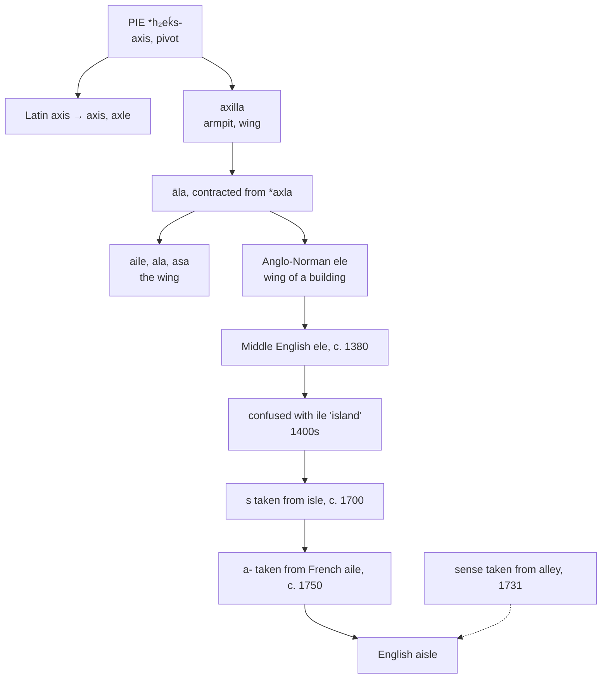

# *Āla*: a wing, and three false letters

A study of a word for the wing of a bird, of the three separate corruptions English visited on it in three centuries, and of the shop aisle that owes its sense to a different word altogether.

---

## 1. The root

Latin **āla** "wing" is a contraction. The fuller form is **axilla** "armpit, upper arm, wing," and *āla* stands for an earlier \**axla* with the cluster simplified — a change visible also in *māla* "cheek" for \**maxla* and *tālus* for \**taxlos*.

Behind both lies Proto-Indo-European **\*h₂eḱs-** "axis, pivot," with the instrumental suffix *-la*. A wing is named as the thing that turns on a joint.

The root's other descendants are more obviously mechanical:

| Source | English |
|---|---|
| Latin *axis* | **axis**, **axial** |
| Greek *áxōn* | **axon**, **axo-** |
| Proto-Germanic \**ahsulaz* | **axle** |
| Latin *axilla* | **axilla**, **axillary** |
| Latin *āla* | **ala**, **alar**, **aisle** |

So **aisle**, **axle**, and **axon** are one word, and English holds *āla* and *axilla* as a doublet — the contracted form in anatomy as *ala*, the full form as *axilla*, both meaning very nearly the same thing.

---

## 2. The wing of a building

Roman builders used *ālae* for the projecting side chambers of a house, and post-classical Latin extended it to the lateral divisions of a basilica. The metaphor is architectural and still current: a *wing* of a hospital, a *wing* of a palace.

English took the word in that sense in the late fourteenth century, as **ele**, from Anglo-Norman *ele* "wing, wing of a building, lateral division of a nave." The earliest attestations are of church architecture.

---

## 3. Three corruptions

What happened next is unusually well documented, and unusually bad.

**First, the vowel.** From the fifteenth century *ele* was confused with the unrelated Middle English *ile* "island," apparently because the side divisions of a church were felt to be detached from the rest of it. The forms *ile* and *ilde* — the *d* an intrusion of its own — supplanted *ele* by the sixteenth century.

**Second, the *s*.** Around 1700, when antiquarians restored the *s* to *isle* on the authority of Latin *insula*, they gave one to this word as well. It had no *s* at any stage of its history, in Latin, French, or English. The confusion was helped along by the fact that in the fifteenth and sixteenth centuries scribes writing Latin used *insula* as the ordinary word for an aisle.

**Third, the *a-*.** By about 1750 the word had acquired an initial *a*, on the model of modern French *aile*. This one is at least a cognate — *aile* is the same Latin *āla* — but it was applied to a form that had already been corrupted twice.

The word therefore reads *a* + *isle* + *e*, and of those three elements only the last belongs to it.

| Century | Form | What changed |
|---|---|---|
| late 1300s | *ele* | the word as borrowed |
| 1400s–1500s | *ile*, *ilde* | assimilated to *ile* "island" |
| c. 1700 | *isle* | took the *s* restored to *isle* |
| by 1750 | *aisle* | took an *a-* from French *aile* |

---

## 4. And then a fourth confusion

The sense moved too, and by another accident.

English *alley* is Old French *alee*, from *aler* "to go" — a walking-place, and etymologically unconnected to wings. But *aisle* and *alley* overlapped in meaning and resembled each other enough that the passage sense passed from one to the other. By 1731 *aisle* meant the gangway between rows of pews rather than the flanking division itself, and from there it spread to railway carriages, theatres, aeroplanes, supermarkets, and the floor of the United States Congress.

So a shopper in the cereal aisle, and a senator reaching across the aisle, are both using a word that means *wing* and has been pushed into the sense of a different word entirely.

---

## 5. The comparative set

| | The wing | The church aisle | The passage between seats |
|---|---|---|---|
| **Latin** | *āla* | *āla* | — |
| **French** | *l'aile* | *le bas-côté* | *l'allée* |
| **Italian** | *l'ala* | *la navata laterale* | *la corsia* |
| **Spanish** | *el ala* | *la nave lateral* | *el pasillo* |
| **Portuguese** | *a ala* | *a nave lateral* | *o corredor* |
| **Catalan** | *l'ala* | *la nau lateral* | *el passadís* |
| **English** | *the wing* | *the aisle* | *the aisle* |
| **Inglisce** | *þe uingue* | *þi aiele* | *þi aiele* |

### The pivot

| | The axis | The axle | The armpit |
|---|---|---|---|
| **Latin** | *axis* | *axis* | *axilla* |
| **French** | *l'axe* | *l'essieu* | *l'aisselle* |
| **Spanish** | *el eje* | *el eje* | *la axila* |
| **Portuguese** | *o eixo* | *o eixo* | *a axila* |
| **Italian** | *l'asse* | *l'assale* | *l'ascella* |
| **Catalan** | *l'eix* | *l'eix* | *l'aixella* |
| **English** | *the axis* | *the axle* | *the axilla* |
| **Inglisce** | *þi axis* | *þi axle* | *þi axilla* |

**English's axle is not a borrowing.** Spanish *eje*, Portuguese *eixo*, and Catalan *eix* continue Latin *axis* by ordinary descent, and French *essieu* comes from a Vulgar Latin \**axilis*. English *axle* is Germanic — Old Norse *ǫxull*, from Proto-Germanic \**ahsulaz* — and therefore a cousin of the Latin rather than a child of it. Old English had the related *eaxl* "shoulder."

**French keeps a doublet.** *Axe* is the learned form, taken from the written Latin, and *essieu* the inherited one; the first is a geometric line and the second the bar a wheel turns on. Spanish, Portuguese, and Catalan use one word for both.

**French *aisselle* shows the same *ai*** as *aisle*, and by a better right: it descends from *axilla* through regular sound change, where the *ai* of *aisle* was fetched from *aile* in the eighteenth century.

Read across the church table, English is the odd one out twice.

**Every Romance language kept *āla* for the wing and English did not.** French *aile*, Italian and Catalan *ala*, Spanish *el ala*, Portuguese *a ala* all continue the Latin in its primary sense; English gave that job to the Germanic *wing*, from Old Norse *vængr*, and kept the Latin word only for the architectural derivative.

**Every Romance language distinguishes the two passages and English does not.** The lateral division of a church is a *bas-côté* or a *nave lateral*, and the corridor between seats or shelves is an *allée*, a *corsia*, a *pasillo*, a *corredor*. English uses one word for both, having taken the second sense from *alley* and never replaced it.

---

## 6. The Inglisce form

**`Aiele` keeps two layers and drops the false one.**

The `s` goes. It entered the word around 1700 by association with *isle*, a word from a different language and a different root, and it has never been pronounced by anyone. Nothing in the history of *āla*, *ele*, or *aile* accounts for it.

The `ai` stays. It came from French *aile*, which is genuinely the same word, so the letters record a real relative even though they arrived late and for a poor reason.

The `ele` stays too. That is the form English actually borrowed in the fourteenth century and wrote for a hundred and fifty years, and it holds the *āla* of the Latin and the *-ele* of the Anglo-Norman together in one syllable.

So `aiele` carries the French and the Middle English at once, and leaves out the island. The plural is `aiels`.

**The homophones part company.** English *aisle* and *isle* are both /aɪl/ and are spelled almost alike, which is exactly backwards: they sound the same by accident and look the same by mistake. In Inglisce they still sound the same — `aiele` and `île` are homophones and will remain so — but the spellings now record two unrelated descents, one from *āla* and one from *insula*, rather than recording a seventeenth-century confusion between them.

### The rest of the root

| English | Inglisce | Plural |
|---|---|---|
| axis | `axis` | `axies` |
| axial | `axïal` | — |
| axon | `axon` | `axons` |
| axle | `axle` | `axels` |
| axilla, axillary | `axilla`, `axillary` | — |
| ala, alar | `âla`, `âlar` | — |

**`Axies` unpicks a collision.** English *axes* is the plural of two different words and is pronounced two ways — /ˈæksiz/ for *axis* and /ˈæksɪz/ for *axe* — with nothing on the page to say which is meant. `Axies` takes the first and leaves the second its own spelling.

**`Axïal` uses the diaeresis for its oldest purpose.** The mark says that two adjacent vowel letters belong to separate syllables, as in French *naïve* and *Noël*. English *axial* is /ˈæksiəl/, three syllables, and the `ia` of the spelling gives no indication that it is not the single vowel of *facial* or *racial*.

**`Axels` writes the schwa before the `l`** where the singular writes it after.

**`Âla` and `âlar` restore the Latin quantity.** Latin *āla* has a long *a*, marked in the dictionaries with a macron; English *ala* is /ˈeɪlə/, and the circumflex says so. The two marks fall on the same letter of the same word for the same reason, one recording length and the other the diphthong that length became.

**The doublet stays apart.** `Âla` and `aiele` are one Latin word — the first taken from the page, the second through French — but they are /ˈeɪlə/ and /aɪl/, and no spelling can join them without misreporting one. What the system can do is record the two routes honestly: `âla` shows the Latin unchanged, and `aiele` shows the French and the Middle English that stand between it and the Latin.

The article is `þi` for all of these, each beginning with a vowel.
