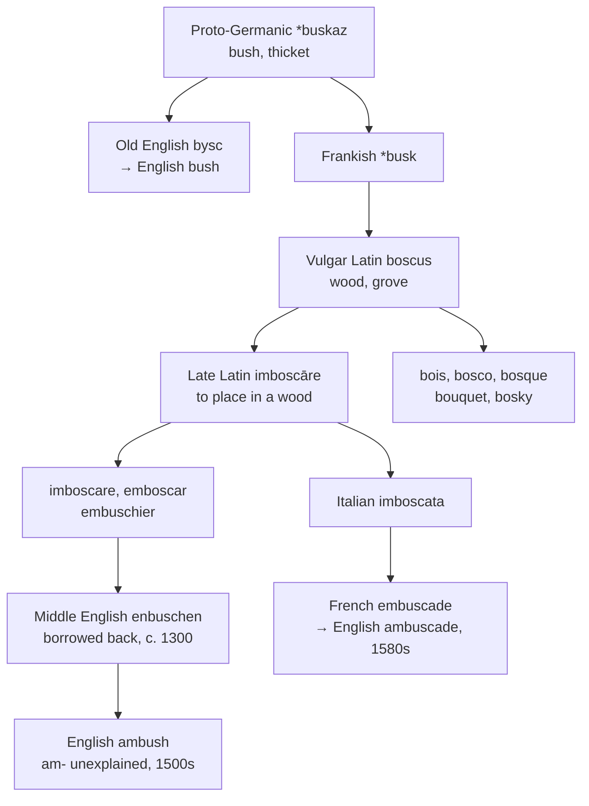

# \**Buskaz*: the bush that went to France

A study of a Germanic word that spent six centuries in Romance and came home unrecognisable, of the vowel change nobody can explain, and of a native cousin still standing in the language it returned to.

---

## 1. The root

Proto-Germanic **\*buskaz** "bush, thicket, heavy stick" is the ancestor of Old English *bysc*, Old Saxon and Old High German *busc*, Dutch *bos*, and German *Busch*. English *bush* continues it directly and without interruption.

The Franks carried the word into Gaul, where it entered the Romance of the region as Vulgar Latin **boscus** "wood, grove." From that Latinised Germanic noun descend a considerable family:

| | |
|---|---|
| French *bois* | wood, timber |
| Italian *bosco*, Spanish and Portuguese *bosque* | wood, forest |
| French *bouquet* | originally "a little grove" |
| English *bosky*, *boscage* | wooded, thicket |

*Bouquet* is worth a pause. It is a diminutive of *bosc*, so a bunch of flowers is literally a small copse, and the word an English speaker uses for a wedding arrangement is the same Germanic thicket that hid the ambushers.

---

## 2. The round trip

Late Latin formed **imboscāre**, "to place in a wood," from *in-* plus *boscus*. From it come Italian *imboscare*, Spanish *emboscar*, Portuguese *emboscar*, and Old French *embuschier*.

England then borrowed the verb back. Middle English *enbuschen* "to place in hiding in order to attack by surprise" comes from Anglo-French *embuscher*, which is the Norman and Picard form — the second element being Picard *busc* "forest, grove."

So the sequence runs:

1. Proto-Germanic \**buskaz* — a Germanic noun.
2. Frankish \**busk* — carried into Gaul.
3. Vulgar Latin *boscus* — absorbed into Romance.
4. Late Latin *imboscāre* — a Romance verb built on it.
5. Anglo-French *embuscher*.
6. Middle English *enbuschen*, c. 1300 — borrowed back into a Germanic language.

English received from French a word made out of a word its own ancestors had exported. And unlike most such returns, the native form was not lost in the interval: *bush* has been in continuous English use throughout, so the language now holds both ends of the journey and connects them only with effort.

---

## 3. The vowel nobody can explain

Every language in the family begins the verb with a front vowel: French *embusquer*, Italian *imboscare*, Spanish *emboscar*, Portuguese *emboscar*. English began that way too — the Middle English forms are *enbuschen*, *embushen*, *inbuchen*.

Then, in the sixteenth century for the noun and the seventeenth for the verb, English changed it to **am-**.

Nobody knows why. Merriam-Webster calls the forms "of uncertain origin" and suggests they may be a by-product of stress shifting onto the initial syllable. The *Oxford English Dictionary* proposes association with *ambage*, which the same note calls unlikely. Wiktionary states flatly that the change is unexplained.

The result is that English is alone in the whole family with an *a*, and the letter records nothing — not the Latin *in-*, not the French *em-*, not any sound change that operated elsewhere in the language.

---

## 4. The word came back twice more

English was not content with borrowing the word once.

| Form | Entered | Route |
|---|---|---|
| **ambush** | c. 1300 (v.), late 1400s (n.) | Anglo-French *embuscher* |
| **ambushment** | late 1300s | Old French *embuschement*, Medieval Latin *imboscamentum* |
| **ambuscade** | 1580s | French *embuscade*, from Italian *imboscata* |
| **ambuscado** | 1600s | *ambuscade* with a spurious Spanish ending |

*Ambuscade* is the same word taking a longer road: Italian made *imboscata* from *imboscare*, French borrowed it as *embuscade*, and English took it from French. It is a re-borrowing of a word English already had, distinguished from it only by register — the *OED* calls it the more formal military term.

*Ambuscado* is stranger still. It is *ambuscade* with a fake Spanish ending, fashionable in the seventeenth century among writers who liked the sound of Spanish military vocabulary, and attached to a word that had never been Spanish.

---

## 5. The comparative set

| | The verb | The noun |
|---|---|---|
| **Late Latin** | *imboscāre* | — |
| **French** | *embusquer* | *l'embuscade* |
| **Italian** | *imboscare* | *l'imboscata* |
| **Spanish** | *emboscar* | *la emboscada* |
| **Portuguese** | *emboscar* | *a emboscada* |
| **English** | *to ambush* | *the ambush* |
| **Inglisce** | *to ambusce* | *þi ambusce* |

**English alone has no derived noun.** Every Romance language forms it on the participle — *embuscade*, *imboscata*, *emboscada*, *emboscada*, all feminine and all transparently "a thing done." English tried that route with *ambushment* and *ambuscade* and then abandoned both, converting the verb instead. The noun *ambush* is the verb unchanged.

---

## 6. The Inglisce form

**`Ambusce` writes /ʃ/ with `sc`**, and the choice is a statement about where the word comes from.

`Sc` is the Old English digraph — the one in *scip*, *fisc*, *scēap*, which give *ship*, *fish*, and *sheep*. It marks a /ʃ/ of Germanic descent. This word's /ʃ/ arrived through French spelling, but the word itself is Germanic to its root, and the second element is the same \**buskaz* that gives English *bush*.

The gain is that the relation becomes visible. English *ambush* and *bush* share three letters and no evident connection; a speaker has no reason to think a surprise attack has anything to do with shrubbery. Written with `sc`, the compound shows its parts, and *ambusce* contains *busce* the way *imboscata* contains *bosco* and *emboscada* contains *bosque* — plainly, in the spelling, for anyone who looks.

**The vowel needs no mark.** English *ambush* is /ˈæmbʊʃ/, and the /ʊ/ there is the regular outcome: Middle English /ʊ/ stayed /ʊ/ after a labial consonant and lowered to /ʌ/ elsewhere, which is why *bush*, *push*, *full*, *pull*, *put*, and *bull* keep the older vowel while *cut*, *rush*, and *dull* do not. The `b` conditions the value, so plain `u` suffices.

**The silent `-e` covers both parts of speech.** `Ambusce` is noun and verb alike, which is what English has — the noun being a conversion of the verb rather than a formation of its own, as the Romance nouns are.

The article is `þi` rather than `þe`, the word beginning with a vowel.
