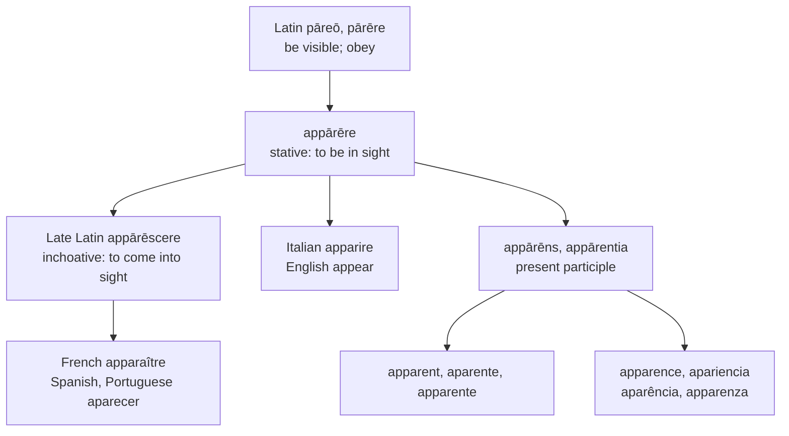

# *Appārēre*: one vowel, two fates

A study of a Latin verb that most of Romance replaced with its own inchoative, and of a single long *ā* that English borrowed twice — once under the stress and once beside it — and spelled two different ways without ever saying why.

---

## 1. The root

Latin *pāreō, pārēre* carries two senses that sit oddly together: "to come forth, be visible, appear," and "to obey, be subject to." The second grows out of the first by way of "to be at hand for," and both are classical. The etymology beyond Latin is unsettled; de Vaan proposes a PIE \**prh-o-* "providing."

With *ad-* the verb gives *appārēre*, "to come into sight, be visible, make an appearance." Its agent noun *appāritor* named the attendant who waited on a Roman magistrate, and its verbal noun *appāritiō* meant both an appearance and, in the plural, a body of servants — the sense that eventually narrows to English *apparition*.

**A false friend worth flagging.** *Parent* has nothing to do with this verb. It comes from *pariō, parere* — third conjugation, short *a* — meaning "to bring forth, give birth," the source also of *parturition*, *postpartum*, and *repertoire*. Latin held two verbs *par-ere* distinguished only by vowel length, and English has inherited words from both.

---

## 2. Stative and inchoative

*Appārēre* is stative: it describes the condition of being visible. Late Latin also formed *appārēscere*, with the inchoative suffix that marks a process beginning — the condition of *coming* into visibility.

For a verb meaning "appear," the inchoative is the more useful of the two, and most of Romance took it. French *apparaître* descends from *appārēscere* by way of Old French *aparoistre*, on the same pattern that gives *naître* from *nāscere*, *croître* from *crēscere*, and *connaître* from *cognōscere*. Spanish *aparecer* and Portuguese *aparecer* show the same suffix in its Iberian form, alongside *crecer*, *nacer*, *conocer*, and *parecer*.

Italian and English kept the stative verb. Italian *apparire* holds *appārēre* with its conjugation shifted to *-ire*; English *appear* comes from *aper-*, the tonic stem of Old French *apare(i)r*, which is *appārēre* and not its inchoative.

The distribution is worth stating plainly, because it cuts across the usual groupings: French, Spanish, and Portuguese chose the verb of becoming; Italian and English chose the verb of being.

The simplex tells the same story. Romance turned *pārēre* and *parēscere* into its ordinary verb for "seem" — French *paraître*, Spanish and Portuguese *parecer*, Italian *parere*. English has nothing there and uses *seem*, a borrowing from Old Norse.

---

## 3. The comparative set

| | Verb | The noun | The adjective |
|---|---|---|---|
| **Latin** | *appārēre* | *appārentia* | *appārēns* |
| **French** | *apparaître* | *l'apparence* | *apparent* |
| **Spanish** | *aparecer* | *la apariencia* | *aparente* |
| **Portuguese** | *aparecer* | *a aparência* | *aparente* |
| **Italian** | *apparire* | *l'apparenza* | *apparente* |
| **English** | *to appear* | *the appearance* | *apparent* |
| **Inglisce** | *to appier* | *þi appirence* | *apperent* |

Two details in the columns. Spanish alone writes an extra *i*, giving *apariencia* against Portuguese *aparência* and French *apparence*; the form has most likely been drawn into the large Spanish class in *-iencia* — *paciencia*, *ciencia*, *experiencia*, *audiencia* — which continues Latin *-ientia*. And Spanish and Portuguese simplify the geminate *pp* that French, Italian, English, and Inglisce all keep.

The English row is the only one whose three forms do not share a stem vowel.

---

## 4. One Latin vowel, two English ones

English *appear* is /əˈpɪə/. English *apparent* is /əˈpærənt/. The vowel in question is the same Latin vowel — the long *ā* of *appār-* — in both words. What separated them is where the stress fell in the particular Latin form that was borrowed.

In *appāret* the accent lands on that syllable: *ap-**pā**-ret*. A stressed long *ā* in an open syllable became /e/ in Old French, /ɛː/ in Middle English, and then /iː/ through the Great Vowel Shift, breaking to /ɪə/ before *r*. That is the vowel of *appear*.

In *appārentem* the accent moves forward to the following syllable: *ap-pa-**ren**-tem*. Pretonic, the vowel never lengthened in the vernacular and never entered the shift. That is the vowel of *apparent*.

So the two English words differ in their stressed vowel for no reason internal to English at all. They differ because one was borrowed from a form in which the syllable was accented and the other from a form in which it was not.

*Appearance* complicates the picture in a way that repays attention. Its Latin source *appārentia* has the accent on *-ren-*, exactly as *appārentem* does, and it ought therefore to rhyme with *apparent*. It does not: it is /əˈpɪərəns/, with the vowel of the verb. The noun was rebuilt on English *appear* at some point after its arrival, and its vowel is the evidence. In Latin and throughout Romance, *appārentia* and *appārēns* are the same stem; in English they have come apart.

English marks the split, but with graphemes that cannot be relied upon. The `ea` of *appear* spells /iː/ in *meat*, /ɛ/ in *head*, /eɪ/ in *great*, and /ɪə/ here; the `a` of *apparent* spells /æ/ for some speakers and /ɛə/ for others. A reader who did not already know the words could not derive either.

---

## 5. The Inglisce forms

`Appirence` and `apperent` record the split with letters that do not equivocate. `I` is the system's letter for /iː/ and `e` for /ɛ/, so the two words announce their vowels rather than presupposing them, and the stem `appir-` runs consistently through the verb, the progressive, and the noun.

The choice has a cost that should be named. Every Romance form in the table shares a stem — *apparence* and *apparent*, *apariencia* and *aparente*, *apparenza* and *apparente* — because in Romance the noun and the adjective genuinely are the same stem. `Appirence` beside `apperent` breaks that, and it breaks it in a place where Latin had no break at all. What the system is recording is not the Latin unity but the English fracture: it writes what English says, and English says two different things.

The geminate `pp` is kept, aligning with French, Italian, and English against Spanish and Portuguese.

`Appier` is the infinitive and `appire` the finite stem, with the progressive `appiering` built on the infinitive. English has no such distinction — *to appear* and *I appear* are one form — though Middle English marked the infinitive with *-en* before the ending was lost. Every other language in the table keeps the two apart, and the system restores what English discarded.
