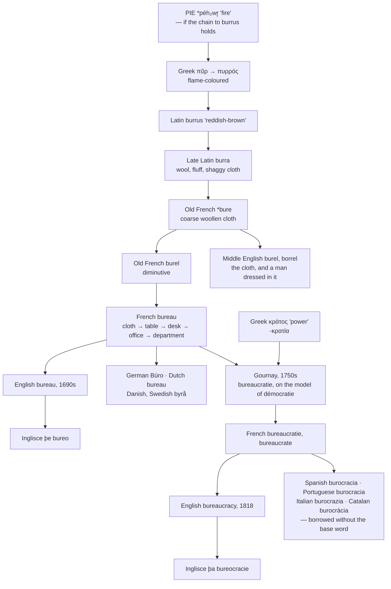

# *Burra*: the cloth that became a government

A study of a word that started as a piece of cheap wool, climbed from the cloth to the table to the room to the institution, and then produced a derivative so successful that four Romance languages borrowed it without ever borrowing the word it was built on.

---

## 1. The root is a piece of cloth

Late Latin *burra* meant wool, fluff, shaggy fabric — coarse stuff, the cheap end of the trade. It gave Old French \**bure* "coarse woollen cloth," which survives as Middle French *bure* and as modern French *bourre* "stuffing, fluff."

From \**bure* Old French made the diminutive *burel*, a small or common grade of the same cloth. *Burel* became *bureau*.

English borrowed the cloth word too, twice over: *burel* and *borrel* both existed in Middle English for the fabric, and *borrel* came to mean a plain, unlearned person — dressed in cheap wool, therefore not a gentleman. Both are long dead. The only survivor of the family in English is the word that went to France first and came back furnished.

---

## 2. Cloth, table, room, institution

The rest is a ladder, and every rung is visible in the record.

1. **The cloth.** *Bureau* is the baize you spread over a table.
2. **The table.** By the fourteenth century, the cloth you did accounts on, then the table it covered.
3. **The desk.** A table with drawers, for papers. This is the sense English borrowed in the 1690s.
4. **The room.** By 1720 English has *bureau* for the place where the desk is — the office.
5. **The department.** By 1796 it is a division of a government.
6. **The furniture again.** A chest of drawers, from 1770, which is now the ordinary American sense.

Nothing in this chain is metaphor. Each step is the ordinary movement by which the name of a covering passes to the thing covered, and then to the place, and then to the people in it. The same path took *the chair* to a professorship and *the crown* to a state.

The end of it is a government department named after a bedsheet-grade textile.

---

## 3. And possibly fire

Late Latin *burra* is usually connected to *burrus* "red, reddish-brown," which is a borrowing of Ancient Greek πυρρός *purrhós* "flame-coloured," from πῦρ *pûr* "fire" — the same word as *pyre* and *pyrotechnic*.

πῦρ descends from Proto-Indo-European \**péh₂wr̥*, which is also the ancestor of English *fire*. If the chain holds, *bureau* and *fire* are the same root, and so is *burro*: Spanish *burrico* comes from Late Latin *burricus*, a small shaggy horse, likewise traced to *burrus*.

The chain is not certain. Some accounts leave *burra* as a word of unknown origin and treat the resemblance to *burrus* as coincidence, and Greek βερβέριον "shabby garment" is offered as a separate connection. Both routes end in the same place — something reddish-brown, or something shaggy — which is what coarse undyed wool looks like.

---

## 4. A word coined as a joke

*Bureaucratie* was invented in France in the 1750s by Jacques Claude Marie Vincent, marquis de Gournay, an intendant of commerce who spent his career objecting to regulation.

He built it by analogy. Greek political vocabulary named forms of government by who held the *kratos*, the power: *monarchie*, *aristocratie*, *démocratie*. Gournay proposed a fourth or fifth form, ruled by desks. The contemporary who recorded the joke, Baron von Grimm, reports him also using *bureaumanie*, an obsession with offices, and calling it an illness.

Two things follow from being coined this way.

**The word was an insult from birth.** It was not the neutral name of an administrative structure that later acquired a sour taste; it was a satire that later acquired a neutral use. English shows the same order: the first known English use, in 1818, applies it to office tyranny, and the neutral sense arrives around the middle of the century.

**It is a hybrid, and a strange one.** *-cratie* is Greek. *Bureau* is French, from Latin, from a piece of cloth. There is no ancient word behind *bureaucratie*; the whole thing is an eighteenth-century construction on a Greek pattern, and *bureaucrate* and *bureaucratique* were built afterwards on the same model as *aristocrate* and *démocrate*, which are themselves French formations of roughly the same period rather than inherited Greek nouns.

---

## 5. Across Romance

| Language | The office | The abstract noun | The person | The adjective | The verb |
|---|---|---|---|---|---|
| **French** | *le bureau* | *la bureaucratie* | *le bureaucrate* | *bureaucratique* | *bureaucratiser* |
| **English** | *the bureau* | *the bureaucracy* | *the bureaucrat* | *bureaucratic* | *to bureaucratise* |
| **Spanish** | *la oficina* | *la burocracia* | *el burócrata* | *burocrático* | *burocratizar* |
| **Portuguese** | *o escritório* | *a burocracia* | *o burocrata* | *burocrático* | *burocratizar* |
| **Italian** | *l'ufficio* | *la burocrazia* | *il burocrate* | *burocratico* | *burocratizzare* |
| **Catalan** | *l'oficina* | *la burocràcia* | *el buròcrata* | *burocràtica* | *burocratitzar* |
| **Inglisce** | þe bureo | þa bureocracie | þe bureocrat | bureocratic | to bureocratyse |

**The first column is where the interest lies.** Spanish, Portuguese, Italian and Catalan have the whole derived family and no base word. *Burocracia* exists; *buro* does not. The root of the word is not a word in the language.

What they use instead is Latin *officium* "duty, service, function" — *oficina*, *ufficio*, *escritório* being a separate formation on *scrībere*. English has *officium* too, as *office*, and so the office is common ground across the whole set. Only French, English, and the Germanic languages that borrowed from French — German *Büro*, Dutch *bureau*, Danish and Swedish *byrå* — call the place a bureau.

Spanish and Catalan do have *buró*, and Portuguese has *birô*, but narrowly: a writing desk of a particular kind, and the governing committee of a political party. It arrived as a nineteenth- and twentieth-century Gallicism, long after *burocracia*, and it never took over the general sense.

**So the abstract noun travelled alone.** *Bureaucratie* spread across Europe as a complete unit, in one movement, in the decades after Gournay, because what spread with it was a political idea rather than a piece of furniture. A language that already had *oficina* had no use for *bureau* and every use for *burocracia*.

**The forms are stable and the endings are native.** Every language put the Greek suffix into its own regular shape: French *-tie*, Spanish and Portuguese and Catalan *-cia*, Italian *-zia*, all of them the ordinary outcomes of Latin *-tia*. Only the *e* of *bureau* varies — French and English keep it, Iberia and Italy reduce to *buro-* — and that follows the pronunciation: French and English have a glide before the vowel, and the Iberian and Italian forms have none to write.

**The written accents record stress.** Spanish *burócrata*, Catalan *buròcrata* and Italian *burocrate* stress the antepenult; French *bureaucrate* stresses the last syllable, as French does everything. English stresses the first syllable of *bureaucrat* and the second of *bureaucracy*, which is why the two words sound less related than they are.

---

## 6. English holds the whole family

English is in the unusual position of having both ends: the base word from the 1690s, borrowed as an object, and the derived word from 1818, borrowed as a political idea, a hundred and twenty years apart and from the same language.

That is why English can still see the joke, at least in principle. *Bureaucracy* is transparently *bureau* plus a suffix, and *bureau* is still a live English noun. In Spanish the connection is invisible, because *buro* is not there to connect to.

What English has lost instead is the plural. French *bureau* pluralises *bureaux*, and English has wavered between *bureaus* and *bureaux* since it borrowed the word, with *bureaus* now much the commoner in ordinary use.

---

## 7. The tree

---

## 8. The Inglisce forms

| English | Inglisce |
|---|---|
| the bureau, the bureaus | þe bureo, þe bureos |
| the bureaucracy | þa bureocracie |
| the bureaucrat | þe bureocrat |
| bureaucratic | bureocratic |
| to bureaucratise | to bureocratyse |

**`-eau` becomes `-o` because `au` is already spoken for.** In the system `au` is /ɔ/ — `automn`, `automatic`, `caufie` — so a written *bureau* would be read /bjʊrɔ/. Final `-o` gives /oʊ/, and `bureo` therefore reads the way English says the word. The French spelling is dropped because the system already uses those letters for something else, not because the French shape is unwelcome.

**The plural settles a question English has left open.** `Bureos` takes the ordinary `-s`, so the choice between *bureaus* and *bureaux* does not arise. The word is treated as fully naturalised, which after three hundred years it is.

**The `e` after the `u` carries the yod.** The word begins /bjʊ/, not /bu/, and in the system it is a following `e` that gives `u` its /ju/ value. Placed directly after the `u`, the `e` is what marks the glide: `bureo` is /bjʊroʊ/ where `buro` would be /buroʊ/. The letter is not inherited decoration from the French spelling — remove it and the pronunciation changes.

This is also why the Romance languages could do what Inglisce cannot. Spanish, Portuguese, Italian and Catalan all reduced the stem to *buro-*, and the reduction costs them nothing, because there is no glide in *burocracia* to lose. English and French have one, so the letter that writes it has to stay. The by-product is that the whole family keeps a single shape: `bureo`, `bureocracie`, `bureocrat`, `bureocratic` all open with the same four letters.

**`To bureocratyse` writes the /aɪ/ with `y`.** The verb ends /aɪz/, and `y` is the system's letter for stressed /aɪ/. The `s` between vowels is voiced, so `-yse` gives /aɪz/ without further marking. The choice of `s` over `z` puts Inglisce with British *-ise*, French *-iser*, and the Iberian *-izar* pattern read through the system's own values.

**The articles track the French genders exactly.** `þe bureo` and `þe bureocrat` are masculine, as *le bureau* and *le bureaucrate* are; `þa bureocracie` is feminine, as *la bureaucratie* is, and as every Romance language in the table has it — *la burocracia*, *a burocracia*, *la burocrazia*, *la burocràcia*. Abstract nouns in this suffix are feminine across the whole family, because Greek *-κρατία* was feminine and Latin *-tia* was feminine after it, and Inglisce inherits the agreement along with the word.
