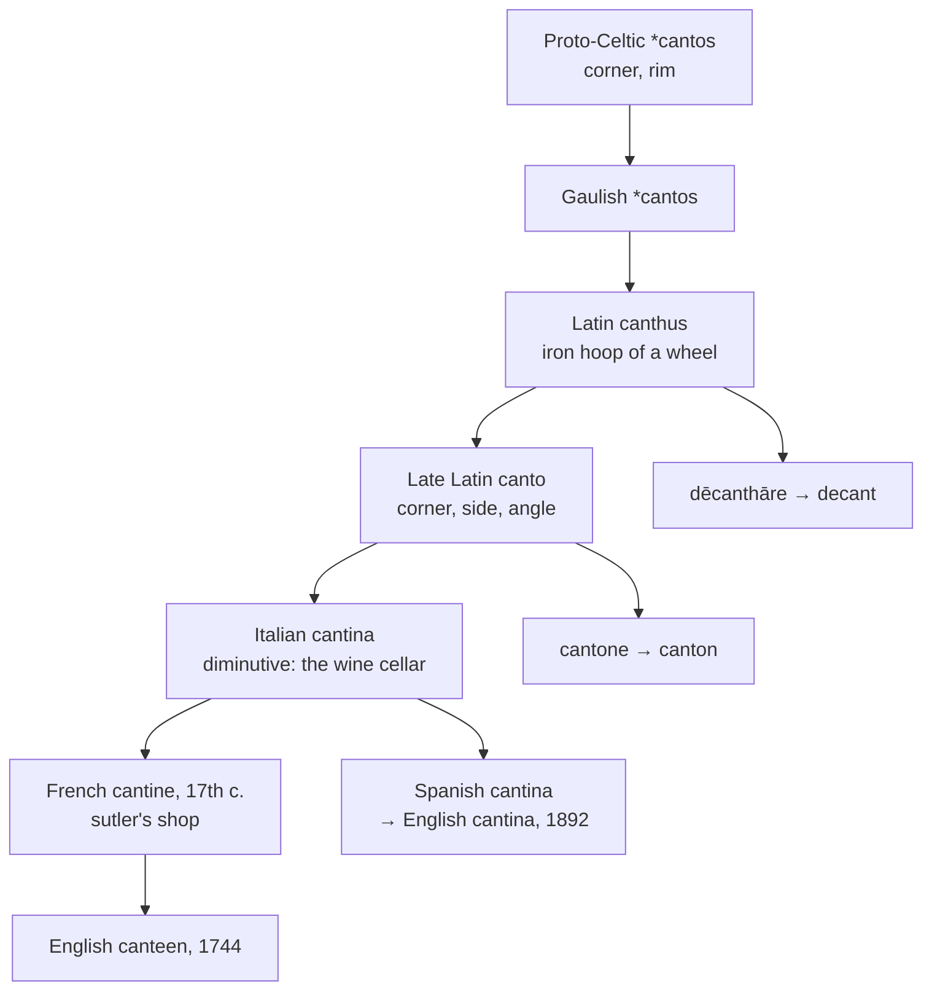

# \**Cantos*: a corner to keep the wine in

A study of a Gaulish word for the rim of a wheel, of the Italian cellar it became, and of an English spelling that took a French word and made it look like nothing else in Europe.

---

## 1. The root is Celtic

Proto-Celtic **\*cantos** "corner, rim" gives Gaulish \**cantos*, and from Gaulish it was borrowed into Latin as **canthus** — the iron hoop encircling a chariot wheel, and thence the rim or edge of anything.

The borrowing is worth noting for its direction. Latin took the word from the Celts, not the other way round, and the technical vocabulary of wheeled transport is one of the areas where Gaulish left the deepest mark on Latin, alongside *carrus* "wagon" (whence *car*, *carry*, *chariot*) and *cambiāre* "to exchange" (whence *change*).

A connection to Greek *kanthós* "corner of the eye" has often been proposed. Wiktionary calls it unconvincing, and the Celtic derivation is the one now generally preferred.

By Late Latin the word had generalised to *canto* "corner, side, angle," and it is from that sense that everything else descends.

---

## 2. The corner family

English holds a good deal of this root, and almost none of it looks related:

| Source | English |
|---|---|
| *canthus* through Old French | **cant** — a slope, an angle, a tilted surface |
| *canthus* + diminutive *cantel* | **cantle** — a corner piece; the raised back of a saddle |
| Italian *cantone*, augmentative of *canto* | **canton**, **cantonment** |
| Medieval Latin *dēcanthāre* | **decant**, **decanter**, **decantation** |
| Italian *cantina*, diminutive of *canto* | **canteen**, **cantina** |

**Decant** repays attention. It is *de-* plus *canthus*: to pour off from the edge or lip, leaving the sediment behind. The word is a piece of alchemists' Latin, and the *cant* in it is the same rim that went round a Gaulish wheel.

**Canton** is the corner sense enlarged — a corner of territory, hence a district, hence the Swiss administrative unit. *Cantonment*, where troops are quartered, is the same word again.

---

## 3. A false friend in the middle of it

Italian *canto* means two entirely different things.

One is **corner**, from *canthus*, and it is the source of *cantina*, *cantone*, and this whole family.

The other is **song**, from Latin *cantus*, the past-participle stem of *canere* "to sing." That is the *canto* of Dante's poem, and the source of *chant*, *cantata*, *canticle*, *incantation*, *accent*, and *enchant*.

The two are unrelated and have been confusing etymologists for centuries. The older dictionaries sometimes derive *canteen* from the singing word, and the resemblance is why several reference works still hedge on the origin. A *cantina* is a corner, not a song.

**English reproduces the same collision.** *Cant* meaning a slope or a tilted surface is *canthus*, the Gaulish rim. *Cant* meaning insincere or jargon-ridden speech is from Latin *cantāre* "to sing" — the whining delivery of beggars and, later, the professional vocabulary of thieves.

**Iberian Romance has it inside a single verb.** Latin kept the two apart with a letter: *dēcantāre* "to sing off, to repeat, to praise" against Medieval Latin *dēcanthāre* "to pour off from the rim." Romance lost the *h*, and the two fell together.

Portuguese dictionaries accordingly list *decantar* twice. One entry is glossed *do francês décanter* and means to pour a liquid off its sediment; the other is glossed *do latim decantāre* and means to celebrate in verse. Spanish is the same: *decantar* is both the chemist's operation and, in the older literary sense, to extol.

So a Portuguese speaker who decants a wine and a Portuguese speaker who decants someone's virtues are using two different verbs that Latin distinguished by a single consonant and Romance no longer can.

---

## 4. From cellar to lunchroom

The Italian *cantina* is a diminutive: a little corner, specifically the below-ground room where wine is kept. In Italy it still means that, and by extension the cool damp place where *salami* and other preserved food is hung.

The sense then moved outward through the military.

| Date | Sense |
|---|---|
| 17th c. | French *cantine*, a sutler's shop — the trader who followed an army |
| 1744 | English *canteen*, a store in a military camp |
| 1744 | English *canteen*, a small tin for water or liquor carried on the march |
| 1803 | a refreshment room at a military base |
| 1870 | extended to factories, schools, and offices |

English therefore ended with two senses from one word, and they have divided by country. In American use *canteen* is chiefly the water flask; in British use it is chiefly the dining hall. Both are the Italian wine cellar, one carried on a belt and one built into a school.

**English holds the word twice.** *Canteen* came through French in the eighteenth century; *cantina* came through Spanish into the English of Texas and the southwest by 1892, meaning a bar room. Both are Italian *cantina*, borrowed a hundred and fifty years apart at opposite ends of the language, and they are doublets that no one takes for relatives.

---

## 5. The comparative sets

### The cellar

| | The word | Chief sense |
|---|---|---|
| **Italian** | *la cantina* | wine cellar, basement |
| **French** | *la cantine* | works or school dining hall |
| **Spanish** | *la cantina* | bar, station buffet |
| **Portuguese** | *a cantina* | canteen, refectory |
| **Catalan** | *la cantina* | canteen |
| **Romanian** | *cantina* | canteen |
| **German** | *die Kantine* | works canteen |
| **English** | *the canteen* | dining hall; water flask |
| **Inglisce** | *þa cantine* | dining hall; water flask |

Every language in Europe has the word in the same shape — *-ina* or *-ine*, the Italian diminutive intact. English alone writes *-een*.

That spelling is an eighteenth-century anglicisation of French *cantine*, made by writers who wrote the vowel as they heard it rather than as the source had it, and it is the same treatment that gave English *tureen* from *terrine* and *poteen* from *poitín*. It records the pronunciation and severs the word from every one of its cognates.

### The pouring

| | To decant | The vessel | The act |
|---|---|---|---|
| **Medieval Latin** | *dēcanthāre* | — | — |
| **French** | *décanter* | *le décanteur*, *la carafe* | *la décantation* |
| **Spanish** | *decantar* | *el decantador* | *la decantación* |
| **Portuguese** | *decantar* | *o decantador* | *a decantação* |
| **Italian** | *decantare* | *la caraffa* | *la decantazione* |
| **Catalan** | *decantar* | *el decantador* | *la decantació* |
| **English** | *to decant* | *the decanter* | *the decantation* |
| **Inglisce** | *to dicante* | *þe dicanter* | *þa dicantâcion* |

The verb is universal and the vessel is not. English *decanter* names the bottle from the operation; French and Italian mostly use *carafe* and *caraffa*, from Arabic *ġarrāfa*, and keep the *decant-* stem for technical use. The word for the thing on the table is Arabic in half of Europe and Gaulish in the other half.

---

## 6. The Inglisce forms

| English | Inglisce | Plural |
|---|---|---|
| canteen | `cantine` | `cantíns` |
| cant | `cante` | `cants` |
| cantle | `cantele` | `cantels` |
| decant | `dicante` | — |
| decanter | `dicanter` | `dicanters` |
| decantation | `dicantâcion` | `dicantâcions` |

**`Cantine` restores the international spelling.** The word is *cantine* in French, *cantina* in five other languages, and *Kantine* in German. Nothing is lost by writing it as everyone else does: the silent `-e` fixes the preceding `i` as /i/ and draws the stress onto it, so `cantine` reads /kænˈtin/ without further marking.

**The plural shows two devices changing places.** When the silent `-e` drops before the ending it can no longer do its work, and the acute takes over: `cantíns`. The mark is neither decoration nor irregularity — it appears exactly where the `-e` has gone and does exactly what the `-e` was doing. English writes *canteen* and *canteens* and marks nothing in either, relying on `ee` to carry a value it does not reliably have elsewhere.

**`Cante`** takes the silent `-e` as a monosyllable serving as both noun and verb and drops it before the plural.

**`Cantele`** writes the reduced vowel of /ˈkæntəl/ with `e`, giving `-ele` for /əl/. The word is a diminutive of *cant*, and the spelling keeps that visible: `cante` inside `cantele`, as *cantel* sits inside Old French.

**`Dicante`, `dicanter`, and `dicantâcion`** carry the family's most literal member. To decant is to pour off from the `cant` — the rim or lip — leaving what has settled behind, and the spelling keeps the stem visible. `Dicantâcion` takes the circumflex for /eɪ/, no final `-e` being available to fix the vowel, and writes `-cion` for /ʃən/.

The article is feminine for `cantine`, `dicanter`, and `dicantâcion`, the stress falling away from the first syllable, and masculine for the rest.
