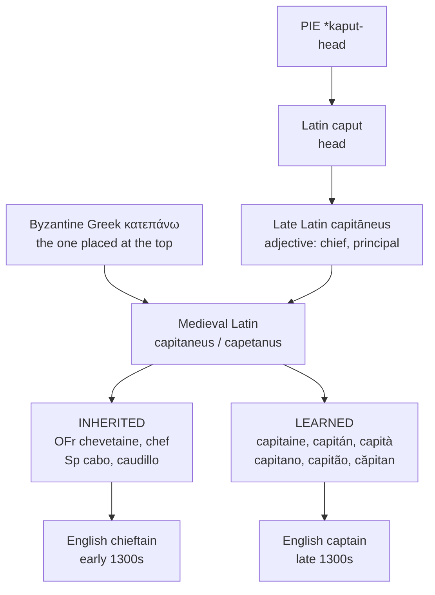

# *Capitaneus*: the head as an office

A study of a Late Latin adjective that became a military rank across the whole of Romance, and of the doublets it left behind in French, Spanish, and English.

---

## 1. The root

Latin *caput, capitis* n. "head" descends from Proto-Indo-European **\*kaput-**, a root of exceptional productivity. Its Latin and Romance progeny include *capitālis*, *capitulum*, *capitellum*, *praecipitium*, *occiput*, and *sinciput*, and by way of French and Italian it has furnished English with *cape*, *capital*, *capitulate*, *chapter*, *chef*, *chief*, *cadet*, *cattle*, *corporal*, *caprice*, *capsize*, and *mischief*. The same root, subject to the Germanic consonant shift, yields English *head* itself. *Captain* and *head* are therefore reflexes of a single Indo-European etymon, separated by Grimm's law and some four thousand years.

From *caput* Late Latin formed the adjective *capitāneus*, "of the head, chief, principal." The formation is not Classical. Classical Latin designated a military commander as *dux*, *praefectus*, *lēgātus*, *tribūnus*, or *centuriō*; *capitāneus* belongs to the later imperial and post-imperial vocabulary, and its substantivisation into a noun denoting a person is a medieval development.

---

## 2. The Byzantine convergence

The history of the word is complicated, and enriched, by a second source. Byzantine Greek κατεπάνω (*katepánō*), "the one placed at the top," designated the senior military governor of the Catepanate of Italy. Latinised as *catepanus* and *capetanus*, the title circulated in the same southern Italian milieu as *capitāneus* and was absorbed into it.

The merger accounts for the variant forms with medial *e* that recur across the tradition: Latin *capetanus*, Venetan *capetanio*, and — by a separate route through Greek καπετάνιος — Ottoman Turkish کاپتان and modern Turkish *kaptan*. What might appear a stray vowel is in fact the residue of a Greek title that converged with a Latin adjective in eleventh-century Apulia.

---

## 3. From adjective to office

The substantivised *capitāneus* enters the documentary record as a feudal and then a military designation. In eleventh-century Lombardy the *capitanei* constituted the class of greater vassals holding directly of the archbishop, ranked above the *valvassores*; the term denotes standing within a hierarchy before it denotes command of a body of troops.

The narrowing to a definite military grade — an officer commanding a company, ranked below the major and above the lieutenant — belongs to the reorganisation of European armies in the sixteenth and seventeenth centuries. The naval sense, and thereafter the civil and sporting senses, extend from it.

The semantic path is thus the reverse of the one traced for *cēnsor*. There, a concrete Roman office was progressively abstracted and redirected onto texts. Here, an abstract adjective meaning "chief" was progressively concretised into a specific rank on a specific rung of a specific hierarchy.

---

## 4. The learned–popular test

*Capitāneus* is unusually well suited to distinguishing inherited from borrowed vocabulary, because the sound changes bearing on it are conspicuous and diagnostic. Intervocalic *-p-* lenites in the western languages; initial *ca-* palatalises in French; final syllables reduce. A reflex preserving *-p-* intact has not passed through the ordinary phonological history of its language and must be a learned or semi-learned borrowing from the written word.

Applied to the set, the test yields doublets in three languages.

| | Inherited reflex of *caput*/*capitāneus* | Learned reflex |
|---|---|---|
| **French** | *chevetaine* (OFr) — *ca-* → *che-*, *-p-* → *-v-*; also *chef*, *chief* | *capitaine* |
| **Spanish** | *cabo* (< *caput*), *caudillo* (< *capitellum*) — *-p-* → *-b-* → *-u-* | *capitán* |
| **English** | *chieftain* (< OFr *chevetaine*), *chief* | *captain* |

French *capitaine* is doubly diagnostic: it retains both the unpalatalised *ca-* that popular French turns to *che-* (as *caballum* → *cheval*, *capra* → *chèvre*) and the intervocalic *-p-* that popular French turns to *-v-*. Old French *chevetaine* displays both changes and is the genuine inheritance; *capitaine* is a re-borrowing from the Latin of the chancery, subsequently reinforced by Italian military usage.

Spanish exhibits the same configuration. Inherited *cabo* shows the regular voicing of intervocalic *-p-*, and *caudillo* the further vocalisation of that consonant before a stop. *Capitán*, retaining *-p-*, cannot be inherited.

Italian and Romanian complicate the picture in different ways. Italian is phonologically conservative and preserves *capo* < *caput* with the plosive intact, so the test does not discriminate there; *capitano* is nonetheless likely to be the form from which the others were reinforced, given the Italian provenance of the military institution. Romanian *căpitan* is a borrowing, most probably from Italian, and stands apart from inherited *cap* "head."

---

## 5. What each form records

Each language preserves a different fragment of the Latin morphology, and the plural is where the differences surface most sharply.

| | Singular | Plural | What the form records |
|---|---|---|---|
| **Latin** | *capitānus* ~ *capetanus* | *capitānī* | The base of the rest. The variant medial vowel is the residue of the *katepánō* merger. |
| **Portuguese** | *o capitão* | *os capitães* | The plural *-ães* continues *-ānem*, as against *-ãos* < *-ānum* (*irmão*) and *-ões* < *-ōnem* (*leão*). The noun is therefore inflected on the imparisyllabic third-declension pattern. Portuguese alone in the set preserves this, and preserves it morphologically rather than orthographically. |
| **Spanish** | *el capitán* | *los capitanes* | Final *-n* retained throughout, with the epenthetic *-e-* required before the plural *-s*. The intact *-p-* marks the word as learned; inherited *cabo* and *caudillo* show the expected lenition. |
| **Catalan** | *el capità* | *els capitans* | Final *-n* lost after a stressed vowel in the singular and restored before the plural *-s*, as in *pa* : *pans* and *mà* : *mans*. The consonant is visible in neither form alone. |
| **French** | *le capitaine* | *les capitaines* | Unpalatalised *ca-* and intervocalic *-p-* jointly mark a learned re-borrowing; the inherited reflex is *chevetaine*. Plurality is marked in writing only. |
| **Italian** | *il capitano* | *i capitani* | The Latin thematic vowel is retained in full and plurality marked by its alternation rather than by suffix — the most conservative treatment in the group. |
| **Venetan** | *el capitan* ~ *capetanio* | *i capitani* | Apocope of the thematic vowel in *capitan*. The variant *capetanio* preserves the medial vowel of *capetanus* and is the closest Romance parallel to the Inglisce form. |
| **Romanian** | *căpitan*, def. *căpitanul* | *căpitani*, def. *căpitanii* | The article is enclitic — *-ul* < *illum*, *-i* < *illī* — a feature shared with Albanian, Bulgarian, and Macedonian and generally attributed to the Balkan *Sprachbund*. |

The Romanian row requires the bare forms alongside the definite ones, since *căpitanul* and *căpitanii* correspond not to *capitano* and *capitani* but to *il capitano* and *i capitani* entire. Set against the bare nouns of the other languages, the definite forms overstate the divergence; set against their articles, they are exactly parallel.

---

## 6. The English doublet

English received the word twice within a single century, by two different routes, and kept both.

| Word | Entered | Immediate source | Character |
|---|---|---|---|
| **chieftain** | early 1300s, *cheftayne* | Anglo-French *chiefteyn*, Old French *chevetain* | inherited through French |
| **captain** | late 1300s, *capitayn* | Old French *capitaine* | learned, re-borrowed |
| **chief** | 1200s | Old French *chief* | inherited through French |

The two are doublets in the strict sense: a single Latin etymon reaching one language along two paths and surviving as two lexemes. English then differentiated them semantically, assigning *chieftain* to tribal and clan leadership and *captain* to military and naval rank — a division of labour that neither French nor Spanish possesses, since in each of those the popular form was largely displaced by the learned one rather than retained beside it.

The structural parallel with *cēnsor* and *cēnsūra* is exact. In both cases English holds two reflexes of one Latin word where the Romance languages hold one, and in both cases the doubling results from borrowing chronology rather than from any inherited distinction. English is not more discriminating than its neighbours; it is merely less tidy, and its untidiness has been put to semantic work after the fact.

---

## 7. The Inglisce form

| | Singular | Plural |
|---|---|---|
| **English** | the captain | the captains |
| **Inglisce** | **þe capetan** | **þe capetans** |

`Capetan` is disyllabic, /ˈkæptən/, and the medial `e` is not pronounced. It is written on the French principle of *e caduc*: a letter whose realisation ranges from [ə] to nothing according to register and context, as in *petit* /pəti/ or /pti/ and *samedi* /samdi/. The vowel is written because the word contains it etymologically and because every language in the comparison set retains it; the syncope is left to the reader, as French leaves it.

The corollary is that unstressed vowels are not respelled phonetically. The final syllable of `capetan` is itself reduced, to /ən/, yet is written `a`; the letter records the etymon and the reduction follows automatically from the absence of stress. This is the practice of French and of received English alike, and it separates the system from a strictly phonemic orthography, which would be obliged either to write the two reduced vowels with one letter or to write neither.

The form is thereby overdetermined, in the fortunate sense. Written on these grounds, it coincides with Medieval Latin *capetanus* and Venetan *capetanio*, both products of the convergence with Byzantine *katepánō* described above, and with the Greek καπετάνιος from which Turkish *kaptan* derives. A spelling motivated by English orthographic principle turns out to match a medieval form motivated by an entirely different history.

The termination `-an` rather than `-ain` removes a French orthographic digraph that English retains without phonetic warrant, since *captain* has not been pronounced with a diphthong in that syllable for centuries. The resulting shape aligns with Spanish *capitán*, Catalan *capità*, and Romanian *căpitan* rather than with French *capitaine*, and is consistent with the general preference of the system for Romance form.
