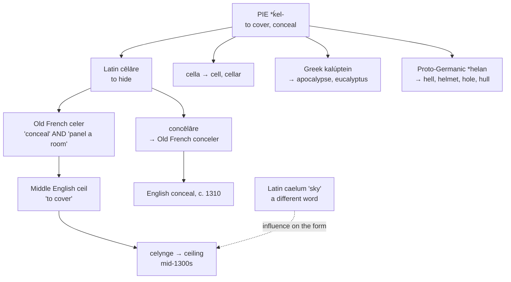

# *Cēlāre*: what covers you from above

A study of a verb meaning *to hide*, of the room-covering that is literally a concealing, and of the Indo-European root that gave English both *ceiling* and *hell*.

---

## 1. The root

Proto-Indo-European **\*ḱel-** means "to cover, to conceal, to save." It is one of the most productive roots in the European vocabulary, and its descendants reached English by three separate routes.

**Through Latin.** Two groups here, and they should be kept apart. Some English words descend from the verb *cēlāre* itself; others descend from separate Latin formations on the same root, and are cousins of *conceal* rather than children of it.

*From the verb:*

| Latin | English |
|---|---|
| *cēlāre* "to hide" | **ceiling** |
| *con-* + *cēlāre* | **conceal**, **concealment** |
| *ob-* + *cēlāre* → *occultus* | **occult**, **occultation** |

*From the root, but not from the verb:*

| Latin | English |
|---|---|
| *cella* "small room, storeroom" | **cell**, **cellar**, **cellular** |
| *clam* "secretly" → *clandestīnus* | **clandestine** |
| *cilium* "eyelid," the coverer | **cilia**, **supercilious** |

A *cella* is a covered space and a *cilium* is what covers the eye, so the sense of the root is present in all of them; but neither is built on *cēlāre*, and *cell* is no more a derivative of *conceal* than *hole* is.

**Through Greek:**

| Greek | English |
|---|---|
| *kalúptein* "to cover" | **eucalyptus** — "well-covered," of its budcaps |
| *apo-kalúptein* "to uncover" | **apocalypse** — an *un*-covering, a revelation |
| *koleós* "sheath" | **coleoptera**, the sheath-winged beetles |

**Through Germanic, without a break:**

| Old English | English |
|---|---|
| *helan* "to conceal" | *hele*, now dialectal |
| *hol* "cave" | **hole**, **hollow** |
| *helm* "covering" | **helm**, **helmet** |
| *hulu* "husk" | **hull** |
| *hell* | **hell** |

**Hell is the concealed place** — the covered-over one, from Proto-Germanic \**haljō*, the same root and the same idea as a helmet or a hull. So *ceiling* and *hell* are one word: what covers you from above, and what covers you from below.

And **apocalypse** is its exact negation. An apocalypse is a *dis-concealing*, and the Book of Revelation is named for the removal of a covering.

---

## 2. *Conceal* and *ceiling* are one verb

Latin *concēlāre* is *con-*, here intensive, plus *cēlāre*. Old French made *conceler* "to hide, to dissimulate," and English took it about 1310 as *concelen*, displacing Old English *dēagan*.

The same Old French verb had a second job. **Celer** meant "to conceal" *and* "to cover with panelling" — the two senses being one act, since panelling a room hides its rafters.

Middle English borrowed that verb too, as **ceil**, "to put a cover over," and from it formed the noun **celynge**, "the act of panelling," attested from the mid-fourteenth century. By the late fourteenth century the noun meant the panelling itself, and by the 1530s the overhead surface of a room.

So a **ceiling** is a *concealing*. The word is the gerund of a verb English no longer has, and the thing it names is defined by what it hides.

The verb *ceil* survives only as a technical term in carpentry. The figurative *ceiling* — an upper limit — dates from 1934, and *hit the ceiling* meaning to lose one's temper from 1908.

---

## 3. A second Latin word may be in it

Etymologists add a complication. The form of *ceiling* was **probably influenced by Latin *caelum* "heaven, sky,"** which is a different word entirely and gives French *ciel*, Spanish *cielo*, Italian *cielo*, Portuguese *céu*, and English *celestial*.

The two suit the sense equally well. A ceiling is the thing that hides the roof, which points to *cēlāre*; and it is the sky of the room, which points to *caelum*. The `ei` of the English spelling may be a trace of the second word pulling on the first.

If so, the word is a blend — the meaning from one Latin verb and part of the shape from an unrelated Latin noun that happened to mean the right thing.

---

## 4. The ceiling is English

No Romance language uses this verb for the overhead surface of a room. Each built its own word from something else entirely:

| | Ceiling | Literally |
|---|---|---|
| **French** | *le plafond* | *plat fond*, "flat bottom" |
| **Spanish** | *el techo* | Latin *tēctum*, "roof, covering" |
| **Portuguese** | *o teto* | Latin *tēctum* |
| **Italian** | *il soffitto* | Latin *suffictus*, "fixed underneath" |
| **Catalan** | *el sostre* | Latin *superstes*, "standing over" |
| **English** | *the ceiling* | Latin *cēlāre*, "to hide" |

Four different metaphors — the flat bottom, the roof, the thing fixed underneath, the thing standing over — and English alone named it for concealment.

**The verb itself faded in Romance too.** French *celer*, Italian *celare*, and Spanish *celar* survive only in literary or archaic use. The everyday words are French *cacher*, from Vulgar Latin \**coacticāre* "to press together"; Spanish *esconder* and Portuguese *esconder*, from *abscondere*; and Catalan *amagar*, of uncertain origin.

---

## 5. The comparative set

| | To conceal | The everyday verb | The sky |
|---|---|---|---|
| **Latin** | *cēlāre*, *concēlāre* | *cēlāre* | *caelum* |
| **French** | *celer* (literary) | *cacher* | *le ciel* |
| **Spanish** | *celar* (rare) | *esconder*, *ocultar* | *el cielo* |
| **Portuguese** | *celar* (rare) | *esconder*, *ocultar* | *o céu* |
| **Italian** | *celare* (literary) | *nascondere* | *il cielo* |
| **Catalan** | *celar* (rare) | *amagar* | *el cel* |
| **English** | *to conceal* | *to hide* | *the sky* |
| **Inglisce** | *to conceile* | *to hide* | *þe scoihe* |

**English kept the Latin verb and Romance did not.** *Conceal* is in ordinary use, where *celer* and *celare* have retreated into poetry. The Romance languages replaced it and English, having borrowed it, uses it more than its source languages do.

**English uses Norse for the everyday word.** *Hide* is Old English *hȳdan*, and *sky* is Old Norse *ský* "cloud" — so English says *hide* and *sky* where Romance says *cacher* and *ciel*, and reserves the Latin words for the formal register.

### The prefixed verbs

| | Concealment | To occult | Occultation |
|---|---|---|---|
| **Latin** | *concēlātiō* | *occulere*, *occultāre* | *occultātiō* |
| **French** | *le recel*, *la dissimulation* | *occulter* | *l'occultation* |
| **Spanish** | *el ocultamiento* | *ocultar* | *la ocultación* |
| **Portuguese** | *a ocultação* | *ocultar* | *a ocultação* |
| **Italian** | *l'occultamento* | *occultare* | *l'occultazione* |
| **Catalan** | *l'ocultació* | *ocultar* | *l'ocultació* |
| **English** | *the concealment* | *to occult* | *the occultation* |
| **Inglisce** | *þa conceilement* | *to occulte* | *þi occultâcion* |

**The two prefixes divided the labour differently in each language.** Latin had *concēlāre* and *occulere* side by side, both intensives of *cēlāre*. English took *con-* for the ordinary sense and left *ob-* to the astronomers and the esotericists; Iberian Romance did the reverse, making *ocultar* the everyday verb for hiding and having no descendant of *concēlāre* at all.

French kept both and narrowed the first sharply: *recel* and *receler* are the legal terms for receiving stolen goods — concealment in the criminal sense only.

**Only English writes the doubled consonant in one and not the other.** *Occult* has `cc` from Latin *occultus*, where the *b* of *ob-* assimilated to the following *c*; Spanish, Portuguese, and Catalan simplified it to a single letter, and Italian and English kept it.

---

## 6. The Inglisce forms

| English | Inglisce |
|---|---|
| conceal | `conceile` |
| concealment | `conceilement` |
| ceiling | `ceiling` |
| occult | `occulte` |
| occultation | `occultâcion` |

**One word, one spelling.** English writes `ea` in *conceal* and `ei` in *ceiling*, two digraphs for the same vowel in two forms of the same verb. Nothing distinguishes them but the accident of which French spelling each word carried across.

`Conceile` and `ceiling` share their `ei`, so the relation is visible: a ceiling is what conceals.

**The `ei` is the one English already uses after `c`.** *Receive*, *deceive*, *perceive*, *conceive*, *ceiling*, and *seize* all write `ei` for /i/, and the schoolroom rule about *i* before *e* is a description of exactly this. `Conceile` joins the class it belongs to; English *conceal* is the member that wandered out of it.

**The silent `-e` marks the verb**, and `ceiling` needs none, the `-ing` already supplying a vowel after the `l`.

**`Conceilement` takes the French `-ement`** where English clips it to `-ment`, and keeps `conceile` whole inside it — so the noun shows the verb it is built on, and the `ei` runs through all three forms of the family.

**`Occulte` and `occultâcion` keep the doubled consonant**, which is not decoration: the first `c` is the assimilated `b` of *ob-*, so `occ-` records a prefix that would otherwise disappear. The silent `-e` marks the verb, and `occultâcion` takes the circumflex for /eɪ/ and `-cion` for /ʃən/.

The stem `occult-` therefore stands apart from `conceil-` on the page, which is correct: they are two prefixes on one Latin verb, and English's own spelling of them shares nothing either.
