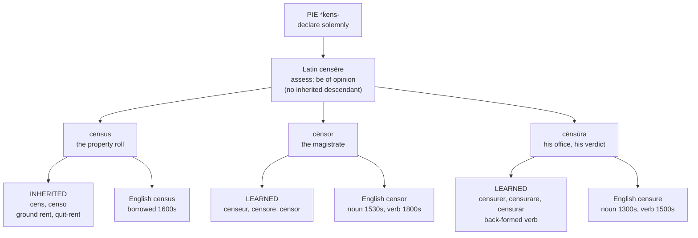

# Latin *censēre*

A study of why English carries three reflexes of a single Latin verb where the Romance languages carry two, and of how Inglisce orthography resolves the resulting collision.

---

## 1. The root

Latin *cēnseō, cēnsēre, cēnsuī, cēnsum* rests on the Proto-Indo-European root **\*ḱens-**, attested also in Sanskrit *śaṃsati* "he recites, proclaims, praises" and in Avestan *saŋhaiti*. The inherited sense is not enumeration but authoritative utterance: to pronounce in a manner that carries weight by virtue of the speaker's standing.

Two Latin senses develop from this and remain intertwined throughout the classical period. The first is assessment — to enter a citizen and his property in the register, and thereby to fix his rank. The second is formal opinion, the verb proper to senatorial procedure: a senator invited to speak replied *cēnseō*, and Cato's motion, in its traditional reconstruction, runs *ceterum censeo Carthaginem esse delendam*, where the verb denotes not private belief but a motion formally put.

The two senses are aspects of a single act. To *censere* is to declare what a thing is worth, whether the thing is a farm or a policy.

---

## 2. The Roman magistracy

The "censorship" was established, by tradition, in 443 BC. Two censors were elected at approximately five-year intervals and held office for eighteen months, a limit imposed by the *lex Aemilia* of 434. Their competence was threefold: the census proper, comprising the registration of citizens, the valuation of property, and the assignment of men to tribes and centuries; the *lectio senatus*, the periodic revision of the senatorial roll; and the *regimen morum*, the supervision of conduct.

The instrument of the third was the *nota censoria*, a mark entered beside a citizen's name in the register and accompanied by a brief *subscriptio* stating its cause. The recorded grounds are various — cowardice, perjury, cruelty toward slaves, extravagance, neglect of one's land, mismanagement of a household, celibacy. The sanction was not pecuniary but positional: removal from the Senate, forfeiture of the public horse, transfer to a lower tribe. The severity of Cato the Elder's censorship of 184 BC was such that *Censorius* attached permanently to his name.

It bears emphasis that the censors exercised no jurisdiction over written texts. Rome did suppress writings — Augustus ordered the burning of prophetic books, and Tacitus records the prosecution of the historian Cremutius Cordus under Tiberius, whose work was burned by the aediles — but such acts proceeded from the Senate, the praetor, or the *princeps*, not from the censors acting in their censorial capacity. The office was concerned with the standing of persons.

Sulla allowed the magistracy to lapse; Augustus absorbed its powers into the principate; Domitian assumed the title *censor perpetuus*. Within the pagan republic, then, *censere* denotes the act by which an official assigns a citizen his public worth and may reduce it.

---

## 3. The loss of the verb and the survival of the nouns

Latin *censēre* left no inherited descendant in any Romance language. In spoken Latin the "think" sense was displaced by *pēnsāre*, *putāre*, *crēdere*, and *cōgitāre*, and the "assess" sense by *taxāre* and *appretiāre*.

What survived by regular sound change was the noun *census* alone, and in a markedly narrowed sense: a tax or rent charged upon land. The remainder of the family — *censor*, *censūra*, and the whole of the modern verbal paradigm — represents learned re-borrowing undertaken by clerks, canonists, and humanists working from written Latin.

The modern verbs are consequently not continuations of *censēre*. They are denominal formations built upon *censūra* with a first-conjugation suffix, by way of Medieval Latin *censurare*. This accounts for their uniform *-are* inflection, which would be inexplicable in a direct reflex of a second-conjugation verb.

### The Romance reflexes

| | Inherited from *census* | Learned noun | Learned verb | "Take a census" |
|---|---|---|---|---|
| **Old French** | *cens* (quit-rent), *acenser*, *censive*, *censitaire* | *censeur*, *censure* (14th c.) | *censurer* (15th–16th c.) | — |
| **French** | *cens*, surviving in *cens électoral*, *suffrage censitaire* | *censeur*, *censure* | *censurer* | *recenser*, *recensement* |
| **Spanish** | *censo*, an annuity or rentcharge in civil law (*censo enfitéutico*, *consignativo*, *reservativo*) | *censor*, *censura* | *censurar* | *censar* |
| **Italian** | *censo* "tribute, wealth, property qualification" | *censore*, *censura* | *censurare* | *censire*, *censimento* |
| **Portuguese** | *censo*, *censual* | *censor*, *censura* | *censurar* | *censear*, *recensear* |

Spanish *censo* has drifted furthest from the semantic core: in the Código Civil it denotes a perpetual charge upon real property, a term of purely feudal and financial reference in which no element of judgment survives.

---

## 4. The ecclesiastical pivot

Canon law inherited the Roman apparatus of moral supervision and redirected it toward two new objects: the soul and the printed page.

In its penal application, *censura ecclesiastica* became the standing term for the three medicinal penalties — excommunication, interdict, and suspension. Classified as *poenae medicinales* and directed toward correction rather than retribution, they retain the designation in both the 1917 Code and the Code of 1983, where they are grouped as *censurae* (cann. 1331–1335). The structure is recognisably censorial: a competent authority marks a subject's standing within the community and suspends it pending reform.

In its doctrinal application, the theological faculties — that of Paris above all — issued *censurae* against propositions, attaching to each a *nota theologica*: *haeretica*, *erronea*, *temeraria*, *scandalosa*, *piarum aurium offensiva*. The procedure reproduces the *nota censoria* precisely, differing only in that the entry marked is a proposition rather than a citizen.

The third application, prior restraint, was occasioned by printing. Innocent VIII's *Inter multiplices* (1487) and the Fifth Lateran Council's *Inter Sollicitudines* (1515) required episcopal or inquisitorial approval before publication, giving rise to the office of *censor librorum* or *censor deputatus*, whose finding of *nihil obstat* permits the ordinary's *imprimatur*. There followed the Pauline Index (1559), the Tridentine Index (1564), and the Congregation of the Index established by Pius V in 1571, dissolved in 1917; the Index itself was abolished in 1966.

The semantic transformation may be stated thus: the censor ceases to be an official who evaluates persons and becomes an official who evaluates their writing. The constituent act is unchanged — an authorised officer inspects, evaluates, and marks — but its object migrates from the citizen to the text. Because prior restraint is a response to the press, the temporal orientation inverts as well: the Roman censor marked *ex post*, whereas the ecclesiastical censor intervenes before publication.

---

## 5. The English tripartition

English borrowed from this family on three separate occasions and never subsequently merged the results.

| Word | Entered | Source | Original English sense |
|---|---|---|---|
| **censure** | late 1300s (n.), 1500s (v.) | *cēnsūra*, via Old French | neutral: "opinion, judgment" |
| **censor** | 1530s (n.), late 1800s (v.) | *cēnsor*, directly from Latin | the Roman magistrate |
| **census** | 1600s | *census*, directly from Latin | the Roman enumeration |

*Censure* initially preserved the neutral Latin sense, as in Polonius's *take each man's censure, but reserve thy judgement*; the narrowing to adverse judgment is gradual.

"To censor" is a conversion of the agent noun, the verb taking the noun's form unaltered. Suffix deletion would have produced cense, a form long since occupied by cense "to swing a thurible," an aphetic development of Old French encenser from incensum and unrelated to the present family; conversion was thus the route available. The verb is accordingly denominal upon an agent rather than upon an abstract, and its currency owes much to the First World War, when the censorship of correspondence and of the press brought it into general use.

### The absence of a Romance parallel

No Romance language distinguishes the two English verbs. French *censurer*, Spanish *censurar*, Italian *censurare*, Portuguese *censurar*, and Catalan and Galician *censurar* each carry both values, suppression and reproach. French extends further still: *censurer un gouvernement* is to bring it down by a *motion de censure*, and the Conseil constitutionnel *censure* a statute in striking it down.

Romanian constitutes a partial exception in the opposite direction. *A cenzura* covers censorship and, by extension, self-restraint (*a-și cenzura reacțiile*), while the sense of blame is carried by *a critica*, *a blama*, and *a mustra*. The language narrows rather than divides.

The family does yield two verbs in Romance, but the division falls elsewhere. Romance separates enumeration (*recenser*, *censar*, *censire*, *recensear*) from condemnation (*censurer* and its cognates); English separates suppression from condemnation and expresses enumeration periphrastically. The divergence is chronological in origin: Romance back-formed a single verb from *censura* in the medieval period, whereas English borrowed *censure* in the fourteenth century and verbalised it in the sixteenth, then borrowed *censor* independently in the 1530s and did not verbalise it for a further three centuries. The distinction Inglisce preserves is thus an artefact of English borrowing chronology rather than an inherited feature.

---

## 6. The Inglisce resolution

| English | Inglisce | Latin ancestor |
|---|---|---|
| the censor | **þe censor** | *cēnsor* |
| to censor | **to censure** | *cēnsūra* (denominal) |
| censorial | **censórial** | *cēnsōrius* |
| censorious | **censorieus** | *cēnsōrius* |
| censorship | **censorscip** | *cēnsor* + native suffix |
| the censure | **þe cenşure** | *cēnsūra* |
| to censure | **to cenşure** | *cēnsūra* |
| censurable | **cenşurable** | *cēnsūra* |
| census | **census** | *census* |

### Principle of the division

The orthographic division follows the Latin one. Forms descending from *cēnsor* retain /s/ and the bare stem; forms descending from *cēnsūra* take `ş`. The result is more transparent than received English orthography, which spells both families identically at the stem and leaves their descent to be inferred.

The grapheme `ş` for /ʃ/ records a contrast that is phonemically real but orthographically invisible in English. *Censor* is /ˈsɛnsər/ and *censure* /ˈsɛnʃər/; nothing in the conventional spelling of the latter indicates the palatal.

### Romance morphology, English semantics

The pairing `þe censor` : `to censure` corresponds directly to French *le censeur* : *censurer*, Italian *il censore* : *censurare*, and Spanish *el censor* : *censurar*, in each of which the agent noun retains the *-or* suffix while the verb is built on the abstract. Because Inglisce retains `cenşure` as a separate lexeme, however, it preserves a distinction that no Romance language possesses. The system is Romance in morphology and English in semantics.

The agentive suffix is written `-or` rather than `-our` on historical grounds: the word entered English directly from Latin in the 1530s and not by way of Anglo-French, so `-our` would signal a transmission route the word never took. The spelling also maintains visual continuity with `census`.

### The rejection of `to censore`

A verb `to censore` is excluded not merely by stress but by verb class. *Explore*, *ignore*, *adore*, *implore*, and *deplore* descend from Latin *explōrāre*, *ignōrāre*, *adōrāre*, *implōrāre*, and *dēplōrāre*, in which a long ō attracts stress by position. The *-or* of *censor* is by contrast the agentive suffix, with a short vowel reducing to schwa. The form would therefore assign the word to a conjugational class to which it never belonged.

### The verb as re-derivation

The exclusion of `censore` removes the agent noun from the set of possible bases, leaving *cēnsūra* as the only remaining derivational foundation within the family. This is precisely the base upon which Romance built its verb: *censurer*, *censurare*, and *censurar* are medieval denominals formed on the abstract noun, not on the agent.

The Inglisce form is a re-derivation. English produced its verb in the nineteenth century by converting whichever noun lay nearest to hand, which happened to be the agent; Romance had produced its own five centuries earlier by suffixing the abstract noun, which is the morphologically orthodox route. The constraints of the Inglisce system render the English expedient unavailable and issue in the orthodox derivation instead.

It follows that `to censure` is more regularly formed than the *to censor* it replaces. The irregularity requiring repair belonged to English rather than to the system.

### Two English-specific distinctions preserved

Latin possessed a single adjective, *cēnsōrius*, and Spanish, Italian, and Portuguese each retain a single reflex (*censorio*, *censorio*, *censório*). English alone divided it, into *censorious* (sixteenth century) and *censorial* (eighteenth). Inglisce accordingly preserves two distinctions peculiar to English — the verbal pair and the adjectival — within a Romance formal framework.

In assigning `censorieus` to the *cēnsor* stem, the system subordinates semantics to etymology. The word denotes a disposition to blame and belongs semantically with `cenşure`, but its ancestry lies with *cēnsor*, and received English makes the same compromise. Nothing is forfeited that English had not already forfeited, and the visible stem yields greater return in a lexicon that records descent.

The two adjectives bear identical stress, but since `ieu` is stress-attracting in Inglisce, only `censórial` requires the acute; the two forms are marked by different mechanisms to the same effect.

---

## 7. Residual difficulties

**The paradigm exhibits stem alternation.** `Þe censor` and `to censure` share no common surface form, the agent retaining `-or` while the verb takes `-ure`, so that the relation between them must be learned rather than read off. The cost is slight and not peculiar to Inglisce: French *censeur* : *censurer* and Italian *censore* : *censurare* alternate identically, the alternation following in each case from the derivation of agent and verb upon different Latin nouns.

**The remaining minimal pair is the most heavily trafficked one.** Loss of the cedilla in transmission — through ASCII normalisation, indexing, or handwriting — yields not a malformed string but the opposing lexeme, so that *þe borde censured him* remains well formed under the wrong reading. Diacritics commonly carry heavy functional load without difficulty, because the forms they distinguish differ in part of speech or semantic domain and context resolves them. Here both verbs are transitive, govern a human object, and denote disapproval issuing from authority, so either construal satisfies the same sentence — the condition that sustains the confusion of *affect* with *effect*. This is where the orthography carries the least redundancy.
