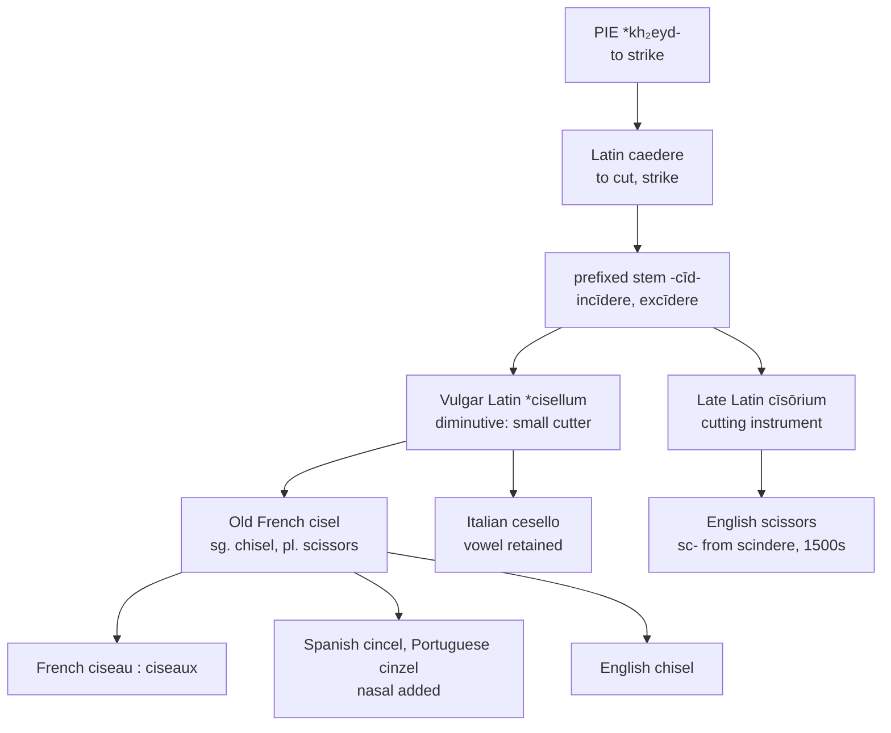

# *Cisellum*: the cut made small

A study of a Latin verb of striking that became a diminutive, then a tool, then two different tools depending on how many of it you had.

---

## 1. The root

Latin *caedere* "to cut, strike, fell" descends from Proto-Indo-European **\*kh₂eyd-** "to strike." Its Latin derivatives include *caedēs* "slaughter," *caesūra* "a cutting," and *caementum* "quarried stone" — which, by way of Old French, gives English *cement*.

The verb behaves irregularly in composition. The diphthong *ae* weakens to long *ī* when a prefix is attached, so that *caedere* yields *incīdere*, *dēcīdere*, *praecīdere*, *concīdere*, *excīdere*, and *circumcīdere*. English has taken the whole set: *incision*, *decide*, *precise*, *concise*, *excise*, *circumcise*, together with the agentive *-cīda* of *homicide* and *suicide*.

This matters for the present word, because the *cīs-* of *cisellum* is not the stem of the simplex verb but the stem generalised out of those prefixed compounds. The tool is named from *excīdere* and its fellows rather than from *caedere* directly — the vowel is the giveaway.

---

## 2. The diminutive

Vulgar Latin formed **\*cisellum*, a diminutive of \**cisus* (for classical *caesus*, the past participle of *caedere*). The word therefore means, with some precision, "a little cut thing" or "a small cutter."

The diminutive suffix *-ellum* is the same one found in *castellum*, *agnellum*, *capitellum*, and *martellum*, and its Romance outcomes are diagnostic in the usual way: Italian *-ello*, Spanish *-illo* or borrowed *-el*, French *-el* and thence *-eau*, Portuguese *-elo* or *-el*. Italian preserves the formation most transparently as *cesello*, verb *cesellare*.

A competing etymology derives the word instead from Late Latin *cīsōrium* "cutting instrument" by exchange of suffix. The *-ell-* of the Romance forms tells against it, and the derivation from *cisellum* is the majority view; but *cīsōrium* is certainly the source of a related word, discussed below.

---

## 3. One tool or two

The most striking fact about this family is that French distinguishes two implements by grammatical number alone.

*Le ciseau* is a chisel. *Les ciseaux* is a pair of scissors. The two are formally the same noun, and the distinction is not a modern convenience: Old French *cisel* already meant "chisel" in the singular and "scissors, shears" in the plural. The modern singular *ciseau* results from the regular vocalisation of *-el* to *-eau*, the same development that gives *castellum* → *château*, *bellus* → *beau*, and *agnellus* → *agneau*.

English divides the same semantic territory, but lexically rather than grammatically. *Chisel* continues *cisellum*; *scissors* continues Vulgar Latin \**cisōria*, the plural of *cīsōrium*, from the same root by a different suffix. Where French has one word and two numbers, English has two words — and, characteristically, arrived at them through two separate borrowings from French.

The English word acquired a spurious consonant along the way. *Scissors* appears in Middle English as *sisoures*, *cisours*, *sesours*; the forms in *sc-* begin only in the sixteenth century, by association with Medieval Latin *scissor* "tailor," from the past-participle stem of *scindere* "to split" — a verb entirely unrelated to *caedere*. The *sc-* of *scissors* is thus an orthographic fossil of a false etymology.

That same false etymology has had a second career in Spanish lexicography, where a number of dictionaries still derive *cincel* from Low Latin *scisellum* and *scindere*. The error is the same one that corrupted the English spelling; in Spanish it corrupted the entry instead.

---

## 4. The Ibero-Romance nasal

Spanish *cincel* and Portuguese *cinzel* carry a nasal that the Latin has not got and that French never had.

Two explanations circulate. Corominas takes the *n* from *pincel* "paintbrush" — a tool of comparable size, found in the same workshops, and rhyming exactly, *cincel* : *pincel* and *cinceles* : *pinceles*. The alternative attributes it to analogical pressure from *escindir* "to split," which is to say from the same *scindere* that produced the *sc-* of English *scissors*.

The loss of the final vowel independently shows that the Iberian words are not inherited. A directly inherited reflex of *cisellum* would have retained it, as Italian *cesello* does; the apocopated shape points to transmission through Old French *cisel*, which is also the source of Catalan *cisell* and of Basque *zizel*.

---

## 5. The comparative set

| | Verb | Singular | Plural | What the form records |
|---|---|---|---|---|
| **Latin** | *caedere* | \**cisellum* | \**cisella* | The diminutive of the prefixed stem, not of the simplex. |
| **French** | *ciseler* | *le ciseau* | *les ciseaux* | Regular *-el* → *-eau*. The plural denotes a different tool. |
| **Spanish** | *cincelar* | *el cincel* | *los cinceles* | Apocope shows French transmission; the nasal is secondary, probably from *pincel*. |
| **Portuguese** | *cinzelar* | *o cinzel* | *os cinzéis* | The same nasal, with *z* for the sibilant. Plural *-éis* < *-eles* is the regular class of *papel* : *papéis* and *pincel* : *pincéis*. |
| **English** | *to chisel* | *the chisel* | *the chisels* | Norman *ch-*; the verb is a conversion of the noun, c. 1500. |
| **Inglisce** | *to c̃isele* | *þe c̃isele* | *þe c̃isels* | Etymological *c* retained under a diacritic; the verb marked by silent *-e*. |

Two structural observations follow from the table. First, every Romance language derives the verb by suffixation on the noun — *ciseler*, *cincelar*, *cinzelar* — while English converts the noun bare. This is the identical pattern found with *censor* : *to censor*, and the identical remedy is available: a formal marker of verbhood that English discarded and the system restores.

Second, English is alone in the set in having received the word with an initial affricate. Old Northern French had *chisel* beside *cisel*, and it is the Norman form that crossed the Channel. Central French, and every language borrowing from it, kept the sibilant.

### The other branch

The *cisōrium* line, which yields the shears rather than the chisel, is far less widely represented. Only French and English name the implement from *caedere* at all; the remaining languages of the set draw on other roots entirely.

| | Scissors | Source |
|---|---|---|
| **French** | *les ciseaux* | The plural of *ciseau* < \**cisellum*; number alone carries the distinction. |
| **English** | *scissors* | \**cisōria*, plural of *cīsōrium*. The *sc-* is a sixteenth-century intrusion from *scindere*. |
| **Spanish** | *las tijeras* | \**tōnsōrias*, from *tondēre* "to shear" — an unrelated root. |
| **Portuguese** | *a tesoura* | \**tōnsōria*, the same formation, retained as a singular. |
| **Italian** | *le forbici* | Latin *forficēs*, plural of *forfex* "shears" — a third root again. |
| **Inglisce** | *þe cisors* | \**cisōria*, with the *sc-* removed. |

The Iberian and Italian words are worth noticing for what they imply about the tool. *Tondēre* is the verb of shearing sheep and cropping hair, and *forfex* is the smith's and barber's implement; both name the object by its trade. French and English name it instead by the bare act of cutting, and in French by the fact that there are two blades.

---

## 6. The Inglisce form

Inglisce writes `c̃isele`. The tilde is a marked continuation of palatalised *c*, preserving the relation between /tʃ/ and the consonant that produced it — a consonant that may be Latin, as here, or Old English elsewhere in the lexicon. In this word it is the *c* of *cisellum*, and the tilde records that English took the affricate outcome where *ciseau*, *cincel*, *cinzel*, and *cesello* took the sibilant. The letter survives and the divergence is annotated, where English `ch` severs the connection entirely — that digraph being a French scribal convention for writing the sound, adopted long after the change that produced it, rather than any continuation of the word's own ancestry.

The same principle governs the vowels. English *chisel* is /ˈtʃɪzəl/, with a reduced second vowel, and `c̃isele` writes that vowel `e` — the letter the etymon supplies, since the *e* stands in that position in *cisellum* and in Old French *cisel* alike. The rule is not that a given letter spells a given reduced vowel, but that unstressed vowels are written etymologically and reduction follows automatically from the absence of stress.

The final `-e` belongs to a defined class. Inglisce writes it on disyllabic words with initial stress that function as both noun and verb, where it supports contraction and marks the pair as a unit: `to cisere` : `a cisere`, `to hamere` : `a hamere`, `to c̃isele` : `a c̃isele`. The marker is thus not verbal in the narrow sense but attaches to the noun-verb pairing itself, which is why the noun carries it without irregularity. It drops before the plural, giving `c̃isels` rather than `c̃iseles` — correctly, since the plural is /ˈtʃɪzəlz/ and a written `e` before the `s` would imply a syllable that is not there.

### The shears

`Cisere`, verb and noun, and its plural `cisors` complete the family. Two features distinguish the treatment.

The first is the removal of the `sc-`. As set out above, that digraph entered English in the sixteenth century through a false association with *scindere*, a verb belonging to a different root altogether. Nothing in the word's history warrants it, and the system discards it. `Cisors` restores the shape the word had in Middle English, where it appears as *sisoures*, *cisours*, and *sesours*, before the antiquarians got to it.

The second is the vowel of the plural. `Cisors` preserves the `-or-` of *cīsōrium*, the suffix from which English took its word, where the singular has reduced it. And it is the plural that carries ordinary usage, exactly as in English, where *scissors* is the everyday word and the singular is scarcely used.

The two words together exhibit the opposition directly. `Cisere` and `c̃isele` carry the same Latin consonant, which before a front vowel yields /s/ in the one and the affricate in the other; plain `c` writes the sibilant reflex and `c̃` the palatalised one. A single pair of words thus shows both outcomes of a single sound change, and the tilde is what tells them apart.

---

## 7. The doublet made visible

*Chisel* and *scissors* are doublets. They descend from one Latin verb by two suffixes, reached English through the same language within the same century, and name two implements that do the same thing at different scales.

English conceals this completely. The two words share no letter in their first two positions, and no reader without etymological training could be expected to connect them. The two spellings fail differently, though, and only one of them is wrong. The `sc-` of *scissors* is false outright, a sixteenth-century intrusion from a verb the word has nothing to do with. The `ch-` of *chisel* is perfectly accurate as a record of sound — the affricate is really there — but it is a French scribal convention for writing that sound, and it buries the *c* the affricate developed from.

Inglisce writes `c̃isele` and `cisors`. The shared `cis-` is visible, the relationship is legible, and the sole difference in the stem is the diacritic marking the one genuine phonological divergence between them. What English spells as two unrelated words, the system spells as what they are: one root, two tools, distinguished by a single mark.
