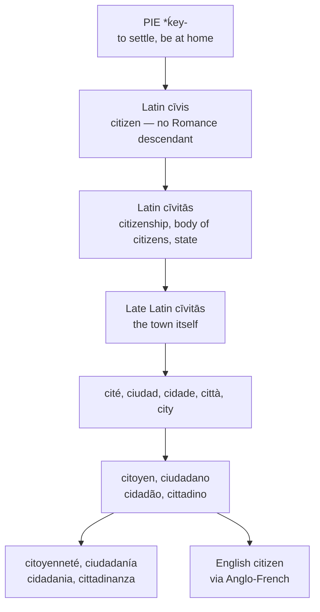

# *Civis*: the citizen rebuilt from the city

A study of a Latin noun that died, leaving its own derivative to be turned back into a person — and of a word for citizenship that took three suffixes to return to where it started.

---

## 1. The root

Latin *cīvis* "citizen, fellow member of a community" descends from Proto-Indo-European **\*ḱey-** "to lie down, to settle, to be at home." The same root yields Sanskrit *śiva-* "auspicious, kindly," Old English *hīwan* "members of a household," and, through Germanic \**haimaz*, English *home*.

The etymology is worth pausing on, because it defines citizenship by residence rather than by allegiance, descent, or arms. A *cīvis* is one who has settled — a person of the household writ large. Greek took the opposite route: *polītēs* is formed on *polis*, so that the Greek citizen is named from the political unit and the Roman from the act of dwelling in it.

English has the root twice over. *Civil*, *civic*, *civilian*, and *civilisation* come from *cīvis* by the learned path, and *home* comes from it by the inherited Germanic one.

---

## 2. *Cīvis* and *cīvitās*

Latin built the abstract *cīvitās*, *-ātis* on *cīvis* with the suffix *-tās*, the same formation seen in *lībertās*, *vēritās*, and *dignitās*. Its senses are three, and all three matter for what follows:

1. **Citizenship** as a status — *cīvitātem dare*, to grant citizenship.
2. **The body of citizens** collectively.
3. **The state** constituted by that body.

The middle term of the comparison set, *cīvium*, is not a fourth lexeme but the genitive plural of *cīvis*. This is itself informative: Latin had no derived collective noun for "the citizenry," because the plural of *cīvis* already served. Where later languages would coin a word, Latin inflected one.

---

## 3. The reversal

Two things then happened, and between them they account for every modern form in the set.

**First, *cīvis* died.** It has no inherited descendant in any Romance language. The learned borrowings — Spanish *civil*, French *civique*, Italian *civile* — preserve the stem in adjectives, but the noun denoting a person did not survive into speech.

**Second, *cīvitās* changed what it meant.** In Late Latin it drifted from the abstract senses toward the concrete, coming to denote the settlement itself and displacing *urbs* across the western territory. The outcome is French *cité*, Spanish *ciudad*, Portuguese *cidade*, Italian *città*, English *city*, and Inglisce `citie`.

The consequence is a reversal of the derivational order. In Latin the person is primary and the place-word does not exist: *cīvis* yields *cīvitās*. In Romance the place is primary and the person must be rebuilt from it, by suffixation on the word for city:

- French *cité* + *-ien* → *citoyen*
- Spanish *ciudad* + *-ano* → *ciudadano*
- Portuguese *cidade* + *-ão* → *cidadão*
- Italian *città* + *-ino* → *cittadino*

Not one of these continues *cīvis*. Every one of them is a citizen defined as an inhabitant of a city — which is to say that the Romance languages arrived, by a long detour, at the Greek formation rather than the Latin one.

---

## 4. The long way back

The third term completes the circle, and does so with a redundancy that is easy to miss.

Latin *cīvitās* means, among other things, citizenship. French *citoyenneté* means citizenship. They are the same word, and the second is three derivations further along:

> *cīvis* → *cīvi-tāt-* → *cité* → *citoyen* → *citoyen-neté*

The final suffix, *-eté*, continues Latin *-itātem*. So does the *-té* buried inside *cité*. *Citoyenneté* therefore contains the suffix *-tās* twice, once visibly and once fossilised, and arrives back at the meaning the single application had in Latin. The same holds elsewhere: Spanish *ciudadanía* is *cīvitāt-* + *-ān-* + *-ia*, and Italian *cittadinanza* is *cīvitāt-* + *-īn-* + *-antia*.

The reason is straightforward. Once *cīvitās* had become the word for a town, its abstract force was spent; the suffix was no longer visible as a suffix, and a fresh one had to be added to do work the old one had already done.

---

## 5. The comparative set

| | The place | The person | The collective | The status |
|---|---|---|---|---|
| **Latin** | *urbs*, later *cīvitās* | *cīvis* | *cīvium* (inflected) | *cīvitās* |
| **French** | *la cité* | *le citoyen* | *les citoyens* (inflected) | *la citoyenneté* |
| **Spanish** | *la ciudad* | *el ciudadano* | *la ciudadanía* | *la ciudadanía* |
| **Portuguese** | *a cidade* | *o cidadão* | *a cidadania* | *a cidadania* |
| **Italian** | *la città* | *il cittadino* | *la cittadinanza* | *la cittadinanza* |
| **English** | *the city* | *the citizen* | *the citizenry* | *the citizenship* |
| **Inglisce** | *þe citie* | *þe citasan* | *þe citasanerie* | *þe citasanscip* |

The Latin row states the whole argument on its own. *Cīvitās* appears twice in it, once as the later word for the place and once as the word for the status, and the two are the same word at different stages of its life. Every form to the right of it in the other rows is built on the first of those senses, and the last column is an attempt to recover the second.

The rightmost columns are where the languages diverge most sharply, and the divergence is not phonological but structural.

Latin and French fill the collective slot by **inflection**: *cīvium* and *les citoyens* are simply plurals. Spanish, Portuguese, and Italian fill both slots with **one derived noun**, which is to say that they have reproduced exactly the polysemy of Latin *cīvitās* — status and collective in a single word — using a word Latin never had. English alone derives **two distinct nouns**, keeping the senses apart.

The place-words are worth a note of their own. Spanish *ciudad* preserves the *v* of *cīvitātem* as the *u* of its diphthong; French *cité*, Portuguese *cidade*, and Italian *città* have lost the consonant entirely, by way of the reduced Late Latin *cīvitāte* → *citāte*. Spanish is thus the only member of the set in which the *cīv-* of *cīvis* remains visible, and even there it is visible only as a vowel.

---

## 6. The English word

English took the word from Anglo-French about 1300, in the forms *citesein* and *citezein*, themselves alterations of Old French *citeain*. The alteration is the interesting part: the *-s-* or *-z-* has no business being there, and the standard explanation is contamination from Anglo-French *deinzein*, the word that gives English *denizen*. The Middle English Compendium suggests the sibilant replaced an earlier *-th-*.

The modern spelling *citizen* thus preserves a consonant contributed by a different word. It is the sort of accident that spelling reform exists to notice.

The word displaced two native compounds, *burhsittend* and *ceasterware*. The first repays attention: it means "borough-sitter," one who sits in the fortified town — which is, morpheme for morpheme, what *cīvis* means at the root, since \**ḱey-* is the verb of settling. English discarded a native word that expressed the Latin etymology exactly, in favour of a French word that expressed it not at all.

The later history is political. The sense of a member of a state rather than a town is late fourteenth century; the sense of a private person as against a soldier or officer is around 1600; and the use as a form of address dates from 1795, when *citoyen* served the Revolution as a republican substitute for *Monsieur*.

---

## 7. The Inglisce forms

`Citie`, plural `citis`, supplies the place-word. English alternates its stem, writing *city* against *cities* and shifting between `y` and `ie` for a vowel that never changes; Inglisce holds the stem invariant at `citi-`, the silent `-e` simply giving way to the plural `-s`. The `ie` also removes the burden English places on final `y`, which must serve as a vowel letter in *city* and as a consonant in *yes*.

Note that `citie` follows the French line and `citasan` the Iberian. French *cité* lost the *ā* of *cīvitātem* through the reduced *citāte*, and English took the place-word from French; the person-word takes its suffix from Iberia for the reason given below. The two Inglisce forms therefore share only `cit-`, exactly as *city* and *citizen* do, and as *cité* and *citoyen* do.

`Citasan` restores the Anglo-French sibilant to a letter rather than a sound. English writes *z* where the attested Anglo-French forms show both *citesein* and *citezein*; Inglisce writes `s`, which is the older of the two spellings and which carries the value /z/ between vowels by ordinary Romance convention. Nothing is lost phonetically and the *denizen*-shaped intrusion is no longer advertised as a *z*.

The vowels are written etymologically rather than phonetically. English *citizen* is /ˈsɪtɪzən/, with both post-tonic vowels reduced; `citasan` writes them both `a`, and both have warrant. The first is the *ā* of *cīvitāt-*, the element visible in *ciudad*, *cidade*, and *città*. The second is the *ā* of the agent suffix *-ānum*, visible in *ciudadano* and *cidadão*. Reduction follows automatically from the absence of stress and needs no marking.

The three forms together display three strata of suffixation on a single stem:

| Form | Suffix | Stratum |
|---|---|---|
| `citasan` | *-ān-* | Latin, by way of Romance |
| `citasanerie` | *-erie* | Old French |
| `citasanscip` | *-scip* | native, Old English *-scipe* |

`Citasanerie` restores the full French suffix that English has clipped to *-ry*, on the pattern of *chevalerie* → *chivalry* and *cavallerie* → *cavalry*. `Citasanscip` writes the native suffix in its native shape. A reader can therefore tell, from the ending alone, which layer of the language each derivative belongs to — information that English carries in *-ry* and *-ship* only for those who already know it.

---

## 8. Iberian morphology in French dress

The choice of `-an` over `-ien` is settled by orthography before etymology is consulted. In Inglisce an `i` standing before a silent `e` is read /i/ and attracts the stress, so a form built on the French `-ien` would misreport the vowel quality and pull the accent off the first syllable, where English firmly keeps it. The suffix therefore required a letter that reduces silently in the absence of stress, and `a` is the one with etymological warrant behind it.

That warrant comes from Iberia. The `-ān-` of `citasan` is the suffix of *ciudadano* and *cidadão*, not of *citoyen*, even though English received the word by the French route. The morphology is Iberian and the orthography is not: intervocalic `s` for /z/ is a French convention, foreign to Spanish, and so is the writing of unstressed vowels etymologically rather than phonetically, and so is the retention of `-erie` at full length where English has clipped it to *-ry*.

This is the characteristic operation of the system on Latinate vocabulary. Where the Iberian languages have preserved a suffix more transparently than French has, the Iberian form supplies the morphology; French supplies the conventions by which it is written. The result is neither a Spanish nor a French word but an English one wearing both — which is a fair description of what English vocabulary of this stratum has always been, made visible.
