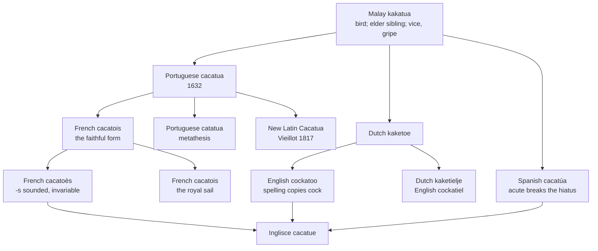

# *Kakatua*: the cock that never was

A study of a Malay bird-name that no European language could leave alone, and of what is left when the corrections are undone.

---

## 1. The Malay word

Malay **kakatua** names the crested parrots of the archipelago. Three accounts of the name are current in the literature.

The first is echoic. It is the account the Real Academia gives — *voz onomatopéyica, imitativa de su canto* — and Vieillot held it too. There is direct testimony from 1707: William Funnell, describing the birds in the wild, reports that "they will call *Crockadore*, *Crockadore*; for which reason they go by that name." An 1854 source puts it more baldly — the cockatoo shrieks its own name.

The second parses the word as a compound: *kakak* "elder brother or sister," a respectful term of address, plus *tua* "old." This is the account etymonline gives, and the ornithological literature glosses it "older sister," referring the name to the birds' noisy sororal behaviour.

The third comes from an 1850 note in the *Journal of the Indian Archipelago*, which gives Malay *kakatuwah* as "a vice, a gripe" — a clamping tool — as well as the name of the bird, and refers the naming to its powerful bill. This is the form the Real Academia cites as its etymon, spelled *kakatūwa*, so the same Malay word carries the first account and the third.

Note what the section does not contain. There is no Latin here, and no Indo-European root. The word arrives in Europe already complete, and everything that follows is damage.

---

## 2. Into Europe by three doors

The word reached Europe three times, independently, and the separate entries account for the split in the modern forms.

Portuguese took **cacatua** from the Malay directly, attested by 1632 — a straightforward transcription with the vowels and the syllable count intact. Spanish took **cacatúa** directly as well: the Diccionario de la lengua española derives it from Malay *kakatūwa* and names no intermediary. Dutch took **kaketoe**, separately again, through the traffic of the Vereenigde Oostindische Compagnie, and altered the second vowel in the process.

English is downstream of the Dutch, not of the Portuguese: *cockatoo* is from *kaketoe*, first recorded in the 1610s. French is downstream of the Portuguese. So the English word and the Romance words are cousins rather than ancestor and descendant, and the resemblance between *cockatoo* and *cacatua* is the resemblance of siblings who have each been separately misheard.

The Dutch also produced a diminutive, *kaketielje*, recorded 1850, which English took as *cockatiel*.

---

## 3. What English did to it

English never settled the word. The seventeenth- and eighteenth-century forms are *cacato*, *cockatoon*, *crockadore*, *cokato*, *cocatore*, *cocatoo*, before *cockatoo* fixes in the eighteenth century. *Crockadore* is Funnell's spelling of the cry rather than of the name, with an intrusive *r* and a Romance-looking ending.

The form that won did so by becoming two English words stuck together. *Cock* is the first, and the spelling copies it directly. The reanalysis was immediate and was visible to contemporaries as a joke: Beaumont and Fletcher, in *The Little French Lawyer* of 1616, have a character announce "My name is Cock-a-two, use me respectively, I will be cock-o'three else" — which is only funny if the audience already hears the bird's name as containing a number. Six years after the word's first English attestation it was already being punned on as though it were native.

The result is a name that says the bird is a male domestic fowl, which it is not, in a language spoken by people who had mostly never seen one.

---

## 4. What French did to it

The French history is the most elaborate, because in French the word had to escape not a bird but an embarrassment.

The older French spelling was **cacatois**, and it corresponds directly to Portuguese *cacatua* — the *-ois* digraph was pronounced /wɛ/, giving a form close to the Portuguese and to the Malay behind it. The modern spelling *cacatoès*, with its sounded final *-s*, is dialectal in origin, the pronunciation of the *-s* reinforced by the written form and by analogy with *aloès* and *faciès*. Lalanguefrançaise adds a further motive: a refined speaker would have wanted to avoid the near-homophony with **caca d'oie**, "goose droppings." A second and short-lived remedy was attempted for the same reason — the metathesised **katakoua**, which rearranges the consonants specifically to break up the *caca*.

Two consequences follow.

The first is that French bought its dignity at the cost of its plural. Because the singular now ends in a pronounced *-s*, the noun is invariable: *le cacatoès*, *les cacatoès*, written and spoken identically. In fleeing one problem the language walked into another, and lost the ability to count its parrots.

The second is that the discarded spelling did not die. **Cacatois** is still current French, and it now names a sail — the square sail set at the highest point of the mast, with *mât de cacatois* the mast that carries it. English calls both the royal.

The naming is a joke that sailors extended. Larousse defines *cacatois* as the sail placed *above the perroquet*, and derives the word from *cacatoès*. **Perroquet** is French for parrot, and it had been the name of the topgallant sail and its mast since at least the Académie's fourth edition of 1762 — "le mât le plus élevé du vaisseau." When rigs grew taller and a further sail was set above that one, it took the name of a larger parrot. The mast therefore ascends through two birds: the *perroquet* above the topsail, the *cacatois* above the *perroquet*. French's more faithful spelling of the Malay word survives attached to a piece of rigging, while the bird itself is spelled to avoid a pun.

---

## 5. The Iberian forms

Portuguese **cacatua** is the most conservative form in the set and the earliest attested in Europe. Portuguese also has **catatua**, which the Infopédia gives as its headword with *cacatua* noted as an alternative designation — the same two syllables rearranged, as in the French *katakoua*.

Spanish **cacatúa** is not an offshoot of the Portuguese, despite sitting beside it on the peninsula. The Diccionario de la lengua española takes it from Malay *kakatūwa* directly, and reads that word as onomatopoeic, imitative of the bird's call.

The acute is doing phonological work rather than decorative work. Without it, *-ua* would be read as a diphthong and the word stressed /ka.kaˈtwa/; the accent breaks the hiatus and forces /ka.ka.ˈtu.a/, four syllables, holding the long *ū* of the etymon in place. Spanish has spent a diacritic to keep the vowels apart, which is worth noting on a page about an orthography that spends diacritics to keep etymologies visible.

The genders diverge across the family. The word is feminine in Portuguese and Spanish — *a cacatua*, *la cacatúa* — and masculine in French and Italian: *le cacatoès*, *il cacatua*. Nothing in the Malay licenses either.

---

## 6. The taxonomy repeats the argument

The scientific name settled the same dispute the vernaculars were having, and the Malay-versus-Dutch question was fought out in Latin.

Georges Cuvier introduced the genus **Kakatoe** in 1801, following the Dutch. Louis Pierre Vieillot introduced **Cacatua** in 1817, following the Romance transcription. Brisson had used *Cacatua* as early as 1760 but did not enter it in his table of genera, so the ICZN does not recognise him as the authority. The Commission suppressed Cuvier's *Kakatoe* and conserved Vieillot's *Cacatua*, which is now the genus, with *Cacatuidae* the family.

The list of rejected synonyms is a fair summary of the whole problem: *Cacatura*, *Cacatus*, *Catacus*, *Kacadoe*, *Kacatua*, *Kakadoe*. Six ways of failing to write one Malay word, in the one register that is supposed to be immune to that failure.

Vieillot, incidentally, held the echoic view. His 1817 entry states that the names *kakatoès*, *cacatou* and *cacacoua* derive from the cry of the white-plumaged species, the only ones then known to Brisson and Buffon.

---

## 7. The comparative set

| | Singular | Plural | What the form records |
|---|---|---|---|
| **Malay** | *kakatua* | — | The source; number unmarked. |
| **Portuguese** | *a cacatua* | *as cacatuas* | The most faithful European form, and the earliest, 1632. Feminine. |
| **Portuguese** | *a catatua* | *as catatuas* | The same syllables rearranged. |
| **Spanish** | *la cacatúa* | *las cacatúas* | Direct from Malay *kakatūwa*; the acute forces hiatus and holds the long *ū*. Feminine. |
| **French** | *le cacatoès* | *les cacatoès* | Invariable, because the singular already ends in a sounded *-s*. Masculine. |
| **French** | *le cacatois* | *les cacatois* | The older spelling of the bird, now the sail above the *perroquet*. |
| **Italian** | *il cacatua* | *i cacatua* | The unaltered form, invariable. Masculine. |
| **Dutch** | *de kaketoe* | *de kaketoes* | The second vowel altered; the form English inherited. |
| **English** | *the cockatoo* | *the cockatoos* | Reanalysed as *cock* + too. |
| **Inglisce** | *þe cacatue* | *þe cacatuis* | Three syllables; no *cock*; the plural in *-uis*. |

---

## 8. The Inglisce form

`Cacatue` follows the Romance reading of the word rather than the Germanic one.

Portuguese *cacatua*, Spanish *cacatúa*, Italian *cacatua* and Vieillot's *Cacatua* take the Malay word whole and write its stops as `c`. Dutch *kaketoe* alters the second vowel, and English then reads a *cock* into the first syllable and a *too* into the last. `Cacatue` sides with the first group: `c` for the stops, and the vowels of *cacatua*.

The ending is `-ue`, spelling unstressed /u/, and its plural is `-uis`: `þe cacatue`, `þe cacatuis`.

The *cock* is gone, and that is the substantive claim of the form. English's spelling asserts a compound that does not exist, in which the first element names the wrong bird and the second is a number. *Cock* is not in this word's ancestry at any point. The English spelling is not an inheritance but an error, and `cacatue` is what the word looks like with the error removed.
