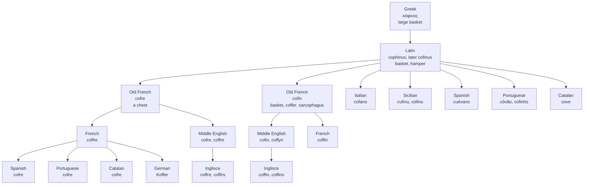

# *Cophinus*: the basket that took a body

A study of one Greek basket, of the two shapes it took in French, and of the language that borrowed both and buried its dead in one of them.

---

## 1. The basket

Greek **κόφινος** — a large basket, a hamper. Merriam-Webster calls it pre-Greek substratal; etymonline says simply that its origin is uncertain. Either way it is not an inherited Indo-European word. Greek got it from whoever was making baskets before the Greeks arrived, and no further account of it can be given.

It is a plain object word, and it stayed plain for a long time. The most familiar κόφινοι in the record are the twelve baskets of leftover bread gathered after the feeding of the five thousand, and when Wycliffe's people came to render that passage around 1380 they used the English word that had come down from it: *Þei gedriden and filden twelve coffynes of relif of fyve barly loves*. In 1380 a coffin was a basket, and that is what the sentence means.

---

## 2. Latin, and two shapes in French

Latin took the word as **cophinus**, "basket, hamper," later simplified to *cofinus*. The *ph* is a transliteration of the Greek φ and nothing more; it never represented anything the Latin mouth was doing that an *f* could not.

Old French produced two forms from it, and this is where the word divides.

**Cofre** meant a chest, and is on record from the twelfth century. **Cofin** kept the older ground — a basket, a coffer, and then a sarcophagus — and is on record from the twelfth century too. They are the same Latin word wearing two endings, and for a long while they were near-synonyms in French as well.

---

## 3. English borrows both

**Coffer** arrives first, from *cofre*, in the middle of the thirteenth century: a box or chest for keeping valuables. By the late fourteenth century the plural has gone figurative and *coffers* means a treasury, the money an institution has to hand — which is the only sense most English speakers now use.

**Coffin** arrives around fifty years later, from *cofin* by way of Anglo-French, meaning a chest or box for valuables. The same thing. For roughly two centuries English carried two words from one Latin noun, both meaning a strongbox, differing in nothing but the shape of the ending.

The overlap is visible in the record around them. Old French *cofin* was synonymous with *coffer*, and the surname **Coffin**, borne by knightly families in the southwest of England, may denote a keeper of the royal coffer — the office appears in Anglo-Latin as *cofferarius*.

---

## 4. The pie and the grave

What broke the tie was not the funeral. It was pastry.

From the late fourteenth century the main secondary sense of *coffin* in English is a pie crust: the mould or casing of pastry built to hold a filling. Medieval English cookery is full of them. A coffin was a thing you constructed to contain something else, and whether the something was money, bread, or a baked bird was not yet the word's business.

The funeral sense is late. It appears in the 1520s, and the first citations are workaday parish accounts — a 1525 entry in the churchwardens' book of St Giles, Reading, records two shillings and a halfpenny for mending the coffin that lay on the bier. Not a burial box at all in that instance, but a reusable parish one, carried out and brought back.

Once that sense took, it took completely. Every other meaning of *coffin* is now dead or technical, and the word that meant a hamper of bread means one thing. *Coffer* was left holding the money.

---

## 5. What the other languages did

Elsewhere the word behaved differently, and the pattern is consistent enough to state as a rule: **the inherited form stayed a basket, and the chest had to be imported.**

Italian *cofano* and Sicilian *cufinu*, *còfinu*, *còfunu* and *cuòfinu* come down directly from *cophinus*, and in Italian the same word simply widened to cover the chest as well — no import was needed, and *cofano* now also names the bonnet of a car.

Spanish *cuévano*, Portuguese *côvão* and *cofinho*, and Catalan *cove* are all inherited, and all of them are baskets. None of them means a strongbox. For that sense each language borrowed **cofre** from French, and Spanish, Portuguese and Catalan all carry the loan alongside their own older word. German took the same French form as *Koffer*, where it now means a suitcase.

French kept both of its own shapes, *coffre* and *coffin*. English kept both too, but borrowed rather than inherited them, which leaves it in a position no other language in the set occupies: two words from *cophinus* and no basket among them.

---

## 6. The comparative set

| Language | The inherited word | The borrowed word | What it means now |
| :--- | :--- | :--- | :--- |
| **Inglisce** | — | coffre, coffin | treasury; burial box |
| English | — | coffer, coffin | treasury; burial box |
| French | coffre, coffin | — | chest; coffin |
| Italian | cofano | — | chest, and a car bonnet |
| Sicilian | cufinu, còfinu | — | basket |
| Spanish | cuévano | cofre | basket; chest |
| Portuguese | côvão, cofinho | cofre | basket; chest |
| Catalan | cove | cofre | basket; chest |
| German | — | Koffer | suitcase |

Read the first two columns down and the set divides by whether the language had the word already. Those that inherited it kept a basket and had to import a chest on top of it, except Italian, where the inherited word stretched to cover both and no import was needed. Those that did not inherit it — English, German — have only the loan, and the loan means a container of the expensive kind. Nobody borrowed a basket. A language will import a word for a strongbox and will not trouble to import a word for wickerwork, because it already has one.

---

## 7. The Inglisce forms

**coffre**, coffirs · **coffin**, coffins

The doubled *f* is the vowel's, not the consonant's. Both words carry /ɔ/ in the first syllable, and the doubling before it is what puts it there — the same mechanism that governs the other terminal sets in this range. Nothing about the Latin or the French requires two letters here; Old French wrote *cofre* and *cofin* with one. The doubling is Inglisce's own, and it is doing phonological work rather than historical.

The two words inflect differently because their second syllables are different things. *Coffre* ends in a schwa written *-re*, which becomes *-ir-* when a suffix follows, hence *coffirs*. *Coffin* ends in a full syllable that needs no such accommodation, so it takes a plain *-s* and never changes shape.

What the spelling declines to do is as pointed as what it does. Latin had *cophinus* and English once wrote *cophre* and *copher*, both now obsolete. The *ph* is available in the orthography and is not used here, because the word did not come from Greek — it came from French, and French had given up the *ph* before English ever saw the word. The spelling records the road travelled rather than the place of origin.

And it keeps the doublet legible as a doublet. *Coffre* and *coffin* share their first syllable on the page, differ only in the ending, and are visibly one word twice. English hides this, because the meanings have drifted so far apart that no reader connects a treasury to a grave. The page connects them: a basket, borrowed twice, which in one hand filled up with money and in the other took a body.
