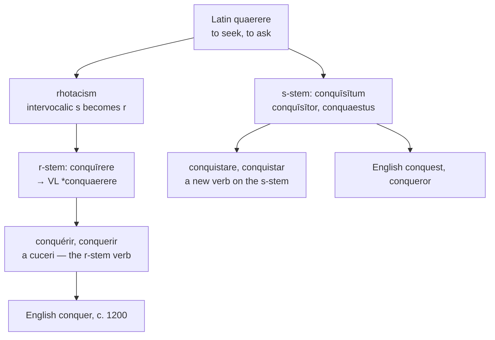

# *Conquīrere*: seeking, taken by force

A study of a verb that meant *to go looking for something*, of the two stems Latin gave it, and of the line running through Europe that decides which of them each language built its verb on.

---

## 1. The root

Latin *quaerere* means "to seek, to look for, to ask, to acquire." Its participial stem is *quaesītum*, and the alternation between the two is **rhotacism**: an intervocalic *s* became *r* in Latin before the classical period, so the *r* of *quaerere* stands for an earlier \**quaisere* while the *s* of *quaesītum*, protected by the following *t*, never changed.

English took both stems, and the two halves of the family do not look related:

| The *r*-stem | The *s*-stem |
|---|---|
| **query**, **inquire**, **require**, **acquire** | **question**, **quest**, **inquest**, **request** |
| **conquer** | **conquest**, **exquisite**, **acquisition**, **inquisition** |

*Inquire* and *inquest*, *acquire* and *acquisition*, *conquer* and *conquest* are each one verb in two costumes, and the consonant that separates them changed some twenty-three centuries ago.

One member of the family is not a derivative at all. **Query** is *quaere*, the bare imperative of the verb — *ask!* — used from the 1530s as a marginal annotation in manuscripts and then taken for a noun. It is the only English word in this set that is a Latin command rather than a Latin stem.

To *quaerere* Latin prefixed *con-*, here an intensive rather than a comitative: **conquīrere**, "to search out thoroughly, to collect, to procure by effort." The participial stem is *conquīsītum*, and the agent noun *conquīsītor* was a recruiting officer — a man who went looking for soldiers.

---

## 2. Seeking becomes subduing

Nothing in the Latin verb is military. *Conquīrere* is what a magistrate does when hunting down evidence, or a quartermaster when gathering supplies. The sense of defeating an enemy is a Romance development, and the path is visible in English:

| Date | Sense |
|---|---|
| c. 1200 | to achieve, to accomplish a task |
| c. 1300 | to defeat an adversary, to be victorious |
| early 1300s | to acquire a country by force of arms |

The bridge is *procure by effort*. What is sought with enough determination is taken, and what is taken by an army is conquered.

The word displaced Old English *oferwinnan*, "to overcome," and it was applied to William of Normandy in Anglo-Latin from the early twelfth century — *Guillelmus Magus id est conquestor rex Anglorum* — long before English itself called him the Conqueror.

The children's game of **conkers** is probably the same word, the object being to break the other player's chestnut and conquer it.

---

## 3. The line through Europe

Vulgar Latin altered the verb to \**conquaerere*, and every Romance language inherited it. They then divided on a question of morphology: **which stem should carry the verb?**

**The west kept the *r*-stem.** French *conquérir*, Catalan *conquerir*, Occitan *conquerir*, and Romanian *a cuceri* all continue the infinitive.

**The south rebuilt on the *s*-stem.** Italian *conquistare*, Spanish *conquistar*, and Portuguese *conquistar* are new verbs formed on the participle *conquīsītum*, by way of a Vulgar Latin \**conquistāre*.

The consequence is that Spanish, Portuguese, and Italian have a single stem running through the whole family — *conquistar*, *conquistador*, *conquista* — while French, Catalan, and English keep the Latin alternation and show two.

English follows French exactly: the *r*-stem verb *conquer* beside the *s*-stem noun *conquest*, as French has *conquérir* beside *conquête*.

---

## 4. The comparative sets

### The *r*-stem languages

| | The verb | The agent | The thing won |
|---|---|---|---|
| **Latin** | *conquīrere* | *conquīsītor* | *conquīsītum* |
| **French** | *conquérir* | *le conquérant* | *la conquête* |
| **Catalan** | *conquerir* | *el conqueridor* | *la conquesta* |
| **English** | *to conquer* | *the conqueror* | *the conquest* |
| **Inglisce** | *to conquere* | *þe conqueror* | *þe conquaist* |

French *conquête* carries a circumflex where English carries an *s*. The mark is a tombstone: *conquesta* lost its consonant in the ordinary French way, as *feste* became *fête* and *hospital* became *hôpital*, and the accent records the burial. English, borrowing before the loss, simply still has the letter.

The agent nouns diverge. French built *conquérant* on the present participle; Catalan and English used the *-tor* suffix. English also had *conquestor*, directly from the Latin *conquaestor*, and let it go.

### The *s*-stem languages

| | The verb | The agent | The thing won |
|---|---|---|---|
| **Italian** | *conquistare* | *il conquistatore* | *la conquista* |
| **Spanish** | *conquistar* | *el conquistador* | *la conquista* |
| **Portuguese** | *conquistar* | *o conquistador* | *a conquista* |

One stem throughout, and the noun and the verb are transparently the same word — which is why *conquistador* needs no explanation to a Spanish speaker and *conqueror* has to be connected to *conquest* by an act of learning.

### The rest of the family

| | Question | Request | To inquire |
|---|---|---|---|
| **Latin** | *quaestiōnem* | \**requaesīta* | *inquīrere* |
| **French** | *la question* | *la requête* | *s'enquérir* |
| **Spanish** | *la cuestión* | *el requerimiento* | *inquirir* |
| **Portuguese** | *a questão* | *o requerimento* | *inquirir* |
| **Italian** | *la questione* | *la richiesta* | *inquisire* |
| **Catalan** | *la qüestió* | *la requesta* | *inquirir* |
| **English** | *the question* | *the request* | *to inquire* |
| **Inglisce** | *þe quaistion* | *þa requaiste* | *to inquîer* |

French *requête* carries the same circumflex as *conquête*, and for the same reason: Old French *requeste* lost its *s*, and the accent marks the place. English borrowed *request* before the loss and kept the consonant, so the two languages hold the two halves of one word between them.

*Question* and *request* both descend from *ae*-forms — *quaestiōnem* and Vulgar Latin \**requaesīta* — which is why they belong with *conquest* rather than with *inquire*, whose Latin has a long *ī*.

---

## 5. The Inglisce forms

| English | Inglisce | Plural |
|---|---|---|
| conquer | `conquere` | — |
| conqueror | `conqueror` | `conquerors` |
| conquest | `conquaist` | `conquaists` |
| question | `quaistion` | `quaistions` |
| request | `requaiste` | `requaists` |
| inquire | `inquîer` | — |
| query | `quírie` | `quíris` |

**`Conquere` regularises the paradigm.** The verb runs `conquere`, `conqueres`, `conquered`, `conquering`, the silent `-e` marking the verb and giving way before the endings. English writes *conquer* and then *conquers*, *conquered*, *conquering*, with the stem unchanged but the citation form indistinguishable from the present indicative.

**`Conqueror` is left alone.** The `-or` is correct — the word came through Anglo-French *conquerour* from the Latin agent suffix, and English has already settled on the Latin spelling rather than the French `-our`.

**`Conquaist` writes the Latin diphthong.** The *s*-stem forms in Latin are *conquaestus* and *conquaestor*, with *ae*, and the Vulgar Latin infinitive was \**conquaerere* for the same reason. The `ai` records that diphthong and spells the /ɛ/ that English says.

The gain is that the word stops looking like a compound of *quest*. English *conquest* invites the reading *con-* plus *quest*, which is very nearly right but not the route the word took: *quest* came separately, through Old French *queste* from *quaesīta*. `Conquaist` and `conquere` show the two stems of one verb, where English shows a prefix on a noun it did not use.

**`Quaistion` and `requaiste` take the same diphthong**, and for the same reason: *quaestiōnem* and Vulgar Latin \**requaesīta* both have *ae*. The three words then look like the family they are — `conquaist`, `quaistion`, `requaiste` — where English *conquest*, *question*, and *request* share a stem and disguise it behind three different spellings of one vowel.

`Requaiste` also keeps the `-e` of Old French *requeste*, which the word had when English borrowed it and which marks it as noun and verb alike.

**`Quaistion` writes `-tion` for /tʃən/.** English uses `-tion` for two different sounds: /ʃən/ in *nation*, *action*, and *portion*, and /tʃən/ after `s` in *question*, *digestion*, *suggestion*, and *combustion*. Inglisce separates them, keeping `-cion` for the first and `-tion` for the second, so the digraph that spells /t/ elsewhere is used where a /t/ is actually pronounced.

**`Inquîer` alternates its stem**, `inquîer` for the infinitive and the progressive `inquîering`, `inquîre` for the finite forms. The circumflex gives /aɪ/, and the Latin here is *inquīrere* with a long *ī* — no *ae* anywhere, which is why the word takes a different vowel from the three above it.

**`Quírie` follows the English vowel rather than the Latin one.** *Query* is *quaere*, so the etymon has the same *ae* as *conquaist* and *quaistion*; but English says /ˈkwɪri/, and the system writes what is said when the two diverge. The acute marks the stressed short `i`, the `-ie` gives final /i/, and the progressive is `quírying`, the `-ie` yielding to `y` before the ending as it does in English.
