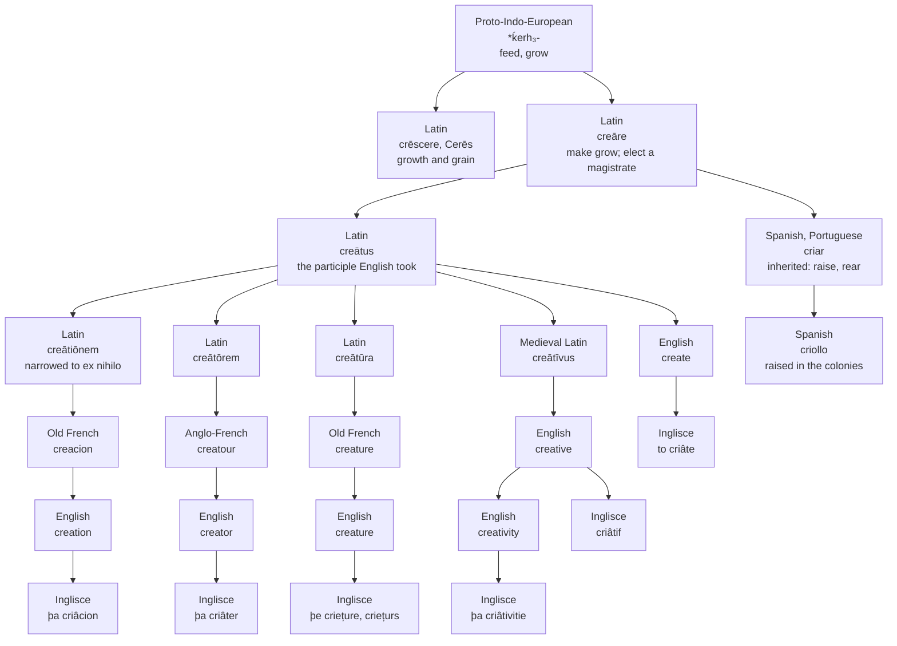

# *Creāre*: the magistrate and the creature

How one Latin verb meaning "to make grow" was taken out of human hands for a thousand years, gave English a peerage, a monster and a faculty, and why five of its six English words say a vowel that the sixth has lost.

---

## 1. The root

Latin *creāre* "to make, to bring forth" rests on the Proto-Indo-European root \**ḱerh₃-* "to feed, to grow." De Vaan holds that the original sense of the Latin verb was "to make grow," still visible in the older texts.

The root's other Latin children are agricultural. *Crēscere* "to grow" gives English *crescent*, *increase*, *decrease*, *accrue*, *recruit* and *concrete*. *Cerēs*, the goddess of grain, gives *cereal* through her adjective *cereālis*. Further out sit *crew*, *croissant* and *sincere*.

Latin built three things on *creāre* that matter here. *Creātiō*, accusative *creātiōnem*, was the act of making. *Creātor* was the one who makes, and *creātūra* the thing made. All three are formed not on the infinitive but on *creātus*, the past participle, and that fact governs the rest of this page.

---

## 2. The classical verb

In classical Latin *creāre* is unremarkable. It means to make, to produce, to bring forth, and it stands beside *facere* without any great difference of dignity: Latin had two words where Greek had only *poiein*, and the two meant much the same thing.

It also had a technical political sense. *Creāre cōnsulem* is to elect a consul, and Livy uses the verb as a matter of course for the appointment of consuls and dictators. English keeps this in one construction and no other. A monarch *creates* a peer; a man is *created* Earl of somewhere. It is the oldest surviving sense of the verb and the one furthest from what the word now suggests.

---

## 3. The Christian narrowing

The change that matters is doctrinal. Under medieval Christianity *creātiō* came to name God's act of *creatio ex nihilo*, and in taking that sense it stopped applying to human activity at all. *Creāre* and *facere* came apart. Men could make; only God could create. Aquinas puts the distinction in its hardest form: to create is to produce a thing's whole substance, with nothing presupposed.

The restriction held for roughly a thousand years, and the Middle Ages went further than antiquity in enforcing it. Poetry lost its claim to exceptional status: poetry was an art, art was craft, and craft was not creation. There was no word for human creativity because there was no concept requiring one.

The English record shows the same thing. The earliest uses of *create*, from the fourteenth century, are overwhelmingly passive and divine — the thing that *was created* — and the active infinitive with a human subject comes later.

---

## 4. The climb back

The recovery is slow, and every stage of it is disputed.

The adjective first. Merriam-Webster derives English *creative* from Medieval Latin *creātīvus*, itself *creātus* plus *-īvus*, and dates the English word to about 1513. The OED agrees on the borrowing. Etymonline denies it: 1670s, formed inside English from *create* plus *-ive*. The three accounts differ by a century and a half and by whether the word crossed the Channel at all. None of them disputes that *creātīvus* is post-classical, a scholastic coinage; the Dictionary of Medieval Latin from British Sources is where one looks for it.

Then the application to human work. The seventeenth century produces the first sustained claim that a person creates: the Polish poet Maciej Kazimierz Sarbiewski applied the language of creation to the poet, and only to the poet. Baltasar Gracián would go no further than calling art a second creator.

The abstract noun is where the disagreement is largest. Merriam-Webster and the revised OED both give 1659, OED's earliest evidence being from the writing of G. Lawson — a theologian, which puts the first *creativity* inside the doctrinal usage rather than outside it. Etymonline gives 1859, from *creative* plus *-ity*, noting *creativeness* from 1800. The scholarship on the concept, working from the unrevised OED, has long used 1875, in Adolfus William Ward's history of English dramatic literature, of Shakespeare's poetic gift.

Two hundred and sixteen years separate the earliest of those from the latest, and the choice is not merely bibliographic. On the 1875 date the word arrives with the concept and names a new idea. On the 1659 date the word existed for two centuries before it meant anything a person could possess, sitting unused as a theologian's term for a divine attribute while the idea it would later carry was assembled elsewhere.

What is not disputed: *creātīvitās* is not a Latin word and never was. A Roman could have parsed it and would have had no use for the result.

---

## 5. The Iberian doublet

Spanish holds the verb twice. *Crear* is the learned borrowing and means what English *create* means. *Criar* is the inherited descendant of the same *creāre*, and means to raise, to rear, to nurse, to breed. From it come *criatura*, *criado* "servant" — one brought up in the household — and *crianza*, the upbringing. The inherited form kept the root's first sense: to *criar* a child is to cause it to grow, which is what \**ḱerh₃-* meant before Latin, before Ceres and before the theologians.

The doublet then cuts through the derived nouns unevenly. Spanish takes its maker from the learned verb and its creature from the inherited one, *el creador* against *la criatura*. The Real Academia states the split directly: *criatura* derives from *criar*, *creatura* from *crear* by the learned route, and *creatura* survives beside it in the philosophical sense of a created being, especially in the Americas. Old Spanish went the other way and called God *el Criador*.

Portuguese never split the verb. *Criar* alone carries both loads, so that one word creates a work and raises a child, and the language never needed a learned form for the first.

One further descendant deserves mention. Spanish *criollo* and Portuguese *crioulo* name a person raised in the colonies rather than born in the metropole — a *criar*-formation — and give English *creole*.

---

## 6. The stem that never changes and the vowel that does

English *create* does not descend from *creāre*. It descends from *creātus*, and so does the whole English class: *relate*, *dictate*, *narrate*, *educate*, *separate*, *illustrate* and *terminate* are built on Latin participles in *-ātus* rather than on the infinitives beside them. English took the fourth principal part and made a verb of it.

Romance did not. French *créer*, Spanish and Catalan *crear*, Portuguese *criar* and Italian *creare* all continue the infinitive, with the present stem *cre-* intact and no *t* in it. The nouns and adjectives are participial in every language here, since *creātiō* and *creātīvus* are themselves built on *creāt-*, so French shows *cré-* in the verb against *créat-* in everything derived from it, and Spanish *cre-* against *creat-*.

It is tempting to call English the tidier of the two. Having taken the participle for its verb as well, it writes *creat-* six times over: *create*, *creation*, *creative*, *creativity*, *creator*, *creature*. But the uniformity is a fact about the page and not about the language. *Creature* is /ˈkriːtʃər/ in General American. The stem vowel is not the /eɪ/ of the other five, and the *t* is not a *t*.

What separates it is the accent. The vowel holds its value wherever the stress falls on it or after it — *create*, *creation*, *creative*, *creator*, and *creativity* with its secondary stress — and reduces only in the one word where the stress falls before it. *Creator* and *creature* are the clearest pair. They share the stem and differ in the suffix, and the suffix is what places the accent: *-or* leaves it on the *a*, *-ure* pulls it in front. Nothing else separates them, and one has the vowel while the other does not.

---

## 7. The comparative set

The diagram follows the majority reading of *creative*, as a borrowing of Medieval Latin *creātīvus*. Etymonline would delete that edge and build the English adjective on *create* plus *-ive*.

| English | Inglisce | French | Spanish | Portuguese | Italian | Where the accent falls |
|---|---|---|---|---|---|---|
| create | to criâte | créer | crear | criar | creare | on the *a*, /kriˈeɪt/ |
| creation | þa criâcion | la création | la creación | a criação | la creazione | on the *a*, /kriˈeɪʃən/ |
| creative | criâtif | créatif | creativo | criativo | creativo | on the *a*, /kriˈeɪtɪv/ |
| creativity | þa criâtivitie | la créativité | la creatividad | a criatividade | la creatività | after the *a*, /ˌkriːeɪˈtɪvəti/ |
| creator | þa criâter | le créateur | el creador | o criador | il creatore | on the *a*, /kriˈeɪtər/ |
| creature | þe criețure, criețurs | la créature | la criatura | a criatura | la creatura | before the *a*, /ˈkriːtʃər/ |

Read the last column down. The vowel is /eɪ/ in every word where the accent stands on it or falls later, and it survives even in *creativity*, four syllables long, where only a secondary stress protects it — though Merriam-Webster records a reduced variant there as well. It is lost in exactly one word, and that is the one word where the accent comes first. Two columns further left, Spanish draws its own line through the same set, taking *creador* from the learned verb and *criatura* from the inherited one, so that the maker and the thing made stop looking like relatives. English keeps all six looking alike and says one of them differently.

---

## 8. The Inglisce form

Inglisce writes the circumflex in five of the six words and leaves it off the sixth: *criâte*, *criâcion*, *criâtif*, *criâtivitie* and *criâter* against *criețure*. The mark is the system's /eɪ/, one of three this letter carries, against *á* for /ɑ/ and *à* for stressed /æ/ in irregular positions. It records the vowel and not the accent, which is why it survives in *criâtivitie*, where the stress has moved off it onto the *-iv-*. English writes the same letter in *cat*, *father* and *make* and distinguishes none of them.

Five of the forms are not decisions about this word. *Criâte* belongs to the *-âte* verbs beside *relâte* and *negâte*, *criâcion* to the *-âcion* nouns beside *relâcion* and *operâcion*, *criâtif* to the *-âtif* adjectives beside *nâtif*. The word joins three established series at once, which is what a participial stem ought to do: *creāt-* is one morpheme, and here it is written one way.

*Criețure* is where the system parts from English. The circumflex comes off because the vowel it marks is not there, and the *ie* writes the /iː/ that is. The *ț* takes the /tʃ/ that English spells with a bare *t* before *-ure*. The plural *criețurs* drops the silent *e*. So the Inglisce set shows *criâ-* five times and *crie-* once, and the break falls exactly where English speech breaks and English spelling does not. This is the reverse of the usual complaint against a reformed orthography. The received spelling is normally the one that keeps a family together; here it keeps together a family that is not together, and the reform records a split English has been concealing since it borrowed *creature* through French while taking the rest from Latin books.

The articles divide the set the same way, because gender is assigned by stress. *Criețure* carries the accent on its first syllable and is masculine, *þe*; *criâcion*, *criâtivitie* and *criâter* carry it later and are feminine, *þa*. The maker and the thing made therefore take opposite articles — *creator* is /kriˈeɪtər/ and *creature* /ˈkriːtʃər/ — and the same accent that strips the circumflex off the one also moves it into the other class. Two parts of the system, working independently, agree about where this family breaks. English puts *the* in front of both and lets the distinction lapse.
