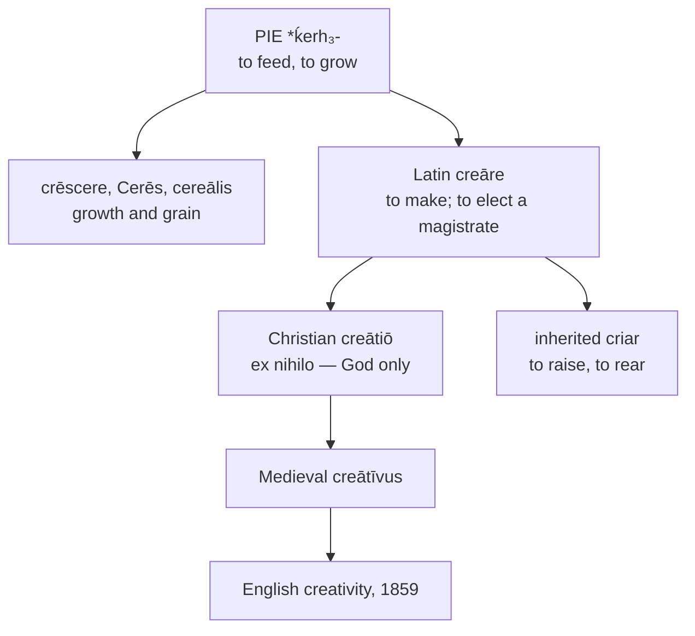

# *Creāre*: reserved to God, and reclaimed

A study of four words that between them span two thousand years — a Latin verb meaning nothing special, a noun the Church took away from human beings, an adjective the schoolmen coined, and a quality nobody had a name for until 1859.

---

## 1. The root

Latin *creāre* rests on Proto-Indo-European **\*ḱerh₃-** "to feed, to grow," and it is not alone there. The same root yields *crēscere* "to grow," and with it *crescent*, *increase*, *decrease*, *accrue*, *recruit*, and *concrete*. It yields *Cerēs*, the goddess of grain, and her adjective *cereālis*, whence *cereal*.

The original sense is agricultural and nutritive. To *create* is, at the root, to cause to grow — which is why the family's other members are about crops, increase, and feeding, and why the theological weight the word later carried is an addition rather than an inheritance.

---

## 2. The classical verb

In classical Latin *creāre* is unremarkable. It means to make, to produce, to bring forth, and it stood beside *facere* without any great distinction of dignity: Latin had two words where Greek had only *poiein*, and the two meant much the same thing.

It also had a technical political sense. *Creāre cōnsulem* is to elect a consul, and the verb is standard for the appointment of magistrates. English preserves this in a single surviving construction — a monarch *creates* a peer, and a man is *created* Earl of somewhere — which is the oldest sense of the verb still in use and the one furthest from what the word now suggests.

---

## 3. The Christian narrowing

The decisive change is doctrinal. Under medieval Christianity *creātiō* came to designate God's act of *creatio ex nihilo*, creation from nothing, and in taking on that sense it ceased to apply to human activity at all. *Creāre* and *facere* came apart: men could make, but only God could create.

Cassiodorus put it in the sixth century as plainly as it can be put — things made and things created differ, for we can make, who cannot create.

The consequence held for roughly a thousand years. The Middle Ages went further than antiquity here, withdrawing even poetry's claim to exceptional status: poetry was an art, and art was craft, and craft was not creation. There was no word for human creativity because there was no concept requiring one.

---

## 4. The climb back

The recovery is slow and its stages are datable.

**Medieval Latin** coins the adjective *creātīvus*, from *creō* + *-īvus*, in scholastic usage. It is not a classical word; the Dictionary of Medieval Latin from British Sources is where one looks for it.

**The seventeenth century** produces the first application of "creativity" to human work — by the Polish poet Maciej Kazimierz Sarbiewski, and even then only to poetry.

**English** takes *creative* from Late Latin *creātīvus*, displacing the native Old English *orþanclīċ*, and applies it to literature and art.

**1859** produces *creativity*, formed in English from *creative* + *-ity*. It is not a Latin word and never was. A Roman would have understood *creātīvus* if pressed; *creātīvitās* he would have had to parse from its parts, and he would have had no use for the result.

The comparison set therefore contains a word from each of four periods, and the Latin column's lower entries are retrojections — forms built backwards out of the modern words rather than sources they descend from.

---

## 5. The Iberian doublet

Spanish holds the verb twice.

*Crear* is the learned borrowing and means what English *create* means. *Criar* is the inherited descendant of the same *creāre*, and it means to raise, to rear, to nurse, to breed. From it come *criatura*, *criado* "servant" — one brought up in the household — and *crianza*, the upbringing.

The inherited form kept the root's original sense. To *criar* a child is to cause it to grow, which is precisely what \**ḱerh₃-* meant before Latin, before Ceres, and before the theologians.

Portuguese did not split them. *Criar* alone carries both loads, so that the same verb creates a work and raises a child, and the language never needed a learned form to say the first.

One further descendant deserves mention. Spanish *criollo* and Portuguese *crioulo* denote a person raised in the colonies rather than born in the metropole — a *criar*-formation — and give English *creole*.

---

## 6. The participial stem

English *create* does not descend from *creāre*. It descends from *creātus*, the past participle, and the same holds for the whole English class: *relate*, *dictate*, *narrate*, *educate*, *separate*, *illustrate*, and *terminate* are built on Latin participles in *-ātus* rather than on the infinitives standing beside them. English took the fourth principal part and made a verb of it.

Romance did not. French *créer*, Spanish and Catalan *crear*, Portuguese *criar*, and Italian *creare* all continue the infinitive, with the present stem *cre-* intact and no *t* anywhere in it.

The consequence is an uncommon instance of English coming out the tidier of the two. The nouns and adjectives are participial formations in every language here, since *creātiō* and *creātīvus* are themselves built on *creāt-*. French therefore shows *cré-* in the verb and *créat-* in everything derived from it, and Spanish shows *cre-* against *creat-*. English, having taken the participle for its verb as well, shows *creat-* throughout — *create*, *creation*, *creative*, *creativity* — and the stem does not alternate.

## 7. The comparative set

| | The verb | The noun | The adjective | The quality |
|---|---|---|---|---|
| **Latin** | *creāre* | *creātiō* | *creātīvus* (medieval) | — |
| **French** | *créer* | *la création* | *créatif* | *la créativité* |
| **Spanish** | *crear* | *la creación* | *creativo* | *la creatividad* |
| **Catalan** | *crear* | *la creació* | *creatiu* | *la creativitat* |
| **Portuguese** | *criar* | *a criação* | *criativo* | *a criatividade* |
| **Italian** | *creare* | *la creazione* | *creativo* | *la creatività* |
| **English** | *to create* | *the creation* | *creative* | *the creativity* |
| **Inglisce** | *to criâte* | *þa criâcion* | *criâtif* | *þa criâtivatie* |

Italian alone keeps the infinitive unchanged from Latin. Portuguese alone raises the stem vowel to *i* throughout, giving *criar*, *criação*, *criativo*, *criatividade* — and Inglisce, arriving from a different direction, does the same.

---

## 8. The Inglisce forms

`Criâte` writes what English says. *Create* is /kriˈeɪt/, with a full /i/ in the first syllable and no trace of the /e/ that the spelling promises, and `cri-` records that directly where English `cre-` records an ancestor.

The result coincides with Portuguese. *Criar*, *criação*, *criativo*, and *criatividade* show the same *i*, arrived at by the regular Portuguese raising of *e* in hiatus — a sound change with no counterpart in English. Two languages have reached the same stem by unrelated routes, and the Inglisce forms sit closer to the Portuguese column than to any other.

The circumflex carries /eɪ/, so `criâte` is /kriˈeɪt/ and the vowel is stated rather than inferred. English writes `a` and relies on the final silent `e` to signal a value that letter does not otherwise have in this position.

`Criâcion` writes `-cion` for /ʃən/ and `criâtif` takes the French masculine ending, as in *créatif*.

`Criâtivatie` ends in `-tie`, the system's regular spelling for final /i/. The `a` before it is positional rather than etymological: where a stressed /ɪ/ is written `i`, a following reduced vowel is written `a`, and the stress in *creativity* falls on `-tiv-`. The ending is therefore not a choice about Latin at all — it falls out of a rule about what may follow a stressed `i`.

The stem `criât-` runs unbroken through all four forms, as it does in English and as it does not in French or Spanish. Whatever else the respelling changes, it does not disturb that.
