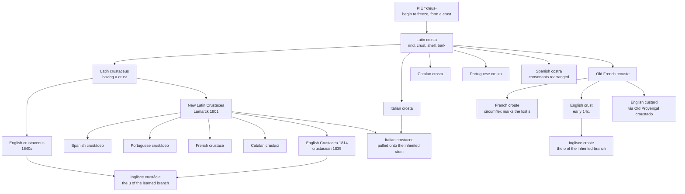

# *Crusta*: the crust made a class

A study of a Latin word for the hard part of a loaf, which came down into Romance twice — once as bread and once as a phylum — and of a French circumflex that marks a letter English still writes.

---

## 1. The root

Proto-Indo-European **\*kreus-** means "to begin to freeze, form a crust." It is a root about surfaces going hard, and it does not distinguish between kinds of hardening: from it come Greek *krystallos* "ice, crystal" and *kryos* "icy cold," Sanskrit *krud-* "make hard, thicken," Avestan *xruzdra-* "hard," Old English *hruse* "earth," Old Norse *hroðr* "scurf."

Latin **crusta** is the suffixed form, "that which has been hardened," and the Latin word's range is the point. It covers rind, crust, shell and bark indifferently — the hard outside of a loaf, a tree, a wound, an animal. Latin had one word for a category English splits between *crust*, *rind*, *bark*, *shell* and *scab*, and every language below inherits that breadth before narrowing it.

The English family from this root is larger than it looks: *crust*, *custard*, *crouton*, *encrust*, *crystal*, *crystalline*, *cryogenic*, and the German *Kristallnacht*. A crouton and a crystal are the same idea, applied to bread and to ice.

---

## 2. The inherited branch

*Crusta* came down into every western Romance language as an ordinary word for a hard outer layer, and it is still an ordinary word.

Italian **crosta**, Catalan **crosta**, Portuguese **crosta**, Occitan **crosta**, Old French **crouste**. Each covers roughly what the Latin covered — the crust of bread, the rind of a cheese, the scab on a wound, and by extension the crust of the earth. The Catalan vowel is irregular: Wiktionary notes that the /ɔ/ is unexpected and may be due to influence from other words of similar meaning.

Spanish went further and rearranged the consonants: **costra**, from the same *crusta*, with the *r* migrating across the *t*. The DLE gives the derivation flatly — *del lat. crusta* — and the Spanish senses are the Latin ones: the hardened covering that dries on something moist, and the scab that forms on a sore.

French did something the rest did not, and it is why this branch is worth a section. Old French *crouste* lost its *s* — as French did throughout, in *hostel*, *forest*, *isle* — and the modern spelling is **croûte**, where the circumflex exists precisely to record the letter that has gone.

That matters here because English kept the consonant. *Crust*, *crustacean*, *crustaceous* all still write the *s* that French had to memorialise with a hat. So the same Latin word is preserved by a diacritic in one language and by a letter in another, and the two strategies are visible side by side in a French menu and an English one.

**Custard** is the same word arriving by a third road: mid-14c. *crustade*, from Anglo-French *croustade*, from Old Provençal *croustado* "fruit tart," literally something covered with a crust, from *crosta*. English also had *crustard* and *custade*. The egg-and-milk sense is only c. 1600 — for two and a half centuries a custard was a pie, and named for its casing rather than its filling.

---

## 3. The learned branch

The second descent is not a descent at all but a quarrying. In 1801 Lamarck took *crustaceus* — the Latin adjective, "having a crust or shell" — and made **Crustacea** a zoological classification, Modern Latin neuter plural of *crustaceus (animalia)*.

Cuvier had been close three years earlier with *les insectes crustacés*: crusted insects, an adjective doing descriptive work inside an existing category. Lamarck's move was to promote the adjective to a noun and the description to a class. So the animals were insects with shells before they were crustaceans, and the seam is still visible in the word, which says nothing about the animals except that they are hard on the outside.

Every Romance language then took the term back from the New Latin — but not all of them took the same stem.

---

## 4. Which stem? Italian breaks ranks

Spanish **crustáceo**, Portuguese **crustáceo**, French **crustacé**, Catalan **crustaci** all keep the Latin *u*. Their everyday words for a crust — *costra*, *crosta*, *croûte*, *crosta* — have an *o*, so in these four languages the scientific term and the kitchen term look like strangers. A Spanish speaker has *costra* and *crustáceo* and no visible reason to connect them.

Italian is the exception. Its word is **crostaceo**, with the *o* of inherited *crosta*, not the *u* of Latin *crusta*. The learned borrowing was pulled onto the shape of the native word as it came in.

The consequence is that Italian alone can see what a crustacean is. *Crosta* and *crostaceo* sit beside each other, obviously related, and the name of the class announces that these are the animals with crusts. Everywhere else — including English — the connection has to be taught.

---

## 5. The English dates run backwards

English has three learned words here and they arrive in an order that makes no sense on the face of it.

**Crustaceous**, "pertaining to crust, crust-like," is 1640s. **Crustacea** is 1814. **Crustacean** is 1835 as a noun and 1858 as an adjective.

So the adjective predates the class by 174 years. That is not the usual accident of attestation: *crustaceous* was formed directly on the Latin adjective and meant crusty in general, with no animals in it at all, because the animals had not yet been gathered into a class. When Lamarck's category reached English, the language already had a perfectly good adjective for crusted things and made a new one anyway — *crustacean* — leaving *crustaceous* to keep the general sense it started with.

The same pattern turns up wherever a derivative is borrowed before its parent. What is unusual here is that both words survived with their senses intact, so English still has a word for crusty and a separate word for crustacean, and only the second one is about animals.

---

## 6. The comparative set

| | The inherited word | The learned word | What the pair records |
|---|---|---|---|
| **Latin** | *crusta* | *crustaceus* | One word for rind, crust, shell and bark alike. |
| **Italian** | *la crosta* | *il crostaceo* | The only language where the two share a stem. |
| **Spanish** | *la costra* | *el crustáceo* | Consonants rearranged in the inherited word; the learned one untouched. |
| **Portuguese** | *a crosta* | *o crustáceo* | Inherited *o* against learned *u*, as in Spanish. |
| **Catalan** | *la crosta* | *el crustaci* | The *ɔ* of *crosta* is irregular; the learned form keeps the Latin *u*. |
| **French** | *la croûte* | *le crustacé* | The circumflex stands in for the *s*; the learned word keeps it. |
| **English** | *the crust* | *the crustacean* | One vowel for both, and the *s* written out. *Crustaceous* predates the class by 174 years. |
| **Inglisce** | *þe croste*, *þe crosts* | *crustâcia*, *crustâcian*, *crustâceus* | The two branches given two vowels, as in Romance. |

Read the two columns against each other and the shape is clear. Five of the six languages have a pair that no longer looks like a pair — *costra* and *crustáceo*, *croûte* and *crustacé*, *crust* and *crustacean* — because the everyday word kept moving while the scientific one was fetched fresh from the Latin two thousand years later. Only Italian pulled the new word into line with the old.

---

## 7. The Inglisce forms

The set divides where the Latin divided, and the vowel is what divides it.

**`Croste` is the inherited word.** It carries the *o* of Italian *crosta*, Catalan *crosta*, Portuguese *crosta* and Old French *crouste* — and that last is the form English actually took the word from, in the early fourteenth century. **`Crustâcia`, `crustâcian` and `crustâceus` are the learned words**, and they carry the *u* of Latin *crusta*, which is what Lamarck quarried in 1801. Two branches, two roads, two vowels.

English cannot make this distinction because it lost the vowel that would carry it. *Crust* and *crustacean* both have *u*, which asserts a directness the first word does not have: English *crust* is from *crouste*, not from *crusta*. Writing `croste` restores what the French route put there and what four Romance languages still have.

Note where that leaves Italian. Italian marks the same distinction and resolves it the other way — pulling the learned *crostaceo* onto the inherited *crosta*, so that both words show the *o*. Inglisce and Italian give opposite answers to the same question. English gives none, because it does not ask.

The plural is **`crosts`**: the silent `-e` drops and `-s` attaches directly.

Among the learned three, the stem `crustâc-` is constant, and only what follows it changes: `-ia` for the class, `-ian` for its member, `-eus` for the quality. Where English hangs three differently-shaped endings on a stem whose stress moves, the Inglisce set holds the stem still and lets the endings carry the grammar.

The **circumflex** sits on the stressed vowel, and it is doing what the neighbouring languages do with their own marks in this same family: Spanish spends an acute on *crustáceo* and Portuguese on *crustáceo*, both to fix stress; French spends a circumflex on *croûte* to record a lost consonant. Three languages, three jobs for a mark over a vowel, all on one Latin word.

The **`c` before `i`** in `crustâcia` and `crustâcian` spells /ʃ/.

One coincidence worth recording. Catalan's adjective is *crustaci*, feminine **crustàcia** — the same string as the Inglisce class name, with a grave where Inglisce has a circumflex. Nothing connects them beyond the shared Latin, but a reader who knows Catalan will meet `crustâcia` and read it correctly on sight.

And the form is lowercase. The capital in English *Crustacea* is a convention of taxonomic writing rather than a property of the word, and an orthography that spells by descent has no reason to carry it.
