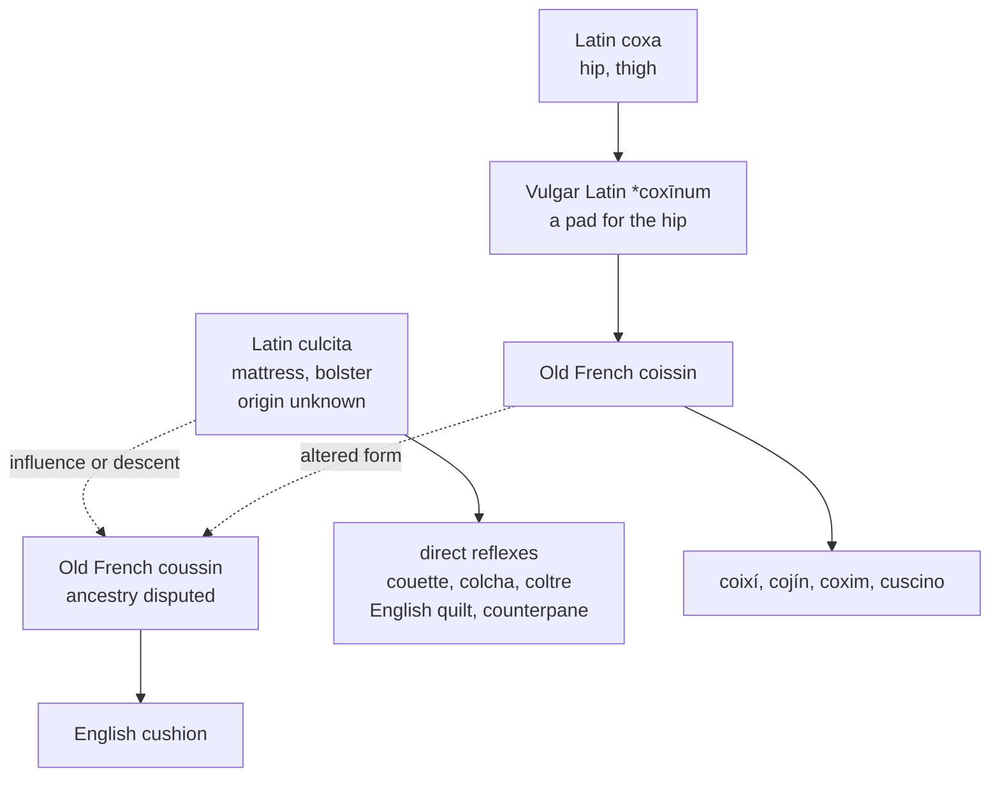

# *Culcita*: four hundred spellings and counting

A study of a stuffed sack whose ancestry philologists have never settled, and of a word English has been spelling differently since the fourteenth century without ever arriving anywhere.

---

## 1. The Latin word

*Culcita, -ae* is a mattress, a bolster, a cushion, a stuffed pad of any kind — a cloth case with something soft inside it. The word is ordinary and domestic, and it appears wherever Roman writers have occasion to mention furniture.

Its own etymology is not known. A connection with *calcāre* "to tread down" has been proposed, on the reasoning that stuffing is trodden into place, and a link to a dissyllabic root meaning "bundle" or to \**kwel-* "to bend, roll" has been suggested on the reasoning that a mattress is matted. Neither proposal is more than a guess, and the honest position is that the word's origin is dark.

---

## 2. The contested descent

The Romance words for *cushion* may or may not come from *culcita*, and the question has been open for well over a century.

**The case for *coxa*.** Vulgar Latin appears to have had \**coxīnum*, formed on *coxa* "hip, thigh" — a pad for the hip, on the model of Latin *cubitāl*, an elbow-cushion formed on *cubitus*. Old French *coissin* fits this exactly, and so do Catalan *coixí*, Spanish *cojín*, and Italian *cuscino*. The Iberian evidence is the strongest part of the argument: the *x* of Portuguese *coxim* and the *j* of Spanish *cojín* are the regular reflexes of the Latin cluster in *coxa*, and they are not what *culcita* would have produced.

**The case for *culcita*.** Old French also had *coussin*, earlier *cussin*, and it is this form and not *coissin* that English took. Its history is the obscure one. It may be *coissin* altered under the influence of Old French *coute* "quilt," which is *culcita*; or it may descend from a Late Latin \**culticīnum* for \**culcitīnum*, a conjectured diminutive of *culcita*. On the latter account *coissin* and *coussin* would be unrelated words that came to look alike, which their intertwined history makes hard to credit.

The compromise found in several dictionaries has it both ways: a Gallo-Roman \**culcinum* from *culcita*, reshaped after *coxa*. Anatoly Liberman's judgement is that *culcita* is the more realistic etymon of the two.

What is not in doubt is that Old French carried two forms, that the Iberian words descend from one of them and the English word from the other, and that a comparison set aligning *culcita* with *coxim* and *cojín* may be aligning two different words.

---

## 3. What English took

Whatever *cushion* turns out to be, English holds two words that are certainly from *culcita*.

**Quilt** comes through Old French *cuilte*, *coilte*, directly from *culcita*, and the descent is clean.

**Counterpane** is not clean. It began as Old French *coute pointe*, from Medieval Latin *culcita puncta*, "a quilted mattress" — literally a mattress that has been pricked through with stitches. Neither half of that survived. First *coute* was replaced by *contre*, producing *contrepointe* and English *counterpoint*, a substitution with no basis whatever beyond the resemblance of the syllables. That drove the word into collision with the musical *counterpoint*, which is *punctus contra punctum* and unrelated. It escaped by a second substitution: *-point* was replaced by *pane*, a cloth panel, from Old French *pan* and Latin *pannus*.

The result is a word in which both elements are false. There is no counter in a counterpane and no pane, and the thing it denotes is a *culcita puncta* under a name that has lost every syllable of its own. The two substitutions are separated by roughly three centuries, and each was made because the form immediately preceding it looked like something a speaker already knew.

Inglisce declines to carry the wreck. It uses `bedsprede`, a native compound of the sort English already prefers in ordinary speech, where *bedspread* is the everyday word and *counterpane* survives mainly in auction catalogues and period fiction. The substitution costs nothing, since a word whose every element is false records no etymology worth preserving; and it is one of the few places in the system where the answer to a Latinate tangle is simply to stop using the Latinate word.

*Mattress*, despite appearances, belongs to neither family: it is from Arabic *al-maṭraḥ*, borrowed in Sicily.

And then there is the spelling. Someone has counted more than four hundred spellings of the plural of *cushion* in Middle English wills and inventories — among them *quessihon*, *quoshin*, *whishin*, *cuishun*, *kuchin*, and *koshen*. Middle English carried two competing types side by side, *cuisshin* and *quishin* from *coissin*, and *cusshyn* and *cushin* from *coussin*, with the northern dialects producing *whishin*.

Four hundred spellings is not orthographic chaos for its own sake. It is what happens when a word arrives in two forms from two French words of disputed and possibly separate ancestry, and no scribe has any principled basis for choosing. The modern *cushion* is one survivor among many, and it was not selected for being right.

---

## 4. The comparative set

| | From *culcita* | The cushion word |
|---|---|---|
| **Latin** | *culcita* | \**coxīnum* or \**culcitīnum* |
| **French** | *couette*, from Old French *coute*, *coite* | *le coussin* |
| **Spanish** | *colcha* | *el cojín* |
| **Portuguese** | *colcha* | *o coxim* |
| **Italian** | *coltre*, from *culcitra* | *il cuscino* |
| **English** | *quilt*, *counterpane* | *the cushion* |
| **Inglisce** | *þe cuilte*, *þe bedsprede* | *þe cûssion* |

The left column is secure and the right one is not. Every language in the set kept a direct descendant of *culcita* for bedding, and acquired a separate word for the smaller pad one sits on — and it is the second word whose parentage cannot be established.

---

## 5. The Inglisce forms

`Cuilte`, plural `cuilts`, is the secure member of the set, and its spelling is attested rather than devised: *cuilte* is the Old French form the English word came from. The `cu` for /kw/ is the Iberian convention — Spanish and Catalan write *cuando*, *cuatro*, *cuestió* where Latin had *qu* — and it aligns the word with the initial *c* of *culcita*, *colcha*, and *coltre*. English `qu` is a French scribal habit that obscures that connection for no phonetic gain. The silent `-e` drops before the plural.

`Cûssion` settles two things that English leaves open, and it is worth being clear about which kind of settling each is.

**The vowel is a genuine repair.** English *cushion* is /ˈkʊʃən/, and the letter `u` spells /ʊ/ here. It also spells /ʌ/ in *cut*, *rush*, *dull*, and *bus*. The two sounds were one vowel until the seventeenth century, when Middle English /ʊ/ split — remaining /ʊ/ after labials and before certain consonants, and lowering to /ʌ/ elsewhere. The spelling never followed. English therefore writes *put* and *cut*, *bush* and *rush*, *full* and *dull*, *pull* and *hull* with the same letter for different vowels, and offers the reader nothing. It is the largest unmarked vowel distinction in the language, and the circumflex of `cûcion` marks it.

**The consonant is etymological as well as phonetic.** The `ss` is the doubled sibilant of Old French *coussin*, retained rather than replaced, and it yields /ʃ/ by the system's own rule that an intervocalic single `s` is voiced and a doubled one is not — the principle that separates French *poisson* from *poison*. Before a following `i` and vowel, the voiceless sibilant palatalises.

The `-cion` spelling used for the *-tiōnem* vocabulary would be wrong here, and wrong twice over. It writes a suffix, and *cushion* has none: the word is a single morpheme, not a stem plus an ending, so `-cion` would impose a boundary the word does not contain. And the /ʃ/ of *cushion* does not descend from a Latin *-ti-* at all. `Ssi` is the correct environment, and English itself agrees — *mission*, *passion*, *session*, *discussion*, *permission*, and *impression* all spell /ʃən/ with `ssi`, and *cushion* is the anomaly for not doing so.

So the form is not a compromise. It records the French doubling, states the sound by rule rather than by exception, and moves the word into the English class it phonetically belongs to and has been excluded from by an accident of scribal history.

`Bedsprede` is a compound of two native elements, and the second carries the silent `-e` that marks a word serving as both noun and verb. It also writes `e` for /ɛ/ where English writes `ea` — the grapheme that spells /ɛ/ in *spread*, *bread*, *dead*, and *head*, /i/ in *bead* and *read*, and /eɪ/ in *break*, with nothing to distinguish them.

All three nouns are masculine, `þe`, the stress falling on the first syllable in each.
