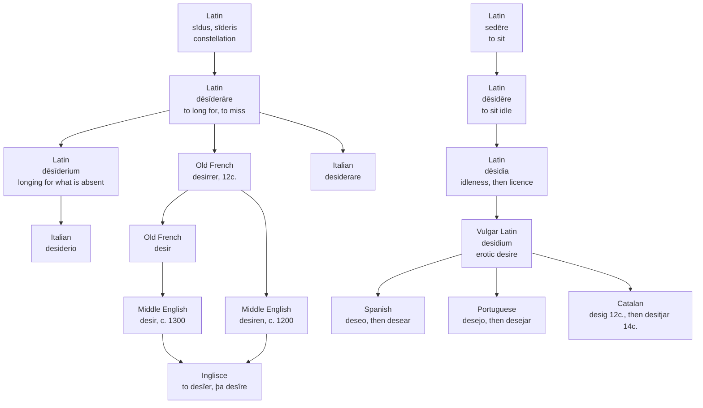

# *Desiderare*: the star and the seat

A study of one Latin verb, and of the three Romance languages that look like they inherited it and did not.

---

## 1. The root

Latin **dēsīderāre** — "to long for, to wish for; to miss, to feel the want of; to demand, to expect."

The traditional analysis takes it as *de-* plus a stem *sīder-*, related to **sīdus** (genitive *sīderis*), "heavenly body, star, constellation," through the phrase *de sidere*, "from the stars." The sense proposed for the whole is *await what the stars will bring*.

Its companion is **cōnsīderāre**, the same stem with *com-*: to observe the stars, and from there to examine, to weigh, to ponder. Both have been read as terms of augury. On that account *consider* and *desire* are two halves of one practice — one word for watching the sky, one for the feeling left when what you watched has gone below the horizon.

The account is not secure, and the page should say so. Tucker rejected the *sidus* connection as inapplicable to *desiderare* and derived the verb instead from the Indo-European root behind English *side*, "stretch, extend," yielding a sense along the lines of "survey on all sides" or "dwell long upon." A 2022 study by D'Angerio moves both verbs out of augury and into agriculture: *sīdus* names a constellation rather than a single star, for which Latin has *stella*, and constellations governed the farming calendar, so the verbs would carry the expectation and the planning that attach to the turn of a growing season rather than anything magical.

What matters for the rest of this page is that no Indo-European root for *sīdus* is securely reconstructed. The other family in this study has one.

---

## 2. What Latin built on the verb

**dēsīderium**, the noun: longing, and specifically grief for something absent — a person away, a thing lost.

**dēsīderātum**, the neuter past participle: something for which desire is felt. English took the plural whole and untranslated in the 1650s as *desiderata*, and it is still Latin in English mouths.

**Dēsīderius**, a personal name, which will matter in section 4.

---

## 3. The road into English

Old French took the verb as **desirrer** in the twelfth century and formed the noun **desir** from it.

English took the verb first: *desiren*, around 1200. The noun arrived roughly a century later, around 1300, and it came from French *desir* rather than from the English verb — French had already performed the conversion, so English imported both halves separately rather than making one from the other. The sense of physical appetite is present from the noun's earliest attestations.

Middle English also nativized a run of forms straight from the Latin and then lost nearly all of them: *desiderable* (mid-14c.), *desideracioun* (late 15c.), *desiderantly* (c. 1500), *desiderate* (1640s). The one survivor in ordinary use is *desirable*, which came the French way.

Italian did not lose anything. It kept the Latin verb and the Latin noun intact, medial *-d-* and all: **desiderare**, **desiderio**.

---

## 4. The Iberian defection

Spanish *deseo*, Portuguese *desejo* and Catalan *desig* are not from *dēsīderium*.

They descend from Vulgar Latin **desidium**, "erotic desire" — the neuter answering to classical **dēsidia**, "indolence, sloth," which had already acquired the sense "voluptuousness, licence" in antiquity on the moral doctrine that idleness is the incentive to lust. *Dēsidia* comes from **dēsidēre**, "to sink down, to sit idle," which is *de-* plus **sedēre**, "to sit," from Indo-European *\*sed-*.

The argument is phonological, not merely lexicographical, and that is what makes it hold. Viaro states it directly for Portuguese: *dēsīderium* would have produced something on the order of *\*deseeiro*, so it cannot be the base of *desejo*; the attested form requires *desidium*. Corominas reaches the same conclusion for Castilian *deseo*, dating the first documentation to Berceo. The *Gran Diccionari de la Llengua Catalana* gives *desidium* for *desig*, first attested in the twelfth-century *Homilies*.

So there are two Latin words here, and the resemblance between their descendants is convergence. One is the star that has set, felt as absence afterwards. The other is the seat you have risen from — a thing you had, and left, and now lack. Both arrive at longing. Neither is the other's ancestor.

The learned word did reach the peninsula and failed to hold. Spanish borrowed *desiderio* directly from Latin, and it fell out of use; it survives as the given name Desiderio, and in Portuguese as Desidério. Before the twelfth century the two are not always separable on the page: a written *desiderio* may be the learned loan or may be a scribe's attempt to spell the popular /deséo/ he actually said.

Catalan reverses the English order. *Desig* is on record from the twelfth century; the verb *desitjar* is derived from the noun and appears in the fourteenth, in Llull. English made a verb and then imported a noun to go with it. Catalan held the noun for two hundred years before it needed a verb.

---

## 5. The comparative set

| Language | Verb | Noun | Which Latin word |
| :--- | :--- | :--- | :--- |
| **Inglisce** | to desîer | þa desîre | *dēsīderāre*, by way of French |
| English | to desire | the desire | *dēsīderāre*, by way of French |
| French | désirer | le désir | *dēsīderāre* |
| Italian | desiderare | il desiderio | *dēsīderāre* and *dēsīderium*, direct |
| Spanish | desear | el deseo | *desidium* |
| Portuguese | desejar | o desejo | *desidium* |
| Catalan | desitjar | el desig | *desidium* |

Read the last column down and the set divides four against three, and not where the map of Romance would put the line. Italian and French are together, and English and Inglisce are with them because English took the word from French. Spanish, Portuguese and Catalan stand apart as a bloc — which is to say the Pyrenees, not the Alps, mark the boundary of this word. The Iberian three are also the three where the noun came first and the verb was built from it. That is what a borrowed noun does when a language has no inherited verb to attach it to.

---

## 6. The Inglisce form

**to desîer** · desîre, desîres, desîred, desîering · **þa desîre**, desîars

The circumflex carries /aɪ/ and holds it in place across every form in the paradigm. Modern English marks that vowel with a bare *i* whose value depends on a silent *e* two letters downstream, and in *desiring* the *e* has been deleted, leaving the vowel unmarked and the spelling reliant on the reader already knowing the word. The circumflex depends on nothing further along, so *desîering* is exactly as legible as *desîre*.

The verb and the noun are visibly different words. The infinitive and the progressive take **-îer**; the present tense and the noun take **-îre**; the noun's plural is **desîars**. English cannot make this distinction at all — *desire* is one string doing both jobs, and only the syntax around it says which is meant. Inglisce restores the split that Old French had when it made *desir* out of *desirrer*, and marks it in the spelling rather than leaving it to context.

The article is **þa** because the stress falls on the second syllable, de-SÎRE, which places the noun in the later-stress class. Nothing about the word's meaning is consulted; the pronunciation decides.

What the spelling records, then, is the French route. *Desîer* is a French verb wearing a diacritic, and it belongs with *désirer* and *desiderare* and the constellation behind them. It does not belong with *desear*, *desejar* or *desitjar*, however closely those resemble it on the page. A reader who comes to Inglisce with Spanish will recognise *desîre* on sight and be wrong about why.
