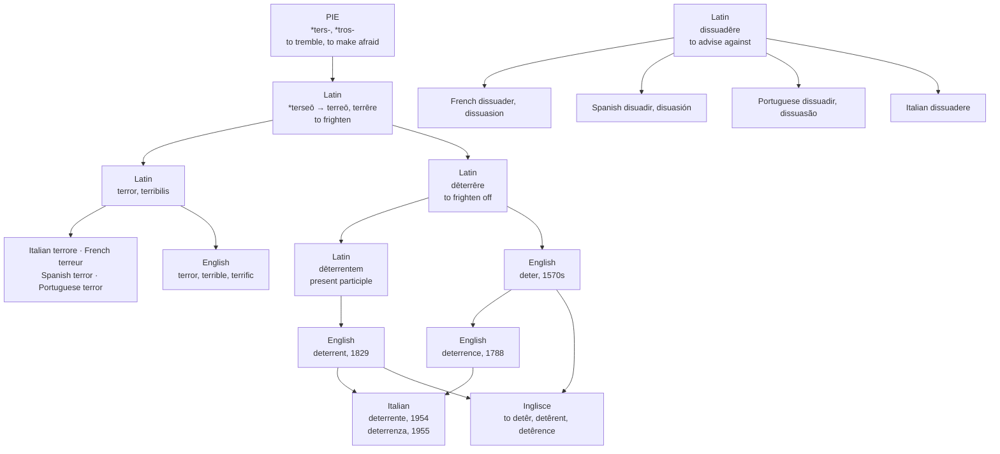

# *Deterrēre*: the word the bomb brought home

A study of a Latin verb that died everywhere it was born, survived only in England, and was carried back to Italy in 1954 as a noun with no verb attached.

---

## 1. To frighten away

Latin **dēterrēre** is *dē*, "away, off," plus **terrēre**, "to frighten, to fill with fear." To frighten someone off a course of action. The whole word is built on fear, and there is nothing else in it.

The doubled *r* is not decoration. *Terreō* is reconstructed from an earlier *\*terseō*, the *-rs-* assimilating to *-rr-*, and the root behind it is reconstructed as *\*tros-* or *\*ters-*, "to make afraid." Its relatives are widely spread and all mean much the same: Sanskrit *trasanti* "they tremble, they are afraid," Avestan *tarshta* "scared," Greek *treëin* "to tremble with fear," Lithuanian *trišėti* "to tremble, shiver," Old Church Slavonic *treso* "I shake," Middle Irish *tarrach* "timid."

So the root is physical before it is emotional. It names the shaking, and the fear is inferred from it.

---

## 2. The family, and the words that only look like family

From *terrēre* English holds **terror** and **terrible**, both through Old French in the fourteenth and fifteenth centuries, **terrify**, **terrific**, and eventually **terrorism** and **terrorist** from the French Revolution's own name for its policy.

*Terrific* is the one that turned. It meant frightful, then by the 1590s violently severe, and had weakened by the eighteenth century into a bare intensifier — the same softening that overtook *awful* and *terrible*, so that a terrific evening and a terrible evening are now opposites while remaining the same word twice.

What does **not** belong here is everything from *terra*, "earth": **territory**, **terrace**, **terrain**, **terrier**, **terrestrial**, **subterranean**. The resemblance is complete and the connection is nil. A terrier is a dog that goes to ground, not a dog that frightens anybody.

---

## 3. What Romance did with the verb

It let it go.

No Romance language kept *dēterrēre* as a living verb. The ground it held was taken by **dissuadēre**, *dis-* plus *suādēre* "to advise, to urge" — persuasion run backwards, an argument rather than a fright. French *dissuader*, Spanish *disuadir*, Portuguese *dissuadir*, Italian *dissuadere*. Where Latin had frightened a man off, Romance talked him out of it.

The bare root survived perfectly well. Italian has *terrore*, Spanish *terror*, French *terreur*, and every language in the family has its *terribile*, *terrible*, *terrível*. It is the compound that died, and the death is total: not a dialect form, not a learned survival, nothing.

---

## 4. England keeps it

English took *dēterrēre* directly from Latin in the 1570s as **deter**, "to discourage and stop by fear."

Twenty years later the fear had already gone out of it. By the 1590s *deter* meant to stop or prevent someone from acting by any countervailing motive at all — a fine, an inconvenience, a locked door. A verb whose entire substance is *terrēre* stopped requiring anybody to be frightened, and has never required it since.

The nouns arrive out of order, which is worth flagging because it looks like an error and is not. **Deterrence** is attested from 1788, "the act of deterring; that which deters." **Deterrent** — the adjective and noun both, from Latin *dēterrentem*, the present participle — is attested in 1829, in Bentham. So the derivative is on record forty-one years before the word it was derived from. Either *deterrent* was circulating unrecorded before Bentham fixed it, or *deterrence* was built straight off the verb; the dictionaries do not say which.

---

## 5. The bomb brings it home

In 1954 the word went back to Italy, and it did not go back as Latin.

The Accademia della Crusca is unambiguous: Italian *deterrente* and *deterrenza* derive **from English** *deterrent* and *deterrence*, and it is precisely this English route that explains why Italian has no verb *deterrere* to put them with. The Italian for what a deterrent does is still *dissuadere*.

The dating is close enough to be startling. Etymonline puts the English nuclear sense of *deterrent* at 1954 and of *deterrence* at 1955. The Crusca's search of the historical archives of the *Corriere della Sera* and *La Stampa* finds 1954 as the year both the English *deterrent* and the Italian *deterrente* first appear in the Italian press. GRADIT gives 1955 and 1966 for the two Italian words, Zingarelli moves the second back to 1963, and Google Books shows *deterrenza* in the fifties.

The word did not drift back into Italian over generations. It arrived with the news, in the same year the strategy it names was being invented, and it arrived incomplete — an adjective and an abstract noun with a hole where their verb should be.

The rest of Romance declined the import. French still says *dissuasion*, Spanish *disuasión*, Portuguese *dissuasão*.

---

## 6. The comparative set

| Language | The verb | The noun | Where the noun came from |
| :--- | :--- | :--- | :--- |
| **Inglisce** | to detêr | detêrence, detêrent | with the verb, from Latin |
| English | to deter | deterrence, deterrent | Latin *dēterrentem* |
| Italian | none; *dissuadere* | deterrenza, deterrente | English, 1954–55 |
| French | dissuader | dissuasion | Latin *dissuadēre* |
| Spanish | disuadir | disuasión | Latin *dissuadēre* |
| Portuguese | dissuadir | dissuasão | Latin *dissuadēre* |

Read the first two columns across and one row does not line up. Every other language has a verb and a noun cut from the same cloth. Italy has an abstract noun and an adjective in one family and a verb in another, because the noun was imported four hundred years after the verb it belonged to had been abandoned. English, which had held on to the Latin compound alone among these languages, was in a position to sell it back.

---

## 7. The Inglisce forms

**to detêr** · detês, detêd, detêring · **detêrent**, **detêrence**

The circumflex carries the stressed r-coloured vowel, and it carries it in every form, which is what lets the *r* itself come and go beneath it. The letter is written where it is a consonant standing before a vowel — *detêring*, *detêrent*, *detêrence* — and dropped where it is not: *detês* and *detêd* have no consonantal *r* to spell, since the colour is already in the vowel. The headword keeps its *r* because the family needs it visible.

The **single *r*** is a departure from the history, and the page should say so rather than let it pass. Latin's doubling was real: *terrēre* comes from *\*terseō*, and the *-rr-* is an assimilated cluster, not a lengthening. English kept both letters in *deterrent*, *deterrence*, *deterred* and *deterring*, and dropped one only in *deter*, where nothing followed. Inglisce writes one throughout, because the circumflex has already said what English's doubled consonant was there to say. Where the diacritic and the etymology want different things, the diacritic wins and the *r* is spent once.

**Detêrent** and **detêrence** keep the circumflex because the vowel is still there to be marked. American English says *deterrent* with the same r-coloured vowel as *deter*, and the stress stays on that syllable through the whole family. British English parts company here and puts a plain vowel in the derivatives, so the mark is choosing a side rather than recording a consensus.

What the circumflex adds is not a repair. English already writes *deter-* unchanged in all three words, and no reader has trouble seeing one word in them. What English does not do is say which vowel those letters stand for, or explain why the *r* doubles in two of the three and not in the first. One mark answers both: it names the vowel, and it makes the doubling unnecessary, so the root is spelled the same way and pronounced the same way wherever it appears.

What the spelling cannot record is the shape of the word's life. *Deter* is Latin taken whole into English in the 1570s and never let go of, while every language nearer to Rome had already replaced it with an argument instead of a fright. That is the sort of thing an orthography can only point at, which is what the *r* under the circumflex does — the doubled consonant of a Latin verb that Latin's own daughters gave up.
