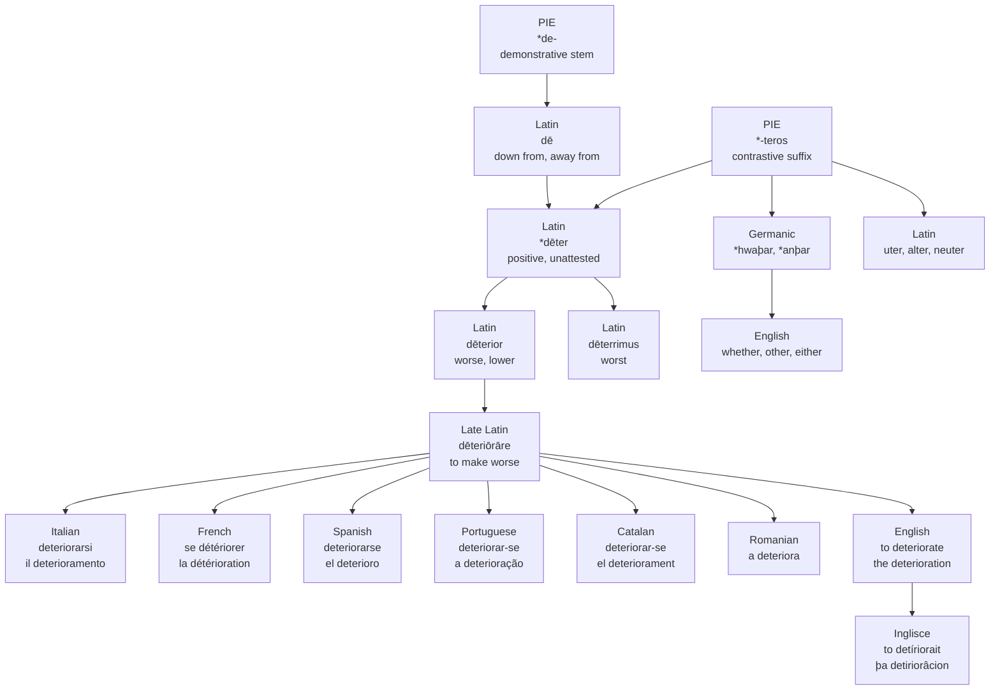

# *Deterior*: worse than a word nobody wrote down

A study of a Latin comparative with no positive degree, of the verb built on it, and of the reflexive pronoun every Romance language uses for it except the two that have none.

---

## 1. A comparative with no positive

Latin **dēterior** means worse, lower, inferior, meaner. It is a comparative adjective, third declension, with a superlative **dēterrimus**, "worst."

Its positive degree does not exist. Dictionaries print it as *\*dēter*, with the asterisk that marks a form nobody ever wrote — reconstructed from the comparative and the superlative that stand on either side of a gap. Latin could say *worse* and *worst* on this stem and had no way at all to say *bad*.

The parts are transparent once separated. *Dē*, the preposition, "down from, away from." Then *-ter-*, the contrastive suffix that Latin uses in *uter* "which of two," *alter* "the other of two," *neuter* "neither of two." Then *-ior*, the ordinary comparative ending. Something like "the more downward of the two."

That middle element is worth pausing on, because it is not confined to Latin. Merriam-Webster's entry sends the reader from *deterior* to **whether**, and it is the same suffix: the *-ther* of *whether*, *other*, *either* and *neither* is the Germanic reflex of the element that sits inside *deterior*. English carries it four times a sentence without noticing.

---

## 2. The company it keeps

*Deterior* belongs to a small and peculiar class: comparatives formed not from adjectives but from prepositions and adverbs of place.

**Interior** from *in*. **Exterior** from *ex*. **Superior** from *super*. **Inferior** from *inferus*. **Ulterior** from *uls*, "beyond." **Citerior** from *citra*, "on this side." **Anterior**, **posterior**, **prior**. None of these has a plain positive either, because a preposition is not a quality and cannot be held in a middling amount.

English has borrowed nearly the whole set and has entirely forgotten what they are. We write *very superior*, *more inferior*, *the most exterior wall* — comparing comparatives, which in Latin is not a mistake so much as a category error. The forms came over as ordinary adjectives and English declined the grammar along with them.

*Deterior* is the one member of the class that English did not take. There is no English adjective *deterior*, outside a rare learned use the OED records and nobody has met. What English took instead was the verb.

---

## 3. The Late Latin verb

Classical Latin had the adjective and did not build a verb on it. **Dēteriōrāre**, "to worsen, to make worse," is Late Latin, and Lewis and Short mark it as belonging to the Christian centuries rather than to the classical language, with only two or three citations to its name. It is a first-conjugation verb of the most ordinary kind, formed by hanging *-ō* on the comparative stem, with the supine *dēteriōrātum*.

So the chain is: a preposition, given a contrastive suffix, given a comparative ending, given a verb ending. Four layers of grammar and not one lexical root among them. *Deteriorare* means "to make more down-from-ish."

---

## 4. What English took, and when

English took the past participle and made a verb of it, and the dating is genuinely disputed.

Etymonline puts the transitive verb, "make worse, reduce in quality," at the 1640s, and the intransitive, "grow worse, degenerate," at 1758. Dictionary.com records the word from 1565 to 1575. The OED lists an adjective *deteriorat* running from 1572 to 1598. The likeliest reading is that a Latinate adjective arrived in the 1570s, fell out of use, and the verb was formed again from the same Latin participle two generations later — but the sources do not agree and the page should not pretend they do.

**Deterioration** appears in the 1650s, and etymonline is careful to say it may be a native English formation on the verb rather than a borrowing, though French *détérioration* had existed since the fifteenth century and may equally be the source.

The gap between the two English senses is the striking figure: a hundred and eighteen years between *deteriorate something* and *deteriorate* on its own. Section 6 is about why that gap had to exist.

---

## 5. Three roots that all begin *deter-*

Three English words begin with the same four letters, all of them containing Latin *dē-*, and no two of them are related beyond that prefix.

**Deteriorate** is *dē* + the contrastive *-ter-* + a comparative ending. No root at all, as section 3 has it.

**Deter** is from *dēterrēre*, *dē* + **terrēre** "to frighten, to fill with fear," from a root also behind *terrible* and *terror*. It entered English in the 1570s — the same decade as the disputed first *deteriorate*, which is how close the collision comes.

**Detriment** is from *dētrīmentum*, on the participial stem of *dēterere*, *dē* + **terere** "to rub, to wear away." Its literal sense is a rubbing-off, and the word arrived in English in the early fifteenth century meaning incapacity, then any harm or injury. The same root gives *attrition*, *trite*, *contrite* and *detour*.

To frighten, to rub, and a suffix meaning "of two." Three unrelated things, and English writes them all *deter-*.

---

## 6. The reflexive English does not have

Look at what the modern languages do to say that something worsens by itself.

French **se détériorer**. Italian **deteriorarsi**. Spanish **deteriorarse**. Portuguese and Catalan **deteriorar-se**. Every one of them takes the transitive verb and adds a reflexive pronoun: the thing worsens *itself*.

English has no such device available in ordinary prose. *It deteriorates itself* is not English. So English had to do the work inside the verb, letting a transitive verb acquire an intransitive sense outright — and that is precisely the change etymonline dates to 1758, more than a century after the transitive arrived. Romance solved the problem with a pronoun it already had; English solved it by waiting for the verb to change what it was.

The nouns divide too, and along a different line. French *détérioration*, Portuguese *deterioração* and English *deterioration* all descend from a *-tiōnem* abstract. Italian *deterioramento* and Catalan *deteriorament* take *-mentum* instead. Spanish takes neither: **el deterioro** is a deverbal noun, made by stripping the infinitive ending off *deteriorar* rather than by adding any suffix at all — the shortest word in the set, and the only one that got there by subtraction.

---

## 7. The comparative set

| Language | The verb, made intransitive | The noun | How the noun is made |
| :--- | :--- | :--- | :--- |
| **Inglisce** | to detíriorait | þa detiriorâcion | *-tiōnem* |
| English | to deteriorate | the deterioration | *-tiōnem* |
| French | se détériorer | la détérioration | *-tiōnem* |
| Portuguese | deteriorar-se | a deterioração | *-tiōnem* |
| Italian | deteriorarsi | il deterioramento | *-mentum* |
| Catalan | deteriorar-se | el deteriorament | *-mentum* |
| Spanish | deteriorarse | el deterioro | stripped, no suffix |

Read the second column down and every Romance language is doing the same thing with a pronoun, while English and Inglisce are doing it with nothing at all. Read the fourth and the set breaks in three, and the break does not follow the first: Portuguese sits with French on the noun and with everyone on the verb, Catalan sits with Italian, and Spanish sits alone. One Late Latin verb, borrowed by seven literate languages more or less simultaneously as a learned word, and they still could not agree on how to make a noun out of it.

---

## 8. The Inglisce forms

**to detíriorait** · **þa detiriorâcion**

The accent is on the stress and nowhere else, and the pair exists to show it move. In the verb the weight falls on the second syllable, de-TÍ-ri-o-rait, and the *í* carries it. In the noun the weight travels four syllables to the right, de-ti-ri-o-RÂ-cion, and the mark travels with it: the *í* goes bare and the *â* takes over.

This is the kind of thing English simply does not do. *Deteriorate* and *deterioration* share their first eleven letters, and nothing in the second word signals that its stress has moved to a syllable that barely existed in the first. A reader who has met neither word aloud has no way to arrive at the right one from the page. Here the mark is not decoration on a letter but a property of the word, and it relocates when the word does.

The final *-ait* and the *â* spell the same vowel, and the difference between them is the difference between a syllable that carries the main stress and one that does not. The verb's *-ait* takes only the secondary beat; the noun's *â* takes the primary, and is marked accordingly.

The article is **þa** because the stress falls late in the word.

The noun follows the *-tiōnem* pattern rather than the *-mentum* one, which puts it with French and Portuguese and apart from Italian and Catalan — a choice, since either was available and the languages that took this word were split.

And one thing the spelling cannot supply. Inglisce has no *deterior*, any more than English does. The verb stands on an adjective the language never adopted, which itself stands on a positive degree that Latin never wrote down. Four layers of grammar, a missing word underneath them, and at the bottom a preposition meaning *down from*.
