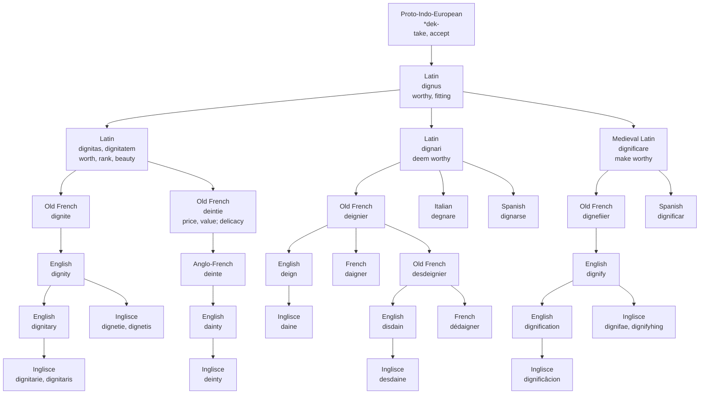

# *Dignus*: the office and the sweetmeat

How one Latin word for "fitting" gave English a rank, a delicacy, a condescension and a sneer, and why only some of them pronounce their *g*.

---

## 1. The root

Latin *dignus* "worthy, proper, fitting" is \*dek-no-, a suffixed form of the Proto-Indo-European root \*dek- "to take, accept." What is *dignus* is what can be accepted: fit to be received, and so fit for its place.

Latin built three words on it that matter here. *Dignitas*, accusative *dignitatem*, was the quality of being *dignus*: worthiness, but also greatness, rank, worth and beauty. *Dignari* meant to deem something *dignus*, to judge it worthy. Medieval Latin later added *dignificare* "to make worthy," which is *dignus* with *-ficare*, the combining form of *facere* "to make." Every English word on this page descends from one of those three.

---

## 2. *Dignitas* arrives twice

English took *dignitatem* twice, through two different Old French words.

The learned one was Old French *dignite*, which became English **dignity** around 1200. It first meant the state of being worthy. By about 1300 it also meant an elevated office, civil or ecclesiastical, and by the late fourteenth century gravity of countenance.

The inherited one had been worn down in ordinary speech into Old French *deintie*. In the twelfth century that meant "price, value," and also "delicacy, pleasure." It passed through Anglo-French *deinte* into Middle English *deinte*. There it first meant "regard, affection," and by about 1300 "excellence, elegance," "a luxury, a precious thing," and fine food or drink. The adjective **dainty** followed: "delightful, pleasing" around 1300, "delicately pretty" around 1400, "fastidious" in the 1570s.

The two words divided the Latin meaning between them. *Dignitas* covered both a man's standing and what he was worth. The learned borrowing kept the standing. The inherited one kept the worth, and from what a thing is worth it came to mean what is worth having: a choice morsel. *Dignity* and *dainty* are a doublet, one Latin accusative taken once from the page and once from the mouth.

---

## 3. The verb and its opposite

*Dignari* became Old French *deignier*, modern French *daigner*, and Italian *degnare*. English **deign** appears around 1300 as *deinen*, from the Old French and directly from the Latin. It meant "think worthy, think well of, regard as suited to one's dignity." It was a verb of esteem, directed at someone else. From "accept graciously" it moved in the 1580s to "condescend," taking an infinitive: one deigns *to* do something. The esteem now flows downward, as a favour.

**Disdain** is the opposite, and its formation is disputed. Etymonline treats it as an Old French compound: *desdeignier*, from *des-* "do the opposite of" and *deignier*. Merriam-Webster sets a Vulgar Latin \*disdignare, *dis-* plus *dignare*, behind the French. American Heritage also has \*disdignare, but derives it from classical Latin *dedignari*, with *de-*. The English verb *desdeinen* dates from the mid-fourteenth century. The noun *desdeyn* is recorded at the same time, and an earlier *dedeyne* around 1300. Early Modern English sometimes clipped it to *sdain*. Modern French writes *dédaigner* and *dédain*.

The Romance languages do not treat the pair alike. Italian has both verbs inherited: *degnare* and *sdegnare*, with the Latin *gn* kept in the spelling and the vowel lowered to *e*. Spanish and Portuguese have the negative inherited, with Latin *gn* turned into the palatal nasal the two languages write *ñ* and *nh*: *desdeñar*, *desdenhar*. The positive verb they use is *dignarse* and *dignar-se*, with *gn* intact. The Real Academia derives *dignarse* straight from Latin *dignāre*. Etymonline names an inherited Spanish *deñar* among the descendants of *dignari*.

---

## 4. The learned workshop

**Dignify** arrived in the early fifteenth century as *dignifien*, from Old French *dignefiier*, from Medieval Latin *dignificare*. It meant "invest with honour or dignity, exalt in rank or office," and also "deem suitable." By the mid-fifteenth century it meant "confer honour upon, make illustrious." English then built on it and on *dignity*:

- **Dignification**, from the 1570s, is the noun of action from *dignify*: "act of honouring, promotion."
- **Dignitary**, from the 1670s, is *dignity* + *-ary*: "one who holds an exalted rank or office."
- *Dignified*, from the 1660s, meant "exalted, honoured, ranking as a dignitary." The sense of noble bearing is recorded only by 1812.

Everything English made on the learned side was about rank. To dignify someone was to promote them, a dignification was the promotion, and a dignitary was the person promoted. The personal quality that *dignified* now names came last.

Spanish and Portuguese built the same learned set: *dignificar*, *dignificación*, *dignificação*. For the office-holder, Spanish alone of the four languages writes *dignatario*, with *-a-* where the others have *-i-*.

---

## 5. The *g* that is spoken and the *g* that is not

The four learned English words pronounce the *g*: *dignity*, *dignify*, *dignification*, *dignitary*. The three inherited words do not: *deign*, *disdain*, *dainty*.

The loss is older than English. The popular Old French forms had already done away with the Latin cluster. *Deintie* had no *g* at all. In *deignier* and *desdeignier*, *gn* spelled a single palatal nasal, not /ɡ/ followed by /n/. Middle English wrote what it heard: *deinen*, *desdeynen*, *deinte*.

Modern English spells the same syllable, /deɪn/, three ways: *deign*, *-dain* in *disdain*, and *dain-* in *dainty*. Only *deign* has a written *g*, and it is silent. French kept the *g* in *daigner* and *dédaigner*, where *gn* still spells the palatal nasal. French changed the vowel to *ai* and the prefix to *dé-*.

---

## 6. The comparative set

The diagram follows etymonline's account of *disdain*, as an Old French compound. Merriam-Webster's and American Heritage's Vulgar Latin \*disdignare would place a node between *dignari* and *desdeignier*.

| English | Inglisce | French | Spanish | Portuguese | Italian | Route into English |
|---|---|---|---|---|---|---|
| dignity | dignetie, dignetis | dignité | dignidad | dignidade | dignità | learned, Old French *dignite* |
| dignitary | dignitarie, dignitaris | dignitaire | dignatario | dignitário | dignitario | built in English on *dignity* |
| dignify | dignifae, -s, -d, dignifyhing | — | dignificar | dignificar | — | learned, Old French *dignefiier* |
| dignification | dignificâcion | — | dignificación | dignificação | — | built in English on *dignify* |
| deign | daine | daigner | dignarse | dignar-se | degnare | inherited, Old French *deignier* |
| disdain | desdaine | dédaigner | desdeñar | desdenhar | sdegnare | inherited, Old French *desdeignier* |
| dainty | deinty | — | — | — | — | inherited, Anglo-French *deinte*, Old French *deintie* |

Read the route column down. Every word that came into English by the learned route, or was built on one that did, pronounces the *g*. Every word that came through popular Old French has lost it. Spanish and Portuguese draw the same line in their own sounds: the inherited *desdeñar* and *desdenhar* show what Latin *gn* became in speech, and the learned *dignarse* and *dignar-se* keep it as written.

---

## 7. The Inglisce form

Inglisce writes *g* in the four learned words and nowhere in the three inherited ones: *dignifae*, *dignificâcion*, *dignetie* and *dignitarie* against *daine*, *desdaine* and *deinty*. Every written *g* in the set is pronounced. In English that is true of every word except *deign*. *Daine* drops the silent letter and joins Middle English *deinen* and the way the word has been said since. The spelling now draws the line that the Romance columns and English speech already draw, between the word that came from the book and the word that came from the mouth.

The inherited words take their vowels on two different principles. *Daine* and *desdaine* are spelled as a pair because both verbs rest on Latin *dignari*, or its active variant *dignare*. Inglisce follows the reasoning of French, which writes the two as *daigner* and *dédaigner* with the same *-aigner*, and gives both the French *ai*. English spells the one syllable two ways, *-eign* in *deign* and *-ain* in *disdain*; the only word Inglisce actually changes here is *deign*.

*Deinty* is spelled for its meaning. The word now mostly means "delicate," and the *ei* is chosen to suggest that. *Delicate* is not in this family; it comes from Latin *delicatus*, so the link is one of sense and look, not descent. The same spelling is also the medieval one: Old French *deintie*, Anglo-French and Middle English *deinte*, the form English actually borrowed. English has these letters the other way round, *ei* in *deign* and *ai* in *dainty*.

The parallel with French stops at the vowel. *Desdaine* keeps the prefix as Old French *desdeignier*, Middle English *desdeinen*, Spanish *desdeñar* and Portuguese *desdenhar* write it. Modern French has moved to *dé-*, English now writes the Latin *dis-*, and Italian has reduced it to *s-*. *Desdaine* follows modern French in its vowel and Old French in its prefix.

The learned words keep one root, *dign-*, but take three shapes before their endings. In *dignetie* the ending *-etie* replaces English *-ity*; its *e* indicates where the stress falls, and the plural is *dignetis*. *Dignitarie*, plural *dignitaris*, keeps *-it-* before *-arie*. The verb writes *ae* in *dignifae* and its *-s* and *-d* forms, and *yh* in *dignifyhing*: both spell /aɪ/, and *yh* marks the vowel as /aɪ/ where a bare *y* would read /i/. *Dignificâcion* carries a circumflex on the *a* and ends in *-cion*, the ending Spanish writes, with its accent, in *dignificación*.
