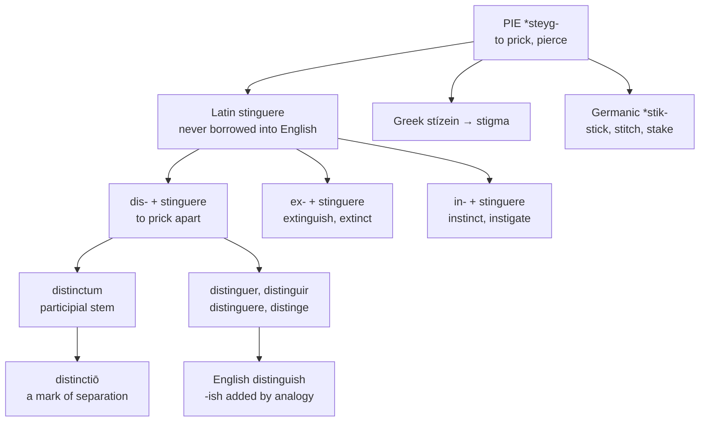

# *Distinguere*: to prick apart

A study of a verb that once meant puncturing a page, of the two other verbs built on the same stem that no one connects to it, and of an English suffix that arrived by mistaken company.

---

## 1. The root

Proto-Indo-European **\*steyg-** "to prick, to pierce, to be sharp" is unusually well represented on both sides of the Latin–Germanic divide.

From it Latin has *stinguere* "to prick," *stimulus* "a goad, a pointed stick," and *īnstīgāre* "to urge on" — the last giving English *instigate*. Greek has *stízein* "to prick, to tattoo," whence *stígma*, a mark made with a point. Germanic has \**stik-*, which gives English *stick*, *stitch*, *stake*, and *stockade*.

So *stigma*, *stimulus*, *instigate*, *stick*, and *stitch* are one family, and the shared idea is a sharp point entering something.

---

## 2. Three verbs, one stem

Latin built three prefixed compounds on *stinguere*, and English holds all three without any sense of their kinship.

| Latin | Literally | English |
|---|---|---|
| *dis-* + *stinguere* | to prick apart | **distinguish**, **distinct** |
| *ex-* + *stinguere* | to prick out | **extinguish**, **extinct** |
| *in-* + *stinguere* | to prick within | **instinct**, **instigate** |

To distinguish two things is to separate them by making marks; to extinguish a fire is to put it out; an instinct is an inward goad. The three senses look unrelated, and the verb they share is invisible in English because *stinguere* itself was never borrowed.

The traditional explanation of the "prick apart" sense is that punctuation was made by pricking holes in parchment, so that to *distinguish* was to mark divisions in a text. Watkins calls the semantic transmission obscure. De Vaan proposes a different second element altogether, from a root meaning "to push, to thrust," which handles all three compounds more evenly: *exstinguere* to push a fire out, *restinguere* to push back, *distinguere* to push apart.

Either way, the three verbs are one verb, and Latin *distinctiō* began as a technical term for a mark of separation in writing — a sense that survives in the musical and typographic vocabulary long after the everyday word turned abstract.

---

## 3. The suffix that was never there

English *distinguish* ends in *-ish*, and it should not.

That ending, in *finish*, *punish*, *abolish*, *nourish*, and *perish*, is the French *-iss-* stem — the extended form that second-group French verbs show through part of their paradigm, continuing the Latin inchoative *-scere*. It is a real morpheme with a real history.

*Distinguere* has nothing to do with it. French *distinguer* is a first-conjugation verb: *je distingue*, *nous distinguons*, with no extended stem anywhere. Nor does any other language in the set show one — Spanish *distingo*, Italian *distinguo*, Portuguese *distingo*, Catalan *distingeixo* aside. There was no *-iss-* to borrow.

English added it anyway, by analogy with the verbs it resembled. The same happened to *extinguish*, *admonish*, and *astonish*, none of which has an inchoative stem behind it either. Four verbs acquired a French suffix on the strength of looking like verbs that had one.

The result is that English *distinguish* is a syllable longer than every one of its cognates, and the extra syllable means nothing.

---

## 4. The comparative set

| | The verb | The adjective | The noun |
|---|---|---|---|
| **Latin** | *distinguere* | *distinctum* | *distinctiō* |
| **French** | *distinguer* | *distinct* | *la distinction* |
| **Spanish** | *distinguir* | *distinto* | *la distinción* |
| **Portuguese** | *distinguir* | *distinto* | *a distinção* |
| **Italian** | *distinguere* | *distinto* | *la distinzione* |
| **Catalan** | *distingir* | *distint* | *la distinció* |
| **Romanian** | *a distinge* | *distinct* | *distincția* |
| **English** | *to distinguish* | *distinct* | *the distinction* |
| **Inglisce** | *to distingoișe* | *distínct* | *þa distínccion* |

**The verb was reassigned twice, in opposite directions.** Latin *distinguere* ends in *-ere*. Italian keeps that ending unchanged, and Romanian *a distinge* is its regular outcome. Everyone else moved the verb: French to *-er*, and Spanish, Portuguese, and Catalan to *-ir*. The two migrations went opposite ways — French toward the class of *aimer* and *parler*, Iberia toward the class of *vivir* and *partir* — so the verb sits in three different conjugations across the six languages.

**The Latin cluster is reduced from opposite ends.** *Distinctum* and *distinctiōnem* both have *ct*. French, Romanian, and English keep it in both words. The others simplify it — but not in the same direction:
 
| | Adjective | Noun |
|---|---|---|
| Latin | *distin**ct**um* | *distin**ct**iōnem* |
| Spanish | *distin**t**o* | *distin**c**ión* |
| Portuguese | *distin**t**o* | *distin**ç**ão* |
| Catalan | *distin**t*** | *distin**c**ió* |
| Italian | *distin**t**o* | *distin**z**ione* |
 
In the adjective the *c* drops and the *t* survives; in the noun the *t* drops and the *c* survives in some form. The same two consonants, and each word kept the one the other lost.

---

## 5. The Inglisce forms

**`Distingoișe` writes the glide English actually says.** In every Romance language the `u` of *distinguir* and *distinguer* is silent: it exists to keep the `g` hard before a front vowel, and Spanish must write `ü` to get the /w/ back, as in *lingüística* and *pingüino*. English says /ɡw/ — *distinguish* is /dɪˈstɪŋɡwɪʃ/ — so the same three letters carry opposite instructions on either side of the Channel. Writing `go` states the labial instead of borrowing a convention that means the reverse of what is meant.

The `ș` is retained. The suffix is historically unwarranted, as set out above, but it is thoroughly established in speech and cannot be dropped without inventing a pronunciation; what the spelling can do is put it in the same class as the other `-ișe` verbs, where the ending is at least consistently written.

**`Distínct` and `distínccion` mark the stress with an acute**, the `i` being stressed and /i/ in both.

The doubled `c` of `distínccion` writes /kʃ/. A single `c` before `-ion` gives /ʃ/, and the doubling holds the velar that the single letter would lose — so the spelling records the Latin `ct` cluster of *distinctum* while stating the sound. English writes `ct` and relies on the reader to know that `cti` yields /kʃ/; the doubled letter says it directly, and keeps `distínct` and `distínccion` visibly the same word.

The article is feminine, `þa`, the stress falling away from the first syllable.
