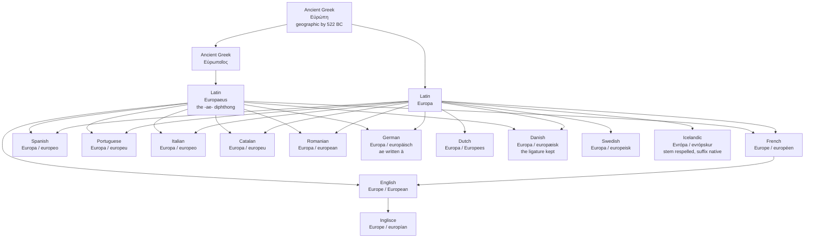

# *Eurōpē*: the sunset, the girl, or neither

A study of a continent's name that nobody has ever explained, spelled almost identically across a dozen languages and pronounced the same way in none of them.

---

## 1. Three etymologies and no answer

Greek **Εὐρώπη** is of uncertain origin. That is etymonline's verdict, and it has been the verdict since antiquity — Herodotus, writing in the fifth century BC, already complained that nobody could say where the name came from or who had given it. Three explanations circulate and none has won.

**Broad face.** The commonest account parses it as *eurys* "wide" plus *ops* "face," literally "eye." A wide-faced or far-gazing land. The compound is well-formed Greek and the elements are ordinary.

**The princess.** Εὐρώπη is also the name of a Phoenician princess in Greek myth, carried off to Crete by Zeus in the shape of a bull. Whether the continent is named after her or she after it is exactly the question, and the tradition linking the two is old enough that it cannot settle its own direction.

**The sunset.** Klein, citing Heinrich Lewy, proposes a Semitic origin in Akkadian *erebu* "to go down, set," of the sun — which would make Europe a translation of the same idea as **occident**, the place where the light falls. A related suggestion points to Phoenician *'ereb* "evening," hence "west."

The third is the most attractive and the least secure, because it comes with a companion claim — that *Asia* is from a Semitic root for rising, so the two continents are simply sunset and sunrise seen from a point on the Levantine coast. That story is repeated everywhere and rests on two different proposed source languages for one name, Akkadian and Phoenician, which is a warning sign rather than a corroboration. A derivation that cannot say which language it comes from has not yet been made.

The earliest geographic use is datable, at least. The name appears as a place in the Homeric Hymn to Apollo, 522 BC or earlier, where Apollo speaks of those who live in rich Peloponnesus and those of Europe and all the wave-washed isles. At that date Europe is not a continent but a region — roughly mainland Greece north of the Peloponnese, as distinct from the islands.

---

## 2. The noun that barely moved

For a word two and a half thousand years old, the spelling has been extraordinarily stable. Latin took **Europa** from the Greek and passed it on essentially unaltered.

**Europa** is the form in German, Dutch, Danish, Swedish, Norwegian, Spanish, Portuguese, Italian, Catalan, Romanian, Polish and Latin itself. Twelve languages, one spelling.

English and French are the exceptions: both have **Europe**, with the Latin *-a* replaced by a final *-e*. Since French is the neighbour and the earlier of the two to have it, the English form is best read as the French one — which makes *Europe* an island of two languages in a continent of *Europa*.

Icelandic is the other departure, and it goes the other way: **Evrópa**. So do Czech, Serbian, Bosnian and Russian (Европа). That *v* is not an alteration of the word but a transcription of it — see the next section.

---

## 3. Two letters, six sounds

The digraph *eu* is the least stable thing in this word, and it is worth setting the values side by side:

- English /jʊə/ — *YOOR-ip*
- French /ø/ — *euh*
- German /ɔʏ/ — *OY-ropa*
- Dutch /øː/
- Spanish, Portuguese, Italian /eu/ — two syllables, a true diphthong
- Icelandic and Russian /ɛv/, /jɪv/ — a consonant

Six languages, six readings of the same two letters, all of them faithful to their own systems and none of them agreeing. The Greek original was /eu̯/, a diphthong of *e* plus a *u* glide; in later Greek that glide hardened to a consonant, and Modern Greek says Ευρώπη as /evˈropi/.

Icelandic and the Slavic languages record that consonant, and they do it by respelling. Icelandic has no native *eu* digraph, so rather than import two letters it cannot read, it writes what it hears: **Evrópa**, with a *v* and an acute on the *o*. Russian does the same in Cyrillic. These languages are not spelling the word differently so much as declining to spell it in a foreign alphabet's conventions — which is a decision an orthographic reform will recognise.

---

## 4. What each language did with the Latin adjective

The Greek adjective was Εὐρωπαῖος, which Latin took as **Europaeus**. That *-ae-* is the diphthong every daughter language then had to do something with, and the solutions divide cleanly.

**Two languages kept it in writing.** German **europäisch** spells the Latin *ae* as *ä* — which is not an umlaut here at all but the standard German rendering of a Latin *ae*, the same convention that gives *Ägypten* for *Aegyptus* and *Äther* for *aether*. Danish **europæisk** goes further and keeps the ligature itself, *æ*, which is what the Latin diphthong looked like when scribes ran the two letters together. So the German and Danish adjectives carry a visible fossil of a Greek diphthong, in a letter each language otherwise uses for its own purposes.

**The Romance languages flattened it.** Spanish and Italian **europeo**, Portuguese and Catalan **europeu**, Romanian **european**, French **européen**. The *ae* has become a plain *e* and the suffix has been rebuilt on native lines.

**English took the French.** *European* is c. 1600 as an adjective and 1630s as a noun, from French *Européen*, from Latin *Europaeus*, from Greek *Europaios*.

**Icelandic threw the suffix away.** **Evrópskur** takes the native adjectival ending *-skur* — the same element as English *-ish* — and attaches it to the respelled stem. Swedish and Norwegian **europeisk** and Dutch **Europees** do something similar with native suffixes, but Icelandic is the only one that discards both the Latin diphthong and the Latin suffix. Where German preserves a Greek diphthong under a German letter, Icelandic declines to preserve anything and builds the word from its own parts. For a person Icelandic does not even use the adjective: *Evrópubúi*, "Europe-dweller."

And a smaller thing that runs the other way. **Every language in this set writes the adjective lowercase — except English and Dutch.** *Européen*, *europeo*, *europeu*, *european*, *europäisch*, *europæisk*, *europeisk*, *evrópskur*: all lowercase, all derived from a capitalised proper noun. German capitalises every noun and still lowercases this adjective. English writes *European*, and Dutch writes *Europees*, and they are alone in it.

---

## 5. The comparative set

| | Noun | Adjective | What the form records |
|---|---|---|---|
| **Ancient Greek** | *Εὐρώπη* | *Εὐρωπαῖος* | Origin unknown to Herodotus and still unknown. |
| **Latin** | *Europa* | *Europaeus* | The *-ae-* that everything below has to solve. |
| **French** | *l'Europe* | *européen* | Drops the *-a*; flattens *ae* to *e*; lowercase adjective. |
| **Spanish** | *Europa* | *europeo* | *eu* read as a true two-vowel diphthong. |
| **Portuguese** | *Europa* | *europeu* | As Spanish, with the masculine in *-eu*. |
| **Italian** | *Europa* | *europeo* | As Spanish. |
| **Catalan** | *Europa* | *europeu* | As Portuguese. |
| **Romanian** | *Europa* | *european* | The nearest continental form to the English adjective. |
| **German** | *Europa* | *europäisch* | *ä* is the Latin *ae*; lowercase despite German capitalising all nouns. |
| **Dutch** | *Europa* | *Europees* | Native suffix; capitalised, with English and against everyone else. |
| **Danish** | *Europa* | *europæisk* | The *æ* ligature preserved intact. |
| **Swedish** | *Europa* | *europeisk* | Native *-isk*; Norwegian identical. |
| **Icelandic** | *Evrópa* | *evrópskur* | Stem respelled to the sound; Latin suffix discarded for native *-skur*. |
| **English** | *Europe* | *European* | Alone with French on the noun, alone with Dutch on the capital. |
| **Inglisce** | *Europe* | *europían* | Noun with English and French; adjective lowercase, with the continent. |

Read down the table and the noun column is almost a constant and the adjective column is a scatter. That is the shape of a name that arrived everywhere at once, in writing, from a single source — and of a suffix that each language then had to pronounce, and therefore had to decide about.

---

## 6. The Inglisce forms

`Europe` is unchanged. That is worth stating rather than passing over: it is one of the few words where the English spelling needs no work, because the word entered in writing and never went through the sound changes that make English orthography a record of things that stopped being true. Keeping it puts Inglisce with English and French against the twelve languages that write *Europa* — a small island, but the right one, since the English form is the French one and that is where English got it.

`Europían` does three things.

**It is lowercase.** English capitalises the adjective; French, Spanish, Portuguese, Italian, Catalan, Romanian, German, Danish, Swedish and Icelandic do not. German lowercases it while capitalising every common noun in the language, which shows the convention is about the adjective and not about proper nouns generally. On this point the reform is not innovating at all — it is joining the majority and leaving English and Dutch alone in the corner.

**The `í` marks the stressed vowel.** Where the acute or circumflex appears elsewhere in this orthography it does this same work, and here it falls on the syllable that carries the stress in English too — /jʊərəˈpiːən/, with the weight on *-pe-*.

**The `-ían` is the Romance solution, not the Germanic one.** Latin *Europaeus* forced a choice on every language, and the answers split: keep the diphthong in writing (German *ä*, Danish *æ*), flatten it to a plain vowel (Spanish *-eo*, French *-éen*), or throw the whole suffix out for a native one (Icelandic *-skur*, Swedish *-isk*, Dutch *-ees*). `Europían` takes the second road, and the form it lands closest to is Romanian *european* — the same letters, differing only in the diacritic and the case.

That is the one place where the two Inglisce forms pull in different directions, and it seems to be deliberate. The noun sides with English and French; the adjective sides with Romance and against English. Neither choice is the other's consequence, and the file records both.
