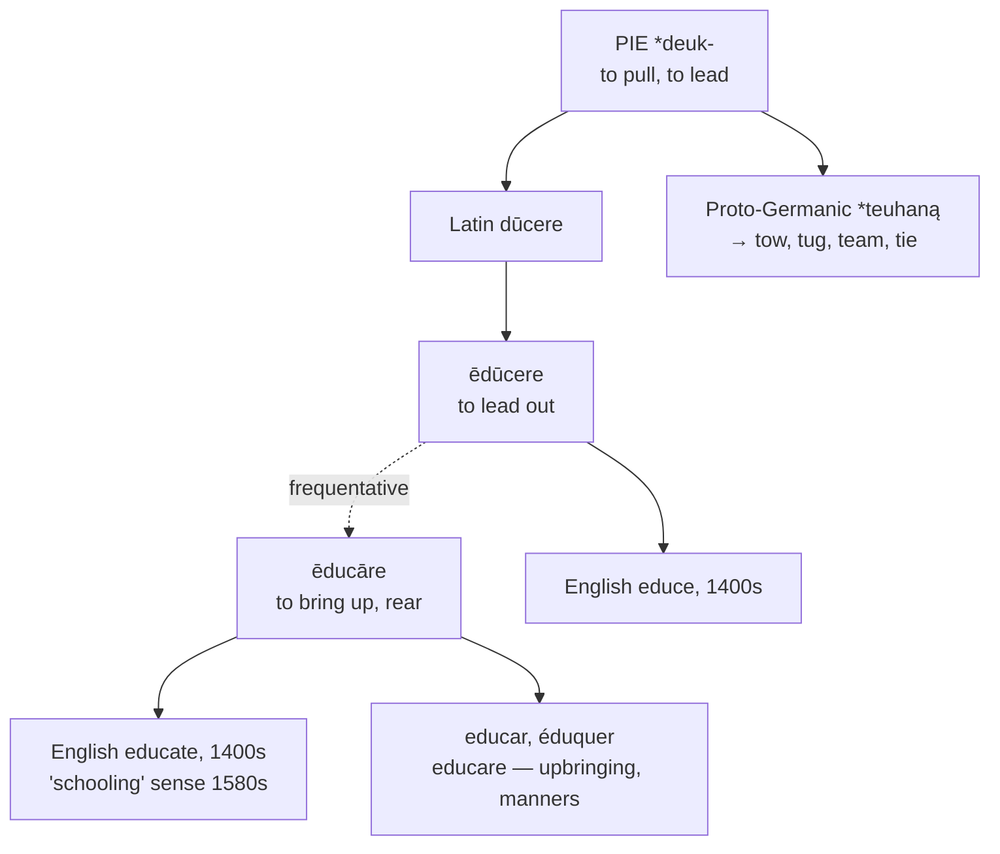

# *Ēducāre*: the leading-out that probably isn't

A study of two Latin verbs one letter apart, of the inspirational etymology built on confusing them, and of a diacritic that completes a set of three.

---

## 1. The root

Latin **dūcere** "to lead" descends from Proto-Indo-European **\*deuk-** "to pull, to lead." It is among the most productive verbs Latin gave to English:

| Latin | English |
|---|---|
| *dux, ducem* | **duke**, **doge**, **ducal** |
| *ductus* | **duct**, **ductile**, **aqueduct**, **viaduct** |
| *condūcere* | **conduct**, **conduit** |
| *dēdūcere* | **deduce**, **deduct** |
| *prōdūcere* | **produce**, **product** |
| *redūcere* | **reduce** |
| *indūcere* | **induce** |
| *sēdūcere* | **seduce** |
| *abdūcere* | **abduct** |
| *ēdūcere* | **educe** |

The same root came into English by the native route as well. Proto-Germanic \**teuhaną* gives **tow**, **tug**, **team**, and **tie** — so a *duke* and a *tugboat* are named by the same act.

---

## 2. Two verbs, one letter apart

Latin had both **ēdūcere** and **ēducāre**, and they are not the same word.

**Ēdūcere** is *ex-* plus *dūcere*: to lead out, to draw forth. It is used of leading troops out of camp, drawing a sword, and — of a child — bringing it into the world or rearing it in the bodily sense.

**Ēducāre** means to bring up, to rear, to train. It is a frequentative or causative built on the other verb in the unrecorded past, but by the classical period the two stand distinct, and it is *ēducāre* that means what *educate* means.

English took both: **educate** from *ēducātus* in the mid-fifteenth century, and **educe** from *ēdūcere* at about the same date. They are a doublet.

### The etymology that isn't

The familiar claim is that *education* means "to lead out" — that teaching is the drawing forth of what already lies within the student, and that the word itself testifies to a Socratic view of learning.

The *Century Dictionary* is blunt about it: *"There is no authority for the common statement that the primary sense of education is to 'draw out or unfold the powers of the mind.'"* It adds that where *ēdūcere* is used of a child it usually refers to bodily nurture, while *ēducāre* is the verb used of the mind.

The inspirational reading depends on assigning to *ēducāre* a sense that belongs to a different verb. It is a nineteenth- and twentieth-century construction, repeated on the first page of a great many education textbooks, and the Romans would not have recognised it.

---

## 3. What *educated* means elsewhere

The Latin sense of rearing rather than schooling survived in Romance, and it produces a persistent false friend.

Spanish *educado*, Portuguese *educado*, and Italian *educato* mean **polite, well-mannered** — the product of good upbringing, not of instruction. *Es muy educado* is "he has good manners," and says nothing about schooling. Italian *educazione* likewise means manners and upbringing; the word for schooling is *istruzione*.

English narrowed the word in the other direction. The sense "to provide schooling" is attested only from the 1580s, and once it took hold the older sense of rearing dropped away entirely, so that an *educated* person in English is one who has been taught and not one who has been brought up well.

---

## 4. The comparative set

| | The verb | The noun | The adjective | The agent |
|---|---|---|---|---|
| **Latin** | *ēducāre* | *ēducātiō* | *ēducātīvus* | *ēducātor* |
| **French** | *éduquer* | *l'éducation* | *éducatif* | *l'éducateur* |
| **Spanish** | *educar* | *la educación* | *educativo* | *el educador* |
| **Portuguese** | *educar* | *a educação* | *educativo* | *o educador* |
| **Italian** | *educare* | *l'educazione* | *educativo* | *l'educatore* |
| **English** | *to educate* | *the education* | *educative* | *the educator* |
| **Inglisce** | *to ed̦ucait* | *þi ed̦ucâcion* | *ed̦ucaitif* | *þi ed̦ucaitor* |

| | Teachable | Teachableness | Of education |
|---|---|---|---|
| **French** | *éducable* | *l'éducabilité* | — |
| **Spanish** | *educable* | *la educabilidad* | — |
| **Portuguese** | *educável* | *a educabilidade* | *educacional* |
| **Italian** | *educabile* | *l'educabilità* | — |
| **English** | *educable* | *educability* | *educational* |
| **Inglisce** | *ed̦ucable* | *þi ed̦ucabilatie* | *ed̦ucâcional* |

**Only English and Portuguese have the last column.** French, Spanish, and Italian make do with *éducatif*, *educativo*, and *educativo* for both "having the effect of educating" and "pertaining to education." English distinguishes *educative* from *educational* and uses the second far more often; Portuguese followed, most likely under English influence.

**The stem does not alternate anywhere.** Every language in the table builds all five words on *educ-*, which is unusual in this series — most Latin families reach English split between a present stem and a participial one. Here the participle won everywhere at once.

---

## 5. The Inglisce forms

### The comma below

**`D̦` writes /dʒ/**, and it completes a set.

English *education* is /ˌɛdʒəˈkeɪʃən/. The `d` is not /d/; it has coalesced with a following yod, the same process that turns /t/ into /tʃ/ and /s/ into /ʃ/. The three outcomes are one sound change operating on three consonants, and the system marks them with one diacritic:

| Letter | Marked | Value | English example |
|---|---|---|---|
| s | `ș` | /ʃ/ | *sure*, *pressure* |
| t | `ț` | /tʃ/ | *nature*, *furniture* |
| d | `d̦` | /dʒ/ | *educate*, *graduate*, *soldier* |

English writes plain `d` in all of them and marks nothing, so *educate* and *dedicate* begin alike on the page and differ in the mouth. The mark records the letter the word descends from — Latin *ēducāre* has a `d` — and states what became of it.

### The rest

**`-ait` for the verb, `-at` for what is not.** `Ed̦ucait` is the verb; where English writes *educate* for the verb and *educated* for the participle used adjectivally, the `ait` keeps the verb's vowel visible. `Ed̦ucaitif` and `ed̦ucaitor` are built on it, so the verb stem runs unbroken through the adjective and the agent noun.

**`-able` and not `-ible`.** The two are both /əbəl/ and differ only in which Latin conjugation the verb belonged to; `ed̦ucable` and `ed̦ucabilatie` take the single form.

**`-âcion` for /eɪʃən/.** The circumflex gives the vowel, no final `-e` being available, and `-cion` gives /ʃən/.

**The article is `þi` throughout**, every noun in the family beginning with a vowel.
