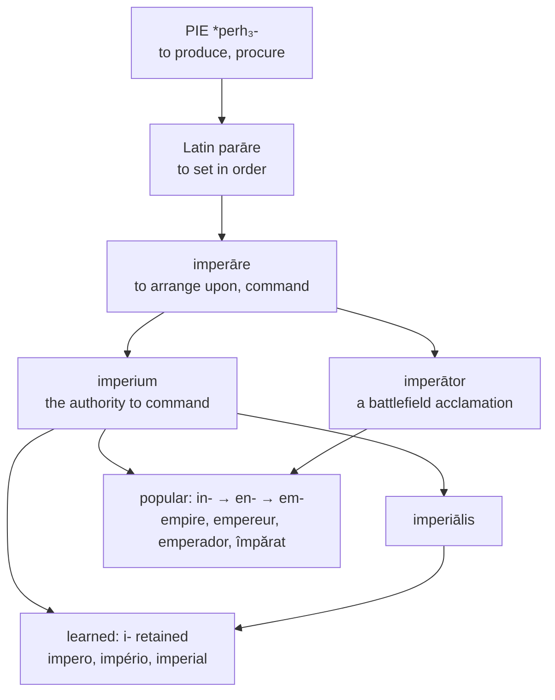

# *Imperium*: the world put in order

A study of a word that began as *arranging things*, became a shout raised on a battlefield, and now carries in its first vowel a record of which century each of its descendants was borrowed in.

---

## 1. The root

Latin *imperāre* "to command" is *in-* "in, upon" plus *parāre* "to make ready, to set in order, to procure," from Proto-Indo-European **\*perh₃-** "to produce, to procure."

The literal sense is therefore *to arrange upon*, and *imperium* is the state of things having been arranged — order imposed and maintained. It is a word about preparation before it is a word about domination, and the Roman usage kept that flavour: *imperium* was the specific legal authority to command, held by consuls, praetors, and dictators, symbolised by the *fasces* and delimited by law.

*Parāre* is one of the great productive verbs of Latin, and English holds a great deal of it:

| Latin | English |
|---|---|
| *praeparāre* | **prepare** |
| *reparāre* | **repair**, **reparation** |
| *apparātus* | **apparatus**, **apparel** |
| *sēparāre* | **separate**, **sever**, **several** |
| *parāre* directly | **parade**, **parry**, **parasol**, **parachute** |
| *imperāre* | **empire**, **emperor**, **imperative**, **imperious** |

An *emperor* and an *apparatus* are the same word twice: something got ready.

---

## 2. The shout

*Imperātor* was not originally a rank. It was an acclamation — the cry raised by Roman legionaries saluting their commander after a decisive victory, and a temporary honour carrying no political authority whatever. A general might be hailed *imperator* in the field and return to Rome an ordinary senator.

Julius Caesar took the acclamation as a permanent personal title. Augustus, in 27 BC, folded it into the formal apparatus of one-man rule, and every subsequent holder of that rule inherited it — except, as it happens, Tiberius and Claudius, who declined it.

So the supreme political title of the Western world for two thousand years began as something soldiers yelled.

The word reached English through Old French, which still had a two-case system: nominative *empereres* against oblique *empereor*. English took the oblique, as it did with nearly all its French borrowings, and *emperor* is that form.

---

## 3. One letter, two centuries

Now the alternation. Every language in the set writes some of these words with **i-** and some with **e-**, and the distribution is not random.

Latin *in-* regularly lowered to *en-* in the popular development into Gallo-Romance, and assimilated to *em-* before a labial — the same change that turns *īnfāns* into *enfant*. Words that passed through ordinary speech therefore show **e**; words re-borrowed later from written Latin kept the original **i**.

The first vowel is thus a date stamp.

| | Popular (inherited) | Learned (re-borrowed) |
|---|---|---|
| **French** | *empire*, *empereur* | *impérial* |
| **Spanish** | *emperador* | *imperio*, *imperial* |
| **Catalan** | *emperador* | *imperi*, *imperial* |
| **Romanian** | *împărat* | *imperiu*, *imperial* |
| **English** | *empire*, *emperor* | *imperial* |
| **Italian** | — | *impero*, *imperatore*, *imperiale* |
| **Portuguese** | — | *império*, *imperador*, *imperial* |

Italian and Portuguese have no popular forms at all in this family: every word is a learned borrowing, and every word begins with *i*.

**Romanian shows the extreme case.** *Împărat* is the fully inherited descendant of *imperātor*, worn down by every sound change Romanian underwent — the initial vowel centralised to *î*, the medial consonants softened, the ending reduced. It is scarcely recognisable as the same word, and in folk usage it serves for "king" as readily as "emperor." Beside it sit *imperiu* and *imperial*, borrowed from French in the nineteenth century and looking exactly like their sources. A thousand years of continuous speech and a hundred and fifty years of bookish borrowing, in one column.

---

## 4. The comparative set

| | The realm | The ruler | The adjective |
|---|---|---|---|
| **Latin** | *imperium* | *imperātor* | *imperiālis* |
| **Italian** | *l'impero* | *l'imperatore* | *imperiale* |
| **Portuguese** | *o império* | *o imperador* | *imperial* |
| **Spanish** | *el imperio* | *el emperador* | *imperial* |
| **Catalan** | *l'imperi* | *l'emperador* | *imperial* |
| **Romanian** | *imperiul* | *împăratul* | *imperial* |
| **French** | *l'empire* | *l'empereur* | *impérial* |
| **English** | *the empire* | *the emperor* | *imperial* |
| **Inglisce** | *þi empîre* | *þi emperor* | *empírial* |

Read down the first two columns and the split is visible at a glance: Italian and Portuguese are wholly learned, Spanish and Catalan are learned in the realm and popular in the ruler, French and English are popular in both, Romanian is popular only in the ruler.

No language in the table has all three words sharing a first vowel except Italian and Portuguese, and they achieve it by having no inherited forms at all.

---

## 5. The Inglisce forms

**`Empírial` unifies the stem.** English writes *empire* and *emperor* with `e` and *imperial* with `i`, so a family of three words is spelled two ways and the reader is given no account of why. The reason is real — the first two came through speech and the third out of a book — but it is a fact about the fourteenth century, not about the word, and no English speaker can be expected to know it.

Inglisce writes `em-` throughout. The choice takes the popular form as the base and applies it to the learned one, which is the reverse of what Italian and Portuguese did in unifying on `i`. It follows from the system's usual preference: `em-` is what English says in two of the three words, and consistency with speech outranks fidelity to a borrowing date.

What is given up should be stated. `Empírial` no longer matches *imperial*, *impérial*, or *imperiale* on the page, and the Latin *in-* is no longer visible in the word. What is gained is that `empîre`, `emperor`, and `empírial` are recognisably one family, which in English they are not.

**`Empîre`** takes the circumflex for /aɪ/, and the plural `empîars` writes the schwa of /ˈɛmpaɪərz/, which English leaves unrecorded in *empires*.

The plural also lands somewhere pleasant. Latin *imperium* is a second-declension neuter, and its plural is *imperia* — the ending `-a`, which is the same letter the Inglisce plural inserts before its `-s`. `Empîars` is not a continuation of *imperia*; the `a` is there to carry a vowel English pronounces and does not write. But the two coincide exactly, and a form arrived at on phonetic grounds turns out to hold the Latin plural vowel that every Romance language in the table discarded when it moved the word to the *-e* and *-o* classes.

**`Empírial`** takes the acute, marking the stressed `i` /i/ where no silent `e` is available to suggest it.

Both nouns are masculine. They take `þi` rather than `þe` because they begin with a vowel — the alternation English makes in speech, saying /ðə/ before a consonant and /ði/ before a vowel, and conceals by writing *the* for both.
