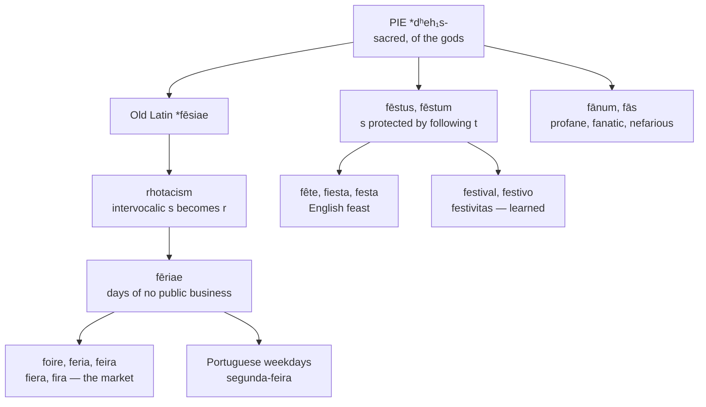

# *Fēriae* and *fēstus*: one word, split by a rolling consonant

A study of two Latin words that are the same word, separated by a sound change of the fourth century BC, and of the doublets they left in every Romance language and in English.

---

## 1. The root

Proto-Indo-European **\*dʰeh₁s-** "sacred, of the gods" is generally taken as an s-extension of **\*dʰeh₁-** "to set, to put" — the root that also gives Latin *facere*, and so English *fact*, *fashion*, and *do*. What is set down is what is established; what is established by the gods is holy.

Latin holds four reflexes:

| Latin | Sense | English descendants |
|---|---|---|
| *fēriae* | days on which no public business was transacted | *fair*, *ferial* |
| *fēstus* | festal, of a holiday | *feast*, *festival*, *festive*, *fête* |
| *fānum* | a sanctuary, from \**fasnom* | *profane*, *fanatic*, *fane* |
| *fās* | divine law, as against *iūs*, human law | *nefarious* |

*Profane* is *prō fānō*, in front of the temple and therefore outside it; *fanatic* is *fānāticus*, one inspired by a temple; *nefarious* is *nefārius*, contrary to divine law. Greek supplies a cognate in *theós* by some accounts, though the derivation is disputed.

---

## 2. The rolling consonant

*Fēriae* and *fēstus* are the same stem. Old Latin had *fēsiae*, and the *r* of the classical form is **rhotacism**: an intervocalic *s* became *r* in Latin at some point before the classical period.

*Fēstus* escaped because its *s* is followed immediately by *t*. The consonant was never between vowels, so the change never touched it.

The same seam runs through the language wherever a stem appears in both environments — *flōs* : *flōris*, *honōs* : *honōris*, *haereō* : *haesum*, *quaerō* : *quaesītum*. Latin is full of pairs that look unrelated and are not.

The consequence here is a doublet in every language that inherited both forms. English holds *fair* and *feast*, and no English speaker connects them.

---

## 3. The holiday becomes a market

*Fēriae* meant days of rest from public business. Its route to "trade fair" runs through the Church: markets were held on saints' days, when people were free from work and gathered in one place, so the commerce took its name from the holiday it was held on.

The semantic shift is complete in every language. French *foire*, Spanish *feria*, Portuguese *feira*, Italian *fiera*, and Catalan *fira* all mean a fair or market, and the ecclesiastical sense survives only in the technical adjective *ferial*, used of an ordinary weekday in the liturgical calendar.

**Portuguese kept the original.** Alone among the Romance languages, Portuguese names its weekdays from *fēria*: *segunda-feira*, *terça-feira*, *quarta-feira*, *quinta-feira*, *sexta-feira*. Monday is literally "second holy-day." The system is attributed to a sixth-century ecclesiastical reform intended to replace the pagan planetary names — *dies Lūnae*, *dies Martis* — which every other Romance language retained. Portuguese is the only one where the reform stuck, and it stuck so thoroughly that a Portuguese speaker naming a day of the week is using the same word a Spanish speaker uses for a livestock market.

---

## 4. The comparative sets

### The *fēria* set

| | The fair |
|---|---|
| **Latin** | *fēria* |
| **French** | *la foire* |
| **Spanish** | *la feria* |
| **Portuguese** | *a feira* |
| **Italian** | *la fiera* |
| **Catalan** | *la fira* |
| **English** | *the fair* |
| **Inglisce** | *þe feire*, *feirs* |

### The *fēstus* set

| | The feast | The festival | The adjective | The quality |
|---|---|---|---|---|
| **Latin** | *fēstum* | — | *fēstīvus* | *fēstīvitās* |
| **French** | *la fête* | *le festival* | *de fête* | *la festivité* |
| **Spanish** | *la fiesta* | *el festival* | *festivo* | *la festividad* |
| **Portuguese** | *a festa* | *o festival* | *festivo* | *a festividade* |
| **Italian** | *la festa* | *il festival* | *festivo* | *la festività* |
| **Catalan** | *la festa* | *el festival* | *festiva* | *la festivitat* |
| **Romanian** | — | *festivalul* | *festiv* | *festivitatea* |
| **English** | *the feast* | *the festival* | *festive* | *the festivity* |
| **Inglisce** | *þe fieste*, *fiests* | *þe festival* | *festif* | *þa festivitie* |

Three observations.

**French lost the *s*.** *Fête* is *feste* with the consonant vocalised and marked by a circumflex, the same development that gives *forêt* from *forest*, *hôpital* from *hospital*, and *île* from *isle*. The circumflex in French is a tombstone for a lost *s*, and it stands in exactly the place where the *s* of *fēstus* once blocked rhotacism.

**The *-īvus* words are all learned.** *Fēstīvus* and *fēstīvitās* did not descend into speech; the modern *festivo*, *festif*, *festiv* are re-borrowings from written Latin. This is why they show *e* throughout, where the inherited nouns diphthongised — Spanish *fiesta* against *festivo*, Italian *festa* against *festivo*.

**English *feast* is not learned.** It came through Old French *feste* before the *s* dropped, which is why English preserves a consonant that modern French does not. Where French must write a circumflex to record the loss, English simply still has the letter.

---

## 5. The Inglisce forms

**The market recovers its own spelling.** *Feire* is not a new form. It is the spelling the word had for the whole of its documented life before modern English: Old French *feire*, Anglo-French *feyre*, and Middle English *feire*, which is the headword the Middle English Dictionary files it under. Modern *fair* is the innovation, and a late one. Restoring *feire* puts the word back beside *foire*, *feria*, *feira*, *fiera* and *fira*, where the *-ai-* of *fair* had cut it off from all five.

**It also separates a homograph.** Modern English *fair* is two words. One is the market, from *fēriae* through French. The other is the adjective meaning beautiful, then light-complexioned, then just, which is Old English *fæger* and shares nothing with it at any point. Middle English still kept them apart most of the time, writing *feire* for the market against *fair* and *fayr* for the adjective, though the two were already bleeding into one another. Modern English finished the collision. *Feire* undoes it, and does so without inventing anything: it takes the older of the two spellings for the older of the two senses.

**The feast keeps the consonant and changes the vowel.** *Fieste* holds the *s* that French vocalised away, so it stands with English against *fête* — but it writes *ie* where English writes *ea*, which puts the vowel with Spanish *fiesta* and the diphthongising branch rather than with the French. The form therefore records both halves of the word's history at once: the consonant it kept from Old French *feste*, and the vowel that marks it as the inherited member of the pair rather than the learned one.

**The learned words stay visibly learned.** *Festival* is untouched, and *festivitie* and *festif* keep the *festiv-* stem intact, exactly as Spanish *festivo*, Portuguese *festivo*, Italian *festivo* and Romanian *festiv* do. *Festif* follows French in dropping the silent *-e* that English carries in *festive*. None of the three shows a diphthong, and that is the point: the *e* of *festiv-* is the mark of a word taken from the page, and it is what tells *fieste* and *festif* apart on sight.

**The plurals drop the final *e*.** *Feire* gives *feirs* and *fieste* gives *fiests*, the same rule that gives *dignetis* from *dignetie*. In English the *t* and *s* of *feasts* meet across a silent letter that does nothing; in Inglisce the letter simply goes.

---

## 6. What the pair recovers

*Fair* and *feast* are the same word. So are *fiera* and *festa*, *foire* and *fête*, *feria* and *fiesta*. In no language of the set does a speaker perceive the relation, because in every one of them the two forms differ by a consonant that changed two thousand three hundred years ago in one environment and not the other.

Inglisce does not repair this, and could not: `feire` and `fieste` are as far apart as *fair* and *feast*. What it does instead is make each of them accurate to its own line of descent — `feire` to the rhotacised branch and the Portuguese market, `fieste` to the diphthongising branch and the Spanish holiday — and keep the learned `festiv-` visibly distinct from both.

The gain is not that the doublet becomes visible. It is that neither member is any longer spelled in a way that misrepresents which branch it came down.
