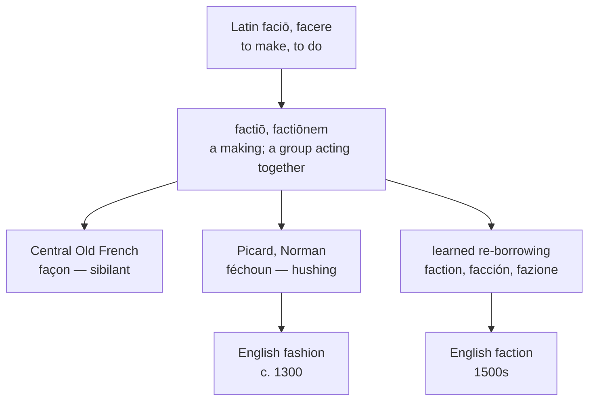

# *Factiōnem*: the same word twice, one of them dressed

A study of a Latin noun of making that reached English by two roads three centuries apart, and of a single spelling anomaly that has kept the two from being recognised as one word ever since.

---

## 1. The root

Latin *faciō, facere* "to make, to do" rests on Proto-Indo-European **\*dʰeh₁-** "to set, to put." The root is enormously productive, and English holds a great deal of it: *fact*, *feat*, *feature*, *factory*, *facile*, *faculty*, *affair*, *benefit*, *confection*, *defeat*, *edifice*, *manufacture*, *profit*, *sacrifice*, and the whole *-fy* class of *magnify*, *satisfy*, *terrify*. The same root gives Greek *tithēmi* "I place" and, through Germanic, English *do* and *deed*.

From *facere* Latin formed the verbal noun *factiō, -ōnis* on the participial stem *fact-*. Its primary sense is the act of making or doing — the making of a thing. From that it developed a second sense, a group of people acting together, which is the sense of the chariot-racing companies at Rome and of the political blocs in the late Republic.

Both senses reached English. They arrived in different centuries by different routes and are now two words.

---

## 2. The Picard hush

The word English took is not from central Old French but from the north.

Latin *factiōnem* has the cluster [ktj], and its treatment differed across the dialects of Old French. Central French produced *façon*, with a sibilant. The Picard and Norman dialects produced a hushing consonant instead — Old Northern French *féchoun*, Anglo-Norman *fechoun*, Jèrriais *faichon*.

England borrowed from Norman and Picard rather than from Paris, so the English word carries the northern outcome. This is the same dialectal accident that gives English *catch* against French *chasser*, *cattle* against *cheptel*, and *warden* against *guardien*. What looks like an English peculiarity is a Picard one, imported intact.

Middle English then spelled it every way it could: *fasoun*, *fasioun*, *fascioun*, and *facioun*, alongside the Anglo-French *façun* and *fauschoun*. The modern *fashion* is one settlement among several, and not the one closest to the word's own history.

---

## 3. The doublet

English also holds *faction*, borrowed in the 1500s directly from Latin *factiōnem* — the same accusative, the same word, two hundred years later and by a different road. French has the identical pair: inherited *façon* beside learned *faction*.

The two English words have divided the two Latin senses cleanly between them:

| | Sense taken | Route | Century |
|---|---|---|---|
| **fashion** | the act or manner of making | Picard → Anglo-Norman | c. 1300 |
| **faction** | a group acting together | direct from Latin | 1500s |

This is as clean a doublet as English possesses. One Latin noun, two senses, two borrowings, and each borrowing took one sense and left the other. Nothing was lost and nothing overlaps.

And yet no English speaker perceives them as related. *Fashion* and *faction* differ by a single letter and by nothing else; they are pronounced /ˈfæʃən/ and /ˈfækʃən/ and mean things a Roman would have called by one name. The reason the connection is invisible is not the vowel, which is identical, nor the ending, which is the same suffix. It is the `sh`.

---

## 4. The anomaly

English spells the Latin *-ctiōn-* ending with `ct` throughout: *action*, *faction*, *fraction*, *section*, *diction*, *friction*, *traction*, *reaction*, *affection*, *collection*, *direction*, *inspection*. The class runs to hundreds of words and it does not vary.

*Fashion* is the sole member spelled otherwise, and the reason is dialectal rather than phonological — it descends from the Picard form, where the cluster hushed, while every other word in the class was borrowed later and directly from written Latin.

The consequence is that English has taken a regular dialectal outcome and recorded it with a grapheme belonging to an entirely different stratum. `Sh` is the native English digraph, the one in *ship*, *fish*, *shall*, *wash* — words descending from Old English *sc*. Using it for *fashion* files a Latin word with a Latinate suffix into the Germanic spelling class, and it is the only Latinate word in the language for which this is done.

---

## 5. The comparative set

| | Inherited | Learned | The clothing sense |
|---|---|---|---|
| **Latin** | *factiōnem* | *factiōnem* | — |
| **French** | *la façon* | *la faction* | *la mode* |
| **Spanish** | — | *la facción* | *la moda* |
| **Portuguese** | *a feição* | *a facção* | *a moda* |
| **Italian** | *la fazione* | *la fazione* | *la moda* |
| **Catalan** | *la faiçó* | *la facció* | *la moda* |
| **English** | *fashion* | *faction* | *fashion* |
| **Inglisce** | *þe facion* | *þe faccion* | *þe facion* |

Two things are visible here.

The inherited column is thin. French *façon* survives in full vigour, meaning manner or way — *de cette façon*, *à ma façon*, *sans façon* — and Portuguese *feição* and Catalan *faiçó* survive as "feature, shape, appearance." Spanish let the inherited form go entirely. Italian never distinguished the two, *fazione* serving for both.

And no Romance language uses this word for clothing. That sense is English alone, and it is late — *fashion* meant shape and manner for two centuries before it meant style of dress in the 1520s, and prevailing custom only from the 1490s. French, Spanish, Portuguese, Italian, and Catalan all use a reflex of Latin *modus* instead, and English has borrowed that too, as *mode* and *model*. So the English word occupying the clothing slot is the one language's inherited *factiōnem*, and every one of its neighbours fills that slot with a different Latin word altogether.

---

## 6. The Inglisce form

`Facion` is an attested Middle English spelling, not a coinage. *Facioun* stands in the record beside *fasioun* and *fascioun*, and it is the form that shows the word's descent most plainly.

The `-cion` writes /ʃən/, and here the spelling is etymologically exact rather than merely convenient. The /ʃ/ of *fashion* comes from the Latin cluster of *-ctiōnem* by the regular Picard development — it is genuinely the *-tiōn-* suffix, palatalised, and not a sibilant from some other source. `Facion` therefore joins the class it belongs to, alongside every other Inglisce word ending in `-cion`, and does so on historical grounds and not by analogy.

Restoring the word to its class has a further effect. In English, *fashion* and *faction* look like near-homographs that happen to differ in one consonant, and the shared suffix is obscured by the `sh`. Written `facion`, the word is transparently `fac-` plus `-ion`, which is what it is, and its relation to the rest of the *facere* vocabulary — `facte`, `factorie`, `manufacțure` — becomes readable off the page.

---

## 7. The doublet resolved

`Faccion` renders *faction*, and the pair `facion` : `faccion` does something neither English nor any Romance language manages.

The two words differ in English by a consonant cluster — /ˈfæʃən/ against /ˈfækʃən/ — and English marks that with `sh` against `ct`, two spellings that share no letter and suggest no relation. Inglisce marks it by doubling: one `c` for the Picard hush, two for the cluster the learned borrowing preserved. The words remain visibly the same word, differing by exactly the amount they historically differ.

The doubling also has the system's own precedent behind it. A single intervocalic consonant and a doubled one are already distinguished elsewhere in the lexicon, the doubling blocking a lenition that the single letter permits; here it blocks the palatalisation. `Facion` shows the cluster reduced and hushed, `faccion` shows it intact, and the difference between them on the page is the difference between them in Latin.

Both are masculine, `þe`, the stress falling on the first syllable in each.

What English cannot do, and this can, is show *fashion* and *faction* as one word. They are one word — the same accusative *factiōnem*, borrowed at a distance of two centuries — and the received orthography conceals it so thoroughly that the relation has to be taught. `Facion` and `faccion` state it.
