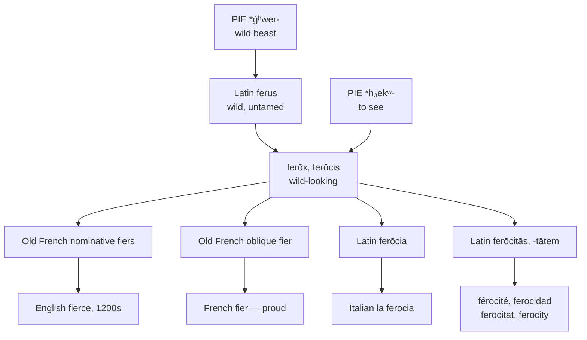

# *Ferōx*: wild-looking, and the word that arrived upright

A study of an adjective built on a word for *eye*, and of the one English borrowing from French that came over in the nominative case when almost every other came over lying down.

---

## 1. The root

Proto-Indo-European **\*ǵʰwer-** "wild beast" gives Latin *ferus* "wild, untamed, uncultivated," Greek *thēr* "wild animal," Old Church Slavonic *zvěrĭ*, and Lithuanian *žvėris*.

From *ferus* Latin built *ferīnus* and *ferālis*, whence English *ferine* and *feral*. The Greek side gives *theropod* and *therapsid*, and — by a longer road through *thēriakē*, an antidote against the bite of wild beasts — English *treacle*, which was a medicinal compound centuries before it was syrup.

One further descendant is disputed but attractive: *zebra* may go back to Latin *equiferus*, "wild horse," by way of Portuguese and an extinct wild ass.

---

## 2. An adjective built on an eye

*Ferōx, ferōcis* is not simply *ferus* with an ending. It is *ferus* plus the suffix **-ox, -ocis**, meaning "looking, appearing" — a suffix cognate with Greek *ṓps* "eye, sight" and descending from Proto-Indo-European \**h₃ekʷ-* "to see."

That root is one of the most productive in English: *optic*, *optician*, *autopsy*, *biopsy*, *synopsis*, *myopia*, *monocle*, *binocular*, *inoculate*, *ocular*, *Cyclops*, *triceratops*, and — through Old English *ēage* — *eye*, *window* (*vind-auga*, "wind-eye"), and *daisy* (*dæges ēage*, "day's eye").

*Ferōx* therefore means, quite literally, **wild-looking**: having the appearance of a wild beast. The same suffix builds *atrōx* "dark-looking," which gives *atrocious* and *atrocity*, and *velōx* "swift-looking," which gives *velocity*.

So *ferocity* and *atrocity* are morphologically identical — a quality noun on an adjective of appearance — and *ferocious*, *atrocious*, and *velocity* form a small closed class in English whose shared shape has nothing to do with their meanings and everything to do with a Latin word for the eye.

---

## 3. The nominative accident

Old French, unlike its descendants, retained a two-case system for nouns and adjectives: a nominative for the subject and an oblique for everything else. The adjective from *ferus* had **oblique *fer*, *fier*** and **nominative *fers*, *fiers***.

Almost every French word English borrowed came from the oblique. That is why English has *baron* and not \**bers*, *count* and not \**cuens*, *lion* and not \**lions* in the Old French nominative sense. The oblique was the ordinary form, the one heard in most syntactic positions, and it is the ancestor of the modern French noun as well.

*Fierce* is the exception. English took **the nominative** *fiers*, and the reason is recorded: while the word still meant "proud, noble, bold," it was widely used as an epithet and thence as a surname — and an epithet attaches to a subject, which is the nominative slot. The case ending rode across the Channel because the word's usual job put it there.

Modern French kept the oblique, and *fier* means "proud" to this day. English kept the nominative and, having taken the word for its "proud, bold" sense in the mid-thirteenth century, watched that sense die out in the sixteenth and be replaced entirely by "savage, violent."

Both languages therefore have half the original word. France has the case English discarded and the meaning English abandoned; England has the case France discarded and a meaning France never assigned it.

---

## 4. Three words, three routes

English holds three reflexes of this family, and each entered by a different door.

| Word | Entered | From | Character |
|---|---|---|---|
| **fierce** | mid-1200s | Old French nominative *fiers* | popular, via French |
| **ferocity** | c. 1600 | French *férocité*, from *ferōcitātem* | learned, via French |
| **ferocious** | 1640s | *ferōcis*, oblique stem of *ferōx* | learned, direct from Latin |

*Fierce* and *ferocious* are doublets in the strict sense: one Latin adjective, borrowed four centuries apart, once through French speech and once out of a Latin book. They mean nearly the same thing and share no visible stem.

An alternative *ferocient* was tried in the 1650s and did not take.

---

## 5. The comparative set

| | The adjective | The quality |
|---|---|---|
| **Latin** | *ferus*, *ferōx* | *ferōcia*, *ferōcitās* |
| **French** | *féroce* | *la férocité* |
| **Spanish** | *feroz* | *la ferocidad* |
| **Portuguese** | *feroz* | *a ferocidade* |
| **Italian** | *feroce* | *la ferocia* |
| **Catalan** | *ferotge* | *la ferocitat* |
| **English** | *ferocious*, *fierce* | *the ferocity* |
| **Inglisce** | *feroceus*, *fierce* | *þa feroçatie* |

Two things stand out.

**Latin had two abstract nouns and the languages divided them.** *Ferōcia* and *ferōcitās* were both available; Italian took the first and everyone else the second. Italian *la ferocia* is therefore not a shortened *ferocità* but a different Latin word.

**Catalan alone suffixed the adjective.** Where French, Spanish, Portuguese, and Italian all continue the bare *ferōcem*, Catalan *ferotge* shows an additional formative, and the result no longer looks like its own abstract noun *ferocitat*. Catalan has the split English has, arrived at by suffixation rather than by borrowing twice.

**Only English has two adjectives.** Every Romance language in the set makes do with one word where English has *fierce* beside *ferocious* — the popular form and the learned form, both alive, differing in register and in intensity but not in sense.

---

## 6. The Inglisce forms

**`Fierce` is left alone**, and it should be. The `ie` already spells the vowel correctly, the `ce` already spells /s/ before a front vowel by the ordinary Romance convention, and the word is one of the few in English whose spelling records something true and unusual — the Old French nominative *s*, still standing where the case system put it eight hundred years ago. Nothing needs repair.

**`Feroceus`** writes /ʃəs/ as `ceus`, on the same principle by which /ʃən/ is written `cion`: a *c* before a front vowel, palatalised in the suffix. English *ferocious* uses `ci` for the same sound, which is not wrong so much as inconsistent, since English also writes that sound `ti` in *nation*, `si` in *mission*, `sci` in *conscious*, `ce` in *ocean*, and `xi` in *anxious*. One sound, six spellings, distributed by no rule a reader could state.

**`Feroçatie`** carries the cedilla for a strictly positional reason, and it is the same reason French and Portuguese use it. A *c* before `a`, `o`, or `u` has its hard value; before `e` or `i` it is soft. `Ferocatie` would therefore be read with /k/. The cedilla marks the soft value in a position where the following vowel would otherwise force the hard one — precisely the job it does in *façon*, *garçon*, *criação*, and *almoço*.

Note that the diacritic is doing something quite different from the others in the system. `Ș` and `ț` record a historical change, a consonant that palatalised; `ç` records only a position. It is not saying *this letter became something* but *this letter has not changed despite what follows it*.

The ending `-atie` gives final /i/ and the article is feminine, `þa`, the stress falling away from the first syllable.
