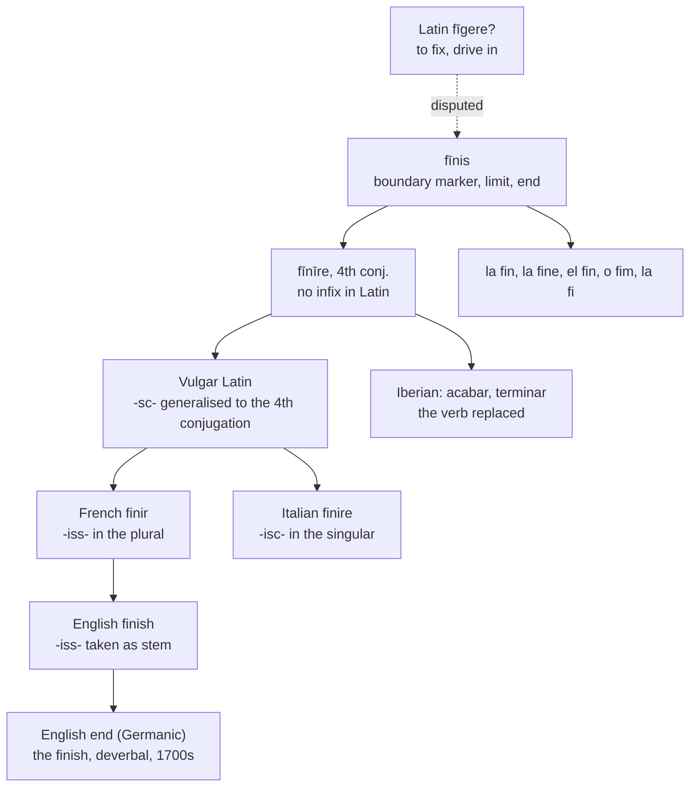

# *Fīnīre*: the ending that begins

A study of a verb of completion that carries, in its final syllable, a suffix meaning *to start* — and of a noun that English alone in the West lost and had to build again from the verb.

---

## 1. The root

Latin *fīnis* means a boundary, a limit, a border, and thence an end. It is a surveyor's word before it is a philosopher's: the *fīnēs* of a territory are its edges, and *fīnitimus* means neighbouring.

Its own etymology is unsettled. The most-cited proposal derives it from \**fīgnis*, related to *fīgere* "to fix, to drive in," on the reasoning that a boundary is a marker driven into the ground. If that is right, an end is a fence post, and the abstraction is a late one.

From *fīnis* Latin formed *fīnīre*, fourth conjugation — to limit, to bound, and so to bring to an end. The family it left in English is large: *final*, *finale*, *finite*, *infinite*, *definite*, *define*, *confine*, *refine*, *affinity*, and the two unrelated-looking *fine*s. *Fine* the adjective is *fīnis* in the sense of a thing brought to completion, hence of highest quality; *fine* the penalty is *fīnis* in the legal sense of a settlement that ends a dispute.

---

## 2. The inchoative in the ending

English *finish* does not end in a native suffix. The `-ish` is the French *-iss-* stem, borrowed whole, and the class it belongs to is a closed one: *finish*, *punish*, *banish*, *cherish*, *nourish*, *perish*, *establish*, *diminish*, *abolish*, *furnish*, *vanish*.

That *-iss-* is the direct continuation of the Latin inchoative suffix *-scere*, the formative that marks a process **beginning** or coming on. Latin used it to build *crēscere* "to start growing" beside *creāre*, *nāscere* "to be born," and *senēscere* "to grow old."

Latin *fīnīre* did not have it. The conjugation is clean — *fīniō, fīnīs, fīnit, fīnīmus* — with no infix anywhere in the paradigm. The suffix was acquired later, when Vulgar Latin generalised the inchoative extension across the fourth conjugation regardless of whether a verb had any inchoative sense to express.

The result is a word for completion built on a marker of inception. To *finish* is, morphologically, to begin to end.

---

## 3. Two languages, two distributions

French and Italian both inherited the extended stem, and neither uses it in the same places.

| | Latin | French | Italian |
|---|---|---|---|
| 1 sg | *fīniō* | *je finis* | *io finisco* |
| 2 sg | *fīnīs* | *tu finis* | *tu finisci* |
| 3 sg | *fīnit* | *elle finit* | *lei finisce* |
| 1 pl | *fīnīmus* | *nous finissons* | *noi finiamo* |

The infix is exactly inverted. French has the bare stem through the singular and the extension in the plural; Italian has the extension through the singular and the bare stem in the first and second plural. A form like *finis* and a form like *finisco* correspond to one Latin form apiece, and the two languages have divided the paradigm along opposite lines.

Italian's rule is stress-governed: the extension appears where the accent would otherwise fall on the stem, and gives way where the ending is accented. French's is not, having generalised by number instead.

English, taking *-iss-* from French, took it from the plural — the forms where French actually shows it — and then applied it to the entire verb. *I finish*, *you finish*, *she finishes*: the extension is everywhere, invariant, and no longer an infix at all but part of the stem.

---

## 4. Where the verb survives

The verb held up unevenly across Romance.

**French and Italian kept it as the ordinary word.** *Finir* and *finire* are the standard verbs for finishing, in every register.

**Spanish, Portuguese, and Catalan largely did not.** Spanish *finir* exists and is conjugated regularly, but it is marked as archaic and is scarcely used; the everyday verbs are *acabar* and *terminar*. Portuguese has *findar*, likewise rare, and uses *acabar* and *terminar*. Catalan inherited *finir* from Old Catalan *fenir*, but *acabar* and *finalitzar* carry the load.

The replacements are worth a look. *Acabar* is built on *cabo*, from Latin *caput* "head" — to finish is to bring a thing to its head. *Terminar* is from *terminus*, a boundary marker, which is the same metaphor as *fīnis* itself with a different noun underneath it. Iberian Romance did not abandon the concept; it rebuilt the verb twice on two other words for edge and end.

---

## 5. The noun English lost

Every Romance language kept *fīnis* as its noun: French *la fin*, Italian *la fine*, Spanish *el fin*, Portuguese *o fim*, Catalan *la fi*.

English has no descendant of it at all in that slot. The ordinary noun is *end*, from Old English *ende* — a Germanic word, cognate with German *Ende* and Dutch *einde*, from a Proto-Indo-European root meaning "opposite, in front." When English needed a noun to go with *finish*, it converted the verb: *the finish* is deverbal, mid-eighteenth century, and centuries younger than the verb it comes from.

So the relation between noun and verb is inverted. In Romance the noun is primary and the verb built on it — *fīnis* gives *fīnīre*, and *fin* stands beside *finir*. In English the verb was borrowed first, the native noun was already occupied, and *the finish* had to be back-built from the borrowed verb long afterwards.

Italian makes a distinction the others do not: *la fine* is the end, while *il finale* is the closing movement or final section — feminine for the abstraction, masculine for the concrete part.

---

## 6. The comparative set

| | The verb | The noun |
|---|---|---|
| **Latin** | *fīnīre* | *fīnis* |
| **French** | *finir* | *la fin* |
| **Italian** | *finire* | *la fine*, *il finale* |
| **Spanish** | *finir* (archaic), *acabar* | *el fin* |
| **Portuguese** | *findar* (rare), *acabar* | *o fim* |
| **Catalan** | *finir*, *acabar* | *la fi* |
| **English** | *to finish* | *the finish*, *the end* |
| **Inglisce** | *to finișe* | *þe finișe*, *þi ende* |

---

## 7. The Inglisce forms

`Finișe` writes /ʃ/ with a marked `s`, and the marking is etymologically exact. The sound descends from the doubled sibilant of French *-iss-*, which is to say from Latin *-sc-*; it is an *s* that palatalised, and the letter records the consonant while the diacritic records what became of it. English `sh` is the native digraph, the one in *ship*, *fish*, and *wash*, all from Old English *sc* — and using it here files a Romance verb into the Germanic spelling class on the strength of a coincidence of sound.

The gain is visible across the whole *-iss-* family. Written with `ș`, *finish*, *punish*, *banish*, *cherish*, *nourish*, *perish*, and *abolish* keep the sibilant that French, Italian, and Latin all show, and the class stays legible as the borrowed class it is.

`Finișe` serves as both noun and verb. The identity is accurate here rather than merely convenient: the English noun is a mid-eighteenth-century conversion of the verb and not a descendant of *fīnis*, so noun and verb genuinely are one form, and writing them alike records that. Where Romance shows two words — *finir* beside *la fin*, *finire* beside *la fine* — Inglisce shows one, because English has one.

The article is masculine, `þe`, the stress falling on the first syllable.
