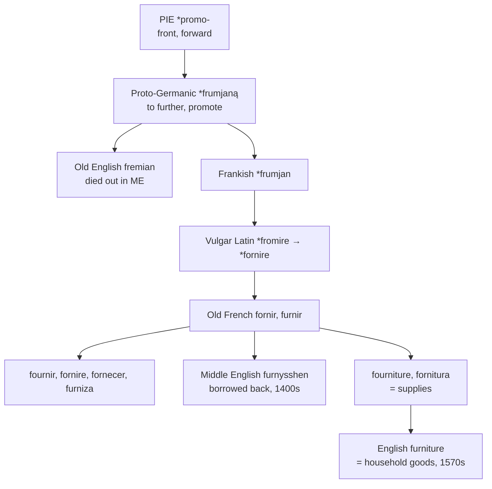

# \**Frumjan*: a Germanic word in French clothes

A study of a word that left Germanic for Frankish, passed through Old French, and returned to a Germanic language that still had its own cognate lying unused — and of a noun whose everyday English meaning no other language shares.

---

## 1. The root is not Latin

Every other word in this series descends from Latin. This one does not.

Proto-Indo-European **\*per-**, in the extended form **\*promo-** "front, forward," gives Proto-Germanic \**frumjaną* "to further, to promote," and thence Frankish \**frumjan* "to complete, to execute." The Latin family of *prō*, *prīmus*, and *prope* rests on the same root, but the verb in question reached French from the Franks and not from Rome.

The Germanic cognates are extensive and mostly still alive in English: *from*, *frame*, *former*, *foremost*, *first*. Old High German has *frumjan* "to perform, provide" and the noun *fruma* "utility, gain."

Old English had the verb too. *Fremian* meant "to promote, to perform, to benefit," and the noun *fremu* meant "profit, advantage." It died out in Middle English.

---

## 2. The round trip

The sequence is worth setting out plainly, because it is unusual.

1. Proto-Germanic \**frumjaną* — a Germanic verb.
2. Frankish \**frumjan* — carried into Gaul by Germanic speakers.
3. Vulgar Latin \**fromire*, altered to \**fornire* — the Franks' word absorbed into the Romance of Gaul, with metathesis of the *r*.
4. Old French *fornir*, *furnir* — the ordinary Gallo-Romance verb, twelfth century.
5. Middle English *furnysshen*, mid-fifteenth century — borrowed back into a Germanic language.

English thus took from French a word its own ancestors had exported some eight centuries earlier. And it took it at a moment when *fremian*, the inherited native form of the same Proto-Germanic verb, was still recently in use. The language replaced its own word with a French-mediated version of that word, and no speaker noticed, because five hundred years of separate development had made them unrecognisable.

A third leg completed the circuit later. German *Furnier* "veneer" was borrowed in 1702 from French *fournir* — Germanic to French to German — and English then took *veneer* from the German. The word has crossed the language boundary four times.

---

## 3. Four languages, four infixes

Latin's inchoative suffix *-scere* marked a process beginning. Vulgar Latin generalised it across the fourth conjugation, and \**fornire*, being an *-ire* verb, was swept up with the rest. What each language then did with it differs.

| | 1 sg | 3 sg | 1 pl | Marker |
|---|---|---|---|---|
| **French** | *je fournis* | *elle fournit* | *nous fournissons* | *-iss-*, in the plural |
| **Italian** | *io fornisco* | *lei fornisce* | *noi forniamo* | *-isc-*, in the singular |
| **Portuguese** | *eu forneço* | *ela fornece* | *nós fornecemos* | *-ec-*, in the infinitive itself |
| **Romanian** | *eu furnizez* | *el furnizează* | *noi furnizăm* | *-ez-*, a different suffix |
| **English** | *I furnish* | *she furnishes* | *we furnish* | *-ish*, everywhere |

French and Italian carry the same infix in complementary positions — French bare in the singular and extended in the plural, Italian the reverse.

Portuguese did something else: it rebuilt the verb as *fornecer*, moving the inchoative into the infinitive and joining the large *-ecer* class of *conhecer*, *parecer*, *merecer*, and *crescer*. The suffix is no longer an infix at all but part of the verb's identity.

Romanian is the outlier. *A furniza* is a late borrowing, most probably from French, and it takes not the inchoative but *-ez-*, the Romanian reflex of Latin *-izāre* from Greek *-izein* — the suffix of *organizează* and *realizează*. Romanian possesses an inchoative class of its own in *-esc*, and declined to put this verb in it.

English took *-iss-* from the French plural, applied it to the whole verb, and stopped treating it as an infix. *Furnish* is invariant.

---

## 4. The noun no one else has

*Furniture* entered English in the 1520s from French *fourniture*, meaning the act of supplying or a supply of something. In the 1570s it acquired the sense of household goods — chairs, tables, movables — **and that sense is unique to English.**

French *fourniture* still means supplies: office *fournitures*, a tailor's *fournitures*. It does not mean furniture. The word for that is *les meubles*, and the same holds across the continent: Spanish *los muebles*, Portuguese *os móveis*, Italian *i mobili*, German *Möbel*, Dutch *meubels*, Romanian *mobilă*. All of them descend from Latin *mōbilis* "movable" — the standard medieval distinction between movable and immovable property.

Europe names its furniture by whether it can be carried. English names it by the act of provisioning a house. The two metaphors are unrelated, and English is alone in the second.

This makes *furniture* a false friend of considerable reach. An English speaker reading French *fourniture*, Italian *fornitura*, or Portuguese *fornecimento* will find a word that looks identical and means "supply, provision" — the original sense, which English abandoned in the ordinary register and preserves only in phrases like *furnish evidence*.

---

## 5. The comparative set

| | The verb | The noun | The noun means |
|---|---|---|---|
| **French** | *fournir* | *la fourniture* | supplies |
| **Italian** | *fornire* | *la fornitura* | supply, provision |
| **Portuguese** | *fornecer* | *o fornecimento* | supply, provision |
| **Romanian** | *a furniza* | — | — |
| **English** | *to furnish* | *the furniture* | household goods |
| **Inglisce** | *to fournișe* | *þe fournițure* | household goods |

---

## 6. The Inglisce forms

`Fournișe` writes the French vowel. English *furnish* has `ur` where French, Italian, and Portuguese all show `or` or `our`, and the received English spelling records neither the Frankish *u* nor the Gallo-Romance *o*. `Ou` puts the word beside *fournir* and *fourniture*, which is where it came from, and beside *fornire* and *fornecer*, which are its cognates.

The `ș` writes /ʃ/ with the letter the sound descends from. This /ʃ/ is the French *-iss-*, which is to say the doubled sibilant of the inchoative; it is an *s* that palatalised. English `sh` is the native digraph of *ship*, *fish*, and *wash*, all from Old English *sc*, and using it here would file the word in the Germanic spelling class — which, given that the word is Germanic by ancestry but Romance by transmission, would be misleading in a particularly subtle way. The word came back from French, and the spelling should say so.

**`Fournițure` marks a yod-coalescence.** English *furniture* is /ˈfɜrnɪtʃər/: the `t` is /tʃ/, and it became so by coalescing with a following yod. The same has happened throughout a large class — *nature*, *picture*, *future*, *culture*, *creature*, *lecture*, *mixture*, *venture* — and English marks none of it, writing `t` for /t/ in *tore* and for /tʃ/ in *torture* with nothing to distinguish them.

The diacritic states it. And it does so on the same principle as `ș`: the letter records the consonant that was there, and the mark records what became of it. The two are one device applied to two letters, and the parallel is exact, since `-ture` /tʃər/ and `-sure` /ʃər/ are the same coalescence operating on *t* and on *s* respectively.

The article is masculine, `þe`.
