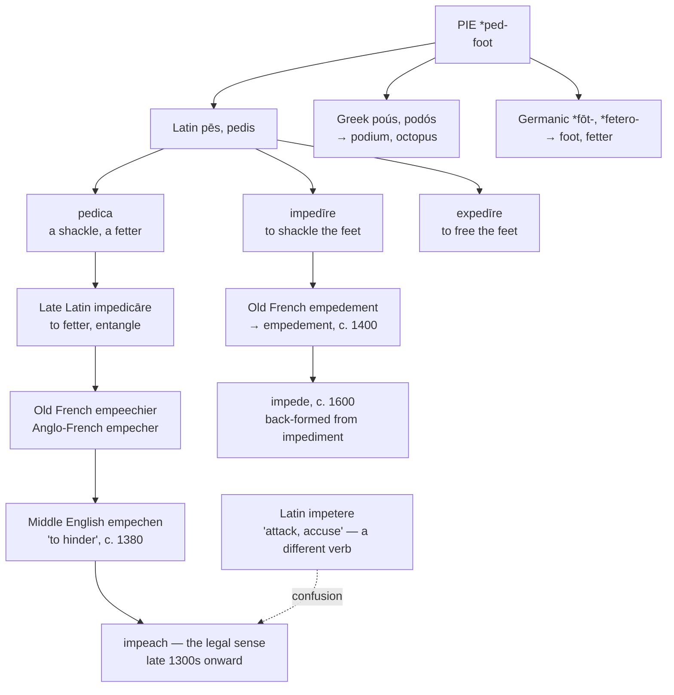

# \**Ped-*: the shackled foot

A study of two English verbs that both mean *to chain someone's legs*, of the four hundred years they spent as synonyms, and of the prefix English put back the wrong way.

---

## 1. The root

Proto-Indo-European **\*ped-** "foot" is among the best-attested roots in the family, and it reached English three times over.

**Through Latin *pēs*, *pedis*:**

**pedal**, **pedestrian**, **pedicure**, **pedestal**, **biped**, **quadruped**, **expedite**, **expedition**, **impede**, **impeach**, **pawn**, **pioneer**

**Through Greek *poús*, *podós*:**

**podium**, **tripod**, **octopus**, **antipodes**, **chiropodist**

**Through Germanic, by Grimm's law:**

Proto-Indo-European \**p* became Germanic \**f* and \**d* became \**t*, so the same root gives Old English *fōt* and *feter* — modern **foot**, **fetter**, and **fetlock**.

**So *fetter* and *pedal* are the same word.** And *fetter* is what both of this page's verbs literally mean.

Two of the derivatives are worth a line. **Pawn**, the chess piece, is Medieval Latin *pedōnem*, a foot soldier. And **pedigree** is Anglo-French *pé de grue*, "crane's foot" — the three-line mark used in genealogies to show descent.

---

## 2. Two verbs, one step apart

Latin made two verbs on this root, and English took both.

| | Latin | Literally |
|---|---|---|
| **impede** | *impedīre* | *in-* + *pēs* — to shackle the feet |
| **impeach** | *impedicāre* | *in-* + *pedica* — to put in fetters |

The difference is one derivation. *Impedīre* is built on the foot itself; *impedicāre* is built on **pedica**, the noun for the shackle. So the second is the first with an instrument named in the middle of it.

And **expedite** is the exact opposite: *ex-* + *pēs*, to free the feet. To expedite a thing is to unshackle it.

---

## 3. In English they were synonyms

This is the part the modern senses hide completely.

**Impeach entered English meaning *to impede*.** The Middle English *empechen*, from about 1380, means "to hinder, to prevent, to stop." Wycliffe uses it of criminals sheltering in churches whom "no man enpeche hym." The mathematician William Leybourn, as late as the seventeenth century, describes a ditch cut deep enough "to impeach the Assaults of an Enemy."

That sense survived to about 1700.

**Impede arrived much later.** It is a back-formation from *impediment*, or a direct borrowing from *impedīre*, and is not attested before about 1600 — two centuries after *impeach*.

So for roughly a hundred years English had two verbs, both meaning *to hinder*, both from the same Latin root, differing only in how far each had travelled. Then one specialised into law and the other kept the original job.

**The legal sense is old but its route is disputed.** *Impeach* is used of formal accusation from the late fourteenth century, and Etymonline suggests the shift came "via Medieval Latin confusion of *impedicāre* with Latin *impetere* 'attack, accuse'" — a different verb, from *petere* "to seek." If that is right, the political sense of *impeach* is a contamination, and the word means *fetter* by descent and *accuse* by accident.

---

## 4. English used to write both with *em-*

Both words entered English through French, and both were written with the French prefix.

| Modern | Earlier English | Source |
|---|---|---|
| impeach | **empeach**, *empechen*, *empesche* | Anglo-French *empecher* |
| impediment | **empedement** | Old French *empedement* |

The *im-* of the modern forms is a **later respelling toward the Latin**. English wrote *em-* for two hundred years first, and the Latin prefix was imposed on words that had reached the language by the French road.

Modern French still has the verb as **empêcher**, where the circumflex marks the *s* that stood in *empescher* — the same tombstone French puts on *fête* and *forêt*.

English also had two more members of the set and lost both. **Appeach**, from *apechen*, ran the same course from "hinder" to "accuse." And **depeach**, from French *dépêcher*, meant "to send away" — the opposite formation, from an unrecorded \**depedicāre*, and the ancestor of French *dépêcher* "to hurry." *Dispatch* looks like its continuation and is not; the two are unrelated despite the resemblance.

---

## 5. The comparative set

| | To hinder | To accuse formally | The hindrance |
|---|---|---|---|
| **Latin** | *impedīre*, *impedicāre* | *impetere* | *impedīmentum* |
| **French** | *empêcher* | *destituer*, *mettre en accusation* | *l'empêchement* |
| **Spanish** | *impedir* | *acusar*, *destituir* | *el impedimento* |
| **Portuguese** | *impedir* | *acusar* | *o impedimento* |
| **Italian** | *impedire* | *mettere sotto accusa* | *l'impedimento* |
| **Catalan** | *impedir* | *acusar* | *l'impediment* |
| **English** | *to impede* | *to impeach* | *the impediment* |
| **Inglisce** | *to empiede* | *to empeic̃e* | *þi empèdiment* |

**The legal sense is English alone.** No Romance language uses this verb for the formal accusation of an officeholder — French *empêcher* means only *to prevent*, and Spanish, Portuguese, and Italian all reach for *acusar* and its equivalents. When continental newspapers report an American impeachment they borrow the English word.

**And Romance kept only one of the two verbs.** *Impedir* and *impedire* continue *impedīre*; *impedicāre* survives only in French *empêcher* and in the English word. So the two verbs English holds as a pair exist as a pair nowhere else.

---

## 6. The Inglisce forms

| English | Inglisce |
|---|---|
| to impede | `empiede` |
| impediment | `þa empèdiment` |
| to impeach | `empeic̃e` |
| impeachment | `þa empeic̃ement` |

### The prefix is restored, not invented

`Em-` is what English wrote before the Renaissance corrected it. *Empeach* and *empedement* are both attested, both from French, and both were respelled toward a Latin the words did not travel through. Writing `em-` records the route and puts the pair beside French *empêcher* and *empêchement*.

This is the same repair the system makes in *empeire* for *impair*, where the modern *im-* is likewise a later correction of an inherited *em-*.

### The two words are visibly a family, and should be

`Empiede` and `empeic̃e` share `empe-` and diverge only at the point where Latin diverged: one built on *pēs*, the other on *pedica*. That is the correct distance — closer than English *impede* and *impeach*, which share four letters and no evident relation, and no closer than the etymology allows.

### The vowel alternation

`Empiede` is /i/ and `empèdiment` is /ɛ/, the ordinary shortening a suffix imposes.

### The affricate

`Empeic̃e` writes /tʃ/ with `c̃`, the mark for a palatalised *c*. The consonant descends from the *c* of *pedica* through Old French *empeechier*, so the letter is the one the word actually has and the tilde records what became of it.

`Ei` is /i/ before `c̃` by the ordinary rule, so no accent is needed.

### The wider family

The root reached English by three roads, and the spellings keep them apart.

**Through Latin *pēs*, *pedis*:**

| English | Inglisce |
|---|---|
| to expedite | `expedît` |
| expedient | `expídient` |
| expediency | `expídiencie` |
| expedition | `expedicion` |
| pedal | `pedale` |
| pedestal | `pedestal` |
| pedestrian | `pedèstrian` |
| pedicure | `pedicure`, `pedicurs` |
| pedigree | `pedigrie` |
| biped, quadruped | `bîpede`, `quadrupede` |
| pawn | `paone`, `paons` |
| to pioneer | `pîonier`, `pîonires`, `pîonired`, `pîoniering` |
| pioneer, pioneers | `pîonire`, `pîoniers` |

**Through Greek *poús*, *podós*:**

| English | Inglisce |
|---|---|
| podium | `pódiom` |
| tripod | `trîpod` |
| octopus | `octopus` |
| antipode, antipodes | `antipode`, `antïpodis` |
| podiatry | `podîatrie` |
| chiropody | `chiropodie` |
| chiropodist | `chiropodist` |

**Through Germanic, by Grimm's law:**

| English | Inglisce |
|---|---|
| foot, feet | `fûte`, `fyte` |
| fetlock | `fetloc` |
| to fetter | `fetter`, `fettres`, `fettred`, `fettering` |

### Three points in that table

**`Expedît` is the opposite of `empiede`.** *Ex-* + *pēs* against *in-* + *pēs* — freeing the feet against shackling them. The two verbs are exact antonyms in their Latin construction, and `expedît` and `empiede` show it by sharing `pe-` and differing in the prefix.

**`Pedale` and `pedestal` are not the same word.** *Pedal* is *pedālis*, "of the foot"; *pedestal* is Italian *piedestallo*, "foot of the stall" — a compound with Germanic *Stall* in it, borrowed whole. So the second half of *pedestal* is a stable, not a suffix, and the word is half Latin and half Germanic.

**`Fûte` : `fyte` writes an alternation English lost the logic of.** *Foot* : *feet* is i-mutation — the plural vowel fronted by an *-i* that later dropped — the same process behind *goose* : *geese*, *tooth* : *teeth*, and *mouse* : *mice*. English keeps four such plurals and spells each one differently; `û` : `y` states the change with a single letter swap.

### And the fruit stays out of it

English *peach* is Latin *persicum mālum*, the Persian apple, and has nothing to do with any of this. It takes `poic̃e`, and the separation is one of the reasons the `oi` separator exists.

`Empeic̃e` and `poic̃e` are as far apart on the page as they are in the dictionary — which is more than can be said for *impeach* and *peach*.
