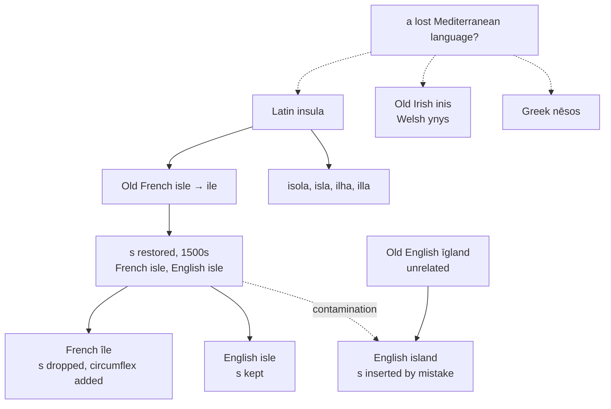

# *Insula*: a letter that was never there

A study of a word whose origin Rome could not explain, of a consonant put back into it by scholars and then taken out again, and of two unrelated English words that caught the letter like an infection.

---

## 1. The root nobody knows

Latin *insula* "island" has no accepted etymology. It is one of a small number of ordinary Latin nouns for which no Indo-European ancestor can be reconstructed.

**The ancient guess** was *in salō*, "in the open sea," from the ablative of *salum* "the swell, the high sea," related to *sal* "salt." Roman grammarians offered it and it has been repeated ever since.

**De Vaan rejects it** on two grounds. Phonetically it is possible, but being *in the sea* is not a precise description of an island; and the Indo-European languages, where they have a word for island at all, mostly mean a river island. He proposes instead that *insula* is a loanword from a language now lost, and that the same lost word lies behind **Old Irish *inis***, **Welsh *ynys***, and **Greek *nēsos***.

If that is right, the word came into Latin, Celtic, and Greek from a fourth language spoken around the Mediterranean before any of them, and its meaning is the only thing about it that survives.

---

## 2. The letter that came and went

Old French took *insula* and wore it down to **isle**, then to **ile**. English borrowed it in the late thirteenth century as **ile**.

Then the scholars intervened. In the sixteenth century the *s* was restored — first in French, then in English — on the authority of the Latin, though it had not been pronounced for centuries and was not pronounced now. English kept that restored letter and writes **isle** to this day.

French thought better of it. Modern French writes **île**, having dropped the *s* again and set a circumflex over the vowel to mark where it had been. The accent is a tombstone, of the sort French also puts on *fête* for *feste*, *forêt* for *forest*, and *hôpital* for *hospital*.

So the two languages made opposite decisions about the same letter, and English is the one still carrying it.

---

## 3. Two words that caught it

The restored *s* did not stay in its own word.

**Island** is not related to *isle* at all. It is Old English **īgland**, from *īeg* "island" plus *land* — literally *island-land*, a pleonasm. *Īeg* descends from Proto-Germanic \**awjō* "thing on the water," from the Indo-European root for water that also gives Latin *aqua*, so an island is a water-thing and the compound says so twice.

The ordinary Middle and early Modern English form was **iland** or **yland**. In the sixteenth century, at the very moment when *isle* was being given its *s* back, *iland* was given an *s* it had never had, by association with a word from a different language family.

**Aisle** caught the same infection. It is Anglo-Norman *ele*, *eile*, from Latin **ala** "wing" — the lateral division of a church being a wing of the building. It had no *s* either, and acquired one partly from French *aile* and partly from the same association with *isle*. The confusion was helped along by the fact that in the fifteenth and sixteenth centuries the usual Latin word for an aisle was *insula*.

So English holds three words pronounced /aɪl/, all spelled with an *s*, and only one of them ever had one:

| Word | From | The *s* |
|---|---|---|
| **isle** | Latin *insula* | historical, restored 1500s |
| **island** | Old English *īgland* | inserted 1500s, never belonged |
| **aisle** | Latin *ala* "wing" | inserted, never belonged |

*Īeg* itself survives in place names — the Isle of Ely, Anglesey, Sheppey, Athelney, Ramsey — and in **ait** and **eyot**, the small islands of the Thames, which are *īeg* with a diminutive suffix.

---

## 4. What English took from it

| Latin | English |
|---|---|
| *insula* | **isle** |
| *insulātus* "made into an island" | **insulate**, **insulation**, **insulator** |
| *insulāris* | **insular**, **insularity** |
| *paene* + *insula*, "almost an island" | **peninsula** |
| Italian *isolato* | **isolate**, **isolation**, **isolated** |

**Insulate and isolate are a doublet.** Both continue *insulātus*, one taken directly from Latin in the 1530s and one through Italian *isolato* in the eighteenth century. To insulate a wire and to isolate a patient are the same operation named twice: making something into an island.

English is alone in keeping both and giving them separate work. French *isoler*, Spanish *aislar*, Portuguese *isolar*, and Italian *isolare* each cover the whole range — the wire, the patient, and the house — with one verb.

The two English forms also disagree about the stem vowel. *Insulate* has *u*, taken from the Latin; *isolate* has *o*, taken from the Italian, which lowered the Latin short *u* as Romance regularly does. So English writes the same Latin word two ways in two words that mean the same thing.

---

## 5. The comparative sets

### The island

| | The island | What became of the *s* |
|---|---|---|
| **Latin** | *insula* | — |
| **Italian** | *l'isola* | kept, with the *u* lowered to *o* |
| **Spanish** | *la isla* | kept |
| **Portuguese** | *a ilha* | *-sl-* palatalised to *lh* |
| **Catalan** | *l'illa* | *-sl-* palatalised to *ll* |
| **French** | *l'île* | lost, marked by the circumflex |
| **Romanian** | *insula* | a learned re-borrowing, the cluster intact |
| **English** | *the isle* | lost in speech, restored in writing |
| **Inglisce** | *þi île* | lost in both |

The middle column sorts the languages by what they did with a consonant cluster. Italian and Spanish kept it. Portuguese and Catalan resolved it by palatalising, giving *ilha* and *illa*. French dropped it outright. Romanian did not inherit the word at all and took it back from books, which is why it alone still looks like the Latin.

### Making something into an island

| | The verb | The act | The thing that does it | Made into an island |
|---|---|---|---|---|
| **Latin** | *insulāre* | — | — | *insulātus* |
| **French** | *isoler* | *l'isolation*, *l'isolement* | *l'isolant* | *isolé* |
| **Spanish** | *aislar* | *el aislamiento* | *el aislante* | *aislado* |
| **Portuguese** | *isolar* | *o isolamento* | *o isolante* | *isolado* |
| **Italian** | *isolare* | *l'isolamento* | *l'isolante* | *isolato* |
| **Catalan** | *aïllar* | *l'aïllament* | *l'aïllant* | *aïllat* |
| **English** | *to insulate*, *to isolate* | *insulation*, *isolation* | *the insulator* | *isolate* |
| **Inglisce** | *to insolait*, *to îsolait* | *þi insolâcion*, *þi isolâcion* | *þi insolaitor* | *îsolat* |

Three divergences run down these columns.

**Only English has two verbs.** Every Romance language covers the wire, the patient, and the house with one.

**Romance names the act with *-mentum*** — *isolamento*, *aislamiento*, *aïllament* — where English uses *-ation*. French has both, *isolation* and *isolement*, and distributes them by sense.

**Romance names the agent with a present participle.** *L'isolant* and *el aislante* are literally *the insulating one*; English reaches for the Latin agentive *-or* instead, and gets a noun that looks like a person and denotes a material.

### The island-adjacent

| | Insular | Insularity | Almost an island |
|---|---|---|---|
| **Latin** | *insulāris* | — | *paenīnsula* |
| **French** | *insulaire* | *l'insularité* | *la péninsule* |
| **Spanish** | *insular* | *la insularidad* | *la península* |
| **Portuguese** | *insular* | *a insularidade* | *a península* |
| **Italian** | *insulare* | *l'insularità* | *la penisola* |
| **Catalan** | *insular* | *la insularitat* | *la península* |
| **English** | *insular* | *insularity* | *the peninsula* |
| **Inglisce** | *insolar* | *þi insolaretie* | *þa penïnsola* |

Spanish and Catalan built their verb afresh on their own noun — *a-isla-r*, *a-illa-r* — but kept the learned *insular* for the adjective, so the two no longer look related. Catalan writes a diaeresis in *aïllar* to keep the vowels apart.

Italian *penisola* dropped the *n* of *paenīnsula* altogether, so the word contains *isola* plainly and *paene* not at all.

---

## 6. The Inglisce forms

### *Île*

**`Île` writes what is said.** The *s* of English *isle* has not been pronounced since Old French and was put back by antiquarians rather than by speakers; dropping it costs nothing and removes a letter that misleads every reader who meets the word before hearing it.

The `î` gives /aɪ/ and the silent `-e` closes a monosyllabic noun. The plural is `îals`, the `a` writing the schwa.

**A coincidence worth recording.** The Inglisce form is identical to the French — `île` and *île*, letter for letter, accent and all. But the accents are doing different work. French sets the circumflex over the vowel to mark the *s* that used to follow it; Inglisce sets it there to say the vowel is /aɪ/. Two languages, one spelling, two unrelated reasons for the mark.

### The derived words

**The stem vowel is settled at `o`.** English writes *insulate* with *u* and *isolate* with *o*, though the two are the same Latin word; Inglisce writes `o` in both, which is the Romance outcome — Italian *isola*, and the *o* that Italian handed to English in *isolate* itself. The vowel is a schwa in English either way, so nothing is lost in the mouth and the family gains a single stem.

**The verb and the adjective are told apart.** `Îsolait` marks the verb with `-ait` and `îsolat` the adjective with `-at`, where English writes *isolate* and *isolated* and leaves the vowel of the final syllable to be inferred. The pattern runs through the language — *a delegate* and *to delegate*, *an estimate* and *to estimate*, *a graduate* and *to graduate*.

**One accent to a word, on the stressed syllable.** `Îsolait` carries the mark on its first syllable and `isolâcion` on its third, because that is where the accent falls in each. The vowel of the first syllable is the same in both; only one of them needs saying so.

**`Insolaretie` keeps `insolar` visible**, where English *insular* and *insularity* diverge in the syllable that carries the suffix.

**`Penïnsola` marks the seam.** The word is *paene* "almost" plus *insula*, and the diaeresis falls exactly at the join, keeping `insola` legible inside the compound.

The article is `þi` before a vowel and `þa` for the feminine nouns.
