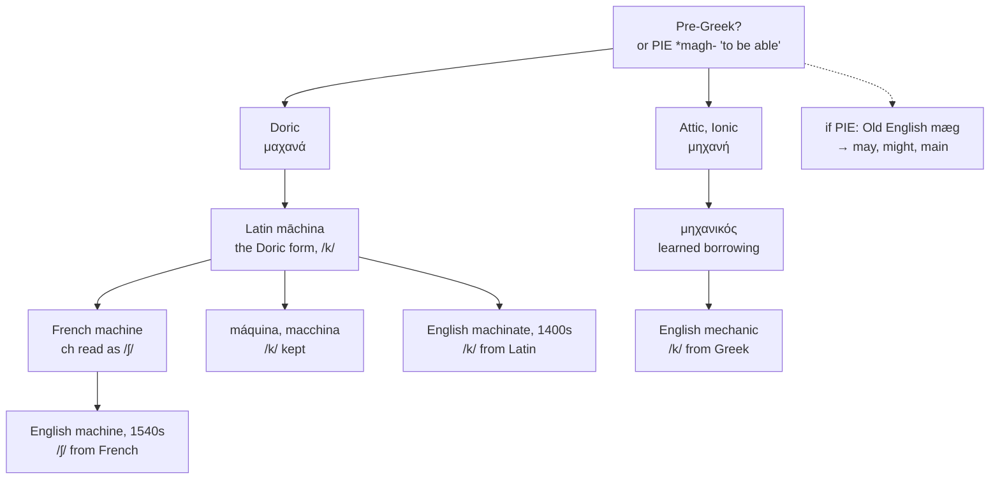

# Μηχανή and μαχανά: one word, two dialects

A study of a Greek noun that Latin borrowed in the wrong dialect, of the consonant French mispronounced and English copied, and of the etymology that makes *machine* a cousin of *may* — if it is true.

---

## 1. Two forms of one Greek word

Attic and Ionic Greek had **μηχανή** "device, contrivance, engine." Doric had **μαχανά**, the same word with the regular Doric α where Attic has η.

**Latin borrowed the Doric form.** *Māchina* preserves the *a*, and every Romance descendant follows it — *machine*, *máquina*, *macchina*.

**Scholarly Greek came later, and brought the Attic form.** From **μηχανικός** "of machines" English has *mechanic*, *mechanical*, *mechanism*, *mechanise*, and the whole *mechano-* prefix.

So English holds a doublet of an unusual kind. Most doublets in these pages divide a popular route from a learned one; this one divides two **dialects of the source language**, separated in Greece before either word left it.

| Greek dialect | Form | English |
|---|---|---|
| **Doric** | μαχανά | **machine**, **machinate**, **machination**, **machinery** |
| **Attic, Ionic** | μηχανή | **mechanic**, **mechanism**, **mechanical**, **mechanise** |

---

## 2. The etymology in doubt

The traditional account derives μηχανή from **\*magh-ana-**, "that which enables," from Proto-Indo-European \**magh-* "to be able, to have power."

If that is right, the English relatives are remarkable:

| Source | English |
|---|---|
| Old English *mæg* "I can" | **may** |
| Old English *miht* | **might** |
| Old English *mægen* "strength" | **main**, as in *with might and main* |
| Old French *esmaier* | **dismay** |
| Old Persian *maguš* | **magic**, **mage**, **magi** |

So *machine* and *may* would be the same word, and a machine would be *the thing that can*.

**Beekes does not accept it.** He objects on formal grounds to the connection with the Germanic and Slavic words, finds the Greek noun isolated within Greek, and concludes that it is **Pre-Greek** — a borrowing from whatever was spoken in the Aegean before Greek arrived.

If he is right, the word has no Indo-European ancestry at all, *machine* and *may* are unrelated, and the appealing gloss "that which enables" is a reconstruction reading sense into a word that never had it.

---

## 3. The god from the machine

The μηχανή was a specific object before it was a general one: a wooden crane with a pulley system, used in the Greek theatre of the fifth and fourth centuries to lift an actor into the air.

It served chiefly to bring gods onto the stage from above, which is where the Latin phrase **deus ex machina** comes from — the god out of the crane. Euripides used it for a mortal in *Medea*, and Aeschylus used it often.

The modern sense of a device made of moving parts is late: the 1670s in English, growing out of the seventeenth-century senses of *apparatus* and *military siege-tower*.

---

## 4. The device and the trick

Latin *māchina* meant both "engine, instrument" and "device, trick, stratagem" — the ambiguity English still has in *contrivance*, which is a mechanism and a scheme at once.

English took the two senses as two words. **Machine** kept the apparatus, and **machinate** — from *māchinārī* "to contrive, to plot," attested in English from the mid-fifteenth century — kept the plotting. *Machination* is the noun of the second, and means nothing mechanical at all.

The word displaced Old English **searu**, which had covered the same ground: a device, a contrivance, and also cunning and treachery.

---

## 5. The consonant English got from France

Latin *māchina* has /k/. The *ch* is the ordinary Latin transliteration of Greek χ, and it is /k/ in every position.

Spanish, Portuguese, Italian, and Catalan all kept it: *máquina*, *máquina*, *macchina*, *màquina*, all with /k/.

**French did not.** French *ch* is /ʃ/, and French readers gave the Latin digraph its French value, producing *machine* /maʃin/. English borrowed the word from Middle French in the 1540s and took the French consonant with it.

So English *machine* has a /ʃ/ that is a French spelling-pronunciation of a Latin transliteration of a Greek letter that was never anything but a stop.

**And English is inconsistent about it.** *Machine* is /məˈʃin/, but *machinate* and *machination* are /ˈmækəneɪt/ and /ˌmækəˈneɪʃən/, with /k/ — the correct value, borrowed directly from the Latin rather than through France. *Mechanic* has /k/ for the same reason, and there the `a` that follows would have given the hard consonant even without the `h`.

English therefore writes `mach-` in three words and says /məʃ/ in one of them and /mæk/ in the other two.

---

## 6. The comparative set

| | The machine | The consonant | To plot |
|---|---|---|---|
| **Greek** | μαχανά, μηχανή | χ | — |
| **Latin** | *māchina* | /k/ | *māchinārī* |
| **French** | *la machine* | /ʃ/ | *machiner* |
| **Spanish** | *la máquina* | /k/ | *maquinar* |
| **Portuguese** | *a máquina* | /k/ | *maquinar* |
| **Italian** | *la macchina* | /k/ | *macchinare* |
| **Catalan** | *la màquina* | /k/ | *maquinar* |
| **Romanian** | *mașina* | /ʃ/ | *a mașina* |
| **English** | *the machine* | /ʃ/ | *to machinate* |
| **Inglisce** | *þa maçine* | /ʃ/ | *to machinait* |

**Only French, Romanian, and English have the fricative**, and in each case for the same reason: the word came through French orthography rather than from the Latin directly. Romanian took it from French in the nineteenth century.

**Iberian Romance rewrote the spelling to match the sound.** *Máquina* uses `qu` because Spanish and Portuguese `ch` is /tʃ/, and keeping the Latin digraph would have given the wrong consonant. Italian doubled the letter instead, `cch` being its ordinary spelling for /kk/ before a front vowel.

Four languages, four solutions to one Greek letter.

### The Attic branch

| | The mechanic | The mechanism | Mechanical | To mechanise |
|---|---|---|---|---|
| **Greek** | μηχανικός | — | μηχανικός | — |
| **Latin** | *mēchanicus* | — | *mēchanicus* | — |
| **French** | *le mécanicien* | *le mécanisme* | *mécanique* | *mécaniser* |
| **Spanish** | *el mecánico* | *el mecanismo* | *mecánico* | *mecanizar* |
| **Portuguese** | *o mecânico* | *o mecanismo* | *mecânico* | *mecanizar* |
| **Italian** | *il meccanico* | *il meccanismo* | *meccanico* | *meccanizzare* |
| **Catalan** | *el mecànic* | *el mecanisme* | *mecànic* | *mecanitzar* |
| **English** | *the mechanic* | *the mechanism* | *mechanical* | *to mechanise* |
| **Inglisce** | *þe mecanic* | *þe mecanism* | *mecanical* | *to mecanyse* |

**Every Romance language drops the `h` here and English keeps it.** The reason is the vowel: a `c` before `a` is already /k/, so the digraph spells nothing the letter did not spell alone. Latin needed it to transliterate χ; the moment the word entered a language whose `c` was hard before `a`, it stopped doing any work.

English keeps it as a badge of Greek ancestry rather than as a spelling of anything, and Italian went further in the other direction, doubling the consonant to *meccanico* on its own rules of length.

---

## 7. The Inglisce forms

| English | Inglisce | Letter | Value | Following vowel |
|---|---|---|---|---|
| machine, machines | `maçine`, `maçíns` | `ç` | /ʃ/ | front |
| machinery | `maçinerie` | `ç` | /ʃ/ | front |
| machinate | `machinait` | `ch` | /k/ | front |
| machination | `machinâcion` | `ch` | /k/ | front |
| mechanic, mechanism | `mecanic`, `mecanism` | `c` | /k/ | back |
| mechanical, mechanise | `mecanical`, `mecanyse` | `c` | /k/ | back |

**The `h` appears exactly where it is needed and nowhere else.** A `c` before a back vowel is already /k/; a `c` before a front vowel is /s/, and must be blocked if /k/ is wanted. The three spellings follow from that one fact:

- `mecanic` has `a` after the `c`, so the hard value comes free and the `h` would be doing nothing.
- `machinait` has `i` after the `c`, which would soften it, so the `h` intervenes to hold the stop.
- `maçine` has `i` after the `c` and wants /ʃ/, so the cedilla carries it past the sibilant to the hush.

English writes `mech-` and `mach-` with an `h` in every one of them, needed in two cases and inert in the other four.

**The plural changes devices.** `Maçine` has a silent `-e` fixing the `i` as /i/; when it drops before the ending the acute takes over, giving `maçíns`.

**`Maçinerie` takes the French abstract suffix in full**, where English clips it to `-ery`, and keeps `maçine` visible inside it.

**`Mecanyse` writes `y` for /aɪ/**, marking a vowel that its own noun does not share: *mechanise* is /ˈmɛkənaɪz/ and *mechanism* is /ˈmɛkənɪzəm/, and English writes `i` for both.

**`Machinait` and `machinâcion` keep `machin-` unbroken.** Neither word has anything mechanical about it, and the spelling now says so: they share their stem with each other and their consonant with `mecanic`, while `maçine` stands apart from both.
