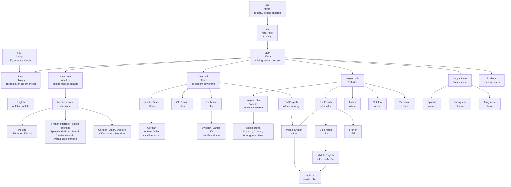

# *Offerre*: the sacrifice and the sale

A study of a Latin verb that entered English twice by two different doors, of the Germanic languages where only the first door was ever opened, and of the past participle Latin had to build from scratch because the one it inherited belonged to another verb.

---

## 1. The verb and its prefix

Latin **offerre** is *ob-* "to, towards" plus *ferre* "to carry, to bring." The prefix assimilates before *f*, which is where the doubled consonant comes from: *ob-* + *ferre* gives *offerre*, not *obferre*. Literally, to bring a thing towards someone — to set it in front of them.

*Ferre* is one of the great irregular verbs of Latin, and its paradigm is stitched together from two unrelated Indo-European roots. *Ferō* and *ferre* are on *\*bʰer-*, "to carry," the root that also gives English **bear**. The perfect and supine, *tulī* and *lātum*, are on *\*telh₂-*, "to lift, to bear a weight." So *offerre* has a past participle, *oblātum*, that shares no material whatever with its present stem.

English took both halves and does not connect them. From the present stem: *offer*. From the supine: *oblation*, and *oblate* — which in its religious sense names a person offered to a monastery, a human *oblātum*.

That mismatch did not survive contact with later Latin. Section 5 is about what was done to it.

---

## 2. The Church carries it north

Long before French existed as a route into English, Latin *offerre* had gone into Germanic on the back of Christianity, in a specifically liturgical sense: in Late Latin the verb meant to present something in worship.

Every Germanic language in the missionary field took it. Old English **offrian**, Old Frisian *offria*, Old Dutch *offrōn*, Middle Dutch *offeren*, Old Norse *offra*, Old High German giving modern German *opfern*.

Old English *offrian* carried two senses side by side: to bring or put forward, to present, to show or exhibit; and to sacrifice, to present something solemnly in worship, to bring an oblation. The verbal noun *offrung* is the ancestor of **offering**, which is therefore the native English noun in this family, formed on English soil from a Latin loan already centuries old.

---

## 3. The French arrives on top

Old French had **ofrir**, from the Vulgar Latin remake of the same verb, and English met it again after the Conquest.

The result is a word with a split inheritance that the dictionaries record carefully. The religious senses of English *offer* descend from Old English *offrian*; the non-religious ones come from Old French *offrir*, or were reinforced by it. Middle English *offren* is one verb with two ancestors, and they were the same verb to begin with.

The noun came separately and late. English *offer* as a noun is early fifteenth century, from Old French *ofre*, itself a verbal noun from *offrir*. So beside the native *offering* there now stood a borrowed *offer*, and English kept both, giving them different work: you make an offer, and you take up a collection of offerings.

The senses then went commercial on a clear schedule. "To present something for acceptance or rejection" from the early fifteenth century, "to attempt to do" from the 1530s, and "to expose for sale" from the 1630s.

---

## 4. The sacrifice and the victim

North of the Channel the word never went commercial at all, because the second door was never opened.

German **Opfer** means a sacrifice, and also a victim. Danish, Swedish and Norwegian **offer** mean the same: a sacrifice, and then a victim, a casualty. Icelandic *offr* is an offering. These are all the churchly word, the one that came in around the ninth century and stayed inside the meaning it arrived with, then drifted from the thing given to the thing destroyed.

So *offerre* has produced, in closely related languages, a word meaning a commercial proposal and a word meaning a casualty. A Swedish newspaper counting *offer* after an accident and an English estate agent presenting an *offer* are using the same Latin verb. English has both senses available too, but they sit in different registers and no ordinary speaker feels the join: the sacrificial sense survives in *offering*, *offertory* and *oblation*, and the transactional one has taken the bare word entirely.

---

## 5. The participle Latin built twice

Classical Latin's past participle for *offerre* was *oblātus*, and it was intolerable. It shared not one letter with the present stem, because it came from the other root. A verb whose participle cannot be predicted from its infinitive is a verb every speaker has to memorise, and later Latin declined to keep memorising it.

So the slot was refilled — independently, twice, and both times by building a regular participle on the present stem.

The learned repair was **offertus**, which Oxford describes flatly as the Late Latin *offert-* that replaced Latin *oblat-*. From it Medieval Latin formed **offertorium**, the place to which offerings are brought. English took that in the middle of the fourteenth century as *offertorie*, at first meaning only the antiphon sung during the offering at Mass. It came to name the part of the service itself in the 1530s, and then, in 1862, the collection of money received. Chant, rite, cash: the same journey the bare verb had made two centuries earlier, run again inside the church.

The popular repair was **\*offerta**, the feminine past participle of Vulgar Latin *\*offerīre*, and it went into Romance as a noun: Italian *offerta*, Catalan and Spanish and Portuguese *oferta*, all meaning an offer or a bid, and all first attested in the thirteenth century. Spanish borrowed its form from Gallo-Romance rather than making its own, but the participle behind it is the same manufacture.

English therefore holds both fillings of one grammatical slot. *Oblation* is the classical participle, from the root that means to lift. *Offertory* is the replacement participle, from the root that means to carry. They mean nearly the same thing and have no letters in common, which is a fair summary of what *ferre* did to everyone who inherited it.

---

## 6. What Romance did with the verb

Romance could not simply keep *offerre*, because *ferre* was athematic and irregular and no Romance language kept it in any form. The compounds survived only by being rebuilt, and they were rebuilt in three different ways.

Most of the family produced **\*offerīre**, on the fourth conjugation: French *offrir*, Italian *offrire*, Catalan *oferir*, Romanian *a oferi*.

Iberia produced an inchoative instead, **\*offerēscere**, which is directly attested for Aragonese *ofrexer* and which explains the shape of Spanish *ofrecer* and Portuguese *oferecer* — the *-sc-* infix is still visible in Spanish *ofrezco*.

Sardinian rebuilt nothing. It has *oferrere*, *oferri*, *oferriri*, straight from *offerre*, and these are listed separately from the Vulgar Latin remake that fed everyone else. The most conservative Romance language simply kept the irregular verb.

---

## 7. The comparative set

### The verb

| Language | Form | How the Latin verb was handled |
| :--- | :--- | :--- |
| **Inglisce** | to offir, offre | Old English *offrian*, reinforced by Old French |
| English | to offer, an offer | Old English *offrian*, reinforced by Old French |
| French | offrir | remade as *\*offerīre* |
| Italian | offrire | remade as *\*offerīre* |
| Catalan | oferir | remade as *\*offerīre* |
| Romanian | a oferi | remade as *\*offerīre* |
| Spanish | ofrecer | remade as an inchoative, *\*offerēscere* |
| Portuguese | oferecer | remade as an inchoative, *\*offerēscere* |
| Aragonese | ofrexer | remade as an inchoative, *\*offerēscere* |
| Sardinian | oferrere, oferri | not remade |
| German | opfern, Opfer | Late Latin, through the Church |
| Swedish, Danish | offer | Late Latin, through the Church |

Read the last column down and there are four fates, not one. The verb was refitted to the fourth conjugation, or refitted as an inchoative, or left alone, or lifted out of Latin entirely by missionaries before Romance had finished deciding. English is the only language on the list with two of these at once, and that is not a tidy fact about English — it is what happens to a language that is converted early and conquered late.

### The noun from *offertorium*

| Language | Form | The Latin ending |
| :--- | :--- | :--- |
| **Inglisce** | offertorie, offertoris | naturalised |
| English | offertory, offertories | naturalised |
| French | offertoire | naturalised |
| Italian | offertorio | naturalised |
| Catalan | ofertori | naturalised |
| Spanish | ofertorio | naturalised |
| Galician | ofertorio | naturalised |
| Portuguese | ofertório | naturalised |
| Aragonese | ofertorio, ofiertorio | naturalised |
| German | Offertorium | left standing |
| Dutch | offertorium | left standing |
| Swedish | offertorium | left standing |
| Polish | ofertorium | left standing |

The line falls in the same place it fell for the verb, and for the same reason. Romance took the word as its own and gave it a native ending. Germanic took it as a piece of church furniture and left it in the Latin nominative singular, undeclined, still visibly a foreign object on the page. English is the only Germanic language on the Romance side of that line, because it received this word not from missionaries in the ninth century but through the fourteenth-century Latin-and-French channel that supplied the rest of its ecclesiastical vocabulary.

The consonant tells a second story across the same set. Ibero-Romance simplifies the geminate — *ofertorio*, *ofertori*, *ofertório* — while French, Italian and every Germanic borrowing keep both letters.

---

## 8. The Inglisce forms

**to offir** · offre, offres, offred, offiring · **offre**, offirs · **offertorie**, offertoris

The doubled *f* is history rather than phonology. *Ob-* assimilates to *of-* before *f*, which is the whole reason Latin has *offerre* and not *obferre*, and the letter records that assimilation. Not every doubled *f* in the orthography is doing this; this one is. It also places the word with French and Italian rather than with Iberia, where the geminate was given up.

The noun and the verb are held apart on the page. *To offir* is the infinitive and *offiring* the progressive; the present tense and the noun compress to *offre*, and the noun's plural restores the vowel as *offirs*. English cannot make this distinction — *offer* is one string for the verb and the noun both, and only the syntax around it says which is meant. Here the citation forms differ before any sentence is built around them.

**Offertorie** stands outside that alternation, and the *e* is what says so. *Offirs* takes its vowel from the Inglisce stem because it was assembled here, out of parts the language already had. *Offertorie* was not assembled here at all: it arrived whole from Medieval Latin *offertorium*, and it keeps the vowel that word brought with it. One letter therefore separates what the language made from what the language received, which is the same distinction that lets a learned Latin borrowing keep its own shape anywhere else in the orthography.

The *t* is worth a moment too, because by classical rules it has no business existing. The participle of *offerre* was *oblātus*, with no *t* and no *f*. The *t* is the seam left by Late Latin's repair — a manufactured participle, built on the present stem so that the verb would behave. Inglisce inherits the repair along with the word, and the letter marks the place where Latin gave up on its own irregularity.

Both nouns begin with a spoken vowel, so both take the euphonic article regardless of where their stress falls.

One thing the spelling does not record, and could not: the double entry. *Offer* has been in English since roughly the ninth century by way of the Church and again since the thirteenth by way of France, and no orthography can show a word arriving twice. What it can show is the shape the word settled into, and that shape is the compressed one — which puts this verb in a different class from other verbs built on the same Latin stem with different prefixes.

That divergence is not a flaw. No Romance language managed to treat the compounds of *ferre* alike either. Portuguese has *oferecer* against *sofrer*, Spanish *ofrecer* against *sufrir* — one Latin verb, two prefixes, two unrelated repairs inside a single language. Latin handed its descendants a verb that had already been assembled out of two roots, and every language that received it went on taking it apart in its own way.
