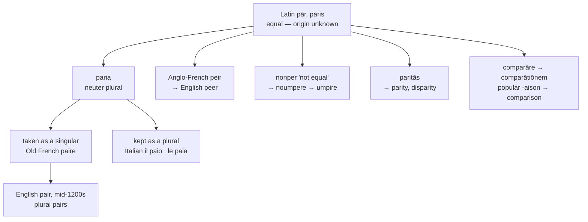

# *Paria*: a plural that became one thing

A study of a Latin plural noun that English mistook for a singular, of the one language that never made the mistake, and of the third party who is *not* one of the pair.

---

## 1. The root

Latin *pār* (genitive *paris*) is an adjective meaning "equal, equal-sized, well-matched," used also as a noun for a counterpart or an equal.

Its own origin is unknown. De Vaan declines to commit; Watkins suggests Proto-Indo-European \**perə-* "to grant, allot," with a notion of reciprocity; another proposal connects it to \**per-* "to traffic in, sell," on the reasoning that a trade gives equal value for equal value. None has carried the field, and the word remains one of the more conspicuous gaps in the Latin lexicon.

Its productivity is not in doubt:

| Latin | English |
|---|---|
| *pār*, through Anglo-French *peir* | **peer**, **peerless** |
| *paria*, neuter plural | **pair** |
| *comparāre* | **compare**, **comparison** |
| *paritās* | **parity**, **disparity** |
| *nōn pār*, through Old French *nonper* | **umpire** |
| French *au pair*, *nonpareil* | **au pair**, **nonpareil** |

**Umpire** deserves its own line. Old French *nonper* means "not equal" — the third person brought in to settle a dispute precisely because he is not one of the two parties. Middle English had it as *noumpere*, and *a noumpere* was misheard as *an oumpere*, the *n* migrating across the article. The umpire is the odd man out, and his name says so.

---

## 2. The plural that became a singular

Latin *paria* is the **neuter plural** of *pār*: equal things, more than one of them.

Old French took the plural form as a singular noun, *paire*, and English took it from there in the mid-thirteenth century. English *a pair* is therefore a Latin plural governed by a singular article, and English *pairs* is a plural formed on a plural.

The reanalysis left a residue in the grammar. English still hesitates over the number of *pair*: *three pair of boots* and *three pairs of boots* are both attested, and older usage preferred the first — the noun resisting a second plural marker because it had already carried one for two thousand years.

The word also acquired an odd job. From the late fourteenth century it serves as a counter for single objects made of two parts: *a pair of scissors*, *a pair of trousers*, *a pair of spectacles*, *a pair of tongs*. One thing, called by a plural, marked as singular.

**Italian never made the mistake.** Latin neuter plurals in *-a* were widely reanalysed as feminine singulars across Romance — that is how *folia* became French *feuille* and *gaudia* became *joie*. Italian preserved a class that keeps them plural. *Il paio* is masculine singular and *le paia* feminine plural, the regular continuation of the Latin second-declension neuter, in the same class as *uovo* : *uova*, *braccio* : *braccia*, *dito* : *dita*.

So Italian *paia* is Latin *paria*, still doing the job it did in Latin.

---

## 3. Two words English does not connect

English took the singular as well, by a different road: *peer* is Anglo-French *peir*, Old French *per*, from *pār* directly. The language holds both numbers of one Latin word as two separate lexemes.

| | From the plural *paria* | From the singular *pār* |
|---|---|---|
| **Latin** | *paria* | *pār* |
| **French** | *la paire* | *le pair* |
| **Italian** | *il paio* : *le paia* | *il pari* |
| **Spanish** | — | *el par* |
| **Portuguese** | — | *o par* |
| **English** | *the pair* | *the peer* |
| **Inglisce** | *þe paire* | *þe piare* |

Spanish and Portuguese have only the singular. French, Italian, and English have both, and in all three the two have drifted far enough apart that no speaker treats them as one word.

The verb is late and English-made. *To pair*, "to come together with another," is attested only from about 1600 and is a conversion of the noun, where Romance builds a verb with a prefix: French *apparier*, Spanish *emparejar*, Italian *appaiare*.

---

## 4. The abstract nouns

*Paritās* is built on the singular *pār*, not on the plural, which is why its vowel never diphthongised: French has *parité* and not \**pairité*.

| | Parity | Disparity |
|---|---|---|
| **Latin** | *paritās* | *disparitās* |
| **French** | *la parité* | *la disparité* |
| **Spanish** | *la paridad* | *la disparidad* |
| **Portuguese** | *a paridade* | *a disparidade* |
| **Italian** | *la parità* | *la disparità* |
| **Catalan** | *la paritat* | *la disparitat* |
| **English** | *parity* | *disparity* |
| **Inglisce** | *þe pairetie* | *þa dispairetie* |

---

## 5. *Comparison* is a popular form

Latin *comparāre* is *com-* "together" plus *pār*: to bring things to equality, to match them against each other.

English *comparison* does not look like its Latin source *comparātiōnem*, and the reason is that it did not come from it directly. Latin *-ātiōnem* had two outcomes in French — a learned *-ation* taken from the written language, and a popular *-aison* worn down by speech. English holds several of the second kind:

| Latin | Old French | English |
|---|---|---|
| *ratiōnem* | *raison* | **reason** |
| *satiōnem* | *saison* | **season** |
| *trāditiōnem* | *traïson* | **treason** |
| *pōtiōnem* | *poison* | **poison** |
| *comparātiōnem* | *comparaison* | **comparison** |

*Reason* and *ration*, *treason* and *tradition*, *poison* and *potion* are doublets: the same Latin noun taken twice, once through speech and once from a book. *Comparison* is the popular member of such a pair, and English never borrowed the learned one.

| | Compare | Comparison | Comparable | Comparative |
|---|---|---|---|---|
| **Latin** | *comparāre* | *comparātiōnem* | *comparābilis* | *comparātīvus* |
| **French** | *comparer* | *la comparaison* | *comparable* | *comparatif* |
| **Spanish** | *comparar* | *la comparación* | *comparable* | *comparativo* |
| **Portuguese** | *comparar* | *a comparação* | *comparável* | *comparativo* |
| **Italian** | *comparare* | *il paragone* | *comparabile* | *comparativo* |
| **Catalan** | *comparar* | *la comparació* | *comparable* | *comparatiu* |
| **English** | *to compare* | *the comparison* | *comparable* | *comparative* |
| **Inglisce** | *to compaire* | *þa compaîrasson* | *compaîrable* | *compaîratif* |

Only French and English have the popular noun. Spanish, Portuguese, and Catalan take the learned ending, and Italian sets the formation aside altogether for *paragone*, which is not from this root.

---

## 6. The verb that is not related

Middle English had a second verb *pairen*, meaning "to impair, to make worse." It is a shortened form of *apeiren*, from Old French *empeirier*, from Late Latin *peiōrāre* "to worsen," from *peior* "worse" — nothing to do with *pār*.

English therefore held two verbs spelled *pair* for a period, one meaning to match and the other to damage. The second survives only in its prefixed form.

Its prefix has been tampered with. The English forms are *ampairen*, *apeiren*, and *empeiren*; the source is Old French *empeirier*, with *em-*. The modern *im-* is a later respelling toward Vulgar Latin \**impeiorāre*, applied to a word that reached English by the French road and not the Latin one.

| | To impair |
|---|---|
| **Latin** | \**impeiorāre*, from *peior* |
| **French** | *empirer* |
| **Spanish** | *empeorar* |
| **Catalan** | *empitjorar* |
| **Portuguese** | *piorar* |
| **Italian** | *peggiorare* |
| **English** | *to impair* |
| **Inglisce** | *to empeire* |

Every Romance cognate that keeps a prefix keeps the front vowel; Portuguese and Italian drop the prefix entirely.

---

## 7. How the family descends

---

## 8. The Inglisce forms

### *Paire* and *piare*

**`Paire` is the Middle English spelling**, and the Old French one before it. The word entered English as *paire* in the mid-thirteenth century and was written that way for three hundred years; the modern *pair* is the later contraction. Restoring it is recovery rather than invention.

The `ai` gives /ɛ/ before `r`, by the *Mary–marry–merry* merger that governs Midwestern English. The silent `-e` covers noun and verb alike, English having one form for both, and the plural `pairs` drops it.

**`Piare` keeps the singular apart.** The vowels record the difference in descent — `i` for the /ɪ/ of *pār* through Anglo-French *peir*, `ai` for the diphthong *paria* developed in Old French. The `a` carries the reduced vowel before `r`, and the plural is `piars`.

There is a further gain in a language full of homophones. English *pair*, *pare*, and *pear* sound identical and come from three unrelated roots — *paria*, *parāre*, and Old English *peru*. Each can take the vowel of its own line of descent, so the three are distinguished by where they came from rather than by which spelling happened to survive.

### *Pairetie* and *dispairetie*

These unify the family on one stem, against the etymology. *Paritās* is built on the singular, and its `a` never diphthongised. Inglisce writes `ai` anyway, so that `paire`, `pairetie`, and `dispairetie` share a visible stem where English *pair* and *parity* share four letters and no evident relation.

The cost is that `pairetie` no longer matches *parité*, *paridad*, or *parità* on the page. What is bought is that a reader who knows `paire` can see what `pairetie` is made of, which in English requires being told.

The plurals are `pairetis` and `dispairetis`, the silent `-e` dropping before the ending — against English *parities*, where the `y` must first become `ie` before the `s` can be added.

### The *compaire* family

**The vowel is marked two ways for one reason.** `Compaire` has a final silent `-e`, which fixes the quality of the preceding vowel; `compaîrasson`, `compaîrable`, and `compaîratif` have no final `-e` available, so the circumflex takes the job over. The two devices are one device in two positions, and the stem is `compair-` throughout.

`Compaîrasson` doubles the `s` to keep the sibilant voiceless, a single intervocalic `s` being voiced. Its ending records the popular French `-aison` rather than the learned `-ation`, which is what English inherited and what most of the table did not.

### *Empeire*

**`Empeire` restores the prefix English lost.** Writing `em-` records the route the word took, and puts the verb beside *empirer*, *empeorar*, and *empitjorar*.

The `ei` is etymological: Latin *peior* has the diphthong and Old French *empeirier* keeps it. So `paire` and `empeire` rhyme and are spelled differently, each vowel recording the letter its own ancestor had — `ai` from *paria*, `ei` from *peior*.

### Gender

The genders follow the stress. `Paire`, `piare`, and `pairetie` are masculine, `þe`, the accent falling on the first syllable in each — *parity* being /ˈpɛrəti/. `Dispairetie` and `compaîrasson` are feminine, `þa`, the accent falling later.
