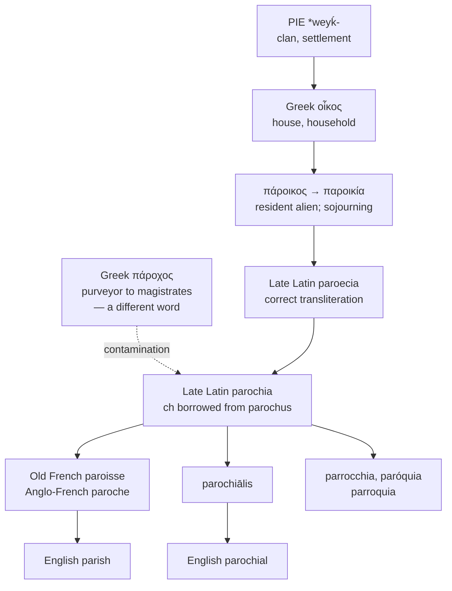

# *Paroikía*: strangers, and a stray consonant

A study of a Greek word for living somewhere you do not belong, and of the letter in *parochial* that was borrowed from an unrelated word about supplying magistrates with firewood.

---

## 1. The root

Greek **παρά** *pará* "beside, near" and **οἶκος** *oîkos* "house, household" compound to **πάροικος** *pároikos*, "dwelling beside" — a neighbour in classical usage, and by extension a resident foreigner.

From it comes **παροικία** *paroikía*, whose sense is precise and legal: sojourning in a foreign land, residency without citizenship. In the Hellenistic and Roman periods *paroikoi* replaced *metics* as the term for foreign residents; in the Byzantine Empire it came to mean a hereditary tenant peasant, comparable to a western serf.

The second element is one of the most productive in the European vocabulary. *Oîkos* descends from Proto-Indo-European **\*weyḱ-** "clan, settlement," which also gives Latin *vīcus* "village, quarter" — whence *vicinity*, *vicinage*, and the *-wich* of *Norwich*, *Ipswich*, and *Greenwich*.

From *oîkos* directly, English holds:

| Greek | English |
|---|---|
| *oikonomía*, household management | **economy**, **economics** |
| *oîkos* + *logía* | **ecology** |
| *oikouménē*, the inhabited world | **ecumenical** |
| *dioíkēsis*, administration | **diocese** |
| *paroikía* | **parish**, **parochial** |

*Parish* and *diocese* are therefore built on the same noun, and so is *economy*. A parish is a household-beside; a diocese is a household-through; an economy is the law of the household.

---

## 2. Strangers in the world

The Christian adoption of *paroikía* is a deliberate reversal of its ordinary sense.

In secular Greek the word meant a defective status — living somewhere without the rights of belonging. Early Christian writers took it as an epithet of pride. First Peter addresses believers as *paroikoi kai parepidēmoi*, sojourners and exiles, on the reasoning that the faithful are resident aliens in the material world and citizens of another.

The community of such sojourners then became the unit of church organisation. In the earliest usage *paroikía* was broader than *dioíkēsis* and could denote what would later be called a diocese; by the thirteenth century the two had settled into their modern relation, with the parish as the smaller unit under a single priest.

In English the word displaced **preostscyr**, "priest-shire" — a native compound naming the district by its clergy rather than by the standing of its people.

The civil sense is later and English: from the 1630s in Great Britain, and thence to some southern American colonies and to Louisiana, where *parish* remains the name of the unit other states call a county.

---

## 3. The stray consonant

Late Latin transliterated the Greek correctly as **paroecia** — *oi* to *oe*, exactly as in *oikonomía* to *oeconomia*.

The form that prevailed, however, was **parochia**, with a *ch*. The Greek word has no χ in it. The *ch* was imported from **parochus**, an earlier and unrelated Latin borrowing from Greek **πάροχος** *párokhos*, meaning an official who supplied visiting magistrates with necessities — lodging, salt, firewood. That word is from παρέχω "to furnish, provide," a different compound with a different second element.

Two Greek words that looked alike in Latin dress therefore contaminated each other, and the wrong consonant won.

English inherited both outcomes and kept them apart by accident:

- **parish**, through Anglo-French *paroche*, *parosse* and Old French *paroisse* — the popular line, where the *ch* was never pronounced as /k/.
- **parochial**, from the learned Latin *parochiālis* — where the borrowed *ch* is pronounced /k/, as Greek χ is in Latin transliteration.

So English *parochial* is pronounced with a consonant that belongs to a word about provisioning officials, and *parish* is not. The two are the same word, and the sound that separates them is a scribal error of the fifth century.

### The error came true

The intruding word was not badly chosen, as it turned out. A *parochus* provisioned those passing through; and the sojourners of *paroikía*, having borrowed his consonant, went on to become the provisioners themselves.

As the western administration failed, the parish took over what the state had stopped doing. It collected the tithe, kept the poor roll, distributed alms, held the register of births and deaths, ran the school, and maintained the road. In England the civil parish outlived the ecclesiastical one as a unit of local government, and in Louisiana it still names the county. The community defined by *not belonging* became, over a thousand years, the institution that supplied everyone within its bounds.

A fifth-century scribe put the provisioner's consonant into the stranger's word. The strangers spent the following millennium earning it.

### Should it be corrected?

The case for restoring *paroecia* is that it is right, and the case against is that it is barren.

Nothing descends from *paroecia*. French *paroisse*, Italian *parrocchia*, Spanish *parroquia*, Portuguese *paróquia*, and English *parish* and *parochial* all continue *parochia* — the contaminated form is the actual ancestor of every word in the comparative set. Restoring the correct transliteration would mean adopting a form that has no descendants, and detaching the word from every cognate it has.

There is also nothing to gain phonetically. English says /k/ in *parochial*, and a corrected spelling would either misreport that or require the same letter by another route. The error is not producing a wrong pronunciation; it produced the pronunciation, fifteen centuries ago, and the language has been built on top of it since.

An orthography that records descent has to record the descent that happened. `Paróchial` keeps the consonant because the consonant is what the word inherited, and because a spelling that corrected it would be describing a Latin word that never had children.

---

## 4. The comparative set

| | The district | The adjective | The member |
|---|---|---|---|
| **Greek** | *paroikía* | — | *pároikos* |
| **Latin** | *paroecia*, *parochia* | *parochiālis* | *parochiānus* |
| **French** | *la paroisse* | *paroissial* | *le paroissien* |
| **Italian** | *la parrocchia* | *parrocchiale* | *il parrocchiano* |
| **Spanish** | *la parroquia* | *parroquial* | *el feligrés* |
| **Portuguese** | *a paróquia* | *paroquial* | *o paroquiano* |
| **English** | *the parish* | *parochial* | *the parishioner* |
| **Inglisce** | *þe pâriçe* | *paróchial* | *þa parician* |

**Spanish breaks the set.** *Feligrés* has nothing to do with *parroquia*: it descends from Latin *fīlī ecclēsiae*, "sons of the church," compressed into a single word. Spanish alone names the parishioner by his relation to the institution rather than by his residence in the district — and in doing so discards the Greek metaphor entirely, since a son of the church is precisely not a sojourner.

**Italian and Spanish double the *r*.** *Parrocchia* and *parroquia* show a gemination absent from the Latin and from French and Portuguese, most likely by expressive reinforcement in a frequently spoken word.

**English doubles the suffix.** Every other language forms the member-noun with one ending: *paroissien*, *parrocchiano*, *paroquiano*, all continuing Latin *parochiānus*. English had that form too — *parishen* around 1200, and the learned doublet *parochian*, obsolete by 1700 — and then added the native agentive *-er* on top of it, producing *parishioner*: an agent suffix stacked on a noun that was already the agent. The word is a suffix longer than any of its cognates and carries no more meaning for it.

---

## 5. The Inglisce forms

**`Paróchial` keeps the stray consonant, and is right to.** The `ch` is /k/, which is the value the digraph carries in Latin transliterations of Greek χ, and although the χ was never in this word, the pronunciation English gives it is genuine. The acute marks the stressed `o` and its quality together. The result is a spelling that states the sound while preserving the scribal history that produced it.

**`Parician` restores the single suffix.** Where English *parishioner* stacks `-er` on an agent noun that needed no help, `parician` renders `-cian` for /ʃən/ and stops — putting the word beside *paroissien*, *parrocchiano*, and *paroquiano*, and beside the Middle English *parishen* that English had before it started adding endings. The `-cian` spelling is the ordinary English one for this sound in *musician*, *physician*, *optician*, and *politician*, all of which are agent nouns of exactly this shape.

**`Pâriçe`** writes /ʃ/ with `ç`, the cedilla giving that value before a front vowel. The sound is the popular outcome — the one Old French *paroisse* and Anglo-French *paroche* carried — so the word keeps the `c` of *parochia* and marks what became of it, where English `sh` files a Greek word in the spelling class of *ship* and *fish*. Set beside `paróchial`, the pair shows the split directly: one `c`, learned and hard, one `c`, popular and hushed.

The circumflex covers the vowel. In Midwestern English the vowel before /r/ is subject to the *Mary–marry–merry* merger, so *parish* is /ˈpɛrɪʃ/ and the `a` English writes is not the /æ/ that letter usually spells.

The article is masculine for `pâriçe` and feminine for `parician`, the stress falling on the first syllable in the one and away from it in the other.
