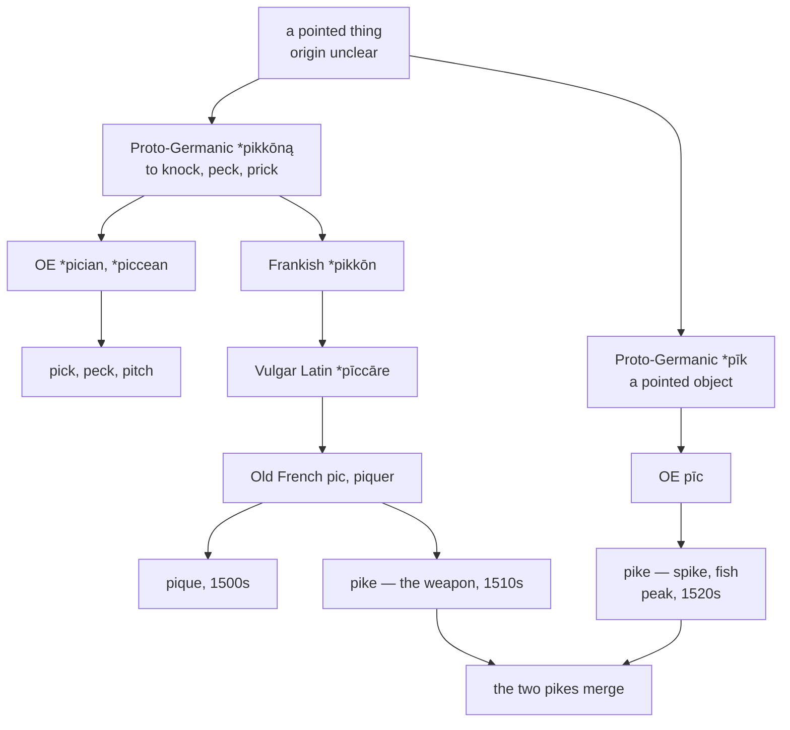

# \**Pikk-*: one point, six words

A study of a Germanic verb meaning *to strike with something sharp*, of the long-vowel twin it kept alongside it, and of the six English words that came out the other end sharing a consonant frame and nothing else.

---

## 1. Two bases, one root

Proto-Germanic held two forms of a single element, differing by vowel length and gemination:

| | Form | Sense |
|---|---|---|
| **Base A** | \**pikkōną* | to knock, to peck, to prick |
| **Base B** | \**pīk* | a pointed object |

Base B is the **collateral long-vowel form** of base A — the two are ablaut variants of one root, related but a step apart. Everything in this page descends from one or the other, and English merged them so thoroughly that the seam is now invisible.

The origin behind them is not secure. The word has no confident Indo-European ancestry, and its distribution across Germanic and Celtic suggests it may have been borrowed rather than inherited. What is certain is that it meant a point, and that it was enormously productive.

---

## 2. The four doublets

Base A produced four English words, and Wiktionary states the relation outright: *pique* is a doublet of *pick*, *pitch*, and *peck*.

| English | Route | Old English |
|---|---|---|
| **pick** | native, reinforced by Old Norse *pikka* | \**pician* |
| **peck** | native, a variant vowel of the same | \**pician* |
| **pitch** | native, palatalised before a front vowel | \**piccean* |
| **pique** | Frankish → Vulgar Latin → Old French | — |

**Pick and peck are barely two words.** Both continue the same fused Middle English *picken* / *piken*; the vowel difference is dialectal variation that got lexicalised into a semantic split. A bird pecks and a person picks, and nothing but usage decides which.

**Pitch is the palatalised member.** Old English \**piccean* had the same base with a front vowel after it, so the *c* palatalised to /tʃ/ by the ordinary rule — the same alternation that gives *bake* : *batch* and *speak* : *speech*.

**Pique took the long road.** Frankish \**pikkōn* entered Gallo-Roman as Vulgar Latin \**pīccāre*, which gave Old French *pic* and the verb *piquer*, and English borrowed it in the sixteenth century. So the word left Germanic, spent five hundred years in Romance, and came back — while its three cousins never moved.

---

## 3. Pike is both bases at once

*Pike* is where the two lines meet, and English merged them without noticing.

| Sense | Attested | From | Base |
|---|---|---|---|
| a spike, a pointed tip | early 1200s | Old English *pīc* | **B** |
| the fish | early 1300s | named for its pointed jaw | **B** |
| the infantry weapon | 1510s | French *pique* | **A** |
| turnpike, a toll road | 1812 | a shortening | **B** |

The 1510s weapon is straightforwardly French *pique*, from *piquer* — the same chain that produced English *pique*. And Etymonline notes that the native word "probably has been influenced by, or is partly from, Old French *pic*," so the two lines did not merely coexist: they merged.

Both meant a sharp point, both sounded alike, and English stopped distinguishing them.

---

## 4. Peak is base B only

*Peak* is a 1520s variant of the native *pike*, meaning the pointed top of a hill. It never went through France, and its relatives are *pike*, *peaked*, and the mountaineering vocabulary.

**Peek is not in the family at all.** Middle English *piken*, of obscure origin — possibly Dutch, possibly a variant of *keek* — and no source connects it to either base. It is a homophone of *peak* and nothing more.

**Prick is not in it either.** West Germanic \**prikojan*, Old English *prician*: an *r* that \**pikkōną* never had, a separate formation. Etymonline goes only so far as saying *pitch* is "related to" it.

---

## 5. The comparative set

| | Base A, native | Base A, through France | Base B |
|---|---|---|---|
| **French** | — | *piquer*, *le pic*, *la pique* | — |
| **Spanish** | — | *picar*, *el pico*, *la pica* | — |
| **Portuguese** | — | *picar*, *o pico*, *a pica* | — |
| **Italian** | — | *piccare*, *il picco*, *la picca* | — |
| **Catalan** | — | *picar*, *el pic*, *la pica* | — |
| **German** | *picken*, *Picke* | *Pike* | — |
| **Dutch** | *pikken* | *piek* | — |
| **English** | pick, peck, pitch | pique, pike (weapon) | pike, peak |

**Romance has the word only by borrowing.** *Picar*, *piquer*, *piccare* are all Frankish through Vulgar Latin; Latin itself had no such verb, using *pungere* and *fodere* instead. The whole Romance family is Germanic vocabulary in Latin clothing.

**German borrowed its own word back.** *Picken* is the inherited verb and *Pike* is a sixteenth-century loan from French — the same round trip English made with *pike* the weapon, from the same source, at the same date.

**Nobody but English has base B.** The long-vowel form left no Romance trace at all, so *peak* and the native *pike* have no continental cousins.

---

## 6. The Inglisce forms

| English | Inglisce | Base |
|---|---|---|
| to pique | `pique` | A, through France |
| pike | `pîque`, `pîx` | A weapon sense, merged with B |
| peak | `peic`, `peix` | B, native |
| to pick | `pic`, `pics`, `piched`, `piching`; `pic`, `pix` | A, native |
| to peck | `pec`, `pecs`, `peched`, `peching` | A, native |
| to pitch | `pic̃e` | A, native, palatalised |
| to peek | `piec` | outside the family |

### What the spellings record

**`Qu` marks the passage through France.** `Pique` and `pîque` carry it; `peic` cannot, being a 1520s variant of a word that never left England. That is the one etymological fact this family's spelling can carry, and it carries it cleanly.

**`Pîque` shows the merger.** The circumflex is base B's vowel and the `qu` is base A's route, so the single form holds both lines — which is exactly the word's history. English *pike* does the same thing and says nothing about it.

**`Peic` takes the default.** `Ei` is /i/ before `c`, so nothing about the form is marked; it is simply what a word looks like when no condition applies to it.

**`Piec` is a separator.** *Peek* has no relation to *peak* and no route to record, so its spelling exists purely to keep the two apart. `Ie` is the /ik/ separator and this is what it is for.

**`Pic̃e` shows the palatalisation.** `Pic` and `pic̃e` are one letter apart, which is the right distance: they are one Old English base, split by a front vowel that is no longer there. English *pick* and *pitch* share three letters and no visible relation.
