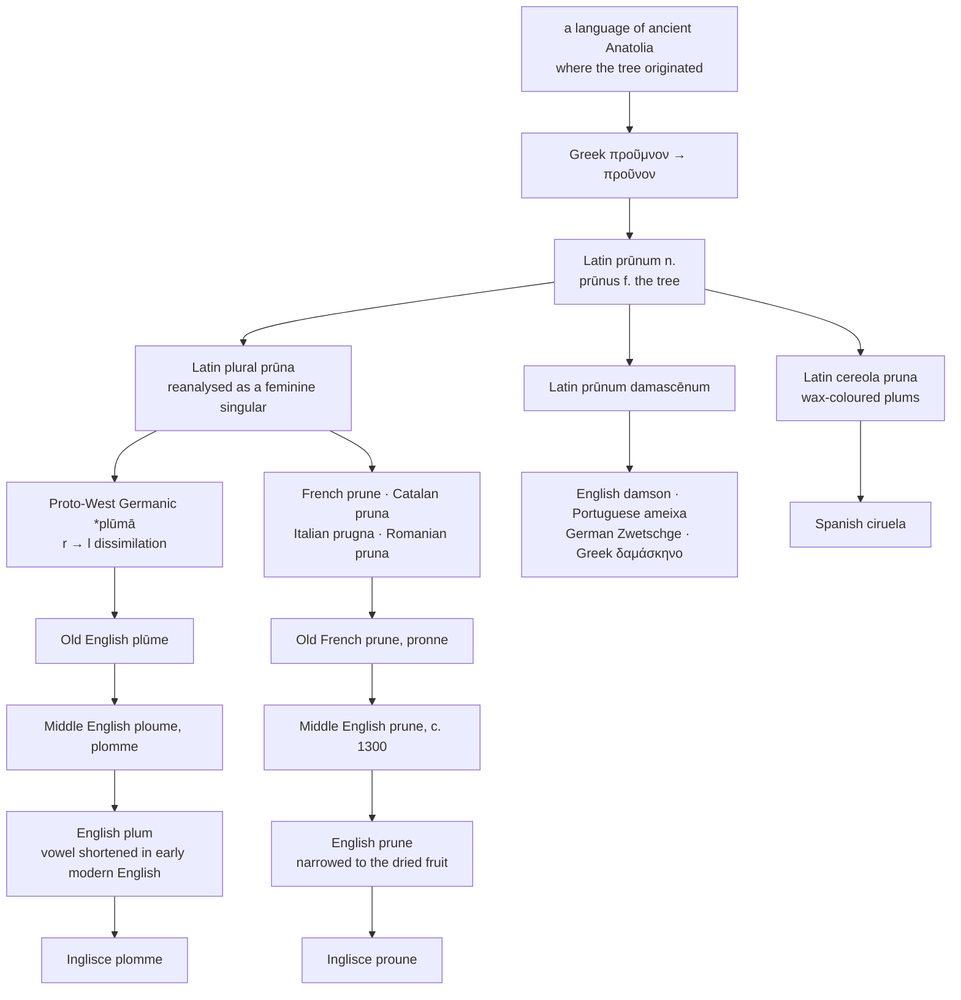

# *Prūnum*: the plural that became a singular, and the *r* that became *l*

A study of a fruit whose name Europe took from Anatolia, of a Latin plural mistaken for a singular by the whole of Romance, of a consonant that changed only in Germanic mouths, and of the one language that ended up with both versions and made them mean different things.

---

## 1. The root is not Indo-European

Greek προῦμνον *proûmnon* "plum," with προύμνη *proúmnē* "plum tree," has no Indo-European family. The later Attic form drops the nasal to προῦνον *proûnon*.

The reason is that neither the word nor the tree is Greek. Both came from Asia Minor, and the word is a loan from some language of ancient Anatolia. Greek took the fruit and the name together, and Latin took both from Greek.

Latin has *prūnum* "the plum," neuter, and *prūnus* "the plum tree," feminine — the ordinary Latin arrangement, where fruit-trees are feminine and their fruits neuter, as with *pirus* / *pirum* and *mālus* / *mālum*.

---

## 2. A plural taken for a singular

*Prūnum* is neuter, so its plural is *prūna*. Neuter plurals in *-a* look exactly like feminine singulars in *-a*, and as the neuter gender collapsed in Vulgar Latin, speakers reanalysed a great many of them as feminines.

*Prūna* was one. "Some plums" became "a plum," and every Romance descendant of the word is feminine singular in form even though it is a Latin plural underneath:

- French *la prune*
- Catalan *la pruna*
- Italian *la prugna*
- Romanian *pruna*

The same reanalysis gave *la feuille* from *folia*, *l'arme* from *arma*, and *la merveille* from *mīrābilia*. It is one of the largest single grammatical events between Latin and Romance, and this word is a clean specimen of it.

English then borrowed the French form and pluralised it again. *Prunes* is a plural of a singular that was already a plural.

---

## 3. The *r* that became *l*

Latin *prūna* was borrowed into West Germanic while Rome was still a presence — early enough for the fruit to be an import and the word to travel with it. In Germanic the first *r* dissimilated to *l*, giving Proto-West Germanic \**plūmā*.

Dissimilation of this kind removes one of two liquids or nasals standing close together. Here the sequence *pr—n* became *pl—m*, and the change is confined to Germanic. No Romance language has it.

The results:

| Language | Form |
|---|---|
| **Proto-West Germanic** | \**plūmā* |
| **Old English** | *plūme* |
| **Middle Dutch** | *prume* |
| **Dutch** | *pruim* |
| **Old High German** | *pfrūma*, *pfluma* |
| **German** | *Pflaume* |
| **Swedish** | *plommon* |
| **Danish** | *blomme* |
| **English** | *plum* |
| **Inglisce** | *plomme* |

Two things are visible in that column. **The change was not complete.** Old High German has both *pfrūma* and *pfluma*, and Dutch never made it at all — *pruim* keeps the *r*. English, German and Swedish went to *l*; Dutch did not.

**And German shifted the *p*.** *Pf-* in *Pflaume* is the Second Sound Shift operating on the initial *p*, which dates the borrowing: the word was already in German before the shift ran, some time before the eighth century. Danish *blomme* went further still and voiced the initial consonant.

Swedish *plommon* is the closest continental form to the Inglisce spelling, and for the same reason: both write the doubled *m*.

---

## 4. Across Romance

| Language | The fruit | The dried fruit |
|---|---|---|
| **Latin** | *prūnum* | *prūnum damascēnum* |
| **French** | *la prune* | *le pruneau* |
| **Catalan** | *la pruna* | *la pruna seca* |
| **Italian** | *la prugna*, *la susina* | *la prugna secca* |
| **Romanian** | *pruna* | *pruna uscată* |
| **Spanish** | *la ciruela* | *la ciruela pasa* |
| **Portuguese** | *a ameixa* | *a ameixa seca* |
| **English** | *the plum* | *the prune* |
| **Inglisce** | þe plomme | þe proune |

**Iberia refused the word.** Spanish and Portuguese are the two Romance languages that did not keep *prūnum* as the ordinary term, and each replaced it differently.

Spanish *ciruela* is from *cereola*, a shortening of *cereola pruna* "wax-coloured plums," a diminutive of *cēreus* "waxen," from *cēra* "wax." It was a Roman varietal name: Columella distinguishes the *pruna cereola* from other kinds, and Spanish is the only Romance language to have generalised it to the whole fruit. So *ciruela* stands in the family of *cirio* "wax candle" rather than in the family of the plum. Spanish does keep *pruna*, but narrowed to certain oblong varieties.

Portuguese *ameixa* is usually derived from *damascēna* "of Damascus" — see the next section — though the etymology is less securely established than *ciruela*'s, and *amygdalina* "almond-grafted," a term Pliny records from Roman Spain, has also been proposed.

Italian is the one language in the set with two live words. *Prugna* is the regular descendant; *susina*, usually traced to Latin *sūsinum*, is the everyday word across much of the country, and modern usage often distinguishes the two by species or by fresh against dried.

---

## 5. The plum of Damascus

Latin called one variety *prūnum damascēnum*, the Damascus plum, and in several languages that epithet displaced the noun entirely:

| Language | Word | From |
|---|---|---|
| **English** | *damson* | *damascēnum* |
| **Inglisce** | *damson* | *damascēnum* |
| **Portuguese** | *ameixa* | *damascēna* |
| **Greek (modern)** | δαμάσκηνο | *damascēnum* |
| **German (regional)** | *Zwetschge* | Vulgar Latin \**davascena* |

English *damson* is therefore the same word as Portuguese *ameixa* and German *Zwetschge*, and all three are a place name. Spanish preserves the phrase intact as *ciruela damascena*, with dialect forms *amacena* and *almacena* showing the same erosion Portuguese completed.

---

## 6. English took the word twice

English holds both halves. *Plum* came in by the Germanic route, borrowed before the year 800 and inherited from Old English *plūme* through Middle English *ploume* and *plomme*. *Prune* came in by the French route around 1300, from Old French *prune*, *pronne*.

They are doublets: one Latin word, entering the same language twice, eight or nine centuries apart, by two different roads, and unrecognisable to each other by the time they met.

**Then English gave them different jobs.** For a while the two words both covered fresh and dried fruit alike, and by the later Middle Ages *prune* had narrowed to the dried one. No other language did this. French *prune* is the fresh fruit and *pruneau* is the dried; Spanish and Portuguese and Italian all use a phrase with "dry" in it. English is alone in having two unrelated-looking nouns for the fresh and the dried fruit, and the split is an accident of having borrowed the same word twice and needing something for the second copy to do.

The consequence is the most reliable false friend between English and French. *Prune* in French is a plum. To an English speaker it is a dried one.

---

## 7. The tree

---

## 9. The Inglisce forms

| English | Inglisce | Plural |
|---|---|---|
| plum | `plomme` | `ploms` |
| prune | `proune` | `prouns` |

**Both halves of the doublet keep an attested Middle English spelling.** *Plomme* and *ploume* both stand in the Middle English record for the fruit, and *prune* is the Middle English form of the other. Nothing here is invented; the page is choosing among spellings English once used.

**`Plomme` takes the sound over the history.** The competing form, `ploume`, would have recorded the long *ū* that Latin *prūna*, Proto-West Germanic \**plūmā* and Old English *plūme* all carried and that English shortened only in the early modern period. It would also have put the two words one letter apart — `ploume` beside `proune` — so that the doublet showed on the page, with the Germanic *l* against the Romance *r* as the only difference.

The vowel history is not lost, only relocated: `proune` is now the only member of the pair carrying the Latin *ū*, which is correct, because it is the only member where English still pronounces it.

**The doubled `m` is doing the work.** A doubled consonant marks the preceding vowel short — English's own device, *hopping* against *hoping* — and here it separates `plomme` from any reading with a long vowel. Swedish arrived at the same spelling from the same need in *plommon*.

**`Prouns` is a plural three times over.** Latin *prūnum* was pluralised to *prūna*; *prūna* was mistaken for a singular and pluralised again in French; English took the French form and added *-s*; Inglisce keeps that *-s*. Every layer is still on the word, and only the outermost one is doing any work.

**`Damson` is left as English spells it.** That is defensible for a word that is a place name rather than a fruit name.
