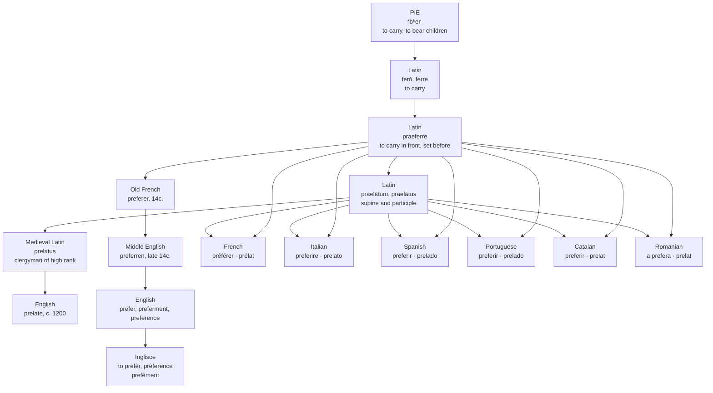

# *Praeferre*: carried in front

A study of a verb that meant a torch held out ahead of you, of the bishop it produced, and of a language that uses a doubled consonant where a mark would do.

---

## 1. To carry in front

Latin **praeferre** is *prae*, "before, in front," plus *ferre*, "to carry, to bear." The literal sense is exactly that and nothing more figurative: to hold a thing out ahead, to bear it in front of you.

The oldest attestation in the dictionaries is entirely physical. Valerius Aedituus, writing in the second century before Christ, asks *Quid faculam praefers, Philerōs?* — why are you carrying that torch in front, Phileros? — and answers himself that they have no need of it, since the flame in his breast gives light enough. A man walking ahead of another with a light: that is *praeferre*.

From there the figurative uses are short steps. To carry a thing in front is to display it, so *praeferre* is to show or profess. To set one man in front of another is to rank him higher. To place a thing before you is to choose it.

---

## 2. The verb with two stems

*Ferō, ferre* is the great suppletive verb of Latin, and *praeferre* inherits the damage: present *praeferō*, perfect **praetulī**, supine **praelātum**. Three principal parts and two of them share no material with the first.

*Ferō* and *ferre* descend from Indo-European *\*bʰer-*, "to carry," the root behind English *bear*. Where *tulī* and *lātum* come from is less settled than it is usually made to sound. Watkins derived *lātus* from an earlier *\*tlātos*, on the root that gives *tollere* and *tolerāre* and Greek *Átlas*; de Vaan's judgement is blunter, that no good etymology is available. The page should carry that hesitation rather than smooth it.

What is not in doubt is the practical consequence. Any word built on *praeferre*'s present stem and any word built on its supine will look nothing alike.

---

## 3. The prelate

**Praelātus** is the past participle: carried in front, set before, preferred. Used as a noun it means *one who has been preferred*.

Medieval Latin took it as *prelatus*, a clergyman of high rank, and English had **prelate** by about 1200 — a bishop, a pope, the superior of a religious house. A prelate is, in the word's own terms, a man set over others.

From it Medieval Latin built *praelatia*, which reached English through Anglo-Norman *prelacie* as **prelacy**: the office of a prelate, and then the whole body of them, and then church government by prelates as a system.

That third sense turned the word into a weapon. In the sixteenth and seventeenth centuries *prelacy* is what the episcopal order is called by people who want it abolished — the Marprelate tracts of 1588 announce the tone in their title, and Milton's five antiprelatical pamphlets of 1641 and 1642 carry it through, one of them titled *The Reason of Church-Government Urged against Prelaty*. Milton's spelling was *prelaty*, straight off the Medieval Latin, and Webster's dictionary of 1828 still lists it with a single citation and the note that it is not in use. In Scotland the word stayed hot longer than the institution did.

The quarrel is inside the word. Milton's case was that scripture shows no difference between a bishop and a presbyter — that nobody in the church should stand above anybody else. Which is to say the argument against prelacy was an argument against anyone being *praelatus*: carried in front.

So English holds *prefer* and *prelate*, the two stems of one Latin verb, and no English speaker connects them. One is a verb of taste and the other is a bishop. The image behind both is the same procession: someone walks in front.

---

## 4. What *prefer* meant first

Not liking. Promotion.

When *preferren* enters English in the late fourteenth century, the first sense on record is to put forward or advance in rank or fortune, to promote someone to an office or a dignity, to further a person's interest. The sense we now use — to esteem one thing above another — is attested from the same period, but the older meaning is the one that shaped the family.

It survives in the law, where it never softened. You **prefer charges** or prefer an indictment: you put them forward before a court. A creditor is preferred over other creditors, meaning paid first. **Preferred stock** is stock carried in front, satisfied before the common shares. In every one of these the verb still means to place ahead, not to like.

It survives more visibly in **preferment**, which appears in the middle of the fifteenth century meaning the furtherance of an undertaking, advancement in status, or a prior claim, and by the 1530s means a superior office, especially in the Church. A clergyman seeking preferment was not expressing a taste. He wanted to be carried in front.

**Preference** followed the same road and travelled further. It appears about 1450 as *preferraunce*, meaning advancement in position or status; it means the act of preferring by the 1650s; and only in **1852** does it come to mean the thing one prefers, the object of choice. The commonest sense of the word today is Victorian.

---

## 5. What Romance did

*Ferre* was athematic and irregular and no Romance language kept it, so the compounds had to be taken again from the books. They were, and the languages disagreed about how to conjugate them.

French took the first conjugation: **préférer**. Italian, Spanish, Portuguese and Catalan took the fourth: **preferire**, **preferir**, **preferir**, **preferir**. Romanian has **a prefera**.

The supine went into all of them intact and separately: French *prélat*, Italian *prelato*, Spanish and Portuguese *prelado*, Catalan and Romanian *prelat*. Every language in the family therefore holds both stems, and in every one of them the two words look unrelated, exactly as they do in English.

---

## 6. The comparative set

| Language | The verb | The noun | The adjective | From the supine |
| :--- | :--- | :--- | :--- | :--- |
| **Inglisce** | to prefêr | prèference | preferencial | prèlat |
| English | to prefer | preference | preferential | prelate |
| French | préférer | préférence | préférentiel | prélat |
| Italian | preferire | preferenza | preferenziale | prelato |
| Spanish | preferir | preferencia | preferente, preferencial | prelado |
| Portuguese | preferir | preferência | preferencial | prelado |
| Catalan | preferir | preferència | preferent | prelat |
| Romanian | a prefera | preferință | preferențial | prelat |

Three columns and three different disagreements. The verb was fitted to whichever conjugation was productive locally, French and Romanian to the first and the rest to the fourth, with nothing in the Latin to decide it. The noun is the one place everybody agrees: *praeferentia* went into all of them unchanged but for the ending.

The adjective divides on a point of grammar. Spanish *preferente* and Catalan *preferent* are the Latin present participle, *praeferentem*, taken as an adjective in its own right — a form that already existed and only had to be inherited. French *préférentiel*, Italian *preferenziale*, Portuguese *preferencial* and English *preferential* are built instead on the noun, with *-ial* stacked on top of *-entia*, which is a suffix on a suffix on a participle stem. Romanian did neither and simply borrowed the French word; the Romanian dictionaries give *préférentiel* as the source outright.

Then the last column, where every language holds a churchman it does not connect to the rest of the row. English is not unusual in failing to hear *prefer* in *prelate*. Nobody hears it.

One English word has no column at all. **Preferment** is not a borrowing but a domestic assembly, *prefer* plus *-ment*, put together in England in the fifteenth century out of French parts.

---

## 7. The Inglisce forms

**to prefêr** · prefê, prefês, prefêd, prefêring
**prèference** · **preferencial** · **prefêment**
**prèlat** · **prelacie**, prelacis

Three marks and three values, on a letter English writes the same way every time.

The syllable *-fer-* is stressed and r-coloured in *prefêr*, *prefêring* and *prefêment*, and takes the **circumflex**. It is stressed and plain in *prèference*, where the weight has moved to the front of the word and the vowel with it, and takes the **grave**. It is unstressed in *preferencial*, where the weight has moved past it onto *-en-*, and takes nothing at all.

English gives a reader none of this. *Prefer*, *preference*, *preferential* and *preferment* are spelled with the same three letters in the same position, and they say /prɪˈfɜr/, /ˈprɛfərəns/, /ˌprɛfəˈrɛnʃəl/ and /prɪˈfɜrmənt/. One spelling, three vowels, three positions of stress, and no signal anywhere.

The **r** appears only where it is a consonant standing before a vowel. That is why *prefêring* has one and *prefês* and *prefêd* do not, and it is why **prefêment** has none: nothing in /prɪˈfɜrmənt/ comes between the vowel and the *m*. English writes *preferment* with an *r* that spells nothing at all.

And here is what the marks are really replacing. Look at where English doubles the consonant in this family: *preferred*, *preferring*, *preferment* — all with two, all stressed on *-fer-*. Then look at *preference* and *preferential*, both with one, both stressed elsewhere. English is already using consonant doubling as a stress diacritic. It is simply doing it with a letter instead of a mark, and doing it unreliably — the OED observes that *preferrable* would be the better spelling and has not prevailed, which is a dictionary admitting the system has failed in a particular case.

Put the stress mark on the vowel where it belongs, and the consonant is released. One *r* throughout, doing consonant work only, while the vowel carries its own information. Nothing wavers, because there is nothing left for the doubling to decide.

The two words off the participle behave the same way and show the mark's economy from the other side. **Prèlat** takes the grave for the same reason *prèference* does: the syllable is stressed and its vowel is plain, and without the mark an initial *pre-* would be read the way it is read in *prefêr*. **Prelacie** takes nothing, and does not need to. Its ending settles the question — English *-acy* words put the weight three syllables from the end without exception, so *prelacie* can only be stressed where it is, and a mark would state what the shape of the word already states. The *-ence* words are marked precisely because their ending settles nothing: English says PREference and deTERrence and transFERence, three stresses on one suffix, and every one of them has to be spelled out.
