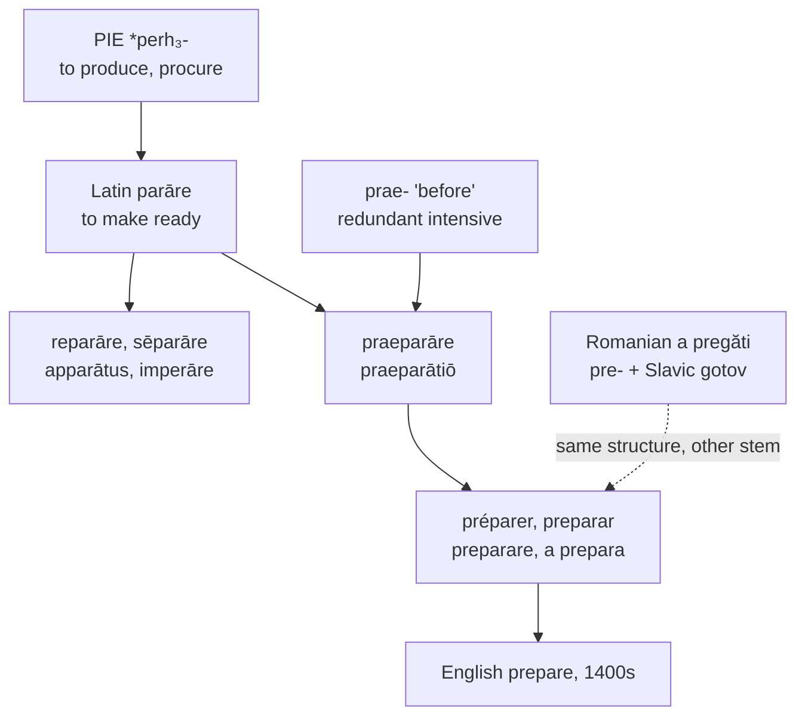

# *Praeparāre*: ready, and ready beforehand

A study of a verb that says the same thing twice, of the very large family it belongs to, and of a single letter that English uses for four vowels and pronounces two ways in the same stem.

---

## 1. The root

Latin *parāre* means "to make ready, to set in order, to procure, to furnish." It descends from Proto-Indo-European **\*perh₃-** "to produce, to procure."

To it Latin prefixed *prae-* "before, in front," from **\*per-** "forward, through" — the same element as in *prae-cedere*, *prae-dicere*, and *prae-videre*, and cognate with English *for-*, *fore-*, and *first*.

**Praeparāre** therefore means "to make ready beforehand." Since *parāre* already means to make ready, and readiness is by nature prior to the thing it is readiness for, the prefix adds no information. It is an intensive rather than a specifier — Latin doubling a sense for emphasis, as it does in *percutere* and *conficere*.

English inherited the redundancy without noticing it. *Preparation* is pre-readying, and *to prepare in advance*, a phrase in ordinary use, says the same thing three times.

---

## 2. The family

*Parāre* is among the most productive verbs Latin bequeathed to English, and the descendants have scattered so widely that few of them look related.

| Latin | English |
|---|---|
| *praeparāre* | **prepare**, **preparation** |
| *reparāre* | **repair**, **reparation** |
| *sēparāre* | **separate**, **sever**, **several**, **severance** |
| *apparātus* | **apparatus**, **apparel** |
| *imperāre* (*in-* + *parāre*) | **emperor**, **empire**, **imperative** |
| *parāre* directly | **pare**, **parry**, **parade**, **parasol**, **parachute** |
| *vituperāre* | **vituperate** |

Some of these repay a second look. *Several* is *sēparāre* — things set apart, hence more than one. *Apparel* and *apparatus* are the same word, one through French speech and one from the Latin page. *Parasol* and *parachute* are Italian and French compounds meaning "ward off sun" and "ward off fall," using the verb in its sense of making ready *against* something. And an *emperor* is *in-parāre*, one who arranges things.

So *prepare*, *repair*, *separate*, *emperor*, *apparel*, and *parachute* are one verb, and the thread running through all of them is getting something ready.

---

## 3. What Romanian did instead

Every western Romance language kept the Latin verb. Romanian did not use it for the everyday sense.

Romanian **a pregăti** is a hybrid: the Latin prefix *pre-* attached to *a găti*, from Slavic *gotov* "ready." The structure is identical to *praeparāre* — a prefix meaning "before" on a stem meaning "ready" — but the stem is Slavic rather than Latin.

Romanian did later borrow *a prepara* from French, and it survives in narrow technical senses, chiefly of preparing substances. The ordinary verb is the Slavic-stemmed one.

The result is that Romanian built the same word twice from different materials, and kept both.

---

## 4. The comparative set

| | The verb | The noun |
|---|---|---|
| **Latin** | *praeparāre* | *praeparātiō* |
| **French** | *préparer* | *la préparation* |
| **Spanish** | *preparar* | *la preparación* |
| **Portuguese** | *preparar* | *a preparação* |
| **Italian** | *preparare* | *la preparazione* |
| **Catalan** | *preparar* | *la preparació* |
| **Romanian** | *a pregăti*, *a prepara* | *pregătirea*, *prepararea* |
| **English** | *to prepare* | *the preparation* |
| **Inglisce** | *to prepâre* | *þa preparâcion* |

The set is unusually well behaved. Every language keeps the stem intact between verb and noun, every one continues the first conjugation, and the only divergence is French *é* for the prefix vowel, marking a quality distinction French needs and the others do not.

---

## 5. The Inglisce forms

English writes `a` in the stressed syllable of both words and pronounces it two different ways:

| | English | The stem vowel |
|---|---|---|
| *prepare* | /prɪˈpɛr/ | /ɛ/ |
| *preparation* | /ˌprɛpəˈreɪʃən/ | /eɪ/ |

Nothing in the spelling accounts for the difference, and `a` is meanwhile also spelling /æ/ in *cat*, /ɑ/ in *father*, and /ə/ in the second syllable of *preparation* itself. One letter, four values, distributed by no rule a reader could state.

**`Prepâre` and `preparâcion` write the stem vowel with `â` in both**, and the two surface values follow automatically. `Â` is /eɪ/; before `r` it merges to /ɛ/, by the *Mary–marry–merry* merger that governs Midwestern English. So `preparâcion` has /eɪ/ because a `c` follows, and `prepâre` has /ɛ/ because an `r` does. The letter states one thing and the environment does the rest.

The unstressed vowels are left to reduce on their own. The `a` of `prepa-` in `preparâcion` is /ə/ and is written plain, the mark being reserved for the syllable that carries the stress.

**`Preparâcion` writes the suffix `-cion` for /ʃən/**, aligning the word with *preparación*, *preparação*, and *preparació* rather than leaving English alone with a `ti` that spells /ʃ/ here and /t/ almost everywhere else.

The article is feminine, `þa`, the stress falling away from the first syllable.
