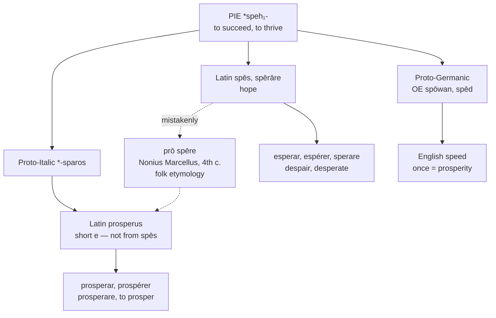

# *Prosperus*: hope, speed, and a grammarian's guess

A study of a word whose famous etymology is probably wrong, and of the Germanic cousin it has been hiding in plain sight — a word every English speaker uses daily without suspecting it once meant *prosperity*.

---

## 1. The received explanation

Almost every dictionary tells the same story. Latin *prosperus* is *prō spēre*, "according to one's hope," from *prō* "for, according to" and an ablative of *spēs* "hope." To prosper is for things to go as you hoped.

The story is old. It is recorded by Nonius Marcellus, a grammarian of the fourth or fifth century, and it has been repeated ever since.

It is also, on the best current view, **a folk etymology** — an explanation invented after the fact by a speaker who noticed a resemblance. The objection is phonological and decisive: *prosperus* has a **short** *e*, and *spēs* has a long one. An ablative of *spēs* cannot produce the vowel the word actually has.

The likelier account has no phrase in it. *Prosperus* descends from Proto-Italic \**-sparos*, from Proto-Indo-European \**sph₁rós* "thriving," an adjective formed directly on the root **\*speh₁-** "to succeed, to thrive." *Spēs* is built on the same root, so the two words are relatives — but *prosperus* is not made out of *spēs*, and never was.

The distinction matters for the page: the family is not about hope. It is about thriving, and hope is one of its branches rather than its trunk.

---

## 2. The Germanic cousin

The root \**speh₁-* is well attested outside Italic, and its Germanic descendant is a word no English speaker would connect to *prosper*.

Old English **spōwan** meant "to prosper, to succeed." Its noun **spēd** meant "success, a successful course; prosperity, riches, wealth; luck, good fortune; opportunity, advancement." That noun is modern English **speed**.

The sense of rapidity is a late-Old-English development, arising first in adverbial use, and the meaning "rate of motion" only from the mid-fourteenth century. For most of its life the word meant what *prosperity* means.

Two fossils preserve the older sense:

- **Godspeed** is not a wish for haste. It is *God spede*, "may God grant you success" — a subjunctive of the verb, and a blessing of prosperity for a journey.
- **To speed** in the sense of thriving survives in the archaic *how speeds your suit?* and in *ill-sped*.

So *prosper* and *speed* are the same Indo-European word arriving in English twice: once through Latin and French in the fourteenth century, once through Germanic without interruption. They now mean thriving and velocity respectively, and nothing about either form suggests the other.

The wider cognate set confirms the sense: Sanskrit *sphāyate* "increases," *sphira-* "fat"; Old Church Slavonic *spěti* "to succeed"; Russian *spet'* "to ripen"; Hittite *išpai-* "to be satiated."

---

## 3. The hope branch

*Spēs* did generate a family of its own, and Romance kept it thoroughly.

From *spērāre* "to hope" come Spanish *esperar*, Portuguese *esperar*, French *espérer*, Italian *sperare*, and Catalan *esperar* — with the Iberian verbs carrying the additional sense "to wait," on the reasoning that waiting is hoping with time attached.

The nouns are *esperanza*, *esperança*, *espérance*, *speranza*, *esperança*. Dante's inscription over the gate of Hell — *lasciate ogne speranza* — uses this word, and so does the name **Esperanto**, "one who hopes," the pseudonym under which Zamenhof published.

English took the negatives rather than the positives. *Dēspērāre*, "to be without hope," gives **despair**, **desperate**, and **desperado**; the Latin adjective *prosperus* gives the positive side. English has no descendant of *spērāre* itself and uses the Germanic *hope* instead.

---

## 4. The comparative set

| | The verb | The quality | The adjective |
|---|---|---|---|
| **Latin** | *prosperāre* | *prosperitās* | *prosperus* |
| **French** | *prospérer* | *la prospérité* | *prospère* |
| **Spanish** | *prosperar* | *la prosperidad* | *próspero* |
| **Portuguese** | *prosperar* | *a prosperidade* | *próspero* |
| **Italian** | *prosperare* | *la prosperità* | *prospero* |
| **English** | *to prosper* | *the prosperity* | *prosperous* |
| **Inglisce** | *to prosper* | *þa prosperetie* | *prosperus* |

**The adjective column is a study in accentuation.** All five Romance forms stress the same syllable, and each language handles it differently. Spanish and Portuguese *próspero* carry an obligatory acute, because the word is *esdrújula* — stressed on the antepenultimate — and Iberian orthography marks every such word without exception. Italian *prospero* has identical stress and no accent, Italian marking only final stress. French *prospère* has a grave, but it is recording vowel quality rather than position, since French stress is fixed. English *prosperous* marks nothing at all.

Four conventions, one stress pattern. The Iberian rule is the only one from which a reader can derive the pronunciation without knowing the word.

**Only English adds a suffix to the adjective.** *Prosperus* was already an adjective in Latin, and French, Spanish, Portuguese, and Italian simply continue it. English attached *-ous*, on the model of its other Latin adjectives, producing a form one syllable longer than any of its neighbours and one suffix further from the Latin.

---

## 5. The Inglisce forms

**`Prosperus` drops the English suffix**, returning the adjective to the shape Latin gave it and the shape every Romance language retains. English *prosperous* is *prosperus* with `-ous` added to a word that did not need it; the Inglisce form is the Latin adjective unchanged, and it puts the word beside *próspero*, *prospero*, and *prospère* where English stands alone.

**The verb alternates its stem.** The non-finite forms keep `-er` — `to prosper`, `prospering` — while the finite forms take `-re`: `prospre`, `prospres`, `prospred`. Both spell the same sequence, so what the alternation encodes is not sound but grammatical category, marking the citation form and the participle apart from the inflected ones.

English has no such distinction. *To prosper* and *I prosper* are one form, and have been since the loss of the Middle English infinitive ending, so a reader meets *prosper* with no indication of which it is. Every Romance language in the table keeps them apart — *prospérer* against *elle prospère*, *prosperar* against *ella prospera* — and the Inglisce verb restores a division English discarded rather than importing a foreign one.

**`Prosperetie`** settles two separate things, and it is worth taking them apart.

*The final vowel.* English *prosperity* ends in /i/ and writes it `y` — a letter that also serves as a consonant in *yes*, spells /aɪ/ in *my* and *type*, and spells /ɪ/ in *myth*. `-ie` gives the vowel a letter that is not doing three other jobs, and it aligns the ending with the Romance abstract nouns rather than leaving English alone with a symbol none of them use in this position.

*The vowel before it.* Latin *prosperitātem* has *i*, and so do French *prospérité*, Spanish *prosperidad*, Portuguese *prosperidade*, and Italian *prosperità*. Inglisce writes `e`. The syllable is /ə/ in English and carries no information of its own, so the letter is free to be chosen for what it does in the word rather than for what it was in Latin.

The two decisions answer to one fact about English. The suffix is fully pronounced in Romance — Spanish *prosperidad* is /pɾospeɾiˈðað/, with the *i* a real vowel bearing its own syllable, and Italian *prosperità* is /prosperiˈta/, the accent carried onto the final vowel. English does neither: *prosperity* is /prɑˈspɛrəti/, the suffix vowel reduced to schwa and the accent retracted onto the stem, two syllables from where Romance puts it.

That retraction is the suffix's most conspicuous property in English. ***Pros**perous* and *pros**per**ity* differ in accent as well as ending, and the same displacement runs through the class — ***a**ble* becomes *a**bil**ity*, ***va**rious* becomes *va**ri**ety*, ***cu**rious* becomes *curi**os**ity*. A suffix that moves the stress and then reduces its own vowel is doing two things at once, and English marks neither.

Writing `-etie` rather than `-ity` is therefore not a cosmetic respelling. It records what English actually does with the ending: the vowel that Romance pronounces is written with a letter that reduces.

The article is feminine, `þa`, the stress falling away from the first syllable.
