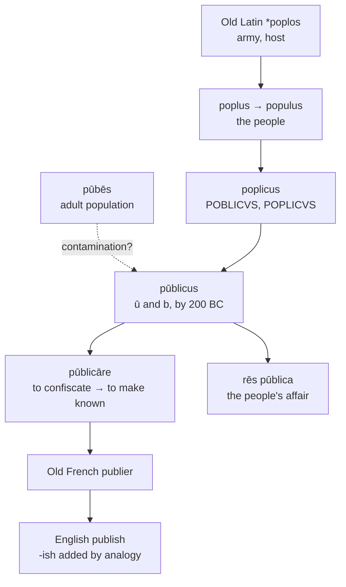

# *Pūblicus*: of the people, with a borrowed consonant

A study of a word that may have taken its middle letter from an unrelated word about pubic hair, and of two English derivatives that share seven letters and pronounce the seventh differently.

---

## 1. The root

Old Latin **\*poplos** "army, host" gives Old Latin *poplus* and thence classical *populus* "the people." From it English holds *people*, *popular*, *populace*, *population*, *publican*, and — through Spanish — *pueblo*.

The adjective was originally **poplicus**, and the inscriptional record preserves it: POBLICVS and POPLICVS appear in stone, and the Senate's decree on the Bacchanalia of 186 BC has IN POPLICOD. The cognomen of Publius Valerius Publicola, "friend of the people," is attested equally as *Poplicola*.

By the second century BC the word had become **pūblicus**, with a long *ū* and a *b* where the older form had a *p*.

---

## 2. The consonant that may be borrowed

How *poplicus* became *pūblicus* is disputed, and the traditional explanation is the more interesting one.

**The contamination account.** Latin *pūbēs* meant the adult male population — the men of military age, the manpower of a state — and by extension the physical sign of adulthood, from which English has *puberty*, *pubescent*, and *pubic*. The claim is that *poplicus* was drawn toward *pūbēs* by resemblance of sense: both words concern the body of grown men who constitute a community. The long *ū* and the *b* would then be borrowed from a word about physical maturity into a word about civic membership.

**The sound-change account.** The alternative treats the shift as regular, in two steps: the medial *p* voiced to *b*, and the *o* broke to *ou* before monophthongising to *ū*. The spelling *poublicom* is attested and would represent the intermediate stage.

De Vaan takes the contamination view; others hold that a regular change cannot be ruled out. Either way, both changes were complete by about 200 BC.

If the traditional account is right, *public* and *pubic* are not merely near-homographs. The first would owe its shape to the second, and the resemblance that makes them a hazard for typesetters would be a genuine relation rather than an accident.

---

## 3. The thing of the people

*Rēs pūblica* — the affair, or property, of the people — was the Roman name for the state itself, and Cicero states the equivalence directly: *res publica res populi*. English *republic* is that phrase compressed.

The Romans had no abstract noun for "the state" independent of the persons composing it. *Populus Rōmānus* was the technical designation, and it was the *populus* that elected magistrates, passed laws, declared war, and dealt with the gods. What English calls public affairs the Romans called the people's business, and meant it literally.

*Pūblicāre* accordingly meant to make state property — to confiscate — before it meant to make known. The sense of issuing a text is medieval.

---

## 4. Another suffix that was never there

English *publish* ends in *-ish*, and the ending has no business in this word.

That suffix, in *finish*, *punish*, *nourish*, and *perish*, is the French *-iss-* stem — the extended form second-group French verbs show through part of their paradigm, continuing the Latin inchoative *-scere*.

French *publier* is not a second-group verb. It is first conjugation throughout: *je publie*, *nous publions*, with no extended stem anywhere. No other language in the set has one either — Spanish *publico*, Portuguese *publico*, Italian *pubblico*.

English added the ending by analogy with the verbs *publish* happened to resemble, exactly as it did to *distinguish*, *extinguish*, *admonish*, and *astonish*. The result is a verb a syllable longer than any of its cognates, carrying a morpheme that means nothing in it.

---

## 5. The comparative set

| | The verb | The adjective | The renown | The act | Adjective of capacity |
|---|---|---|---|---|---|
| **Latin** | *pūblicāre* | *pūblicus* | — | *pūblicātiō* | — |
| **Spanish** | *publicar* | *público* | *la publicidad* | *la publicación* | *publicable* |
| **Portuguese** | *publicar* | *público* | *a publicidade* | *a publicação* | *publicável* |
| **Italian** | *pubblicare* | *pubblico* | *la pubblicità* | *la pubblicazione* | *pubblicabile* |
| **French** | *publier* | *public*, *publique* | *la publicité* | *la publication* | *publiable* |
| **English** | *to publish* | *public* | *the publicity* | *the publication* | *publishable* |
| **Inglisce** | *to publiçe* | *public* | *þa publicitie* | *þa publicâcion* | *publiciable* |

Three things in the columns.

**Italian geminates.** *Pubblicare* and *pubblico* double the *b* by the regular Italian treatment of Latin *-bl-*, which also gives *nebbia* from *nebula* and *doppio* from *duplus*.

**French alone inflects the adjective.** *Public* and *publique* are masculine and feminine, French needing the *-que* to keep the consonant hard before a front vowel. Spanish, Portuguese, and Italian mark gender on the final vowel and leave the stem alone.

**The verb's ending is unstable.** Latin *pūblicāre* is first conjugation, and Spanish, Portuguese, and Italian keep it there. French moved it to the *-ier* type, and English then made a second alteration on top of the French one.

---

## 6. The Inglisce forms

NEEDS EDIT
