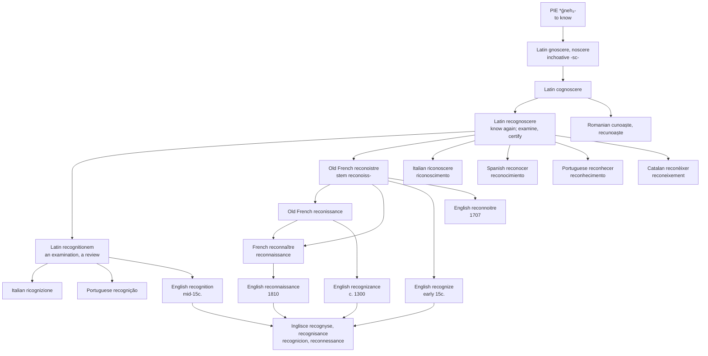

# *Recognoscere*: the second look

A study of a Latin verb that every Romance language inherited once and English borrowed five times, ending with four words that no longer look related.

---

## 1. The root

Latin **gnōscere**, later *nōscere*, "to come to know," descends from Proto-Indo-European **\*ǵneh₃-** "to know" — the root that gives English *know* and *can* through Germanic, *gnosis* and *diagnosis* through Greek, and *noble*, *notice*, *narrate* and *quaint* through Latin.

Two pieces of Latin morphology in the verb matter for everything that follows.

The first is the inchoative infix **-sc-**, which marks a verb of becoming rather than being: *gnōscere* is not "to know" but "to come to know, to get acquainted with." Latin has the pair *nōvī* "I know" against *nōscere* "I am finding out." This infix leaves a visible deposit in every daughter language, and it is the source of a letter the Inglisce forms preserve.

The second is the prefix in **cognōscere**, an assimilated form of *com-*, giving "to get to know thoroughly." Adding *re-* produces **recognōscere**, "to know again, recall to mind, identify" — and also, from the beginning, "to examine, to inspect, to certify." The two senses that English now splits between *recognise a face* and *carry out a reconnaissance* are one word in Latin, and neither is a metaphor for the other. To recognise is to look a second time and check.

The past-participle stem gives **recognitionem**, "an examination, an inquiry, a review." That noun and that verb take separate roads out of Latin, and they are still apart.

---

## 2. What Romance did with it

*Cognōscere* survived into daily speech everywhere, and its shape records two regular sound changes.

The Latin cluster **-gn-** does not survive as written. It palatalises or simplifies: Italian *conoscere*, Spanish *conocer*, French *connaître*, Catalan *conèixer*, Romanian *cunoaște*, and — most transparently — Portuguese *conhecer*, where the digraph *nh* spells /ɲ/ and is the direct descendant of the Latin *gn*. Old Galician-Portuguese has *reconnocer* with the geminate.

The inchoative **-sc-** survives as a sibilant, and it is easiest to see where the conjugation exposes it: Spanish *reconozco*, *reconozca*; Romanian *cunosc*; Catalan *conèixer* with its *-ix-*; and in French the present-participle stem **reconoiss-**, from Latin *-scent-*, which is the piece that will matter most below.

On this inherited verb each language built its own nouns and adjectives, and they are all recognisably the verb: French *reconnaissance* and *reconnaissable*, Spanish *reconocimiento* and *reconocible*, Portuguese *reconhecimento* and *reconhecível*, Italian *riconoscimento* and *riconoscibile*, Catalan *reconeixement*, Romanian *recunoaștere*. A Spanish speaker meeting *reconocimiento* for the first time can parse it. That is what an inherited family looks like.

Two languages also keep a second, learned noun taken straight from *recognitionem*: Portuguese **recognição** beside *reconhecimento*, Italian **ricognizione** beside *riconoscimento*. The pairs are doublets in the ordinary sense — same origin, different routes, both alive, and visibly related to each other.

---

## 3. What English did instead

English inherited none of this. There is no native descendant of *cognōscere* in the language, so every member of the family had to be fetched, and English fetched them one at a time over five centuries.

**Recognizance**, early 14c., *reconisaunce* — a legal bond acknowledging an obligation, from Old French *reconissance*.

**Recognize**, early 15c., *recognisen*, and not meaning what it means now: "to resume possession of land." Etymonline gives it as either a back-formation from *recognizance* or a borrowing of the Old French stem *reconoiss-*. The sense "know again, recall the knowledge of" waits until the 1530s.

**Recognition**, mid-15c., *recognicion*, from Old French *recognition* and directly from Latin *recognitionem* — the examination sense, entering separately and by a different door.

**Reconnoitre**, 1707, from older French *reconnoitre*, "to make a survey" for military or engineering purposes.

**Reconnaissance**, 1810, a word of the Napoleonic Wars, from French *reconnaissance*.

Five borrowings, one Latin verb. And because each arrived at a different date from a different form, they no longer look like relatives: *recognize* and *reconnaissance* share a Latin ancestor, a meaning, and almost no letters.

The Spanish entry makes the contrast plain. The DLE lists among the ordinary senses of *reconocer*: "explorar de cerca un lugar para obtener una información determinada." What English had to import from Napoleon's army as a separate noun is, in Spanish, simply something the everyday verb does.

---

## 4. The doublet: *recognizance* and *reconnaissance*

The sharpest case is the two that are the same French word.

Old French *reconissance*, from the participial stem *reconoiss-*, entered English around 1300 as *reconisaunce* and settled as **recognizance**, a term of law. It is still in use: to be released *on one's own recognizance* is to be let go on a written promise to appear, which is a bond acknowledging an obligation, exactly as in 1300.

The same French word, by then spelled *reconnaissance*, entered English again in 1810 as a term of war. Five hundred years separate the two borrowings; nothing else does.

The spellings record the gap. *Recognizance* was re-Latinised at some point after its arrival — the *g* is not in the Old French and not in the pronunciation of the French — while *reconnaissance* came in late enough to keep the French *-nn-* and the French shape entire. So English holds one word in two spellings, one dressed as Latin and one as French, and treats them as unrelated.

**Reconnoitre** (1707) is the same French verb caught a century before the noun, which makes three helpings from the French side alone.

---

## 5. The comparative set

| | Verb | Noun | What the form records |
|---|---|---|---|
| **Latin** | *recognoscere* | *recognitionem* | One verb for knowing again and for inspecting. |
| **French** | *reconnaître* | *reconnaissance* | Inherited. *-gn-* to *-nn-*; *-sc-* to *-ss-* through the participial stem. |
| **Spanish** | *reconocer* | *reconocimiento* | Inherited. The *-sc-* surfaces in *reconozco*. Scouting is a sense of the plain verb. |
| **Portuguese** | *reconhecer* | *reconhecimento* | Inherited. *nh* is the direct outcome of Latin *gn*. |
| **Portuguese** | — | *recognição* | The learned doublet, from *recognitionem*, alive beside the inherited noun. |
| **Italian** | *riconoscere* | *riconoscimento* | Inherited, and the closest of the six to the Latin shape. |
| **Italian** | — | *ricognizione* | The learned doublet; the word Italian uses for a military reconnaissance. |
| **Catalan** | *reconèixer* | *reconeixement* | Inherited. The *-ix-* continues the inchoative *-sc-*. |
| **Romanian** | *recunoaște* | *recunoaștere* | *Cunoaște* inherited from *cognoscere*; the prefix added within Romanian. |
| **English** | *to recognize* | *recognition* | Nothing inherited. The verb from the French stem, the noun from the Latin. |
| **English** | *to reconnoitre* | *recognizance*, *reconnaissance* | The same French word twice, 1300 and 1810, plus the verb in 1707. |
| **Inglisce** | *to recognyse* | *recognicion*, *recognisance*, *reconnessance* | Each word spelled to its own route; the doublet kept visibly apart. |

Read down the noun column and the point makes itself. Every Romance language has one word where English has three, and every Romance language's noun is transparently its own verb. English is the only member of the set in which a speaker who knows *recognize* has no way to see that *reconnaissance* is the same word.

---

## 6. The Inglisce forms

The spellings take the position that these are one family and that each member came by its own road.

**`Recognyse`, `recognîsable`, `recognisance`, `recognicion`** all keep the `-gn-` of *recognoscere*. **`Reconnessance`** does not, and that is the substantive decision in the set: it carries `-nn-`, because the word English took in 1810 is the French one, in which the Latin cluster had long since resolved. The doublet therefore stays legible as a doublet — `recognisance` written to its Latin ancestry, `reconnessance` written to its French — where English's own spellings hide the relation behind an accident of date.

The **`s`** in `recognyse`, `recognîsable` and `recognisance` is the older letter and the more honest one. English *-ize* is a suffix substitution: etymonline records that the ending of *recognize* was assimilated to the pattern of verbs in *-ise*, *-ize*, replacing what was there. What was there is the sibilant that continues the Latin inchoative `-sc-`, the same element visible in French *reconnaissance*, Spanish *reconozco*, Catalan *reconèixer* and Romanian *cunosc*. Writing `s` keeps English inside that set; writing `z` marks it as a suffix English chose in the sixteenth century.

**`Recognicion`** takes the Romance spelling of the suffix — Spanish *-ción*, Catalan *-ció*, Portuguese *-ção*, Italian *-zione*, and Old French *recognition*, which is the form etymonline gives as the English word's immediate parent alongside the Latin.

The verb is marked by the silent **`-e`** of `recognyse`, and the /aɪ/ is written `y` in the verb and `î` in the adjective `recognîsable`.
