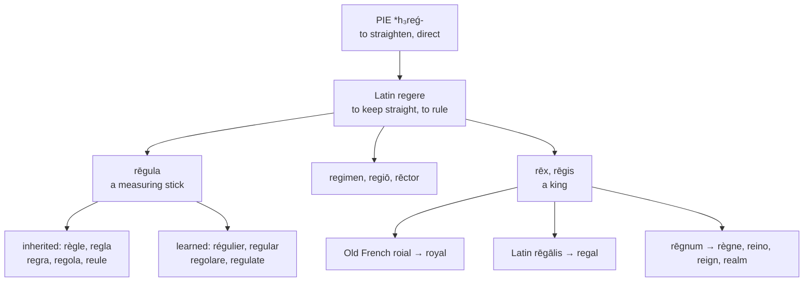

# *Rēgula*: the straight stick

A study of a measuring rod that became a law, of the three families one Latin verb produced, and of a doublet English holds in every one of them.

---

## 1. The root

Latin **regere** means "to keep straight, to guide, to rule," from Proto-Indo-European **\*h₃reǵ-** "to straighten, to direct." From that verb Latin built three separate stems, and English took all three.

| Latin | Sense | English |
|---|---|---|
| **rēgula** | a straight stick, a measuring rod | **rule**, **ruler**, **regular**, **regulate** |
| **regere**, *rēctum*, *regimen* | to guide, to govern | **region**, **regime**, **regiment**, **rector**, **regent**, **rectify** |
| **rēx**, *rēgis* | a king | **regal**, **royal**, **reign**, **realm** |

The first is a diminutive: a *rēgula* is a little straightening-thing, a stick used to draw a line or check that something is true.

**A ruler is a ruler for one reason.** The stick that draws a straight line and the person who keeps a country straight are named by the same act, and English preserves the coincidence exactly — the object and the sovereign are one word, as they are in no other language of the group.

---

## 2. The same word, twice, everywhere

*Rēgula* came down into every Romance language by ordinary speech, and *rēgulāris* and *rēgulāre* were then re-borrowed from written Latin. Each language therefore holds an inherited form and a learned one:

| | Inherited | Learned |
|---|---|---|
| **French** | *la règle*, *régler* | *régulier*, *réguler* |
| **Spanish** | *la regla*, *reglar*, *arreglar* | *regular* |
| **Portuguese** | *a regra*, *regrar* | *regular* |
| **Italian** | *la regola* | *regolare* |
| **Catalan** | *la regla*, *arreglar* | *regular* |
| **English** | *the rule*, *to rule*, *the ruler* | *regular*, *to regulate*, *the regulator* |

English fits the pattern without alteration: *rule* arrived through Old French *reule* in the thirteenth century, and *regular* and *regulate* came from the Latin page two centuries later. **Rule and regular are the same word**, and so are *ruler* and *regulator*.

**Portuguese moved a consonant.** *Rēgula* gave *regra*, the *l* becoming *r*, where Spanish and Catalan kept *regla* and Italian kept *regola* whole. The same change gives Portuguese *praga* for *plaga* and *branco* for *blanco*.

**Spanish built a verb English has no equivalent for.** *A-* plus *reglar* gives **arreglar**, one of the commonest verbs in the language — to fix, to arrange, to settle, to sort out. Catalan has it too. English reaches for *arrange*, which is not from this root at all but from Frankish \**hring*, a ring.

**Two senses English lacks.** French *les règles* and Spanish *la regla* mean a menstrual period — the rule as a recurring measure. And Spanish *regular*, answering *¿cómo estás?*, means "so-so," which catches every learner at least once.

---

## 3. The king, three times over

*Rēx* reached English by three roads, and the results do not resemble each other.

| Form | Route | Century |
|---|---|---|
| **royal** | Old French *roial* | 1300s |
| **regal** | Latin *rēgālis* | 1400s |
| **real** | Spanish, in *rial*, *riyal* | later |

All three are *rēgālis*. Spanish *real* is the same word again, and it collides in that language with a second *real* from *rēālis* "actual" — so Spanish speakers use one spelling for *royal* and *real*, which are unrelated.

**Reign and realm are also one word twice.** *Reign* is Latin *rēgnum* through Old French *regne*; *realm* is Old French *realme*, a reshaping of *reaume* under the influence of the same *rēgnum*. Spanish and Portuguese use *el reino* and *o reino* for both, and French keeps *le règne* and *le royaume* apart as English does.

---

## 4. The comparative sets

### The stick and its derivatives

| | The rule | Regular | To regulate | Regulation |
|---|---|---|---|---|
| **Latin** | *rēgula* | *rēgulāris* | *rēgulāre* | — |
| **French** | *la règle* | *régulier* | *réguler* | *la régulation* |
| **Spanish** | *la regla* | *regular* | *regular* | *la regulación* |
| **Portuguese** | *a regra* | *regular* | *regular* | *a regulação* |
| **Italian** | *la regola* | *regolare* | *regolare* | *la regolazione* |
| **Catalan** | *la regla* | *regular* | *regular* | *la regulació* |
| **English** | *the rule* | *regular* | *to regulate* | *the regulation* |
| **Inglisce** | *þe reule* | *regular* | *to regulait* | *þa regulâcion* |

Italian is the extreme case: *regolare* is the adjective and the verb, so *una regola regolare regolare* is grammatical and means "a regular rule to regulate."

### The governing words

| | Regime | Regiment | Region | Rector | Regent |
|---|---|---|---|---|---|
| **Latin** | *regimen* | *regimentum* | *regiō* | *rēctor* | *regēns* |
| **French** | *le régime* | *le régiment* | *la région* | *le recteur* | *le régent* |
| **Spanish** | *el régimen* | *el regimiento* | *la región* | *el rector* | *el regente* |
| **Portuguese** | *o regime* | *o regimento* | *a região* | *o reitor* | *o regente* |
| **Italian** | *il regime* | *il reggimento* | *la regione* | *il rettore* | *il reggente* |
| **English** | *the regime* | *the regiment* | *the region* | *the rector* | *the regent* |
| **Inglisce** | *þe regime* | *þe règiment* | *þe rígion* | *þe rectre* | *þe rigent* |

### The king

| | Royal | Regal | Reign | Realm |
|---|---|---|---|---|
| **Latin** | *rēgālis* | *rēgālis* | *rēgnum* | *rēgnum* |
| **French** | *royal* | — | *le règne* | *le royaume* |
| **Spanish** | *real* | *regio* | *el reino* | *el reino* |
| **Portuguese** | *real* | *régio* | *o reino* | *o reino* |
| **Italian** | *reale* | *regale* | *il regno* | *il reame* |
| **English** | *royal* | *regal* | *the reign* | *the realm* |
| **Inglisce** | *royal* | *rígal* | *þe reigne* | *þe relme* |

**Only English and Italian keep both adjectives.** French dropped *regal* entirely, and Spanish and Portuguese have *regio* and *régio* only in the elevated register. English uses *royal* of persons and institutions and *regal* of bearing and manner, a division neither form was born with.

---

## 5. The Inglisce forms

### The stick

**`Reule` is attested.** English *rule* came through Old French **reule**, and that spelling was used in Middle English for three centuries before the modern contraction. Restoring it is recovery, not invention, and the `eu` gives /u/ as it does in French *heureux* and English *neutral*.

The noun and verb share the form, as they do in English, and the `-e` marks the pair. The plural is `reuls` and the agent noun `reuler`.

**`Regulait` and `regulâcion`** take the verb's `-ait` and the noun's circumflex, keeping `regula-` visible across the whole learned branch — `regular`, `regulait`, `regulâcion`, `regulatory`.

### The accents sort three pronunciations

The *regimen* group is where English is least consistent, and the marks record it.

| Inglisce | Value | Why |
|---|---|---|
| `regime` | /rəˈʒim/ | stress on the second syllable, French value |
| `règiment` | /ˈrɛdʒəmənt/ | stress on the first, `è` for /ɛ/ |
| `rígion`, `rigent` | /ˈridʒən/, /ˈridʒənt/ | `í` for stressed /i/ |
| `rígal` | /ˈriɡəl/ | `í` for /i/, `g` hard before `a` |

English writes `re-` in all of them and pronounces /rə/, /rɛ/, and /ri/, with nothing on the page to distinguish them. *Regime*, *regiment*, and *region* begin with the same two letters and three different sounds.

**`Regime` and `regíms` change devices.** The silent `-e` fixes the `i` as /i/ in the singular; when it drops before the plural, the acute takes the job over.

### The rest

**`Rectre` and `rectors`** transpose around the syllabic *r*, writing `-re` at the end of the word and `-or-` before a suffix, with the Latin *rēctor* visible in the second.

**`Reigne` keeps its silent `g`**, which is the *g* of *rēgnum* and the reason French writes *règne*. **`Relme` drops an `a`** that English writes and does not say: *realm* is /rɛlm/, and `ea` is a digraph English also uses for /i/ in *real* and /eɪ/ in *great*.

**`Rectifae`** belongs to the large `-fy` class — *satisfy*, *magnify*, *classify*, *justify* — all from Latin *-ficāre* through French *-fier*. The paradigm runs `rectifae`, `rectifaes`, `rectifaed`, `rectifyhing`, the progressive taking a different spelling of the same diphthong before the ending.
