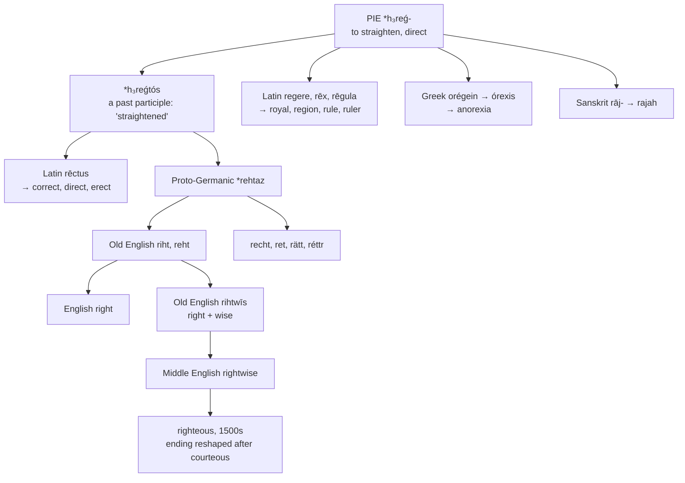

# \**H₃reǵtós*: straightened

A study of an Indo-European past participle that became a Germanic adjective and a Latin one, of the enormous family it fathered on both sides, and of a suffix in *righteous* that was invented in the sixteenth century to look Latin.

---

## 1. The root

Proto-Indo-European **\*h₃reǵ-** means "to straighten, to direct, to move in a straight line." From it the parent language formed a past participle, **\*h₃reǵtós**, "having been straightened."

That participle is the word. It descended twice, into two families, and became an adjective in both:

| | Form | Sense |
|---|---|---|
| **Germanic** | \**rehtaz* → Old English *riht* | straight, correct, just |
| **Latin** | *rēctus* | straight, upright, correct |

So English **right** and Latin **rectus** are not merely related. They are the same word, inherited in parallel, and every difference between them is the ordinary sound change of five thousand years.

Between them they gave English a very large vocabulary.

### The Germanic side

**right**, **rightly**, **rightful**, **righteous**, **upright**, **outright**, **rich**, **bishopric**, **-ric** in old names

### The Latin side

**rectitude**, **rectify**, **rectangle**, **rector**, **rectum**, **correct**, **direct**, **erect**, **regal**, **regent**, **region**, **regime**, **regiment**, **regular**, **reign**, **realm**, **royal**, **rule**, **ruler**

**A ruler is a ruler for one reason.** Latin *rēgula* is a straight stick, from *regere* "to keep straight"; the stick that draws a line and the person who governs are named by the same act of keeping things straight.

### Elsewhere

Sanskrit *rāj-* "king" gives **rajah** and **maharajah**. Gaulish *-rīx* "king" is the ending of **Vercingetorix**, and Old Irish *rí* is the same. Greek *orégein* "to reach out, to stretch toward" gives *órexis* "appetite" and thence **anorexia** — literally *no reaching for*.

So *right*, *royal*, *rajah*, *rich*, *rectangle*, *anorexia*, and the last syllable of *Vercingetorix* are one word.

---

## 2. The right hand came second

Old English did not use *riht* for the direction. The word for the right-hand side was **swīþra**, "the stronger one," and the left was *winestra*.

*Right* took the directional sense only because the right hand is the correct or proper one for most people — an assumption the vocabulary of Europe makes everywhere. Latin *dexter* gives **dexterity** and *sinister* gives **sinister**; French *gauche* means both left and awkward, and *droit* means both right and law.

German shows the same doubling still: *recht* is "correct," *rechts* is "to the right," and *Recht* is "law."

---

## 3. *Righteous* has a false suffix

The word looks like *courteous*, *bounteous*, *piteous*, *plenteous* — a Latinate stem with the Old French *-eus* from Latin *-ōsus*.

It is nothing of the kind.

Old English had **rihtwīs**, a compound of *riht* "right" and *wīs* "wise, way, manner" — *right-wise*, disposed in the right manner. Middle English kept it as **rightwise**, and the abstract noun was *rihtwīsnes*, which is where *righteousness* comes from.

In the early sixteenth century the ending was **altered to *-eous* by analogy with *courteous* and its like**. A native Germanic second element was reshaped to look like a Romance suffix, and it has looked like one ever since.

So *righteous* is *right* plus *wise*, and its resemblance to *courteous* is a five-hundred-year-old cosmetic operation.

---

## 4. Across the two families

| Language | The adjective | The noun |
|---|---|---|
| **Proto-Germanic** | \**rehtaz* | — |
| **Gothic** | *raihts* | — |
| **Old English** | *riht*, *reht* | *riht* |
| **Old Frisian** | *riucht* | *riucht* |
| **Old Saxon** | *reht* | *reht* |
| **Old High German** | *reht* | *reht* |
| **Old Norse** | *réttr* | *réttr* |
| **German** | *recht* | *das Recht* |
| **Dutch** | *recht* | *het recht* |
| **Swedish** | *rätt* | *rätten* |
| **Danish** | *ret* | *retten* |
| **Icelandic** | *réttur* | *rétturinn* |
| **English** | *right* | *the right* |
| **Inglisce** | *roiht* | *þe roihte* |

**Every Germanic language uses one word for both.** The adjective and the noun are identical in all of them, and the noun means both a moral entitlement and the body of law — German *Recht*, Dutch *recht*, Swedish *rätt*. English has the same range and marks it no more than its cousins do.

**The vowel divides the group.** Old English and Old Frisian have *i*; Old Saxon, Old High German, and Old Norse have *e*. English later diphthongised its *i* to /aɪ/ by the Great Vowel Shift, which is why *right* no longer resembles *recht* at all — the continental languages kept a short vowel and English did not.

### The Latin side

| Language | Straight | The direction | The law, an entitlement |
|---|---|---|---|
| **Latin** | *rēctus* | *dexter* | *iūs*, *dīrēctum* |
| **French** | *droit* | *droite* | *le droit* |
| **Spanish** | *derecho* | *la derecha* | *el derecho* |
| **Portuguese** | *direito* | *a direita* | *o direito* |
| **Italian** | *diritto*, *dritto* | *la destra* | *il diritto* |
| **Catalan** | *dret* | *la dreta* | *el dret* |
| **Romanian** | *drept* | *dreapta* | *dreptul* |
| **English** | *right* | *the right* | *the right* |
| **Inglisce** | *roiht* | *þe roihte* | *þe roihte* |

**Romance abandoned the simplex.** No modern Romance language continues bare *rēctus* as its ordinary word. All of them use the prefixed **dīrēctus** — *dī-* plus *rēctus*, "straightened out" — which gives French *droit*, Spanish *derecho*, Portuguese *direito*, Italian *diritto*, Catalan *dret*, and Romanian *drept*. Latin *rēctus* survives only in learned borrowings: *recto*, *recte*, *rectitud*.

English took the prefixed form too, as **direct**, and so holds the compound as a Latin loanword beside the simplex it inherited.

**The three senses travel together.** French *droit*, Spanish *derecho*, and their fellows mean *straight*, *the right-hand side*, and *the law* — precisely the range of German *recht*, Dutch *recht*, and English *right*.

That convergence is not inheritance. Latin used *iūs* for law and *dexter* for the direction, and kept *rēctus* to the geometrical sense. Romance and Germanic arrived at the same three-way spread independently, from opposite ends of Europe, because the same two metaphors were available to both: what is straight is correct, and the hand most people favour is the correct one.

**Italian kept the Latin direction word.** *La destra* is *dextera*, so Italian alone in the table names the side from *dexter* rather than from *dīrēctus*, and *diritto* is left to carry only *straight* and *the law*.

---

## 5. The Inglisce forms

| English | Inglisce | Part of speech |
|---|---|---|
| right | `roiht` | adjective |
| the right, the rights | `þe roihte`, `roihts` | noun |
| righteous | `roihteus` | adjective |

**The `ht` is Old English.** *Riht* had a velar fricative before the *t*, and English writes it `gh` — a digraph that spelled that sound and now spells nothing. `H` states the same silence with one letter, and it is the letter the word was written with for six hundred years.

**The `-e` separates the noun from the adjective.** A monosyllabic noun takes the silent `-e` and an adjective does not, so `roiht` and `roihte` are told apart on the page. English writes one form and leaves the reader to the syntax, which is a real cost in a language where *the right thing* and *the right to a thing* sit in the same sentence.

**`-teus` gives /tʃəs/.** *Righteous* is /ˈraɪtʃəs/, the `t` having coalesced with a following yod, and the spelling states it by the same rule that gives `-tion` its /tʃən/ — a `t` before a front vowel and another vowel yields the affricate, so no diacritic is needed.

**And the false suffix is left in place.** `Roihteus` keeps the ending that the sixteenth century put there in imitation of *courteous*, rather than restoring the *rightwise* the word actually is. The spelling of a living word records what it has become; a form built on *wīs* would be a different word, and one nobody has used since 1600.

**Four words, four spellings.** English has *right*, *rite*, *write*, and *wright*, all /raɪt/, from *riht*, *rītus*, *wrītan*, and *wyrhta*. `Roiht` takes the first, and the others take spellings recording their own descent — so the homophones remain homophones in the mouth and stop being near-homographs on the page.
