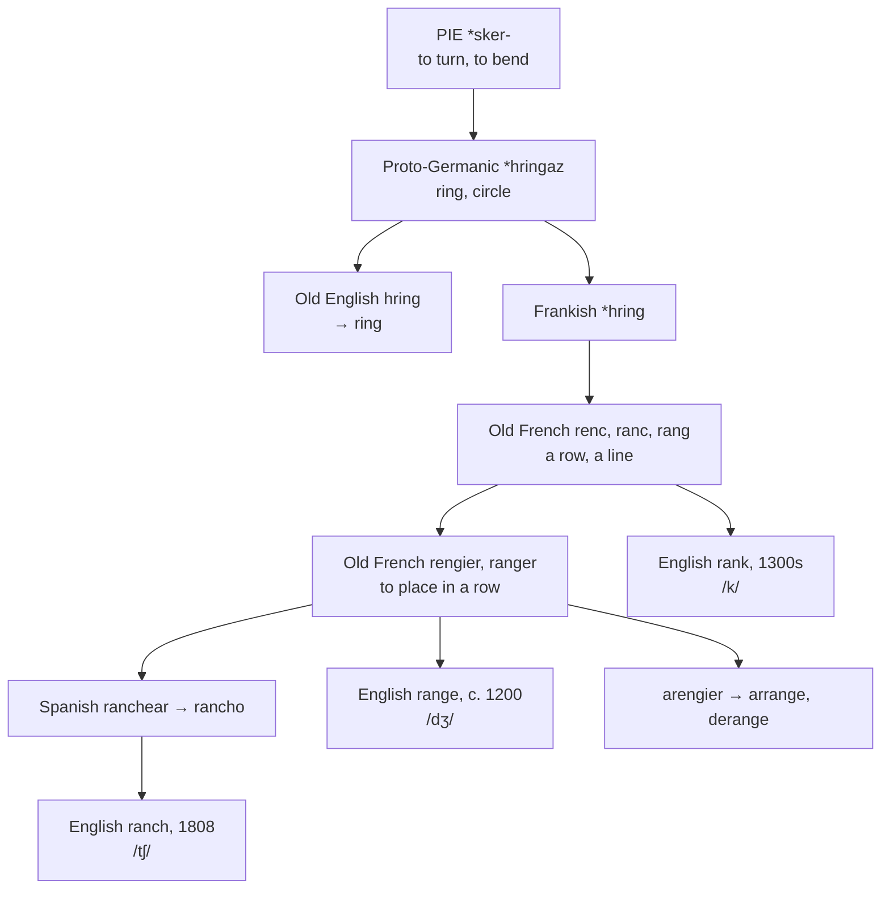

# \**Hringaz*: one ring, three consonants

A study of a Germanic word for a circle that left the family, passed through France and Spain, and came back three times wearing three different consonants — while its native form sat in English the whole while.

---

## 1. The root

Proto-Germanic **\*hringaz** means "ring, circle, something curved," from a nasalised form of Proto-Indo-European **\*sker-** "to turn, to bend."

It stayed in English by the native route as **ring**, from Old English *hring*, and it is still the ordinary word. German *Ring*, Dutch *ring*, Swedish *ring*, and Old Norse *hringr* are the same.

It also left. Frankish \**hring* entered the Romance of Gaul, where a circle of soldiers or spectators became a *row* — Old French **renc**, **reng**, **ranc**, **rang**, "a line, a row, a rank." The OED notes that the sense shift apparently began with a circular or cross-shaped disposition of troops in battle.

From that French noun the word set out again, and English received it three separate times.

---

## 2. Three journeys, three consonants

| English word | Route | Century | Consonant |
|---|---|---|---|
| **rank** | Frankish → Old French *renc*, *ranc* | early 1300s | /k/ |
| **range** | Frankish → Old French *rengier*, *ranger* | c. 1200 | /dʒ/ |
| **ranch** | Frankish → Old French *ranger* → Spanish *rancho* | 1808 | /tʃ/ |

**Rank** is the French noun taken plain, and the consonant never palatalised.

**Range** is the French *verb* — *rengier*, *ranger*, "to place in a row, to get into line" — where the *g* stood before a front vowel and softened to /dʒ/.

**Ranch** took the longest road. Old French *ranger* "to install in position" gave Spanish *ranchear* "to lodge, to station," and from that *rancho*, which meant a group of men who eat together and then the place they do it. American English took it from Mexican Spanish in 1808. The consonant is /tʃ/ because Spanish palatalised it, and English received the Spanish outcome.

So one Frankish word produced /k/, /dʒ/, and /tʃ/ in English, and the difference between them is entirely a matter of which language handled it and how far the consonant had travelled toward the front of the mouth.

**And *ring* was here all along.** The native form never left, so English holds four reflexes of \**hringaz* — one inherited and three borrowed back — and connects none of them.

---

## 3. The other *rank*

English has a second *rank*, and it is a different word.

**Rank** meaning strong-smelling, rancid, or grossly overgrown is Old English **ranc** "proud, overbearing, haughty, showy," from Proto-Germanic \**rankaz* "straight," from Proto-Indo-European **\*h₃reǵ-** "straight, direct."

That is the root of *right*, *rectus*, *regal*, and *rule*. So the *rank* of *rank injustice* and *rank vegetation* is a cousin of *correct* and *royal*, and has nothing to do with the *rank* of a soldier.

The Germanic cognates keep the older sense: Dutch *rank* "slender," Danish *rank* "straight, erect," Swedish *rank* "shaky," Icelandic *rakkur* "straight, bold."

The path from *proud* to *rancid* runs through *growing too vigorously*: what is rank grows tall and coarse, and what grows coarse goes off.

---

## 4. What else the ring gave

**Arrange** is *a-* plus *rangier*, Old French *arengier* "to put in a row, to draw up in battle order." So arranging flowers is drawing them up in ranks.

**Derange** is the same verb with *dis-*, and to be deranged is to be out of line.

**Harangue** is more doubtful but often given here: Old Italian *aringa* "a public speech," possibly from a Gothic reflex of \**hringaz*, the ring of listeners standing round the speaker. The derivation is not secure.

**Rink** may belong too, a Scots variant of *ring* in the sense of a marked-out course.

---

## 5. The comparative set

| | The row | To set in a row | The farm | The circle |
|---|---|---|---|---|
| **Frankish** | \**hring* | — | — | \**hring* |
| **French** | *le rang* | *ranger*, *arranger* | *le ranch* | *l'anneau* |
| **Spanish** | *el rango* | *ranchear* | *el rancho* | *el anillo* |
| **Portuguese** | *o rango* | — | *o rancho* | *o anel* |
| **Italian** | *il rango* | *rangiare* | *il ranch* | *l'anello* |
| **German** | *der Rang* | *rangieren* | *die Ranch* | *der Ring* |
| **Dutch** | *de rang* | *rangschikken* | *de ranch* | *de ring* |
| **English** | *the rank* | *to range*, *to arrange* | *the ranch* | *the ring* |
| **Inglisce** | *þe rânque* | *to rânge*, *to arrânge* | *þe ranc̃e* | *þe ringue* |

**The Romance languages have no native form.** *Rango*, *rang*, and *ranc* are all borrowings of the French noun, which is itself a borrowing from Frankish; the inherited Romance word for a circle is *anneau*, *anillo*, *anel*, *anello*, from Latin *ānellus*. So the word for a rank is Germanic everywhere in Europe and the word for a ring is Latin everywhere in Romance — the two families having swapped.

**German took its own word back from French.** *Der Rang* is a borrowing of French *rang*, which is a borrowing of Frankish \**hring*, which is the ancestor of German *Ring*. German holds both ends of a circle its own ancestors started.

---

## 6. The Inglisce forms

| English | Inglisce | Consonant |
|---|---|---|
| range | `rânge` | `g` = /dʒ/ |
| ranch | `ranc̃e` | `c̃` = /tʃ/ |
| rank | `rânque`, `râncs` | `qu`, `c` = /k/ |

**The consonants carry the history.** Three spellings for three outcomes of one Frankish consonant, and each letter records the route rather than merely the sound:

`G` before a front vowel is /dʒ/ by the ordinary Romance rule, which is exactly what happened to the *g* of *ranger* in French. `C̃` is a palatalised *c*, which is what Spanish did to it in *rancho*. `Qu` is the French spelling of an unpalatalised /k/, which is the consonant *rank* never lost.

English writes `ge`, `ch`, and `k`, and the three tell the reader nothing about why one word has an affricate and another does not.

**`Rânque` and `râncs` work around the digraph.** `Qu` needs a following vowel letter, and the bare noun plural and the bare present have none, so the spelling falls back on `c`. The verb runs `rânque`, `rânc`, `râncs`, `rânqued`, `rânquing`.

**`Ranc̃e` takes no circumflex.** The vowel is /æ/ and needs no marking, where `rânge` and `rânque` carry the mark.
