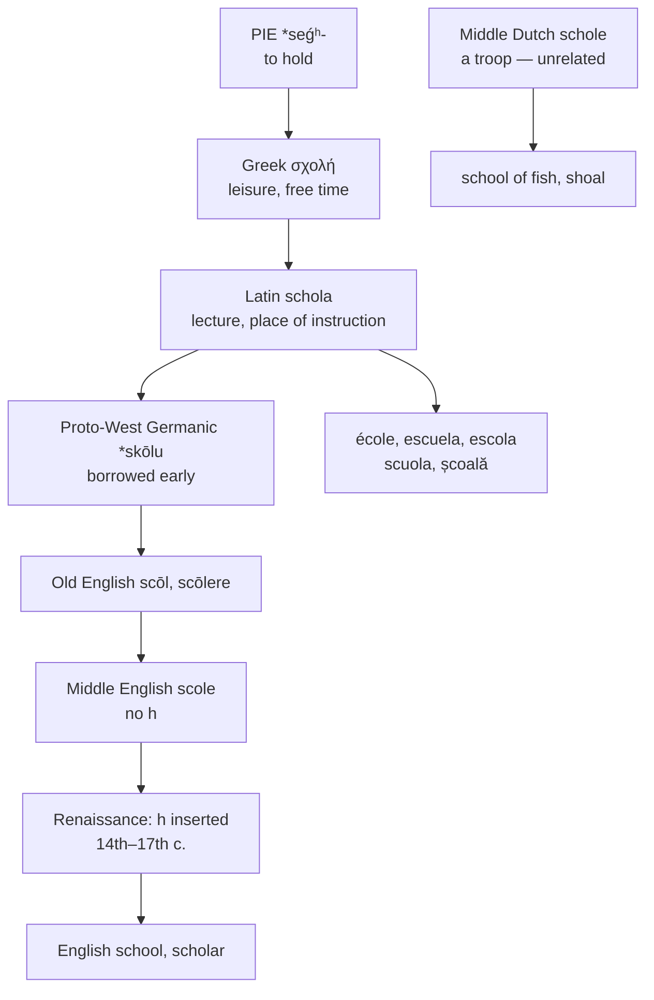

# *Skholḗ*: time off

A study of a word that meant *leisure* and now means its opposite, of a letter added to it by Renaissance scholars with something to prove, and of the shoal of fish that has nothing to do with any of it.

---

## 1. The root

Ancient Greek **σχολή** *skholḗ* means "spare time, leisure, rest, ease" — and, in its less flattering uses, "idleness."

From there it moved twice. Leisure became *what leisure is spent on*, which in Athens meant learned conversation; and learned conversation became *the place where it happens*. By the classical period *skholḗ* could mean a lecture hall, but the primary sense remained free time.

The root beneath it is Proto-Indo-European **\*seǵʰ-** "to hold, to possess," through Greek *ékhein* "to have, to hold." A *skholḗ* is a *holding back* — a stretch of time kept clear of obligation.

That root has other children in English:

| Greek | English |
|---|---|
| *skhêma* "form, figure" | **scheme**, **schematic** |
| *epokhḗ* "a stopping point" | **epoch** |
| *hektikós* "habitual, continuous" | **hectic** |
| *skholḗ* | **school**, **scholar**, **scholastic** |
| *skholastikós* "enjoying leisure" | **scholastic** |

**The irony is structural.** The institution most associated with compulsion, timetables, and attendance registers is named after the absence of all three. A *scholastic* was originally a person with leisure enough to think; the word now means the opposite of leisurely.

---

## 2. English got this one early

Most of the Latinate vocabulary in these pages arrived after 1066, through French. This word did not.

Latin **schola** entered West Germanic while the Roman presence was still felt, giving Proto-West Germanic \**skōlu* and thence **Old English scōl**. The same early borrowing produced German *Schule*, Dutch *school*, Old Norse *skóli*, and Old Frisian *skūle*.

So *school* has been an English word for as long as English has existed, and its Middle English form was **scole** — no *h*, no French, no Norman intermediary.

*Scholar* came the same way. Old English **scōlere**, from Late Latin *scholāris*, is attested around the year 1000, alongside German *Schüler* and Dutch *scholier*.

---

## 3. The letter the Renaissance added

Old English wrote *scōl* and Middle English wrote *scole* for some six hundred years. The *h* is not in either.

It was inserted between the fourteenth and seventeenth centuries, when classical learning was fashionable and writers wanted their spelling to display it. Putting an *h* in *scole* announced that the writer knew the word came from Latin *schola* and ultimately from Greek σχολή.

The *h* has never been pronounced in English. It was added to be seen, not heard — the same impulse that gave *debt* its *b*, *island* its *s*, and *receipt* its *p*.

The change did not reach every language. French, Spanish, Portuguese, Italian, and Catalan all write the word without an *h*, because spoken Latin had lost the Greek aspirate long before any of them existed.

---

## 4. The other school

English has a second *school*, and it is unrelated.

A **school of fish** comes from Middle Dutch *schole* "a troop, a band, a multitude," from Proto-Germanic \**skulō*. Its true English relative is **shoal**, which is the same word by the native route — the Germanic *sk-* palatalising to *sh-* as it does in *ship*, *fish*, and *shall*.

So *shoal* and *school of fish* are a doublet, one inherited and one borrowed from Dutch, and neither has anything to do with leisure or with Greek. English simply ended with two words spelled alike.

---

## 5. The comparative set

| | The school | The *h* | The initial cluster |
|---|---|---|---|
| **Greek** | *skholḗ* | χ | *skh-* |
| **Latin** | *schola* | *ch* | *sch-* |
| **French** | *l'école* | none | *é-*, the *s* lost |
| **Spanish** | *la escuela* | none | *esc-*, a vowel added |
| **Portuguese** | *a escola* | none | *esc-*, a vowel added |
| **Catalan** | *l'escola* | none | *esc-*, a vowel added |
| **Italian** | *la scuola* | none | *sc-*, unchanged |
| **Romanian** | *școala* | none | *șc-* |
| **English** | *the school* | inserted 1400s–1600s | *sch-* |
| **Inglisce** | *þe scoule* | none | *sc-* |

**Only English writes the *h*.** Every Romance language dropped it with the Latin aspirate, and the Germanic languages that borrowed early — German *Schule*, Dutch *school* — write *sch* for a different reason, the digraph being their ordinary spelling for /ʃ/ and /sx/ respectively.

**The vowel divides the Romance languages.** Latin *schola* has a short open *o*, which diphthongises under stress in Italian *scuola* and Spanish *escuela* but not in Portuguese *escola* or Catalan *escola*.

**French lost the *s* and marked it.** *Schola* gave *escole*, which gave *école*, the acute over the initial vowel recording the consonant that used to follow it — the same device French uses in *étude* for *estude* and *épine* for *espine*.

---

## 6. The Inglisce forms

| English | Inglisce | Plural |
|---|---|---|
| school | `scoule` | `scouls` |
| scholar | `scholar` | `scholars` |

**`Scoule` removes a letter that was never heard.** English wrote *scol* and *scole* for six hundred years and then acquired an *h* for display. Dropping it restores what the word looked like for the whole of its Old and Middle English life, and puts it beside *escola*, *escuela*, and *scuola*, none of which has one either.

The `sc` reads /sk/ without help: a `c` before a back vowel takes its hard value. Nothing is lost by removing the `h`, because the `h` was never doing anything.

**`Ou` writes /u/.** The Old English vowel was a long *ō*, which the Great Vowel Shift raised to /u/, and English writes it `oo` — a digraph it also uses for /ʊ/ in *book*, *good*, and *foot*, and for /ʌ/ in *blood* and *flood*. `Ou` takes the French value, as in *route* and *soup*.

**`Scholar` keeps its digraph.** Where `scoule` is an everyday word that English wrote plainly for most of its history, `scholar` belongs to the learned stratum, and the `ch` is the system's spelling for a Greek /k/. Both words read /sk/; the difference on the page records which register each belongs to rather than any difference in sound.

The article is masculine, `þe`.
